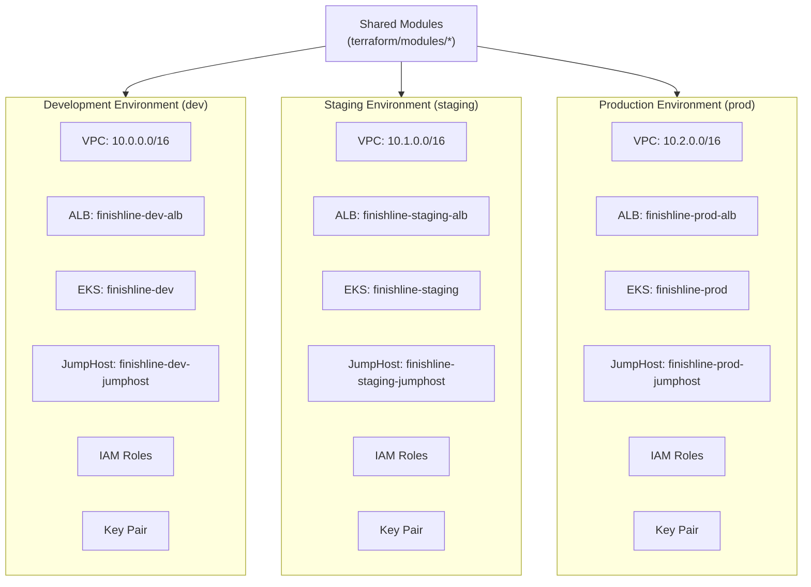
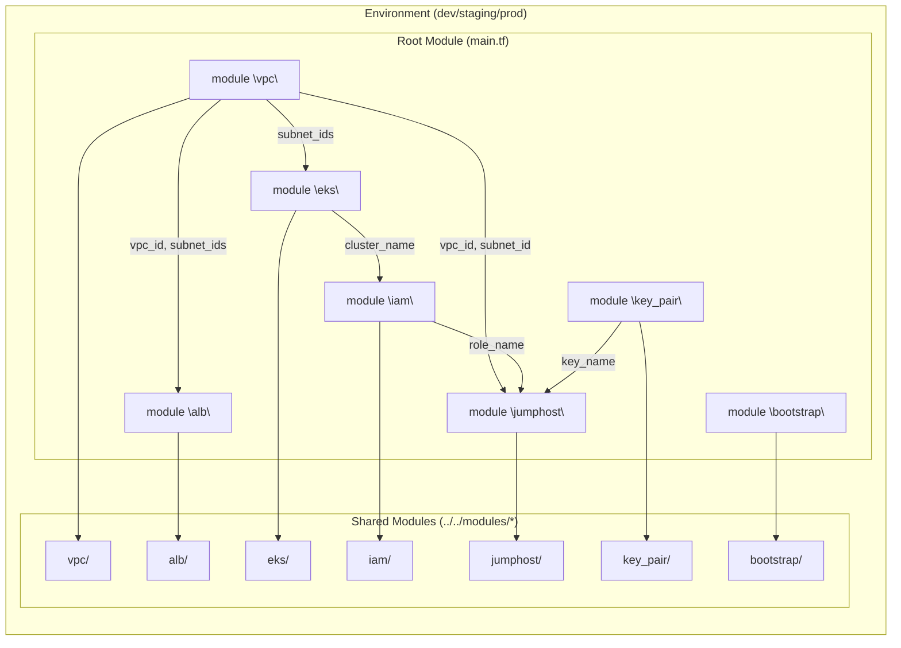
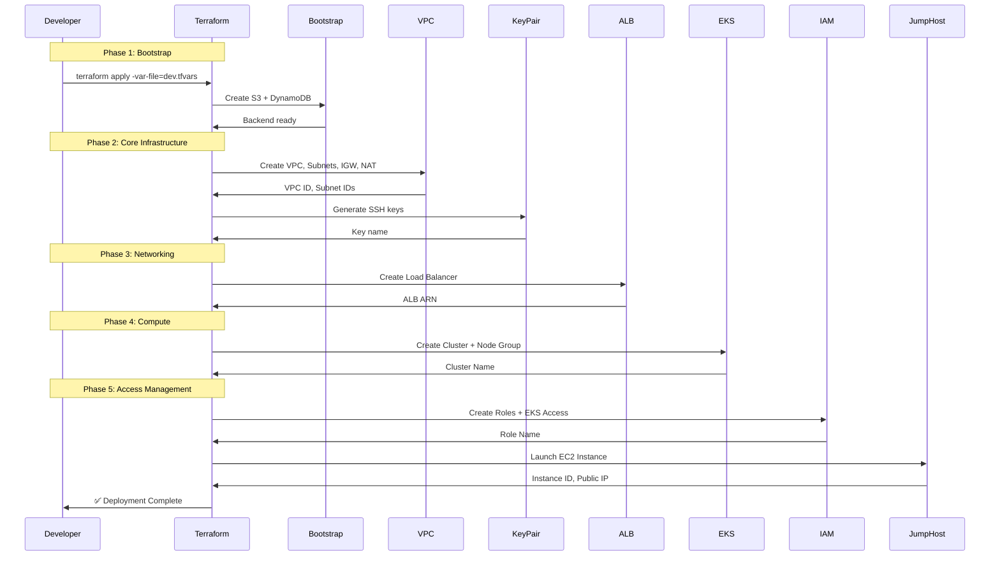

# Environment Architecture Diagrams

## Environments: dev, staging, prod



---

## Dev Environment Detailed Architecture

```mermaid
flowchart TB
    subgraph AWS_DEV["AWS - Development Region"]

        subgraph VPC_DEV["VPC: 10.0.0.0/16"]

            subgraph Public_DEV["Public Subnets"]
                PS1_DEV["10.0.1.0/24 (AZ 1)"]
                PS2_DEV["10.0.2.0/24 (AZ 2)"]
                PS3_DEV["10.0.3.0/24 (AZ 3)"]
            end

            subgraph Private_DEV["Private Subnets"]
                PVS1_DEV["10.0.101.0/24 (AZ 1)"]
                PVS2_DEV["10.0.102.0/24 (AZ 2)"]
                PVS3_DEV["10.0.103.0/24 (AZ 3)"]
            end

            IGW_DEV["IGW"]
            NAT_DEV["NAT Gateway"]

            ALB_DEV["🔷 ALB<br/>finishline-dev-alb<br/>HTTP → Forward<br/>HTTPS → Redirect"]

            EKS_DEV["☸️ EKS Cluster<br/>finishline-dev<br/>2x t3.medium<br/>Bottlerocket"]

            Jump_DEV["🖥️ JumpHost<br/>finishline-dev-jumphost<br/>AL2023<br/>EIP"]

        end

        subgraph Backend_DEV["Terraform Backend"]
            S3_DEV["S3: finishline-dev-tf-state"]
            DDB_DEV["DynamoDB: finishline-dev-locks"]
        end

    end

    Users["👥 Users"]
    Admin["👤 Admin"]

    Users -->|HTTP/HTTPS| ALB_DEV
    ALB_DEV -->|Traffic| EKS_DEV

    Admin -->|SSH (Home IP)| Jump_DEV
    Jump_DEV -->|EKS Access| EKS_DEV

    PS1_DEV --> IGW_DEV
    PVS1_DEV --> NAT_DEV
    NAT_DEV --> IGW_DEV

    IGW_DEV -->|Internet| Users
    NAT_DEV -->|Internet| Users
```

---

## Staging Environment Detailed Architecture

```mermaid
flowchart TB
    subgraph AWS_STAGING["AWS - Staging Region"]

        subgraph VPC_STAGING["VPC: 10.1.0.0/16"]

            subgraph Public_STAGING["Public Subnets"]
                PS1_STAGING["10.1.1.0/24 (AZ 1)"]
                PS2_STAGING["10.1.2.0/24 (AZ 2)"]
                PS3_STAGING["10.1.3.0/24 (AZ 3)"]
            end

            subgraph Private_STAGING["Private Subnets"]
                PVS1_STAGING["10.1.101.0/24 (AZ 1)"]
                PVS2_STAGING["10.1.102.0/24 (AZ 2)"]
                PVS3_STAGING["10.1.103.0/24 (AZ 3)"]
            end

            IGW_STAGING["IGW"]
            NAT_STAGING["NAT Gateway"]

            ALB_STAGING["🔷 ALB<br/>finishline-staging-alb<br/>HTTP → Redirect HTTPS<br/>HTTPS enabled"]

            EKS_STAGING["☸️ EKS Cluster<br/>finishline-staging<br/>2x t3.medium<br/>Bottlerocket"]

            Jump_STAGING["🖥️ JumpHost<br/>finishline-staging-jumphost<br/>AL2023<br/>EIP"]

        end

        subgraph Backend_STAGING["Terraform Backend"]
            S3_STAGING["S3: finishline-staging-tf-state"]
            DDB_STAGING["DynamoDB: finishline-staging-locks"]
        end

    end

    QA["👥 QA Team"]
    DevTeam["👤 DevOps"]

    QA -->|HTTP/HTTPS| ALB_STAGING
    ALB_STAGING -->|Traffic| EKS_STAGING

    DevTeam -->|SSH (Home IP)| Jump_STAGING
    Jump_STAGING -->|EKS Access| EKS_STAGING

    PS1_STAGING --> IGW_STAGING
    PVS1_STAGING --> NAT_STAGING
    NAT_STAGING --> IGW_STAGING

    IGW_STAGING -->|Internet| QA
    NAT_STAGING -->|Internet| QA
```

---

## Production Environment Detailed Architecture

```mermaid
flowchart TB
    subgraph AWS_PROD["AWS - Production Region"]

        subgraph VPC_PROD["VPC: 10.2.0.0/16"]

            subgraph Public_PROD["Public Subnets"]
                PS1_PROD["10.2.1.0/24 (AZ 1)"]
                PS2_PROD["10.2.2.0/24 (AZ 2)"]
                PS3_PROD["10.2.3.0/24 (AZ 3)"]
            end

            subgraph Private_PROD["Private Subnets"]
                PVS1_PROD["10.2.101.0/24 (AZ 1)"]
                PVS2_PROD["10.2.102.0/24 (AZ 2)"]
                PVS3_PROD["10.2.103.0/24 (AZ 3)"]
            end

            IGW_PROD["IGW"]
            NAT_PROD["NAT Gateway"]

            ALB_PROD["🔷 ALB<br/>finishline-prod-alb<br/>HTTP → Redirect HTTPS<br/>HTTPS with ACM"]

            EKS_PROD["☸️ EKS Cluster<br/>finishline-prod<br/>2x t3.medium<br/>Bottlerocket"]

            Jump_PROD["🖥️ JumpHost<br/>finishline-prod-jumphost<br/>AL2023<br/>EIP"]

        end

        subgraph Backend_PROD["Terraform Backend"]
            S3_PROD["S3: finishline-prod-tf-state"]
            DDB_PROD["DynamoDB: finishline-prod-locks"]
        end

    end

    Customers["👥 Customers"]
    SRE["👤 SRE Team"]

    Customers -->|HTTPS Only| ALB_PROD
    ALB_PROD -->|Traffic| EKS_PROD

    SRE -->|SSH (Home IP)| Jump_PROD
    Jump_PROD -->|EKS Access| EKS_PROD

    PS1_PROD --> IGW_PROD
    PVS1_PROD --> NAT_PROD
    NAT_PROD --> IGW_PROD

    IGW_PROD -->|Internet| Customers
    NAT_PROD -->|Internet| Customers
```

---

## Environment Comparison

| Feature                 | dev           | staging          | prod             |
| ----------------------- | ------------- | ---------------- | ---------------- |
| **VPC CIDR**            | 10.0.0.0/16   | 10.1.0.0/16      | 10.2.0.0/16      |
| **ALB HTTP**            | Forward to TG | Redirect → HTTPS | Redirect → HTTPS |
| **ALB HTTPS**           | Optional      | Optional         | Required (ACM)   |
| **Deletion Protection** | Disabled      | Enabled          | Enabled          |
| **Node Count**          | 2             | 2                | 2                |
| **Instance Type**       | t3.medium     | t3.medium        | t3.medium        |
| **SSH Access**          | Home IPs      | Home IPs         | Home IPs         |

---

## Module Composition by Environment



---

## Deployment Order



---

_Generated for FinishLine 2026 Infrastructure Project_
