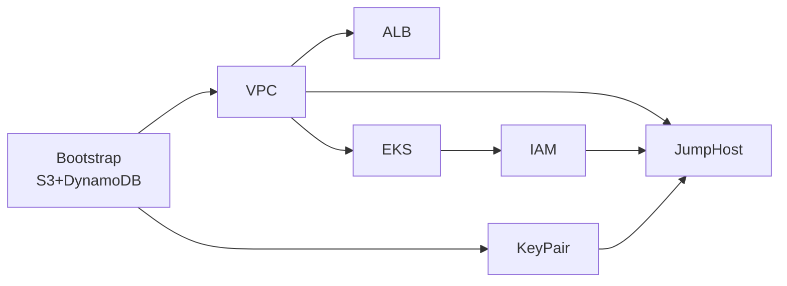

# FinishLine Infrastructure - Mermaid Diagrams

This directory contains Mermaid diagrams visualizing the complete FinishLine 2026 Infrastructure project architecture.

## Diagram Index

| #   | File                                                     | Description                                           |
| --- | -------------------------------------------------------- | ----------------------------------------------------- |
| 1   | [01-project-architecture.md](01-project-architecture.md) | Overall project architecture overview                 |
| 2   | [02-vpc-module.md](02-vpc-module.md)                     | VPC module components and networking                  |
| 3   | [03-eks-module.md](03-eks-module.md)                     | EKS cluster and node group architecture               |
| 4   | [04-alb-module.md](04-alb-module.md)                     | Application Load Balancer configuration               |
| 5   | [05-iam-module.md](05-iam-module.md)                     | IAM roles and EKS access management                   |
| 6   | [06-jumphost-module.md](06-jumphost-module.md)           | JumpHost/bastion host setup                           |
| 7   | [07-keypair-module.md](07-keypair-module.md)             | SSH key pair generation                               |
| 8   | [08-bootstrap-module.md](08-bootstrap-module.md)         | Terraform backend with S3 and DynamoDB                |
| 9   | [09-environments.md](09-environments.md)                 | Environment-specific architectures (dev/staging/prod) |

## Quick Reference

### Project Structure

```
finishline_infra_app/
├── terraform/
│   ├── modules/
│   │   ├── vpc/          # Networking
│   │   ├── eks/          # Kubernetes
│   │   ├── alb/          # Load Balancer
│   │   ├── iam/          # Access Management
│   │   ├── jumphost/     # Bastion Host
│   │   ├── key_pair/    # SSH Keys
│   │   └── bootstrap/   # Terraform Backend
│   └── envs/
│       ├── dev/          # Development
│       ├── staging/     # Staging
│       └── prod/        # Production
└── docs/
    └── diagrams/        # This directory
```

### Module Dependencies



## Viewing Diagrams

These diagrams can be viewed in:

1. **VS Code** - Install the "Markdown Preview Mermaid Support" extension
2. **GitHub** - Native Mermaid support in markdown files
3. **Mermaid Live Editor** - https://mermaid.live/
4. **Docusaurus** - With mermaid plugin
5. **Notion** - Native support

## Diagram Types Used

- **Flowcharts** - Resource relationships and data flow
- **Sequence Diagrams** - Step-by-step processes
- **ER Diagrams** - Database schemas
- **Class Diagrams** - Object relationships

## Key Architecture Highlights

| Component    | Details                                      |
| ------------ | -------------------------------------------- |
| **VPC**      | 10.0.0.0/16, 3 AZs, public + private subnets |
| **EKS**      | 2x t3.medium, Bottlerocket x86_64            |
| **ALB**      | Internet-facing, group-tag=finishline        |
| **JumpHost** | AL2023, SSH restricted to home IPs           |
| **IAM**      | EKS access entry with admin policy           |
| **Backend**  | S3 with DynamoDB state locking               |

---

_Generated for FinishLine 2026 Infrastructure Project_
\*Source: terraform/modules/\* and terraform/envs/\*\*
