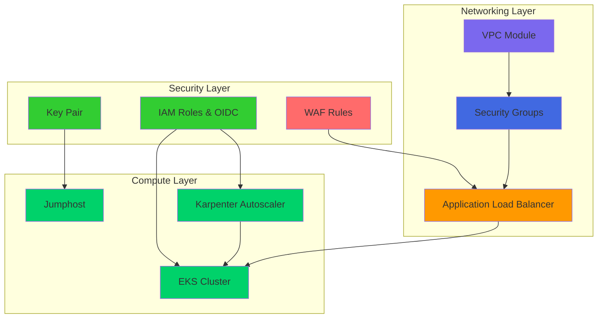

# FinishLine Infrastructure Runbook

**Document Owner:** FinishLine Infrastructure Team  
**Last Updated:** March 2026  
**Environments:** Dev, Stage, Prod  
**Classification:** Internal Operations  
**Version:** 2.0

---

## Table of Contents

- [FinishLine Infrastructure Runbook](#finishline-infrastructure-runbook)
  - [Table of Contents](#table-of-contents)
  - [Overview](#overview)
    - [Infrastructure Architecture](#infrastructure-architecture)
    - [Deployment Order](#deployment-order)
    - [Environment Configuration](#environment-configuration)
    - [Karpenter Configuration by Environment](#karpenter-configuration-by-environment)
  - [Prerequisites](#prerequisites)
    - [Required Tools](#required-tools)
    - [AWS Configuration](#aws-configuration)
    - [Clone Repository](#clone-repository)
  - [Part 1: Networking Deployment](#part-1-networking-deployment)
    - [Step 1: Bootstrap State Backend](#step-1-bootstrap-state-backend)
    - [Step 2: Deploy VPC](#step-2-deploy-vpc)
    - [Step 3: Deploy Security Groups](#step-3-deploy-security-groups)
    - [Step 4: Deploy ALB](#step-4-deploy-alb)
    - [Step 5: Verify Networking](#step-5-verify-networking)
  - [Part 2: Security Module Deployment](#part-2-security-module-deployment)
    - [Step 1: Deploy Key Pair](#step-1-deploy-key-pair)
    - [Step 2: Deploy IAM Roles](#step-2-deploy-iam-roles)
    - [Step 3: Configure OIDC for IRSA](#step-3-configure-oidc-for-irsa)
      - [3.1 Get OIDC URL from EKS Cluster](#31-get-oidc-url-from-eks-cluster)
      - [3.2 Get OIDC Thumbprint](#32-get-oidc-thumbprint)
      - [3.3 Update IAM Terragrunt Configuration](#33-update-iam-terragrunt-configuration)
      - [3.4 Re-apply IAM Module](#34-re-apply-iam-module)
      - [3.5 Verify OIDC Provider](#35-verify-oidc-provider)
    - [Step 4: Annotate Karpenter Service Account](#step-4-annotate-karpenter-service-account)
      - [4.1 Create Karpenter Namespace](#41-create-karpenter-namespace)
      - [4.2 Get Karpenter Role ARN](#42-get-karpenter-role-arn)
      - [4.3 Create/Annotate Service Account](#43-createannotate-service-account)
      - [4.4 Verify IRSA Configuration](#44-verify-irsa-configuration)
  - [Part 3: Compute Deployment](#part-3-compute-deployment)
    - [Step 1: Deploy EKS Cluster](#step-1-deploy-eks-cluster)
    - [Step 1.5: Deploy EKS Node Groups (Bootstraps)](#step-15-deploy-eks-node-groups-bootstraps)
    - [Step 2: Deploy Jumphost](#step-2-deploy-jumphost)
    - [Step 3: Deploy Karpenter](#step-3-deploy-karpenter)
      - [3.1 Prerequisites Check](#31-prerequisites-check)
      - [3.2 Install Karpenter Helm Chart](#32-install-karpenter-helm-chart)
      - [3.3 Create EC2NodeClass](#33-create-ec2nodeclass)
      - [3.4 Create NodePool](#34-create-nodepool)
      - [3.5 Verify Karpenter](#35-verify-karpenter)
      - [3.6 Karpenter Troubleshooting](#36-karpenter-troubleshooting)
  - [Part 4: Security Hardening](#part-4-security-hardening)
    - [Enable HTTPS/TLS](#enable-httpstls)
      - [Step 1: Request SSL Certificate](#step-1-request-ssl-certificate)
      - [Step 2: Validate Certificate](#step-2-validate-certificate)
      - [Step 3: Update ALB Configuration](#step-3-update-alb-configuration)
      - [Step 4: Verify HTTPS](#step-4-verify-https)
    - [Deploy AWS WAF](#deploy-aws-waf)
      - [Step 1: Create WAF Module](#step-1-create-waf-module)
      - [Step 2: Apply WAF Configuration](#step-2-apply-waf-configuration)
      - [Step 3: Verify WAF](#step-3-verify-waf)
    - [Enable Access Logging](#enable-access-logging)
      - [Step 1: Create S3 Bucket for Logs](#step-1-create-s3-bucket-for-logs)
      - [Step 2: Enable ALB Access Logs](#step-2-enable-alb-access-logs)
      - [Step 3: Query Logs with Athena](#step-3-query-logs-with-athena)
    - [Configure Monitoring](#configure-monitoring)
      - [Step 1: Create CloudWatch Alarms](#step-1-create-cloudwatch-alarms)
      - [Step 2: Create Dashboard](#step-2-create-dashboard)
  - [Operations](#operations)
    - [Daily Checks](#daily-checks)
    - [Incident Response](#incident-response)
      - [P1: Active Attack](#p1-active-attack)
      - [P2: Suspicious Activity](#p2-suspicious-activity)
    - [Troubleshooting](#troubleshooting)
  - [Appendix](#appendix)
    - [A. Cost Estimates](#a-cost-estimates)
    - [B. Quick Reference Commands](#b-quick-reference-commands)
    - [C. Related Documentation](#c-related-documentation)

---

## Overview

This runbook provides step-by-step instructions for deploying and operating the FinishLine Infrastructure on AWS using Terraform and Terragrunt.

### Infrastructure Architecture



### Deployment Order

```mermaid
gantt
    title Infrastructure Deployment Sequence
    dateFormat X
    axisFormat Step %s

    section Networking (Part 1)
    Bootstrap          :0, 1
    VPC Module         :1, 2
    Security Groups    :3, 2
    ALB Module         :5, 2
    Verification       :7, 1

    section Security (Part 2)
    Key Pair           :8, 1
    IAM Roles          :9, 2
    OIDC Config        :11, 2
    IRSA Annotation    :13, 1

    section Compute (Part 3)
    EKS Cluster        :14, 3
    Jumphost           :17, 2
    Karpenter          :19, 3

    section Hardening (Part 4)
    HTTPS/WAF/Logging  :22, 3
```



### Environment Configuration

| Environment | AWS Region | VPC CIDR    | Karpenter Enabled | Purpose               |
| ----------- | ---------- | ----------- | ----------------- | --------------------- |
| **Dev**     | us-east-1  | 10.0.0.0/16 | Yes               | Development & Testing |
| **Stage**   | us-east-1  | 10.1.0.0/16 | Yes               | Staging/Pre-prod      |
| **Prod**    | us-east-1  | 10.2.0.0/16 | Yes               | Production            |

### Karpenter Configuration by Environment

| Environment | Instance Types                             | Max CPU | Capacity Types  |
| ----------- | ------------------------------------------ | ------- | --------------- |
| **Dev**     | m5.large, m5.xlarge, c5.large              | 50      | spot, on-demand |
| **Stage**   | m5.large, m5.xlarge, m5.2xlarge, c5.large  | 100     | spot, on-demand |
| **Prod**    | m5.large, m5.xlarge, m5.2xlarge, c5.xlarge | 500     | on-demand, spot |

---

## Prerequisites

### Required Tools

| Tool       | Version   | Installation              |
| ---------- | --------- | ------------------------- |
| Terraform  | >= 1.5.0  | `tfenv install 1.6.0`     |
| Terragrunt | >= 0.50.0 | `brew install terragrunt` |
| AWS CLI    | >= 2.0    | `brew install awscli`     |
| kubectl    | >= 1.28   | `brew install kubectl`    |
| Helm       | >= 3.12.0 | `brew install helm`       |

### AWS Configuration

```bash
# Configure AWS credentials
aws configure

# Verify configuration
aws sts get-caller-identity

# Expected output:
# {
#     "UserId": "AIDAXXXXXXXXXXXXXXXXX",
#     "Account": "123456789012",
#     "Arn": "arn:aws:iam::123456789012:user/your-user"
# }
```

### Clone Repository

```bash
git clone https://github.com/finishline/finishline_infra_app.git
cd finishline_infra_app/terraform
```

---

## Part 1: Networking Deployment

### Step 1: Bootstrap State Backend

**Purpose:** Create S3 bucket for Terraform state storage.

```bash
# Navigate to bootstrap directory
cd environments/dev/bootstrap

# Review configuration
cat terragrunt.hcl

# Deploy bootstrap
terragrunt init
terragrunt apply

# Expected output:
# Apply complete! Resources: 1 added, 0 changed, 0 destroyed.
# S3 bucket: finishline-infra-app-ba3347ce
```

**Verify:**

```bash
# Check S3 bucket exists
aws s3 ls s3://finishline-infra-app-ba3347ce

# Check versioning is enabled
aws s3api get-bucket-versioning --bucket finishline-infra-app-ba3347ce
```

---

### Step 2: Deploy VPC

**Purpose:** Create VPC, subnets, Internet Gateway, and route tables.

```bash
# Navigate to VPC module
cd ../networking/vpc

# Review configuration
cat terragrunt.hcl

# Plan deployment
terragrunt plan -out=tfplan

# Apply configuration
terragrunt apply tfplan
```

**Configuration Summary:**

| Setting            | Value                                    |
| ------------------ | ---------------------------------------- |
| VPC CIDR           | 10.0.0.0/16                              |
| Public Subnets     | 10.0.1.0/24, 10.0.2.0/24, 10.0.3.0/24    |
| Private Subnets    | 10.0.10.0/24, 10.0.11.0/24, 10.0.12.0/24 |
| Availability Zones | us-east-1a, us-east-1b, us-east-1c       |
| DNS Support        | Enabled                                  |
| DNS Hostnames      | Enabled                                  |

**Verify:**

```bash
# Check VPC
aws ec2 describe-vpcs --filters "Name=tag:Name,Values=finishline-infra-app-dev-vpc"

# Check subnets
aws ec2 describe-subnets --filters "Name=vpc-id,Values=vpc-xxx"

# Check Internet Gateway
aws ec2 describe-internet-gateways --filters "Name=attachment.vpc-id,Values=vpc-xxx"

# Check route tables
aws ec2 describe-route-tables --filters "Name=vpc-id,Values=vpc-xxx"
```

**Expected Output:**

```
VPC: vpc-0abc123def456789
Subnets: 6 (3 public, 3 private)
Internet Gateway: igw-0abc123def456789
Route Tables: 2 (main + custom)
```

---

### Step 3: Deploy Security Groups

**Purpose:** Create security groups for ALB, EKS, and application traffic.

```bash
# Navigate to Security Group module
cd ../sg

# Review configuration
cat terragrunt.hcl

# Plan deployment
terragrunt plan -out=tfplan

# Apply configuration
terragrunt apply tfplan
```

**Security Group Rules:**

| Security Group    | Ingress                                                  | Egress          |
| ----------------- | -------------------------------------------------------- | --------------- |
| **finishline-sg** | 80, 443 (0.0.0.0/0), 22 (10.0.0.0/16), 30000-32768 (EKS) | All (0.0.0.0/0) |

**Verify:**

```bash
# List security groups
aws ec2 describe-security-groups --filters "Name=tag:Name,Values=finishline-infra-app-dev-sg"

# Check ingress rules
aws ec2 describe-security-groups \
  --filters "Name=group-name,Values=finishline-infra-app-dev-sg" \
  --query 'SecurityGroups[0].IpPermissions'
```

---

### Step 4: Deploy ALB

**Purpose:** Create Application Load Balancer with Target Group and Listener.

```bash
# Navigate to ALB module
cd ../alb

# Review configuration
cat terragrunt.hcl

# Plan deployment
terragrunt plan -out=tfplan

# Apply configuration
terragrunt apply tfplan
```

**ALB Configuration:**

| Setting        | Value                         |
| -------------- | ----------------------------- |
| Type           | Application (Internet-facing) |
| Subnets        | Public subnets from VPC       |
| Security Group | Dedicated ALB SG              |
| Listener       | HTTP (Port 80)                |
| Target Group   | Port 80, HTTP protocol        |
| Health Check   | /health, 30s interval         |

**Verify:**

```bash
# Check ALB
aws elbv2 describe-load-balancers --query "LoadBalancers[?contains(LoadBalancerName, 'finishline')]"

# Check Target Group
aws elbv2 describe-target-groups --query "TargetGroups[?contains(TargetGroupName, 'finishline')]"

# Check Listener
aws elbv2 describe-listeners --load-balancer-arn <alb-arn>

# Get ALB DNS name
aws elbv2 describe-load-balancers \
  --query "LoadBalancers[0].DNSName" \
  --output text
```

**Expected Output:**

```
ALB: finishline-infra-app-dev-alb
DNS: finishline-infra-app-dev-alb-123456789.us-east-1.elb.amazonaws.com
Target Group: finishline-infra-app-dev-alb-tg
Listener: Port 80, HTTP
```

---

### Step 5: Verify Networking

**Purpose:** Ensure all networking components are working correctly.

```bash
# Create verification script
cat > /tmp/verify-networking.sh << 'EOF'
#!/bin/bash

echo "=== Networking Verification ==="
echo ""

# VPC Check
echo "1. VPC Status:"
VPC_ID=$(aws ec2 describe-vpcs --filters "Name=tag:Name,Values=finishline-infra-app-dev-vpc" --query "Vpcs[0].VpcId" --output text)
echo "   VPC ID: $VPC_ID"

# Subnet Check
echo ""
echo "2. Subnet Status:"
aws ec2 describe-subnets --filters "Name=vpc-id,Values=$VPC_ID" \
  --query "Subnets[*].[AvailabilityZone,CidrBlock,State]" --output table

# ALB Check
echo ""
echo "3. ALB Status:"
ALB_DNS=$(aws elbv2 describe-load-balancers --query "LoadBalancers[0].DNSName" --output text)
echo "   ALB DNS: $ALB_DNS"

# Connectivity Test
echo ""
echo "4. Connectivity Test:"
curl -s -o /dev/null -w "   HTTP Response: %{http_code}\n" http://$ALB_DNS/health || echo "   (Expected: 503 - no targets registered)"

echo ""
echo "=== Verification Complete ==="
EOF

chmod +x /tmp/verify-networking.sh
/tmp/verify-networking.sh
```

**Expected Results:**

```
=== Networking Verification ===

1. VPC Status:
   VPC ID: vpc-0abc123def456789

2. Subnet Status:
| us-east-1a | 10.0.1.0/24 | available |
| us-east-1b | 10.0.2.0/24 | available |
| us-east-1c | 10.0.3.0/24 | available |

3. ALB Status:
   ALB DNS: finishline-infra-app-dev-alb-xxx.us-east-1.elb.amazonaws.com

4. Connectivity Test:
   HTTP Response: 503 (Expected - no targets registered)

=== Verification Complete ===
```

---

## Part 2: Security Module Deployment

### Step 1: Deploy Key Pair

**Purpose:** Create SSH key pair for jumphost access.

```bash
# Navigate to Key Pair module
cd ../../security/key_pair

# Review configuration
cat terragrunt.hcl

# Plan deployment
terragrunt plan -out=tfplan

# Apply configuration
terragrunt apply tfplan
```

**Outputs:**

```
key_pair_name = finishline-infra-app-dev-key
private_key   = (stored in AWS Secrets Manager)
```

**Verify:**

```bash
# List key pairs
aws ec2 describe-key-pairs --filters "Name=key-name,Values=finishline*"

# Retrieve private key from Secrets Manager
aws secretsmanager get-secret-value \
  --secret-id finishline-infra-app-dev-key \
  --query SecretString --output text > ~/.ssh/finishline-dev.pem

chmod 400 ~/.ssh/finishline-dev.pem
```

---

### Step 2: Deploy IAM Roles

**Purpose:** Create IAM roles for EKS cluster, worker nodes, OIDC integration, and Karpenter autoscaler.

```bash
# Navigate to IAM module
cd ../iam

# Review configuration
cat terragrunt.hcl

# Plan deployment
terragrunt plan -out=tfplan

# Apply configuration
terragrunt apply tfplan
```

**IAM Roles Created:**

| Role                                  | Purpose              | Trust Entity      |
| ------------------------------------- | -------------------- | ----------------- |
| `finishline-dev-cluster-role`         | EKS Cluster          | eks.amazonaws.com |
| `finishline-dev-nodegroup-role`       | EKS Worker Nodes     | ec2.amazonaws.com |
| `finishline-dev-oidc-role`            | Generic Workloads    | OIDC (IRSA)       |
| `finishline-dev-karpenter-controller` | Karpenter Controller | OIDC (IRSA)       |
| `finishline-dev-karpenter-node`       | Karpenter Nodes      | ec2.amazonaws.com |

**IAM Policies Attached:**

| Role                 | Policies                                                                                                        |
| -------------------- | --------------------------------------------------------------------------------------------------------------- |
| EKS Cluster          | AmazonEKSClusterPolicy, AmazonEKSVPCResourceController                                                          |
| Nodegroup            | AmazonEKSWorkerNodePolicy, AmazonEKSCNIPolicy, AmazonEC2ContainerRegistryReadOnly, AmazonEBSCSIDriverPolicy     |
| Karpenter Controller | Custom policy (EC2, IAM PassRole, SSM, Pricing)                                                                 |
| Karpenter Node       | AmazonEKSWorkerNodePolicy, AmazonEKSCNIPolicy, AmazonEC2ContainerRegistryReadOnly, AmazonSSMManagedInstanceCore |

**Verify:**

```bash
# List IAM roles
aws iam list-roles --query "Roles[?contains(RoleName, 'finishline')].[RoleName,Arn]" --output table

# Check trust policies
aws iam get-role --role-name finishline-dev-cluster-role --query "Role.AssumeRolePolicyDocument"

# Check OIDC provider
aws iam list-open-id-connect-connect-providers
```

---

### Step 3: Configure OIDC for IRSA

**Purpose:** Enable IAM Roles for Service Accounts (IRSA) for Karpenter and workloads.

#### 3.1 Get OIDC URL from EKS Cluster

```bash
# After EKS cluster is created, get OIDC issuer URL
aws eks describe-cluster \
  --name finishline-dev \
  --query "cluster.identity.oidc.issuer" \
  --output text

# Expected output: https://oidc.eks.us-east-1.amazonaws.com/id/XXXXXXXXXXXXX
```

#### 3.2 Get OIDC Thumbprint

```bash
# Get the thumbprint for the OIDC provider
openssl s_client -showcerts -connect oidc.eks.us-east-1.amazonaws.com:443 \
  | openssl x509 -fingerprint -sha256 -noout \
  | cut -d= -f2 \
  | tr -d ':'

# Expected output: XXXXXXXXXXXXXXXXXXXXXXXXXXXXXXXX (64 characters)
```

#### 3.3 Update IAM Terragrunt Configuration

```bash
# Edit terragrunt.hcl with OIDC values
vi terragrunt.hcl

# Update:
# eks_oidc_url        = "https://oidc.eks.us-east-1.amazonaws.com/id/XXXXXXXXXXXXX"
# oidc_thumbprint     = "XXXXXXXXXXXXXXXXXXXXXXXXXXXXXXXX"
# eks_oidc_namespace  = "default"  # or your workload namespace
# eks_oidc_service_account = "my-app"  # or your service account name
```

#### 3.4 Re-apply IAM Module

```bash
# Apply OIDC configuration
terragrunt apply
```

#### 3.5 Verify OIDC Provider

```bash
# List OIDC providers
aws iam list-open-id-connect-providers

# Get provider details
aws iam get-open-id-connect-provider \
  --open-id-connect-provider-arn arn:aws:iam::ACCOUNT:oidc-provider/oidc.eks.us-east-1.amazonaws.com/id/XXXXX
```

---

### Step 4: Annotate Karpenter Service Account

**Purpose:** Link Kubernetes service account to IAM role for Karpenter controller.

#### 4.1 Create Karpenter Namespace

```bash
# Create karpenter namespace
kubectl create namespace karpenter
```

#### 4.2 Get Karpenter Role ARN

```bash
# Get the role ARN from Terraform outputs
KARPENTER_ROLE_ARN=$(terragrunt output karpenter_controller_role_arn)
echo "Karpenter Role ARN: $KARPENTER_ROLE_ARN"
```

#### 4.3 Create/Annotate Service Account

```bash
# Create service account with annotation
kubectl apply -f - <<EOF
apiVersion: v1
kind: ServiceAccount
metadata:
  name: karpenter
  namespace: karpenter
  annotations:
    eks.amazonaws.com/role-arn: ${KARPENTER_ROLE_ARN}
EOF

# Verify annotation
kubectl get sa karpenter -n karpenter -o yaml

# Expected output should include:
# annotations:
#   eks.amazonaws.com/role-arn: arn:aws:iam::ACCOUNT:role/finishline-dev-karpenter-controller-role-XXXX
```

#### 4.4 Verify IRSA Configuration

```bash
# Test IRSA from within the cluster
kubectl run test-irsa --rm -it --image=amazon/aws-cli --restart=Never -- \
  aws sts get-caller-identity

# Expected output:
# {
#     "UserId": "AROAXXXXXXXXXXXXXXXX:karpenter",
#     "Account": "123456789012",
#     "Arn": "arn:aws:sts::123456789012:assumed-role/finishline-dev-karpenter-controller-role-XXXX/karpenter"
# }
```

---

## Part 3: Compute Deployment

### Step 1: Deploy EKS Cluster

**Purpose:** Create EKS cluster for container workloads.

```bash
# Navigate to EKS module
cd ../../compute/eks

# Review configuration
cat terragrunt.hcl

# Plan deployment
terragrunt plan -out=tfplan

# Apply configuration
terragrunt apply tfplan

# This takes 15-20 minutes
```

---

### Step 1.5: Deploy EKS Node Groups (Bootstraps)

**Purpose:** Create managed node groups for running Kubernetes workloads.

```bash
# Navigate to bootstraps module
cd ../bootstraps

# Review configuration
cat terragrunt.hcl

# Plan deployment
terragrunt plan -out=tfplan

# Apply configuration
terragrunt apply tfplan
```

**Node Group Configuration:**

| Setting        | Value     |
| -------------- | --------- |
| Instance Types | t3.medium |
| Capacity Type  | ON_DEMAND |
| Min/Max Nodes  | 1/4       |
| Disk Size      | 20GB      |

**EKS Configuration:**

| Setting            | Value               |
| ------------------ | ------------------- |
| Kubernetes Version | 1.28                |
| Node Group Type    | Managed             |
| Instance Types     | m5.large, m5.xlarge |
| Min/Max Nodes      | 2/10                |
| VPC CNI            | Enabled             |

**Verify:**

```bash
# Update kubeconfig
aws eks update-kubeconfig --name finishline-infra-app-dev-eks --region us-east-1

# Check cluster status
kubectl cluster-info

# Check nodes
kubectl get nodes

# Expected:
# NAME                          STATUS   ROLES    AGE   VERSION
# ip-10-0-10-1.ec2.internal     Ready    <none>   5m    v1.28.x
# ip-10-0-11-1.ec2.internal     Ready    <none>   5m    v1.28.x
```

---

### Step 2: Deploy Jumphost

**Purpose:** Create bastion host for private subnet access.

```bash
# Navigate to Jumphost module
cd ../jumphost

# Review configuration
cat terragrunt.hcl

# Plan deployment
terragrunt plan -out=tfplan

# Apply configuration
terragrunt apply tfplan
```

**Configuration Note:** The jumphost module requires the `install_tools_script_path` variable to be set when `use_install_tools_script` is enabled. This path is relative to the Terragrunt configuration file and should point to the install-tools script:

```hcl
install_tools_script_path = "../../../scripts/jumphost-install-tools.sh"
```

The jumphost will automatically install the following tools on startup:

- AWS CLI v2
- kubectl
- helm
- terraform
- jq
- git

**Connect to Jumphost:**

```bash
# Get jumphost public IP
JUMP_IP=$(aws ec2 describe-instances \
  --filters "Name=tag:Name,Values=finishline-jumphost" \
  --query "Reservations[0].Instances[0].PublicIpAddress" \
  --output text)

# SSH to jumphost
ssh -i ~/.ssh/finishline-dev.pem ec2-user@$JUMP_IP
```

---

### Step 3: Deploy Karpenter

**Purpose:** Install Karpenter autoscaler for efficient node provisioning.

#### 3.1 Prerequisites Check

Ensure the following are complete before deploying Karpenter:

- [ ] EKS cluster is running
- [ ] IAM roles created (Part 2, Step 2)
- [ ] OIDC configured (Part 2, Step 3)
- [ ] Karpenter service account annotated (Part 2, Step 4)
- [ ] Karpenter node instance profile created

```bash
# Verify prerequisites
terragrunt output karpenter_controller_role_arn
terragrunt output karpenter_node_instance_profile_name

kubectl get sa karpenter -n karpenter -o yaml | grep eks.amazonaws.com/role-arn
```

#### 3.2 Install Karpenter Helm Chart

```bash
# Add Karpenter Helm repository
helm repo add karpenter https://charts.karpenter.sh
helm repo update

# Get values from Terraform
CLUSTER_NAME="finishline-dev"
KARPENTER_ROLE_ARN=$(terragrunt output karpenter_controller_role_arn)
KARPENTER_INSTANCE_PROFILE=$(terragrunt output karpenter_node_instance_profile_name)

# Install Karpenter
helm install karpenter karpenter/karpenter \
  --namespace karpenter \
  --create-namespace \
  --set serviceAccount.annotations.eks\.amazonaws\.com/role-arn=${KARPENTER_ROLE_ARN} \
  --set settings.clusterName=${CLUSTER_NAME} \
  --set settings.interruptionQueue=${CLUSTER_NAME} \
  --set controller.resources.requests.cpu=1 \
  --set controller.resources.requests.memory=1Gi \
  --set controller.resources.limits.cpu=1 \
  --set controller.resources.limits.memory=1Gi \
  --wait
```

#### 3.3 Create EC2NodeClass

```bash
# Create EC2NodeClass for Karpenter
kubectl apply -f - <<EOF
apiVersion: karpenter.k8s.aws/v1beta1
kind: EC2NodeClass
metadata:
  name: default
spec:
  amiFamily: AL2
  role: ${KARPENTER_INSTANCE_PROFILE}
  subnetSelectorTerms:
    - tags:
        karpenter.sh/discovery: ${CLUSTER_NAME}
  securityGroupSelectorTerms:
    - tags:
        karpenter.sh/discovery: ${CLUSTER_NAME}
  tags:
    karpenter.sh/discovery: ${CLUSTER_NAME}
EOF
```

#### 3.4 Create NodePool

```bash
# Create NodePool for Karpenter
kubectl apply -f - <<EOF
apiVersion: karpenter.sh/v1beta1
kind: NodePool
metadata:
  name: default
spec:
  template:
    spec:
      nodeClassRef:
        name: default
      requirements:
        - key: kubernetes.io/arch
          operator: In
          values: ["amd64"]
        - key: kubernetes.io/os
          operator: In
          values: ["linux"]
        - key: karpenter.sh/capacity-type
          operator: In
          values: ["on-demand", "spot"]
        - key: node.kubernetes.io/instance-type
          operator: In
          values: ["m5.large", "m5.xlarge", "m5.2xlarge", "c5.large", "c5.xlarge"]
  limits:
    cpu: 100
  disruption:
    consolidationPolicy: WhenEmpty
    consolidateAfter: 30s
EOF
```

#### 3.5 Verify Karpenter

```bash
# Check Karpenter pods
kubectl get pods -n karpenter

# Expected:
# NAME                         READY   STATUS    RESTARTS   AGE
# karpenter-xxxxxxxxxx-xxxxx   1/1     Running   0          5m

# Check Karpenter logs
kubectl logs -n karpenter -l app.kubernetes.io/name=karpenter --tail=50

# Expected: Should see "Discovered security group", "Discovered subnets" messages

# Test Karpenter by creating a workload
kubectl apply -f - <<EOF
apiVersion: apps/v1
kind: Deployment
metadata:
  name: inflate
spec:
  replicas: 10
  selector:
    matchLabels:
      app: inflate
  template:
    metadata:
      labels:
        app: inflate
    spec:
      containers:
      - name: inflate
        image: public.ecr.aws/eks-distro/kubernetes/pause:3.7
        resources:
          requests:
            cpu: 1
EOF

# Watch Karpenter provision nodes
kubectl get nodes --watch

# In another terminal, watch Karpenter logs
kubectl logs -n karpenter -l app.kubernetes.io/name=karpenter -f

# Clean up test workload
kubectl delete deployment inflate
```

#### 3.6 Karpenter Troubleshooting

```bash
# Check if Karpenter can see pending pods
kubectl logs -n karpenter -l app.kubernetes.io/name=karpenter | grep -i "pending\|unschedulable"

# Check EC2NodeClass status
kubectl get ec2nodeclass default -o yaml

# Check NodePool status
kubectl get nodepool default -o yaml

# Common issues:
# 1. "No security groups found" - Add karpenter.sh/discovery tag to security groups
# 2. "No subnets found" - Add karpenter.sh/discovery tag to subnets
# 3. "No IAM instance profile" - Verify instance profile name in EC2NodeClass
```

---

## Part 4: Security Hardening

### Enable HTTPS/TLS

**Purpose:** Encrypt traffic between clients and ALB.

#### Step 1: Request SSL Certificate

```bash
# Request ACM certificate
aws acm request-certificate \
  --domain-name "*.finishline.example.com" \
  --subject-alternative-names "finishline.example.com" \
  --validation-method DNS \
  --region us-east-1

# Note the certificate ARN
# arn:aws:acm:us-east-1:123456789012:certificate/xxx-xxx-xxx
```

#### Step 2: Validate Certificate

```bash
# Get validation CNAME records
aws acm describe-certificate \
  --certificate-arn arn:aws:acm:us-east-1:123456789012:certificate/xxx \
  --query 'Certificate.DomainValidationOptions[0].ResourceRecord' \
  --output json

# Add CNAME record to Route53
# Name: _xxx.finishline.example.com
# Value: _yyy.acm-validations.aws
```

#### Step 3: Update ALB Configuration

```hcl
# environments/dev/networking/alb/terragrunt.hcl
inputs = {
  listener_port             = 443
  listener_protocol         = "HTTPS"
  listener_ssl_policy       = "ELBSecurityPolicy-TLS13-1-2-2021-06"
  listener_certificate_arn  = "arn:aws:acm:us-east-1:123456789012:certificate/xxx"
}
```

```bash
# Apply changes
cd environments/dev/networking/alb
terragrunt apply
```

#### Step 4: Verify HTTPS

```bash
# Test HTTPS endpoint
curl -v https://your-alb.us-east-1.elb.amazonaws.com/health

# Check TLS version
openssl s_client -connect your-alb.us-east-1.elb.amazonaws.com:443 -tls1_3
```

---

### Deploy AWS WAF

**Purpose:** Protect against common web attacks (SQLi, XSS, etc.).

#### Step 1: Create WAF Module

```hcl
# modules/networking/alb/waf.tf
resource "aws_wafv2_web_acl" "alb_acl" {
  name        = "${local.alb_name}-waf"
  description = "WAF for ALB"
  scope       = "REGIONAL"

  default_action {
    allow {}
  }

  # AWS Managed Common Rule Set (OWASP Top 10)
  rule {
    name     = "AWSManagedRulesCommonRuleSet"
    priority = 1

    override_action {
      none {}
    }

    statement {
      managed_rule_group_statement {
        name        = "AWSManagedRulesCommonRuleSet"
        vendor_name = "AWS"
      }
    }

    visibility_config {
      cloudwatch_metrics_enabled = true
      metric_name                = "CommonRuleSetMetric"
      sampled_requests_enabled   = true
    }
  }

  # Rate limiting
  rule {
    name     = "RateLimitRule"
    priority = 2

    action {
      block {}
    }

    statement {
      rate_based_statement {
        limit              = 1000
        aggregate_key_type = "IP"
      }
    }

    visibility_config {
      cloudwatch_metrics_enabled = true
      metric_name                = "RateLimitMetric"
      sampled_requests_enabled   = true
    }
  }

  visibility_config {
    cloudwatch_metrics_enabled = true
    metric_name                = "${local.alb_name}-waf-metric"
    sampled_requests_enabled   = true
  }
}

resource "aws_wafv2_web_acl_association" "alb_association" {
  resource_arn = aws_alb.finishline_alb.arn
  web_acl_arn  = aws_wafv2_web_acl.alb_acl.arn
}
```

#### Step 2: Apply WAF Configuration

```bash
cd environments/dev/networking/alb
terragrunt apply
```

#### Step 3: Verify WAF

```bash
# Check WAF Web ACL
aws wafv2 get-web-acl --name finishline-infra-app-dev-alb-waf --scope REGIONAL

# Check association
aws wafv2 list-resources-for-web-acl --scope REGIONAL --web-acl-arn <arn>
```

---

### Enable Access Logging

**Purpose:** Create audit trail for security analysis.

#### Step 1: Create S3 Bucket for Logs

```hcl
# modules/networking/alb-logs/main.tf
resource "aws_s3_bucket" "alb_logs" {
  bucket = "${var.project_name}-alb-logs-${var.environment}"
}

resource "aws_s3_bucket_server_side_encryption_configuration" "alb_logs" {
  bucket = aws_s3_bucket.alb_logs.bucket
  rule {
    apply_server_side_encryption_by_default {
      sse_algorithm = "AES256"
    }
  }
}

resource "aws_s3_bucket_lifecycle_configuration" "alb_logs" {
  bucket = aws_s3_bucket.alb_logs.id
  rule {
    id = "transition-to-ia"
    transition {
      days          = 30
      storage_class = "STANDARD_IA"
    }
    transition {
      days          = 90
      storage_class = "GLACIER"
    }
    expiration {
      days = 365
    }
  }
}
```

#### Step 2: Enable ALB Access Logs

```hcl
# environments/dev/networking/alb/terragrunt.hcl
inputs = {
  enable_access_logs    = true
  access_logs_s3_bucket = "${var.project_name}-alb-logs-${var.environment}"
  access_logs_s3_prefix = "alb-access-logs"
}
```

```bash
terragrunt apply
```

#### Step 3: Query Logs with Athena

```sql
-- Create Athena table
CREATE EXTERNAL TABLE alb_logs (
  type string,
  time string,
  elb string,
  client_ip string,
  request_verb string,
  request_url string,
  elb_status_code int
)
LOCATION 's3://finishline-infra-app-alb-logs-dev/alb-access-logs/';

-- Query top IPs
SELECT client_ip, COUNT(*) as requests
FROM alb_logs
GROUP BY client_ip
ORDER BY requests DESC
LIMIT 10;
```

---

### Configure Monitoring

**Purpose:** Set up alerts for operational visibility.

#### Step 1: Create CloudWatch Alarms

```hcl
# High 5xx error rate
resource "aws_cloudwatch_metric_alarm" "alb_5xx" {
  alarm_name          = "${local.alb_name}-high-5xx"
  comparison_operator = "GreaterThanThreshold"
  evaluation_periods  = 2
  metric_name         = "HTTPCode_ELB_5XX_Count"
  namespace           = "AWS/ApplicationELB"
  period              = 300
  statistic           = "Sum"
  threshold           = 50
  alarm_actions       = [aws_sns_topic.alerts.arn]
}

# Unhealthy hosts
resource "aws_cloudwatch_metric_alarm" "alb_unhealthy" {
  alarm_name          = "${local.alb_name}-unhealthy-hosts"
  comparison_operator = "GreaterThanThreshold"
  evaluation_periods  = 2
  metric_name         = "UnHealthyHostCount"
  namespace           = "AWS/ApplicationELB"
  period              = 300
  statistic           = "Average"
  threshold           = 0
  alarm_actions       = [aws_sns_topic.alerts.arn]
}
```

#### Step 2: Create Dashboard

```bash
# Create CloudWatch Dashboard
aws cloudwatch put-dashboard \
  --dashboard-name FinishLine-ALB \
  --dashboard-body file://dashboard.json
```

---

## Operations

### Daily Checks

```bash
#!/bin/bash
# daily-check.sh

echo "=== Daily Infrastructure Check ==="

# ALB Health
echo "1. ALB Target Health:"
aws elbv2 describe-target-health \
  --target-group-arn <tg-arn> \
  --query "TargetHealthDescriptions[].TargetHealth.State"

# CloudWatch Alarms
echo ""
echo "2. CloudWatch Alarms:"
aws cloudwatch describe-alarms \
  --query "MetricAlarms[?StateValue=='ALARM'].[AlarmName,StateReason]" \
  --output table

# EKS Nodes
echo ""
echo "3. EKS Node Status:"
kubectl get nodes --show-labels

# Cost Check (weekly)
echo ""
echo "4. Estimated Daily Cost:"
aws ce get-cost-and-usage \
  --time-period Start=$(date -d yesterday +%Y-%m-%01),End=$(date +%Y-%m-%d) \
  --granularity DAILY \
  --metrics BlendedCost
```

---

### Incident Response

#### P1: Active Attack

```bash
# 1. Enable WAF block mode immediately
aws wafv2 update-web-acl \
  --name finishline-alb-waf \
  --scope REGIONAL \
  --id <web-acl-id> \
  --default-action Block

# 2. Contact AWS Support
aws support create-case \
  --subject "DDoS Attack - P1" \
  --service-code "aws-support-api" \
  --severity-code "urgent" \
  --category-code "technical" \
  --communication-body "Active DDoS attack detected. Requesting Shield Advanced support."

# 3. Preserve logs
aws s3 cp s3://finishline-alb-logs/ s3://forensics-bucket/ --recursive

# 4. Enable Shield Advanced (if not already)
aws shield create-protection \
  --name "finishline-alb-shield" \
  --resource-arn <alb-arn>
```

#### P2: Suspicious Activity

```bash
# 1. Review WAF logs
aws athena start-query-execution \
  --query-string "SELECT source_ip, COUNT(*) FROM waf_logs WHERE action='BLOCK' GROUP BY source_ip ORDER BY COUNT(*) DESC LIMIT 10"

# 2. Add rate limiting
# Update WAF rule with lower threshold

# 3. Block suspicious IPs
aws wafv2 update-ip-set \
  --name finishline-bad-ips \
  --addresses "1.2.3.4/32" "5.6.7.8/32"
```

---

### Troubleshooting

| Issue               | Command                               | Resolution                       |
| ------------------- | ------------------------------------- | -------------------------------- |
| ALB 502 errors      | `aws elbv2 describe-target-health`    | Check target registration        |
| SSL errors          | `openssl s_client -connect <alb>:443` | Verify ACM certificate           |
| WAF false positives | Check CloudWatch WAF logs             | Add rule exclusions              |
| EKS nodes NotReady  | `kubectl describe node <node>`        | Check IAM roles, security groups |

---

## Appendix

### A. Cost Estimates

| Component   | Dev/Month | Stage/Month | Prod/Month |
| ----------- | --------- | ----------- | ---------- |
| VPC         | $0        | $0          | $0         |
| NAT Gateway | $32.40    | $32.40      | $97.20     |
| ALB         | $34.43    | $34.43      | $88.43     |
| WAF         | $5.00     | $5.00       | $15.00     |
| EKS         | $73.00    | $73.00      | $219.00    |
| Jumphost    | $15.00    | $15.00      | $30.00     |
| **Total**   | **~$160** | **~$160**   | **~$450**  |

### B. Quick Reference Commands

```bash
# Terraform state operations
terragrunt state list
terragrunt state show <resource>
terragrunt import <resource> <id>

# AWS CLI shortcuts
alias k='kubectl'
alias aws-who='aws sts get-caller-identity'
alias alb-dns='aws elbv2 describe-load-balancers --query LoadBalancers[0].DNSName'
```

### C. Related Documentation

- [Networking Module README](../terraform/modules/networking/README.md)
- [Terraform Documentation](https://www.terraform.io/docs)
- [Terragrunt Documentation](https://terragrunt.gruntwork.io)
- [AWS EKS Best Practices](https://aws.github.io/aws-eks-best-practices/)

---

**END OF RUNBOOK**
