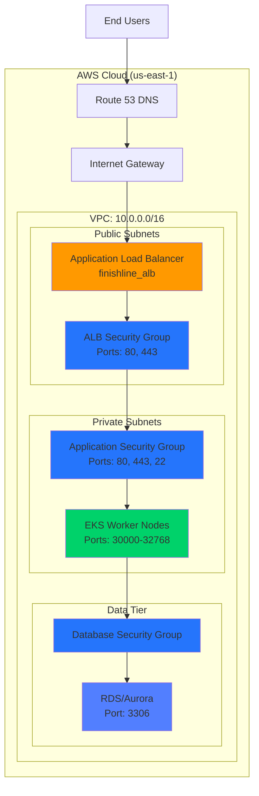
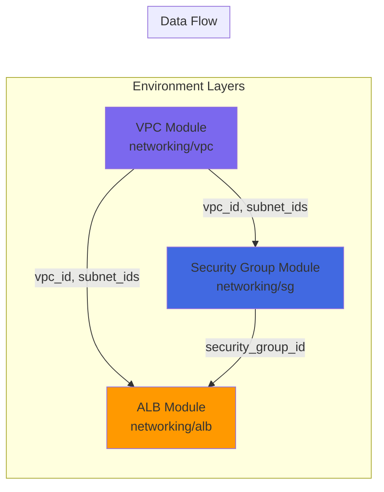
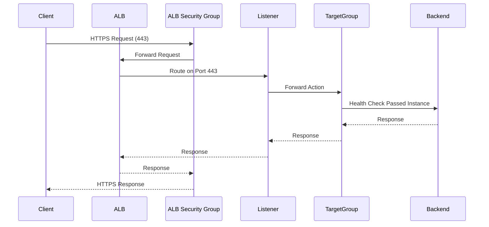
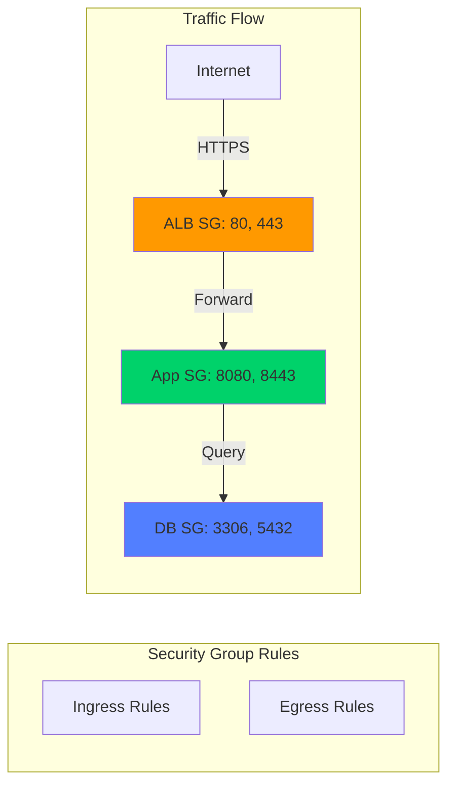
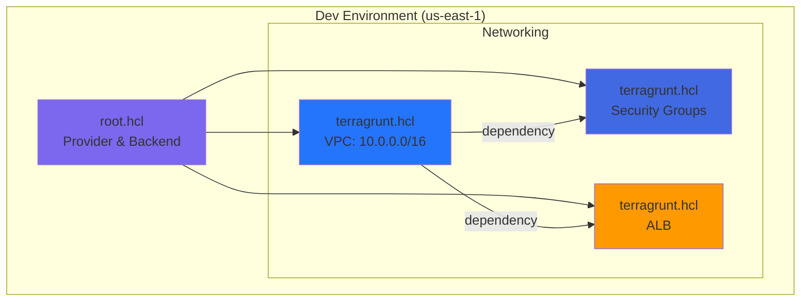
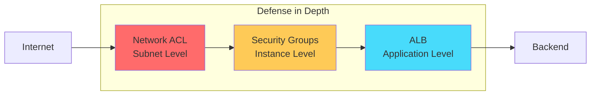
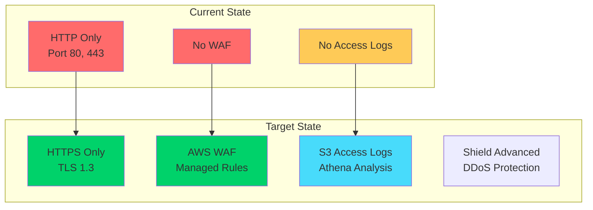

# Networking Module

This directory contains the Terraform networking modules for the FinishLine Infrastructure application. These modules provide the foundational network infrastructure including VPC, Security Groups, and Application Load Balancer (ALB) components.

## Directory Structure

```
networking/
├── alb/                    # Application Load Balancer module
│   ├── main.tf            # ALB, Target Group, Listener resources
│   ├── security_group.tf  # Dedicated ALB Security Group
│   ├── variables.tf       # Input variables
│   ├── outputs.tf         # Module outputs
│   └── locals.tf          # Local values
├── sg/                     # Security Group module
│   ├── main.tf            # Security Group resources
│   ├── variables.tf       # Input variables
│   ├── outputs.tf         # Module outputs
│   └── locals.tf          # Local values with rule transformations
└── vpc/                    # VPC module
    ├── main.tf            # VPC, Subnets, Gateway resources
    ├── variables.tf       # Input variables
    └── outputs.tf         # Module outputs
```

## Architecture Overview



## Module Dependencies



---

## ALB Module

### Overview

The ALB module provisions an Application Load Balancer with associated Target Group, Listener, and a dedicated Security Group. It follows AWS best practices for high availability and security.

### Resources Created

| Resource                                  | Type                      | Description                 |
| ----------------------------------------- | ------------------------- | --------------------------- |
| `aws_alb.finishline_alb`                  | Application Load Balancer | Main ALB resource           |
| `aws_lb_target_group.finishline_alb_tg`   | Target Group              | Backend target registration |
| `aws_lb_listener.finishline_alb_listener` | Listener                  | Traffic routing rules       |
| `aws_security_group.finishline_alb_sg`    | Security Group            | ALB network security        |

### Component Flow



### Configuration Options

#### ALB Settings

| Variable                           | Type   | Default       | Description                   |
| ---------------------------------- | ------ | ------------- | ----------------------------- |
| `alb_internal`                     | bool   | -             | Internal vs Internet-facing   |
| `alb_load_balancer_type`           | string | `application` | ALB type                      |
| `enable_deletion_protection`       | bool   | `false`       | Prevent accidental deletion   |
| `enable_http2`                     | bool   | `true`        | HTTP/2 support                |
| `enable_cross_zone_load_balancing` | bool   | `true`        | Cross-AZ traffic distribution |

#### Health Check Configuration

| Variable                | Type   | Default   | Description              |
| ----------------------- | ------ | --------- | ------------------------ |
| `health_check_enabled`  | bool   | `true`    | Enable health checks     |
| `health_check_path`     | string | `/health` | Health check endpoint    |
| `health_check_interval` | number | `30`      | Check interval (seconds) |
| `health_check_timeout`  | number | `5`       | Timeout (seconds)        |
| `healthy_threshold`     | number | `2`       | Consecutive successes    |
| `unhealthy_threshold`   | number | `3`       | Consecutive failures     |

#### Security Group Rules

Ingress rules are configurable via `ingress_rules` variable:

```hcl
ingress_rules = [
  {
    description = "HTTP ingress"
    from_port   = 80
    to_port     = 80
    protocol    = "tcp"
    cidr_blocks = ["0.0.0.0/0"]
  },
  {
    description = "HTTPS ingress"
    from_port   = 443
    to_port     = 443
    protocol    = "tcp"
    cidr_blocks = ["0.0.0.0/0"]
  }
]
```

### Usage Example

```hcl
module "alb" {
  source = "../../../../modules//networking/alb"

  project_name = "finishline-infra-app"
  environment  = "dev"
  managed_by   = "finishline-infra-team"

  # VPC Configuration
  vpc_id     = module.vpc.vpc_id
  subnet_ids = module.vpc.public_subnet_ids

  # ALB Configuration
  alb_internal                   = false
  alb_load_balancer_type         = "application"
  enable_deletion_protection     = false
  enable_http2                   = true
  enable_cross_zone_load_balancing = true

  # Target Group
  target_group_port     = 80
  target_group_protocol = "HTTP"
  target_type           = "instance"

  # Health Check
  health_check_path    = "/health"
  health_check_interval = 30

  # Listener
  listener_port           = 80
  listener_protocol       = "HTTP"
  listener_default_action = "forward"

  # Security Group
  ingress_rules = [
    {
      description = "HTTP"
      from_port   = 80
      to_port     = 80
      protocol    = "tcp"
      cidr_blocks = ["0.0.0.0/0"]
    }
  ]
}
```

### Outputs

| Output                | Description             |
| --------------------- | ----------------------- |
| `alb_id`              | ALB ID                  |
| `alb_arn`             | ALB ARN                 |
| `alb_dns_name`        | ALB DNS name            |
| `alb_name`            | ALB name                |
| `alb_zone_id`         | ALB Zone ID             |
| `target_group_arn`    | Target Group ARN        |
| `target_group_name`   | Target Group name       |
| `target_group_id`     | Target Group ID         |
| `listener_arn`        | Listener ARN            |
| `listener_port`       | Listener port           |
| `security_group_id`   | ALB Security Group ID   |
| `security_group_name` | ALB Security Group name |

---

## Security Group Module

### Overview

The Security Group module creates reusable security groups with dynamic ingress and egress rules. It supports EKS-specific rules for Kubernetes clusters.

### Resources Created

| Resource                           | Type           | Description         |
| ---------------------------------- | -------------- | ------------------- |
| `aws_security_group.finishline_sg` | Security Group | Main security group |

### Security Architecture



### Configuration Options

| Variable                     | Type         | Description                |
| ---------------------------- | ------------ | -------------------------- |
| `security_group_name`        | string       | Name of the security group |
| `security_group_description` | string       | Description                |
| `vpc_id`                     | string       | VPC ID                     |
| `ingress_rules`              | list(object) | Ingress rules              |
| `egress_rules`               | list(object) | Egress rules               |
| `eks_ingress_rules`          | list(object) | EKS-specific rules         |

### Rule Format

```hcl
ingress_rules = [
  {
    description = "HTTP ingress"
    from_port   = 80
    to_port     = 80
    protocol    = "tcp"
    cidr_blocks = ["0.0.0.0/0"]
  }
]
```

### Usage Example

```hcl
module "sg" {
  source = "../../../../modules//networking/sg"

  project_name = "finishline-infra-app"
  environment  = "dev"
  vpc_id       = module.vpc.vpc_id

  security_group_name        = "finishline-app-sg"
  security_group_description = "Security group for application"

  ingress_rules = [
    {
      description = "HTTP"
      from_port   = 80
      to_port     = 80
      protocol    = "tcp"
      cidr_blocks = ["10.0.0.0/16"]
    }
  ]

  egress_rules = []  # Empty = allow all

  eks_ingress_rules = [
    {
      description = "Node ports"
      from_port   = 30000
      to_port     = 32768
      protocol    = "tcp"
      cidr_blocks = ["10.0.0.0/16"]
    }
  ]
}
```

---

## Environment Configuration

### Development Environment

The `environments/dev/networking/` directory contains Terragrunt configurations for the development environment.



### VPC Configuration (Dev)

| Setting            | Value                                          |
| ------------------ | ---------------------------------------------- |
| VPC CIDR           | `10.0.0.0/16`                                  |
| Public Subnets     | `10.0.1.0/24`, `10.0.2.0/24`, `10.0.3.0/24`    |
| Private Subnets    | `10.0.10.0/24`, `10.0.11.0/24`, `10.0.12.0/24` |
| Availability Zones | `us-east-1a`, `us-east-1b`, `us-east-1c`       |
| DNS Support        | Enabled                                        |

### Network ACL Rules

#### Ingress

| Rule # | Port       | Protocol | Action | CIDR        |
| ------ | ---------- | -------- | ------ | ----------- |
| 100    | 80         | TCP      | Allow  | 0.0.0.0/0   |
| 110    | 443        | TCP      | Allow  | 0.0.0.0/0   |
| 120    | 22         | TCP      | Allow  | 10.0.0.0/16 |
| 32766  | 1024-65535 | TCP      | Allow  | 0.0.0.0/0   |

#### Egress

| Rule # | Port       | Protocol | Action | CIDR        |
| ------ | ---------- | -------- | ------ | ----------- |
| 100    | 80         | TCP      | Allow  | 0.0.0.0/0   |
| 110    | 443        | TCP      | Allow  | 0.0.0.0/0   |
| 120    | 1024-65535 | TCP      | Allow  | 0.0.0.0/0   |
| 130    | 3306       | TCP      | Allow  | 10.0.0.0/16 |

---

## Deployment

### Prerequisites

- Terraform >= 1.5.0
- Terragrunt >= 0.50.0
- AWS CLI configured
- S3 bucket for state (or use bootstrap module)

### Deployment Order

```mermaid
gantt
    title Module Deployment Sequence
    dateFormat X
    axisFormat %s

    section Bootstrap
    State Bucket       :0, 1
    Root Config        :1, 1

    section Networking
    VPC Module         :2, 2
    Security Groups    :4, 2
    ALB Module         :6, 2

    section Compute
    EKS Cluster        :8, 3
    Node Groups        :11, 2
```



### Commands

```bash
# Navigate to environment
cd environments/dev/networking

# Deploy VPC first (dependency)
cd vpc && terragrunt apply

# Deploy Security Groups
cd ../sg && terragrunt apply

# Deploy ALB
cd ../alb && terragrunt apply
```

### State Management

State is stored in S3:

```
s3://finishline-infra-app-ba3347ce/
├── dev/networking/vpc/terraform.tfstate
├── dev/networking/sg/terraform.tfstate
└── dev/networking/alb/terraform.tfstate
```

---

## Security Considerations

### ALB Security Group

- **Dedicated SG**: ALB has its own security group for isolation
- **Ingress**: Only ports 80 and 443 from internet
- **Egress**: All traffic allowed (to reach targets)

### Security Best Practices



1. **Least Privilege**: Only required ports open
2. **Layered Security**: NACL + Security Groups
3. **Private Subnets**: Backend resources not directly accessible
4. **Logging**: Access logs configurable for ALB

### Security Hardening Recommendations

For production environments, implement the following hardening measures:



| Hardening           | Current   | Recommended       | Priority    |
| ------------------- | --------- | ----------------- | ----------- |
| HTTPS/TLS           | HTTP only | TLS 1.3           | 🔴 Critical |
| WAF                 | None      | AWS Managed Rules | 🟠 High     |
| Access Logs         | Disabled  | S3 + Athena       | 🟡 Medium   |
| Deletion Protection | Disabled  | Enabled           | 🟡 Medium   |
| Shield Advanced     | Standard  | Advanced (Prod)   | 🟢 Optional |

### Quick Hardening Guide

```hcl
# environments/prod/networking/alb/terragrunt.hcl
inputs = {
  # HTTPS with TLS 1.3
  listener_port             = 443
  listener_protocol         = "HTTPS"
  listener_ssl_policy       = "ELBSecurityPolicy-TLS13-1-2-2021-06"
  listener_certificate_arn  = "arn:aws:acm:us-east-1:ACCOUNT:certificate/XXX"

  # Enable access logs
  enable_access_logs    = true
  access_logs_s3_bucket = "finishline-alb-logs-prod"
  access_logs_s3_prefix = "alb-access-logs"

  # Enable deletion protection
  enable_deletion_protection = true

  # Restrictive security group (HTTPS only)
  ingress_rules = [
    {
      description = "HTTPS only"
      from_port   = 443
      to_port     = 443
      protocol    = "tcp"
      cidr_blocks = ["0.0.0.0/0"]
    }
  ]
}
```

> 📖 **See [RUNBOOK.md](../../docs/RUNBOOK.md) for complete security hardening procedures, incident response, and monitoring setup.**

---

## Troubleshooting

### Common Issues

| Issue                 | Cause                   | Resolution                     |
| --------------------- | ----------------------- | ------------------------------ |
| ALB unhealthy targets | Security group blocking | Allow ALB SG to target SG      |
| 502 Bad Gateway       | No healthy targets      | Check health check path        |
| Connection timeout    | NACL blocking           | Review NACL rules              |
| DNS resolution failed | DNS support disabled    | Enable DNS in VPC              |
| SSL handshake failed  | Certificate mismatch    | Verify ACM cert and TLS policy |

### Debug Commands

```bash
# Check ALB target health
aws elbv2 describe-target-health --target-group-arn <arn>

# Check security group rules
aws ec2 describe-security-groups --group-ids <sg-id>

# Check NACL rules
aws ec2 describe-network-acls --filters "Name=vpc-id,Values=<vpc-id>"

# Test HTTPS endpoint
curl -v https://your-alb.us-east-1.elb.amazonaws.com/health

# Check WAF logs (Athena)
aws athena start-query-execution \
  --query-string "SELECT * FROM waf_logs WHERE action='BLOCK' LIMIT 10" \
  --query-execution-context "Database=waf_db" \
  --result-configuration "OutputLocation=s3://your-query-results/"
```

---

## Contributing

1. Create feature branch from `main`
2. Make changes in module directory
3. Update documentation
4. Run `terraform validate` and `terragrunt plan`
5. Submit PR with changes

## License

Internal use only - FinishLine Infrastructure
