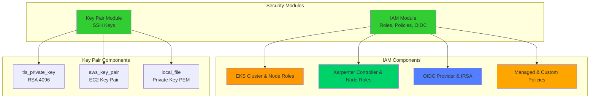
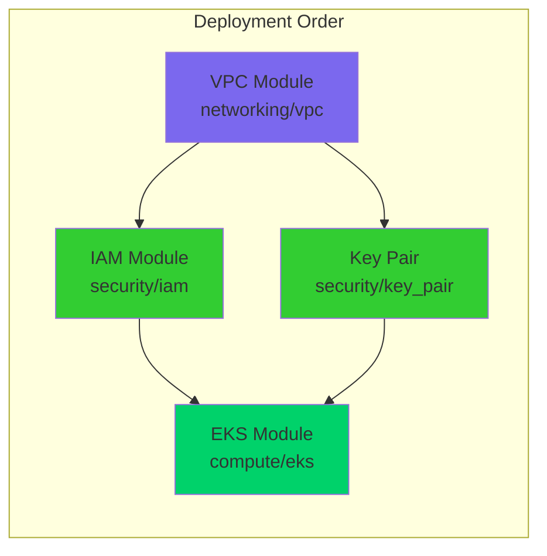
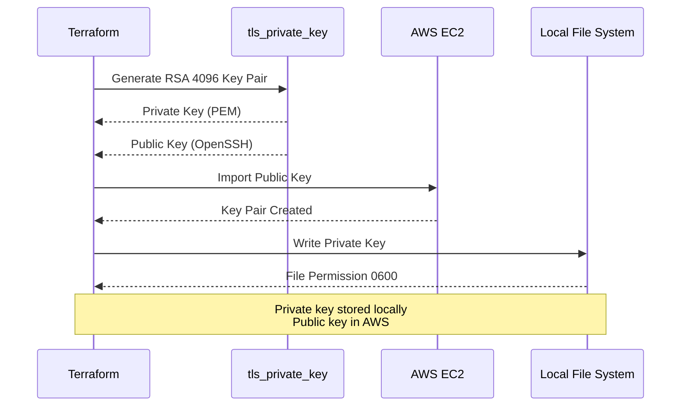
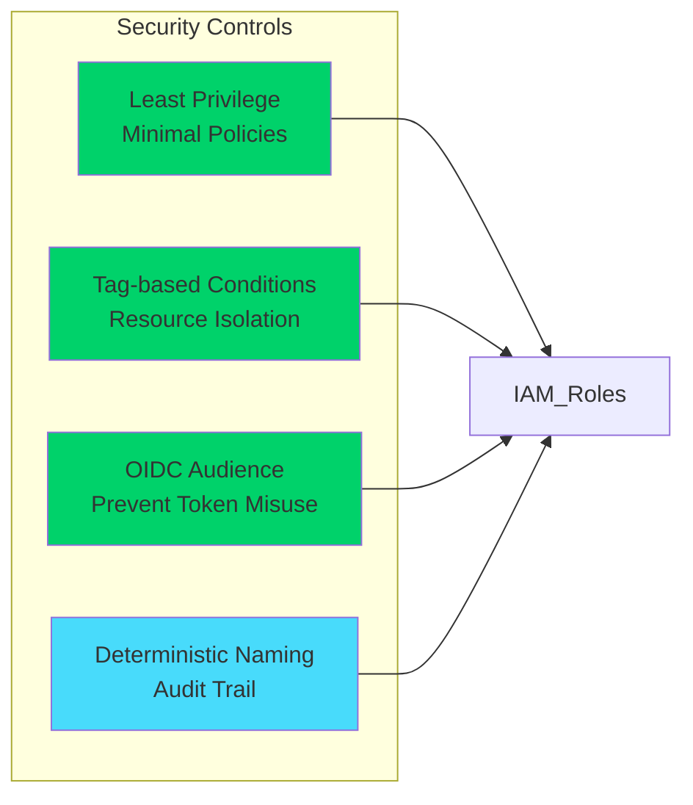

# Security Module

This directory contains the Terraform security modules for the FinishLine Infrastructure application. These modules provide IAM roles, policies, OIDC configuration, and SSH key pair management for EKS clusters and workloads.

## Directory Structure

```
security/
├── iam/                    # IAM module for EKS and Karpenter
│   ├── main.tf            # IAM roles, policies, and instance profiles
│   ├── variables.tf       # Input variables
│   ├── outputs.tf         # Module outputs
│   ├── data.tf            # Data sources and policy documents
│   ├── locals.tf          # Local values and naming conventions
│   └── README.md          # IAM module documentation
└── key_pair/              # SSH Key Pair module
    ├── main.tf            # Key pair and private key resources
    ├── variables.tf       # Input variables
    ├── outputs.tf         # Module outputs
    └── locals.tf          # Local values
```

## Architecture Overview



## Module Dependencies



---

## IAM Module

### Overview

The IAM module provisions IAM roles, policies, and OIDC configuration for:
- EKS cluster control plane
- EKS worker nodes (managed nodegroups)
- Karpenter autoscaler controller (IRSA)
- Karpenter provisioned nodes
- Generic workloads via IRSA

### Resources Created

| Resource Type | Description |
| ------------- | ----------- |
| `aws_iam_role` | EKS cluster, nodegroup, Karpenter controller, Karpenter node, generic OIDC roles |
| `aws_iam_role_policy_attachment` | Managed policy attachments |
| `aws_iam_policy` | Custom policies (Karpenter, S3 access) |
| `aws_iam_openid_connect_provider` | EKS OIDC identity provider |
| `aws_iam_instance_profile` | Karpenter node instance profile |

### Key Features

- **IRSA Ready**: Full support for IAM Roles for Service Accounts
- **Karpenter Enabled**: Complete IAM setup for Karpenter autoscaler
- **Security Hardened**: Tag-based conditions, audience validation
- **Flexible Naming**: Optional deterministic naming for production

### Documentation

See [iam/README.md](./iam/README.md) for detailed documentation.

---

## Key Pair Module

### Overview

The Key Pair module generates and manages SSH key pairs for EC2 instance access (jumphost/bastion).

### Resources Created

| Resource Type | Description |
| ------------- | ----------- |
| `tls_private_key` | Generates RSA 4096-bit private key |
| `aws_key_pair` | Imports public key to AWS EC2 |
| `local_file` | Stores private key as PEM file |

### Key Architecture



### Configuration Options

| Variable | Type | Default | Description |
| -------- | ---- | ------- | ----------- |
| `key_name` | string | - | Name of the key pair in AWS |
| `key_algorithm` | string | `RSA` | Algorithm (RSA, ED25519) |
| `rsa_bits` | number | `4096` | RSA key size |
| `private_key_directory` | string | - | Local directory for private key |
| `private_key_filename` | string | - | Private key filename |
| `file_permission` | string | `0600` | File permissions |

### Usage Example

```hcl
module "key_pair" {
  source = "../../../../modules//security/key_pair"

  project_name = "finishline-infra-app"
  environment  = "dev"
  managed_by   = "finishline-infra-team"
  aws_region   = "us-east-1"

  # Key Pair Configuration
  key_name              = "finishline-infra-app-dev-key"
  key_algorithm         = "RSA"
  rsa_bits              = 4096

  # Private Key Storage
  private_key_directory = "${get_terragrunt_dir()}/keys"
  private_key_filename  = "finishline-infra-app-dev-key.pem"
  file_permission       = "0600"

  computed_tags = {}
}
```

### Outputs

| Output | Description |
| ------ | ----------- |
| `key_pair_name` | AWS key pair name |
| `key_pair_arn` | AWS key pair ARN |
| `public_key` | Public key in OpenSSH format |
| `private_key_path` | Full path to private key file |

### Security Considerations

- **Private Key Storage**: Stored locally with `0600` permissions
- **Key Rotation**: Regenerate by destroying and recreating resources
- **Backup**: Consider storing in AWS Secrets Manager for production
- **Access**: Only jumphost should use this key pair

---

## Environment Configuration

### Development Environment

The `environments/dev/security/` directory contains Terragrunt configurations:

```
environments/dev/security/
├── iam/
│   └── terragrunt.hcl    # IAM module configuration
└── key_pair/
    └── terragrunt.hcl    # Key pair module configuration
```

### Configuration Summary

| Module | Key Settings |
| ------ | ------------ |
| **IAM** | EKS roles enabled, Karpenter enabled, OIDC configured post-cluster-creation |
| **Key Pair** | RSA 4096-bit, local storage in `keys/` directory |

---

## Deployment

### Prerequisites

- Terraform >= 1.5.0
- Terragrunt >= 0.50.0
- AWS CLI configured
- Helm >= 3.12.0 (for Karpenter deployment)

### Deployment Order

```mermaid
gantt
    title Security Module Deployment
    dateFormat X
    axisFormat Step %s

    section Pre-requisites
    VPC Deploy           :0, 2

    section Security
    Key Pair Deploy      :2, 1
    IAM Roles Deploy     :3, 2
    OIDC Config          :5, 2

    section Post-deployment
    IRSA Annotation      :7, 1
    Karpenter Deploy     :8, 2
```



### Commands

```bash
# Navigate to security modules
cd environments/dev/security

# Deploy Key Pair first (needed for jumphost)
cd key_pair && terragrunt apply

# Deploy IAM roles
cd ../iam && terragrunt apply

# After EKS cluster creation, configure OIDC
# Update terragrunt.hcl with OIDC URL and thumbprint
cd ../iam && terragrunt apply

# Annotate Karpenter service account
kubectl annotate serviceaccount karpenter -n karpenter \
  eks.amazonaws.com/role-arn=$(terragrunt output karpenter_controller_role_arn)
```

---

## Security Best Practices

### IAM



1. **Least Privilege**: Use managed policies where possible
2. **Tag-based Conditions**: Restrict actions to tagged resources
3. **OIDC Audience**: Validate `aud` claim in trust policies
4. **Deterministic Naming**: Enable for production environments

### Key Pair

1. **Secure Storage**: Store private keys with `0600` permissions
2. **Key Rotation**: Rotate keys periodically
3. **Access Control**: Limit jumphost access to authorized users
4. **Backup**: Consider AWS Secrets Manager for production

---

## Troubleshooting

### Common Issues

| Issue | Cause | Resolution |
| ----- | ----- | ---------- |
| IRSA not working | Missing OIDC thumbprint | Re-apply IAM module after getting thumbprint |
| Karpenter can't launch nodes | Missing `iam:PassRole` | Verify controller policy attachment |
| Key pair not found | Wrong region | Ensure AWS CLI region matches deployment region |
| Private key permission denied | Wrong file permissions | Run `chmod 400 <keyfile>.pem` |

### Debug Commands

```bash
# Verify IAM roles
aws iam list-roles --query "Roles[?contains(RoleName, 'finishline')]"

# Check OIDC provider
aws iam list-open-id-connect-providers

# Verify key pair
aws ec2 describe-key-pairs --filters "Name=key-name,Values=finishline*"

# Test IRSA
kubectl run test --rm -it --image=amazon/aws-cli --restart=Never -- \
  aws sts get-caller-identity
```

---

## Related Documentation

- [IAM Module README](./iam/README.md) - Detailed IAM module documentation
- [RUNBOOK](../../docs/RUNBOOK.md) - Deployment and operations guide
- [EKS IRSA Documentation](https://docs.aws.amazon.com/eks/latest/userguide/iam-roles-for-service-accounts.html)
- [Karpenter IAM Setup](https://karpenter.sh/docs/getting-started/)

---

## Contributing

1. Create feature branch from `main`
2. Make changes in module directory
3. Update documentation
4. Run `terraform validate` and `terragrunt plan`
5. Submit PR with changes

## License

Internal use only - FinishLine Infrastructure
