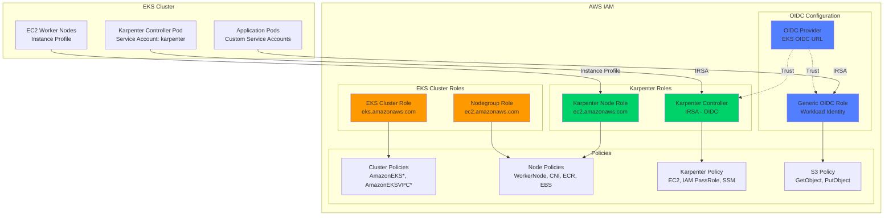
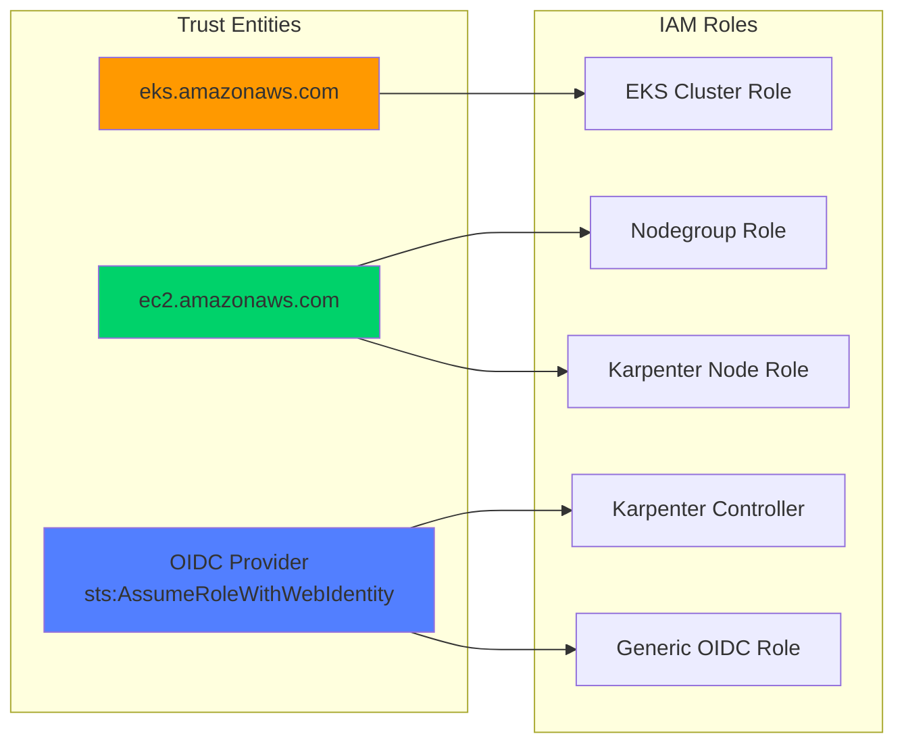
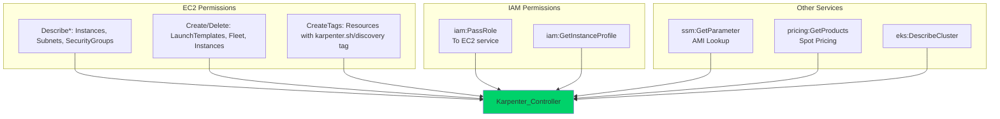
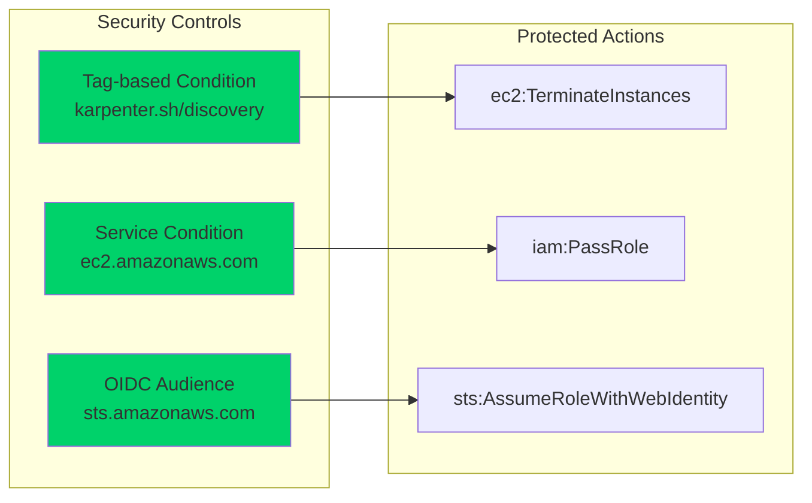

# IAM Module

This directory contains the Terraform IAM module for the FinishLine Infrastructure application. This module provides IAM roles, policies, and OIDC configuration for EKS clusters and Karpenter autoscaler.

## Directory Structure

```
iam/
├── main.tf            # IAM roles, policies, and instance profiles
├── variables.tf       # Input variables
├── outputs.tf         # Module outputs
├── data.tf            # Data sources and policy documents
└── locals.tf          # Local values and naming conventions
```

## Architecture Overview



## IAM Trust Relationships



---

## Resources Created

### EKS Cluster IAM

| Resource                                    | Type              | Description                    |
| ------------------------------------------- | ----------------- | ------------------------------ |
| `aws_iam_role.eks-cluster-role`             | IAM Role          | EKS control plane role         |
| `aws_iam_role_policy_attachment.*`          | Policy Attachment | Managed policies for cluster   |
| `aws_iam_role.eks-nodegroup-role`           | IAM Role          | EKS worker node role           |
| `aws_iam_role_policy_attachment.node-*`     | Policy Attachment | Managed policies for nodes     |

### OIDC Configuration

| Resource                                         | Type              | Description                  |
| ------------------------------------------------ | ----------------- | ---------------------------- |
| `aws_iam_openid_connect_provider.eks-oidc-provider` | OIDC Provider     | EKS OIDC identity provider   |
| `aws_iam_role.eks_oidc_role`                     | IAM Role          | Generic workload identity    |
| `aws_iam_policy.eks_oidc_policy`                 | IAM Policy        | S3 access policy for workloads |

### Karpenter IAM

| Resource                                        | Type              | Description                    |
| ----------------------------------------------- | ----------------- | ------------------------------ |
| `aws_iam_role.karpenter-controller-role`        | IAM Role          | Karpenter controller (IRSA)    |
| `aws_iam_policy.karpenter-controller-policy`    | IAM Policy        | Karpenter controller permissions |
| `aws_iam_role.karpenter-node-role`              | IAM Role          | Karpenter-provisioned nodes    |
| `aws_iam_instance_profile.karpenter-node-profile` | Instance Profile | EC2 instance profile for nodes |

---

## Karpenter IAM Permissions

### Controller Role (IRSA)

The Karpenter controller requires the following permissions:



### Node Role

Karpenter nodes assume a role with:
- `AmazonEKSWorkerNodePolicy` - EKS node registration
- `AmazonEKS_CNI_Policy` - VPC CNI plugin
- `AmazonEC2ContainerRegistryReadOnly` - Container image pull
- `AmazonSSMManagedInstanceCore` - SSM access (optional)

### Security Boundaries



---

## Configuration Options

### EKS Cluster Configuration

| Variable                       | Type   | Default | Description                          |
| ------------------------------ | ------ | ------- | ------------------------------------ |
| `cluster_name`                 | string | -       | Name of the EKS cluster              |
| `is_eks_cluster_enabled`       | bool   | `false` | Enable EKS cluster resources         |
| `is_eks_role_enabled`          | bool   | `false` | Enable EKS cluster IAM role          |
| `is_eks_nodegroup_role_enabled`| bool   | `false` | Enable EKS nodegroup IAM role        |

### OIDC Configuration

| Variable                     | Type   | Default     | Description                          |
| ---------------------------- | ------ | ----------- | ------------------------------------ |
| `eks_oidc_url`               | string | `""`        | EKS OIDC provider URL                |
| `eks_oidc_namespace`         | string | `"default"` | Kubernetes namespace for service account |
| `eks_oidc_service_account`   | string | `""`        | Kubernetes service account name      |
| `oidc_thumbprint`            | string | `""`        | OIDC provider thumbprint             |

### Karpenter Configuration

| Variable                       | Type   | Default       | Description                          |
| ------------------------------ | ------ | ------------- | ------------------------------------ |
| `is_karpenter_enabled`         | bool   | `false`       | Enable Karpenter resources           |
| `karpenter_namespace`          | string | `"karpenter"` | Karpenter controller namespace       |
| `karpenter_service_account`    | string | `"karpenter"` | Karpenter service account name       |
| `karpenter_cluster_name`       | string | `""`          | Cluster name for Karpenter (defaults to cluster_name) |

### S3 Access Configuration

| Variable          | Type   | Default | Description                          |
| ----------------- | ------ | ------- | ------------------------------------ |
| `s3_bucket_arn`   | string | `""`    | S3 bucket ARN for access             |
| `s3_prefix`       | string | `""`    | S3 prefix/path for access            |
| `s3_access_type`  | string | `"read"`| Access type: `read`, `write`, `readwrite` |

### Naming Configuration

| Variable                    | Type   | Default | Description                          |
| --------------------------- | ------ | ------- | ------------------------------------ |
| `enable_deterministic_naming` | bool | `false` | Use deterministic names (no random suffix) |

---

## Usage Example

### Basic EKS IAM Setup

```hcl
module "iam" {
  source = "../../../../modules//security/iam"

  project_name = "finishline-infra-app"
  environment  = "dev"
  managed_by   = "finishline-infra-team"
  aws_region   = "us-east-1"

  cluster_name = "finishline-dev"

  # Enable EKS roles
  is_eks_cluster_enabled      = true
  is_eks_role_enabled         = true
  is_eks_nodegroup_role_enabled = true

  # OIDC (populate after cluster creation)
  eks_oidc_url        = "https://oidc.eks.us-east-1.amazonaws.com/id/XXXXXXXXXXXXX"
  oidc_thumbprint     = "XXXXXXXXXXXXXXXXXXXXXXXXXXXXXXXX"
  eks_oidc_namespace  = "default"
  eks_oidc_service_account = "my-app"

  computed_tags = {}
}
```

### Karpenter-Enabled Configuration

```hcl
module "iam" {
  source = "../../../../modules//security/iam"

  project_name = "finishline-infra-app"
  environment  = "dev"
  managed_by   = "finishline-infra-team"
  aws_region   = "us-east-1"

  cluster_name = "finishline-dev"

  # Enable EKS roles
  is_eks_cluster_enabled      = true
  is_eks_role_enabled         = true
  is_eks_nodegroup_role_enabled = true

  # Enable Karpenter
  is_karpenter_enabled      = true
  karpenter_namespace       = "karpenter"
  karpenter_service_account = "karpenter"
  karpenter_cluster_name    = "finishline-dev"

  # OIDC Configuration
  eks_oidc_url        = "https://oidc.eks.us-east-1.amazonaws.com/id/XXXXXXXXXXXXX"
  oidc_thumbprint     = "XXXXXXXXXXXXXXXXXXXXXXXXXXXXXXXX"

  # Production: use deterministic naming
  enable_deterministic_naming = true

  computed_tags = {}
}
```

### Outputs Usage

```hcl
# Reference Karpenter role ARN for service account annotation
output "karpenter_role_arn" {
  value = module.iam.karpenter_controller_role_arn
}

# Reference instance profile for Karpenter EC2NodeClass
output "karpenter_instance_profile" {
  value = module.iam.karpenter_node_instance_profile_name
}
```

---

## Deployment

### Prerequisites

- Terraform >= 1.5.0
- Terragrunt >= 0.50.0
- AWS CLI configured with appropriate permissions
- EKS cluster (for OIDC configuration)

### Deployment Order

```mermaid
gantt
    title IAM Module Deployment
    dateFormat X
    axisFormat Step %s

    section Pre-requisites
    EKS Cluster Create     :0, 3
    Get OIDC URL           :3, 1
    Get Thumbprint         :4, 1

    section IAM Deployment
    IAM Module Apply       :5, 2
    Annotate Service Account :7, 1

    section Post-deployment
    Verify IRSA            :8, 1
    Deploy Karpenter       :9, 2
```



### Commands

```bash
# Navigate to IAM module
cd environments/dev/security/iam

# Initialize and plan
terragrunt init
terragrunt plan -out=tfplan

# Apply
terragrunt apply tfplan
```

### OIDC Configuration Steps

1. **Create EKS Cluster first** (OIDC URL comes from cluster)

2. **Get OIDC URL:**
   ```bash
   aws eks describe-cluster \
     --name finishline-dev \
     --query "cluster.identity.oidc.issuer" \
     --output text
   ```

3. **Get OIDC Thumbprint:**
   ```bash
   openssl s_client -showcerts -connect oidc.eks.us-east-1.amazonaws.com:443 \
     | openssl x509 -fingerprint -sha256 -noout \
     | cut -d= -f2 \
     | tr -d ':'
   ```

4. **Update terragrunt.hcl** with OIDC values

5. **Re-apply IAM module:**
   ```bash
   terragrunt apply
   ```

6. **Annotate Service Account:**
   ```bash
   # Get role ARN
   KARPENTER_ROLE_ARN=$(terragrunt output karpenter_controller_role_arn)

   # Annotate service account
   kubectl annotate serviceaccount karpenter \
     -n karpenter \
     eks.amazonaws.com/role-arn=$KARPENTER_ROLE_ARN
   ```

---

## Security Considerations

### IRSA Trust Policy

The OIDC trust policy includes both `sub` and `aud` claims for security:

```json
{
  "Version": "2012-10-17",
  "Statement": [
    {
      "Effect": "Allow",
      "Principal": {
        "Federated": "arn:aws:iam::ACCOUNT:oidc-provider/oidc.eks.us-east-1.amazonaws.com/id/XXXXX"
      },
      "Action": "sts:AssumeRoleWithWebIdentity",
      "Condition": {
        "StringEquals": {
          "oidc.eks.us-east-1.amazonaws.com/id/XXXXX:sub": "system:serviceaccount:karpenter:karpenter",
          "oidc.eks.us-east-1.amazonaws.com/id/XXXXX:aud": "sts.amazonaws.com"
        }
      }
    }
  ]
}
```

### Karpenter Security Boundaries

| Action | Condition | Purpose |
|--------|-----------|---------|
| `ec2:TerminateInstances` | `karpenter.sh/discovery` tag | Only terminate Karpenter-managed instances |
| `iam:PassRole` | `ec2.amazonaws.com` service | Only pass roles to EC2 |
| `sts:AssumeRoleWithWebIdentity` | `aud: sts.amazonaws.com` | Prevent token misuse |

### Naming Best Practices

| Environment | `enable_deterministic_naming` | Reason |
| ----------- | ----------------------------- | ------ |
| Dev/Stage   | `false` (default)             | Random suffix prevents conflicts during testing |
| Production  | `true`                        | Predictable names for automation and auditing |

---

## Troubleshooting

### Common Issues

| Issue | Cause | Resolution |
|-------|-------|------------|
| IRSA not working | Missing `aud` condition | Ensure OIDC thumbprint is correct |
| Karpenter can't launch nodes | Missing `iam:PassRole` | Verify controller policy attachment |
| `InvalidClientTokenId` | Wrong OIDC URL | Verify cluster name and region |
| Service account annotation fails | Role not created | Apply IAM module after EKS creation |

### Debug Commands

```bash
# Verify OIDC provider
aws iam list-open-id-connect-providers

# Check role trust policy
aws iam get-role --role-name finishline-dev-karpenter-controller-role

# Verify service account annotation
kubectl get sa karpenter -n karpenter -o yaml

# Test IRSA (from within cluster)
kubectl run test --rm -it --image=amazon/aws-cli --restart=Never -- \
  aws sts get-caller-identity

# Check Karpenter logs
kubectl logs -n karpenter -l app.kubernetes.io/name=karpenter
```

---

## Outputs Reference

### EKS Cluster Outputs

| Output | Description |
|--------|-------------|
| `eks_cluster_role_name` | EKS cluster role name |
| `eks_cluster_role_arn` | EKS cluster role ARN |
| `eks_nodegroup_role_name` | Nodegroup role name |
| `eks_nodegroup_role_arn` | Nodegroup role ARN |

### OIDC Outputs

| Output | Description |
|--------|-------------|
| `oidc_provider_arn` | OIDC provider ARN |
| `oidc_provider_url` | OIDC provider URL |
| `eks_oidc_role_name` | Generic OIDC role name |
| `eks_oidc_role_arn` | Generic OIDC role ARN |
| `eks_oidc_policy_arn` | S3 access policy ARN |

### Karpenter Outputs

| Output | Description |
|--------|-------------|
| `karpenter_controller_role_name` | Controller role name |
| `karpenter_controller_role_arn` | Controller role ARN |
| `karpenter_controller_policy_arn` | Controller policy ARN |
| `karpenter_node_role_name` | Node role name |
| `karpenter_node_role_arn` | Node role ARN |
| `karpenter_node_instance_profile_name` | Instance profile name |
| `karpenter_node_instance_profile_arn` | Instance profile ARN |

---

## Related Documentation

- [EKS IRSA Documentation](https://docs.aws.amazon.com/eks/latest/userguide/iam-roles-for-service-accounts.html)
- [Karpenter IAM Setup](https://karpenter.sh/docs/getting-started/)
- [AWS IAM Best Practices](https://docs.aws.amazon.com/IAM/latest/UserGuide/best-practices.html)
- [FinishLine RUNBOOK](../../docs/RUNBOOK.md)

---

## Contributing

1. Create feature branch from `main`
2. Make changes in module directory
3. Update documentation
4. Run `terraform validate` and `terragrunt plan`
5. Submit PR with changes

## License

Internal use only - FinishLine Infrastructure
