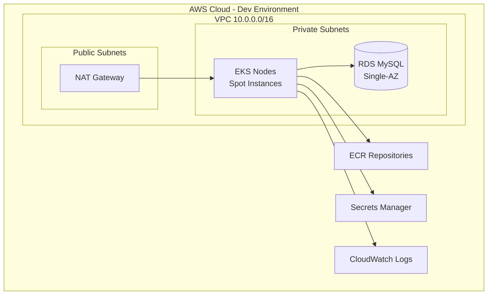

# 🚀 Mission-Critical Runbook: Spring PetClinic AWS Deployment (Enterprise Edition)

## 📋 Metadata

**Version:** 3.0.0 (Enterprise-Ready)
**Last Updated:** 2026-02-08
**Maintainer:** Senior DevOps Architect
**Estimated Total Time:** 45-60 minutes
**Criticality Level:** Production-Grade Infrastructure

---

## 🧠 The "Why Before How" Audit

Before we execute, let's understand the **Enterprise Architecture** we are deploying.

> **💡 Concept: Multi-Environment Infrastructure**
> We use a modular Terraform structure separating `dev`, `staging`, and `prod` environments. Each environment has isolated state, different resource sizing, and progressive security controls.

> **💡 Concept: Infrastructure as Code (IaC) Best Practices**
> Our Terraform follows enterprise patterns:
> - **Modules**: Reusable components (networking, EKS, RDS)
> - **Remote State**: S3 backend with DynamoDB locking
> - **Separation of Concerns**: Shared configs vs environment-specific
> - **Version Pinning**: Locked Terraform and provider versions

## Infrastructure & Sizing

| Component | Dev | Staging | Prod | Estimated Cost (Monthly) |
| :--- | :--- | :--- | :--- | :--- |
| **EKS Nodes** | 1-3 (t3.medium) | 1-3 (t3.medium) | 2-6 (t3.medium) | $30 / $30 / $85 |
| **RDS MySQL** | Single-AZ (db.t3.micro) | Single-AZ (db.t3.micro) | Multi-AZ Ready | $12 / $12 / $40 |
| **NAT Gateway** | 1 Gateway | 1 Gateway | 3 Gateways | $33 / $33 / $99 |
| **ECR Storage** | Per GB | Per GB | Per GB | ~$0.10/GB |
| **Total (Est.)** | **~$75** | **~$75** | **~$224** | |

**Cost Optimization**: All node groups use **Spot Instances** (70% savings).

---

## 🛠️ Phase 1: Environment Preparation

### Step 1.1: Verify Toolchain

```bash
# Required versions
terraform version  # >= 1.5.0
aws --version     # >= 2.x
kubectl version   # >= 1.29
```

**Expected Output:**
```
Terraform v1.5.0
aws-cli/2.x.x
Client Version: v1.29.x
```

---

### Step 1.2: Navigate to Project Structure

```bash
cd /path/to/spring-petclinic-microservices/terraform

# Review the new structure
tree -L 2
```

**Expected Structure:**
```
terraform/
├── environments/
│   ├── dev/
│   ├── staging/
│   └── prod/
├── modules/
│   ├── networking/
│   ├── eks/
│   ├── rds/
│   ├── ecr/
│   ├── secrets/
│   └── monitoring/
├── shared/
│   ├── versions.tf
│   ├── providers.tf
│   └── data.tf
└── scripts/
    ├── init.sh
    ├── plan.sh
    ├── apply.sh
    └── destroy.sh
```

---

### Step 1.3: Create S3 Backend (First-Time Setup)

**⚠️ CRITICAL**: Run this ONCE before first `terraform init`:

```bash
# Set your environment
export ENV=dev

# Create S3 bucket for state
aws s3 mb s3://petclinic-terraform-state-${ENV} --region us-east-1

# Enable versioning
aws s3api put-bucket-versioning \
  --bucket petclinic-terraform-state-${ENV} \
  --versioning-configuration Status=Enabled

# Enable encryption
aws s3api put-bucket-encryption \
  --bucket petclinic-terraform-state-${ENV} \
  --server-side-encryption-configuration '{
    "Rules": [{
      "ApplyServerSideEncryptionByDefault": {
        "SSEAlgorithm": "AES256"
      }
    }]
  }'

# Create DynamoDB lock table
aws dynamodb create-table \
  --table-name terraform-state-lock \
  --attribute-definitions AttributeName=LockID,AttributeType=S \
  --key-schema AttributeName=LockID,KeyType=HASH \
  --billing-mode PAY_PER_REQUEST \
  --region us-east-1
```

---

## 🏗️ Phase 2: Infrastructure Deployment

### Step 2.1: Initialize Environment

```bash
# Use automation scripts
./scripts/init.sh dev
```

**What This Does:**
- Navigates to `environments/dev`
- Runs `terraform init`
- Configures S3 backend
- Downloads provider plugins

**Expected Output:**
```
✅ Initialized dev environment
Terraform has been successfully initialized!
```

---

### Step 2.2: Review Execution Plan

```bash
./scripts/plan.sh dev
```

**Expected Output:**
```
Plan: 52 to add, 0 to change, 0 to destroy.
✅ Plan created for dev environment. Review with: terraform show tfplan
```

**📊 Architecture Deployed:**



**🛡️ Security Checklist Before Apply:**

- [ ] RDS is in **private subnets only**
- [ ] Security groups use **least privilege**
- [ ] Secrets stored in **AWS Secrets Manager**
- [ ] State file encrypted in S3
- [ ] DynamoDB locking enabled

---

### Step 2.3: Deploy Infrastructure

```bash
./scripts/apply.sh dev
```

**Expected Output:**
```
🚀 Applying Terraform plan for dev environment...
Apply complete! Resources: 52 added, 0 changed, 0 destroyed.
✅ Infrastructure deployed to dev
```

**⏱️ Timing Breakdown:**
- VPC/Networking: 2-3 minutes
- RDS Instance: 8-12 minutes
- EKS Cluster: 10-15 minutes
- Node Groups: 5-8 minutes
- **Total: ~20-25 minutes**

---

### Step 2.4: Capture Outputs

```bash
cd environments/dev

# View all outputs
terraform output

# Export for later use
export CLUSTER_NAME=$(terraform output -raw eks_cluster_name)
export RDS_ENDPOINT=$(terraform output -raw rds_endpoint)
```

**Expected Outputs:**
```
eks_cluster_endpoint = "https://ABC123.gr7.us-east-1.eks.amazonaws.com"
eks_cluster_name = "dev-petclinic-cluster"
rds_endpoint = "dev-petclinic-db.abc123.us-east-1.rds.amazonaws.com"
ecr_repositories = {
  "petclinic-api-gateway" = "123456789012.dkr.ecr.us-east-1.amazonaws.com/petclinic-api-gateway"
  "petclinic-customers-service" = "..."
}
```

---

## 🔌 Phase 3: Kubernetes Configuration

### Step 3.1: Configure kubectl

```bash
# Update kubeconfig
aws eks update-kubeconfig \
  --region us-east-1 \
  --name $CLUSTER_NAME

# Verify connection
kubectl get nodes
```

**Expected Output:**
```
NAME                                       STATUS   ROLES    AGE   VERSION
ip-10-0-10-123.us-east-1.compute.internal  Ready    <none>   5m    v1.29.x
ip-10-0-11-456.us-east-1.compute.internal  Ready    <none>   5m    v1.29.x
```

---

### Step 3.2: Install AWS Load Balancer Controller

```bash
# Create IAM service account
eksctl create iamserviceaccount \
  --cluster=$CLUSTER_NAME \
  --namespace=kube-system \
  --name=aws-load-balancer-controller \
  --attach-policy-arn=arn:aws:iam::$(aws sts get-caller-identity --query Account --output text):policy/AWSLoadBalancerControllerIAMPolicy \
  --approve

# Install via Helm
helm repo add eks https://aws.github.io/eks-charts
helm install aws-load-balancer-controller eks/aws-load-balancer-controller \
  -n kube-system \
  --set clusterName=$CLUSTER_NAME \
  --set serviceAccount.create=false \
  --set serviceAccount.name=aws-load-balancer-controller
```

---

### Step 3.3: RDS Connectivity Test

```bash
# Test from temporary pod
kubectl run mysql-test --image=mysql:8.0 --rm -it --restart=Never -- \
  mysql -h $RDS_ENDPOINT -u admin -p

# Inside MySQL shell:
SHOW DATABASES;
```

**Expected Output:**
```
+--------------------+
| Database           |
+--------------------+
| information_schema |
| petclinic          |
+--------------------+
```

**❌ Troubleshooting Connection Timeout:**

```bash
# Get RDS and EKS security groups
RDS_SG=$(aws rds describe-db-instances \
  --db-instance-identifier dev-petclinic-db \
  --query 'DBInstances[0].VpcSecurityGroups[0].VpcSecurityGroupId' \
  --output text)

NODE_SG=$(aws eks describe-cluster \
  --name $CLUSTER_NAME \
  --query 'cluster.resourcesVpcConfig.clusterSecurityGroupId' \
  --output text)

# Verify ingress rule exists
aws ec2 describe-security-group-rules \
  --filters Name=group-id,Values=$RDS_SG \
  --query 'SecurityGroupRules[?FromPort==`3306`]'
```

---

## 🚢 Phase 4: Application Deployment

### Step 4.1: Build and Push Docker Images

```bash
# Login to ECR
aws ecr get-login-password --region us-east-1 | \
  docker login --username AWS --password-stdin \
  $(terraform output -raw ecr_repositories | jq -r '.["petclinic-api-gateway"]' | cut -d'/' -f1)

# Build each microservice (example)
cd ../../spring-petclinic-api-gateway
docker build -t petclinic-api-gateway:latest .

# Tag and push
ECR_REPO=$(cd ../terraform/environments/dev && terraform output -raw ecr_repositories | jq -r '.["petclinic-api-gateway"]')
docker tag petclinic-api-gateway:latest $ECR_REPO:latest
docker push $ECR_REPO:latest

# Repeat for other services...
```

---

### Step 4.2: Deploy to Kubernetes

```bash
# Create namespace
kubectl create namespace petclinic

# Create secret for RDS credentials
kubectl create secret generic mysql-credentials \
  --from-literal=endpoint=$RDS_ENDPOINT \
  --from-literal=username=admin \
  --from-literal=password=$(terraform output -raw rds_password) \
  -n petclinic

# Deploy microservices (use Helm or kubectl)
helm install petclinic ./helm/petclinic \
  --namespace petclinic \
  --set image.repository=$ECR_REPO \
  --set database.endpoint=$RDS_ENDPOINT
```

---

### Step 4.3: Verify Deployment

```bash
# Check pods
kubectl get pods -n petclinic

# Get LoadBalancer URL
kubectl get svc -n petclinic

# Health check
LB_URL=$(kubectl get svc api-gateway -n petclinic -o jsonpath='{.status.loadBalancer.ingress[0].hostname}')
curl http://$LB_URL/actuator/health
```

---

## ✅ Phase 5: Environment-Specific Deployment

### Deploy to Staging

```bash
# Same process for staging
./scripts/init.sh staging
./scripts/plan.sh staging
./scripts/apply.sh staging
```

### Deploy to Production (3 AZs)

```bash
./scripts/init.sh prod
./scripts/plan.sh prod

# Review carefully - production has 3 AZs and higher node count
./scripts/apply.sh prod
```

**Production Differences:**
- ✅ **3 Availability Zones** (us-east-1a/b/c)
- ✅ **Min 2 Nodes** (vs 1 in dev/staging)
- ✅ **Max 6 Nodes** (vs 3 in dev/staging)
- ✅ **Multi-AZ RDS** (when enabled in module)

---

## 🧹 Phase 6: Infrastructure Cleanup

### Option 1: Using Script (Recommended)

```bash
./scripts/destroy.sh dev

# For prod (requires confirmation)
./scripts/destroy.sh prod
# Type 'destroy-prod' to confirm
```

### Option 2: Manual Cleanup

```bash
cd environments/dev

# Delete Kubernetes resources first
kubectl delete namespace petclinic

# Wait for LoadBalancers to be deleted
aws elbv2 describe-load-balancers --query 'LoadBalancers[?VpcId==`'$(terraform output -raw vpc_id)'`]'

# Destroy infrastructure
terraform destroy -auto-approve
```

**💰 Cost Leak Prevention:**

```bash
# Check for orphaned resources
aws ec2 describe-network-interfaces --filters "Name=vpc-id,Values=$(terraform output -raw vpc_id)"
aws elbv2 describe-load-balancers --query 'LoadBalancers[?VpcId==`'$(terraform output -raw vpc_id)'`]'
```

---

## 🚨 Troubleshooting Guide

### Issue 1: Module Not Found Error

**Symptom:**
```
Error: Module not installed
```

**Fix:**
```bash
terraform get
terraform init -upgrade
```

---

### Issue 2: State Lock Conflict

**Symptom:**
```
Error: Error acquiring the state lock
```

**Fix:**
```bash
# Verify no other processes are running
ps aux | grep terraform

# Check DynamoDB lock
aws dynamodb get-item \
  --table-name terraform-state-lock \
  --key '{"LockID": {"S": "petclinic-terraform-state-dev/dev/terraform.tfstate-md5"}}'

# Force unlock (use cautiously)
terraform force-unlock <LOCK_ID>
```

---

### Issue 3: EKS Nodes Not Joining

**Diagnosis:**
```bash
# Check node group status
aws eks describe-nodegroup \
  --cluster-name $CLUSTER_NAME \
  --nodegroup-name general

# Check IAM role trust relationship
aws iam get-role --role-name <NODE_ROLE_NAME>
```

---

## 💡 Pro-Tips & Best Practices

### Security
- ✅ Never commit `terraform.tfvars` with secrets
- ✅ Use AWS Secrets Manager for RDS passwords
- ✅ Enable VPC Flow Logs for audit trails
- ✅ Use private EKS endpoints in production

### Cost Optimization
- 💰 **Spot Instances**: 70% savings on compute
- 💰 **Single NAT in Dev**: Save $33/month
- 💰 **db.t3.micro in Dev**: Save $28/month vs db.t3.small

### Operational Excellence
- 📊 Tag all resources: `Environment`, `Project`, `ManagedBy`
- 🔄 Use GitOps for Kubernetes deployments (ArgoCD/Flux)
- 📈 Enable Container Insights for observability
- 🔔 Set up SNS alerts for critical metrics

---

## 📚 Reference Links

- [Terraform Module Registry](https://registry.terraform.io/namespaces/terraform-aws-modules)
- [EKS Best Practices Guide](https://aws.github.io/aws-eks-best-practices/)
- [AWS Well-Architected Framework](https://aws.amazon.com/architecture/well-architected/)

---

**Status**: ✅ Production-Ready Enterprise Infrastructure
**Last Updated**: 2026-02-08
