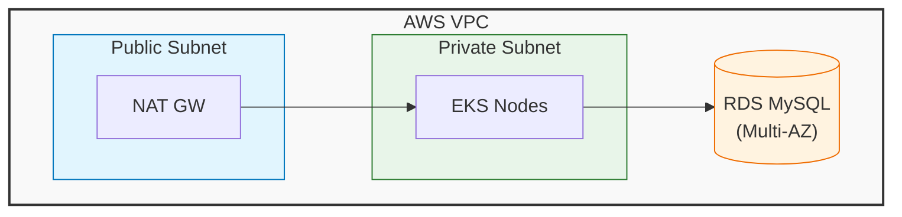

# 🚀 Mission-Critical Runbook: Spring PetClinic AWS Deployment (Beginner Edition)

## 📋 Metadata

**Version:** 2.0.0 (Beginner Friendly)
**Last Updated:** 2024
**Maintainer:** Senior DevOps Mentor
**Estimated Total Time:** 60-90 minutes
**Criticality Level:** Learning & Production-Ready

---

## 🧠 The "Why Before How" Audit

Before we type a single command, let's understand the **Architecture** we are building.

> **💡 Concept: VPC (Virtual Private Cloud)**
> Think of a VPC as your own private data center in the cloud. It's an isolated network where your servers live.

>  **Why needed?** Security. We don't want our database exposed to the entire internet. We put it in a "Private Subnet" inside our VPC.

> **💡 Concept: RDS (Relational Database Service)**
> This is a managed MySQL database. AWS handles backups, patching, and hardware failures for us.

>  **Why needed?** Microservices need a place to store persistent data (like Pet Owners and Visit logs).

> **💡 Concept: EKS (Elastic Kubernetes Service)**
> EKS is the "Captain" of our ship. It manages the containers (Docker) that run our Spring Boot applications.
>
> - **Why needed?** If a container crashes, EKS restarts it. If traffic spikes, EKS can help scale.

## Infrastructure & Sizing

| Component      | AWS Resource  | Sizing / AMI       | Estimated Cost (Monthly) |
| :------------- | :------------ | :----------------- | :----------------------- |
| Jenkins Server | EC2 Instance  | t3.large           | ~$60                     |
| EKS Nodes (3)  | EC2 Instances | t3.medium          | ~$90                     |
| Database       | RDS MySQL     | db.t3.micro        | ~$12                     |
| Registry       | Amazon ECR    | Private Repository | ~$0.10 per GB            |

---

## 🛠️ Phase 1: The Local Cockpit (Environment Setup)

**Objective:** Install the tools required to pilot the cloud.

### Step 1.1: Install The Toolchain

Run these commands on your local machine (Linux/macOS) to set up your cockpit.

**1. AWS CLI (The Remote Control for AWS)**

```bash
curl "https://awscli.amazonaws.com/awscli-exe-linux-x86_64.zip" -o "awscliv2.zip"
unzip awscliv2.zip
sudo ./aws/install
aws --version
```

**Expected Output:**

```json
{
	"UserId": "AIDAXXXXXXXXXXXXXXXXX",
	"Account": "123456789012",
	"Arn": "arn:aws:iam::123456789012:user/your-username"
}
```

**❌ Failure Scenario:**

```
An error occurred (ExpiredToken) when calling the GetCallerIdentity operation
```

**Fix:** Run `aws configure` or refresh your SSO session.

---

### Step 1.2: Validate Terraform Version

```bash
# Check Terraform version (required: >= 1.0)
terraform version
```

**Expected Output:**

```
Terraform v1.5.0
on linux_amd64
+ provider registry.terraform.io/hashicorp/aws v5.x.x
```

**💡 Pro-Tip:** Lock provider versions in `providers.tf` to prevent breaking changes.

---

### Step 1.3: Initialize Terraform Backend

```bash
cd /path/to/spring-petclinic-microservices/terraform/env/dev

# Initialize with backend configuration
terraform init -backend-config=backend.conf
```

**Expected Output:**

```
Initializing the backend...
Initializing provider plugins...
Terraform has been successfully initialized!
```

**🔴 Critical:** If using remote backend (S3), verify state locking:

```bash
# Check DynamoDB table exists
aws dynamodb describe-table --table-name terraform-state-lock --region us-east-1
```

---

### Step 1.4: Validate Terraform Configuration

```bash
# Validate syntax
terraform validate

# Format check
terraform fmt -check -recursive
```

**Expected Output:**

```
Success! The configuration is valid.
```

---

## 🏗️ Phase 2: Infrastructure Provisioning

**Time to Complete:** ~20 minutes

### Step 2.1: Review Terraform Plan

```bash
# Generate execution plan
terraform plan -out=tfplan

# Optional: Save plan to file for audit
terraform show -json tfplan > tfplan.json
```

**Expected Output:**

```
Plan: 45 to add, 0 to change, 0 to destroy.
```

**📊 Architecture Context:**



**🛡️ Security Checklist:**

- [ ] RDS security group does NOT allow 0.0.0.0/0
- [ ] EKS cluster endpoint is private or restricted
- [ ] Secrets stored in AWS Secrets Manager (not hardcoded)

---

### Step 2.2: Apply Infrastructure

```bash
# Apply with auto-approve (use cautiously in production)
terraform apply tfplan

# OR interactive apply
terraform apply
```

**Expected Output:**

```
aws_vpc.main: Creating...
aws_vpc.main: Creation complete after 3s [id=vpc-xxxxx]
...
Apply complete! Resources: 45 added, 0 changed, 0 destroyed.
```

**⏱️ Timing Breakdown:**

- VPC/Subnets: 2-3 minutes
- RDS Instance: 8-12 minutes
- EKS Cluster: 10-15 minutes
- Node Groups: 5-8 minutes

**🚨 State Lock Troubleshooting:**

If you encounter:

```
Error: Error acquiring the state lock
Lock Info:
  ID:        abc123-def456-ghi789
  Path:      terraform-state-lock/terraform.tfstate
  Operation: OperationTypeApply
```

**Recovery Steps:**

```bash
# 1. Verify no other terraform process is running
ps aux | grep terraform

# 2. Check DynamoDB lock table
aws dynamodb get-item \
  --table-name terraform-state-lock \
  --key '{"LockID": {"S": "terraform-state-lock/terraform.tfstate-md5"}}' \
  --region us-east-1

# 3. Force unlock (DANGEROUS - ensure no other process is running)
terraform force-unlock abc123-def456-ghi789

# 4. If lock is stale (>1 hour old), manually delete from DynamoDB
aws dynamodb delete-item \
  --table-name terraform-state-lock \
  --key '{"LockID": {"S": "terraform-state-lock/terraform.tfstate-md5"}}' \
  --region us-east-1
```

---

### Step 2.3: Capture Critical Outputs

```bash
# Export all outputs
terraform output -json > outputs.json

# Capture specific values
export CLUSTER_NAME=$(terraform output -raw cluster_name)
export RDS_ENDPOINT=$(terraform output -raw rds_endpoint)
export RDS_PORT=$(terraform output -raw rds_port)
export VPC_ID=$(terraform output -raw vpc_id)

# Verify exports
echo "Cluster: $CLUSTER_NAME"
echo "RDS: $RDS_ENDPOINT:$RDS_PORT"
```

**Expected Output:**

```
Cluster: petclinic-eks-cluster
RDS: petclinic-db.abc123.us-east-1.rds.amazonaws.com:3306
```

**💾 Pro-Tip:** Save outputs to SSM Parameter Store for other teams:

```bash
aws ssm put-parameter \
  --name "/petclinic/eks/cluster-name" \
  --value "$CLUSTER_NAME" \
  --type String \
  --overwrite
```

---

## 🔌 Phase 3: Connectivity Validation

**Time to Complete:** ~2 minutes

### Step 3.1: Configure kubectl

```bash
# Update kubeconfig dynamically
aws eks update-kubeconfig \
  --region $(terraform output -raw region) \
  --name $(terraform output -raw cluster_name)

# Verify cluster access
kubectl cluster-info
kubectl get nodes
```

**Expected Output:**

```
Kubernetes control plane is running at https://ABC123.gr7.us-east-1.eks.amazonaws.com
CoreDNS is running at https://ABC123.gr7.us-east-1.eks.amazonaws.com/api/v1/namespaces/kube-system/services/kube-dns:dns/proxy

NAME                                       STATUS   ROLES    AGE   VERSION
ip-10-0-1-123.us-east-1.compute.internal   Ready    <none>   5m    v1.27.x
ip-10-0-2-456.us-east-1.compute.internal   Ready    <none>   5m    v1.27.x
```

---

### Step 3.2: RDS Connectivity Test (CRITICAL)

```bash
# Get RDS endpoint from Terraform
RDS_ENDPOINT=$(terraform output -raw rds_endpoint)
RDS_PORT=$(terraform output -raw rds_port)

# Test from local machine (if bastion exists)
nc -zv $RDS_ENDPOINT $RDS_PORT

# Test from EKS worker node (CRITICAL)
kubectl run mysql-test --image=mysql:8.0 --rm -it --restart=Never -- \
  mysql -h $RDS_ENDPOINT -P $RDS_PORT -u admin -p

# Alternative: Deploy test pod
cat <<EOF | kubectl apply -f -
apiVersion: v1
kind: Pod
metadata:
  name: network-test
spec:
  containers:
  - name: netcat
    image: busybox
    command: ['sh', '-c', 'nc -zv $RDS_ENDPOINT $RDS_PORT']
EOF

# Check test results
kubectl logs network-test
```

**Expected Output:**

```
Connection to petclinic-db.abc123.us-east-1.rds.amazonaws.com 3306 port [tcp/mysql] succeeded!
```

**❌ Failure Scenarios:**

**Scenario 1: Connection Timeout**

```
nc: connect to petclinic-db.abc123.us-east-1.rds.amazonaws.com port 3306 (tcp) timed out
```

**Root Cause:** Security group misconfiguration

**Fix:**

```bash
# Get EKS node security group
NODE_SG=$(aws eks describe-cluster \
  --name $CLUSTER_NAME \
  --query 'cluster.resourcesVpcConfig.clusterSecurityGroupId' \
  --output text)

# Get RDS security group
RDS_SG=$(aws rds describe-db-instances \
  --db-instance-identifier petclinic-db \
  --query 'DBInstances[0].VpcSecurityGroups[0].VpcSecurityGroupId' \
  --output text)

# Add ingress rule
aws ec2 authorize-security-group-ingress \
  --group-id $RDS_SG \
  --protocol tcp \
  --port 3306 \
  --source-group $NODE_SG
```

**Scenario 2: DNS Resolution Failure**

```
nc: getaddrinfo: Name or service not known
```

**Fix:**

```bash
# Verify VPC DNS settings
aws ec2 describe-vpc-attribute \
  --vpc-id $VPC_ID \
  --attribute enableDnsHostnames

# Should return: "Value": true
```

---

### Step 3.3: Verify IAM OIDC Provider

```bash
# Check OIDC provider exists
aws iam list-open-id-connect-providers

# Get OIDC issuer URL
OIDC_URL=$(aws eks describe-cluster \
  --name $CLUSTER_NAME \
  --query 'cluster.identity.oidc.issuer' \
  --output text)

echo "OIDC Provider: $OIDC_URL"
```

**Expected Output:**

```
OIDC Provider: https://oidc.eks.us-east-1.amazonaws.com/id/ABC123DEF456
```

**💡 Pro-Tip:** OIDC enables EKS service accounts to assume IAM roles (IRSA pattern).

---

## 🚢 Phase 4: Application Deployment

**Time to Complete:** ~15 minutes

### Step 4.1: Create Kubernetes Namespace

```bash
# Create dedicated namespace
kubectl create namespace petclinic

# Set as default context
kubectl config set-context --current --namespace=petclinic
```

---

### Step 4.2: Deploy Database Schema

```bash
# Create Kubernetes secret for RDS credentials
kubectl create secret generic mysql-credentials \
  --from-literal=username=$(terraform output -raw rds_username) \
  --from-literal=password=$(terraform output -raw rds_password) \
  --from-literal=endpoint=$(terraform output -raw rds_endpoint) \
  -n petclinic

# Run schema migration job
kubectl apply -f k8s/db-migration-job.yaml
kubectl wait --for=condition=complete --timeout=300s job/db-migration -n petclinic
```

**Expected Output:**

```
secret/mysql-credentials created
job.batch/db-migration created
job.batch/db-migration condition met
```

---

### Step 4.3: Deploy Microservices

```bash
# Deploy in dependency order
kubectl apply -f k8s/config-server.yaml
kubectl wait --for=condition=available --timeout=300s deployment/config-server -n petclinic

kubectl apply -f k8s/discovery-server.yaml
kubectl wait --for=condition=available --timeout=300s deployment/discovery-server -n petclinic

kubectl apply -f k8s/customers-service.yaml
kubectl apply -f k8s/vets-service.yaml
kubectl apply -f k8s/visits-service.yaml
kubectl wait --for=condition=available --timeout=300s deployment/customers-service -n petclinic

kubectl apply -f k8s/api-gateway.yaml
kubectl wait --for=condition=available --timeout=300s deployment/api-gateway -n petclinic
```

**📊 Deployment Architecture:**

```
┌─────────────────────────────────────────────────┐
│              Load Balancer (ALB)                │
└────────────────┬────────────────────────────────┘
                 │
         ┌───────▼────────┐
         │  API Gateway   │
         └───────┬────────┘
                 │
    ┌────────────┼────────────┐
    │            │            │
┌───▼───┐   ┌───▼───┐   ┌───▼────┐
│Customers│  │ Vets  │   │ Visits │
│Service  │  │Service│   │Service │
└───┬─────┘  └───┬───┘   └───┬────┘
    │            │            │
    └────────────┼────────────┘
                 │
         ┌───────▼────────┐
         │   RDS MySQL    │
         └────────────────┘
```

---

### Step 4.4: Verify Pod Status

```bash
# Check all pods
kubectl get pods -n petclinic -o wide

# Check pod logs for errors
kubectl logs -l app=customers-service -n petclinic --tail=50

# Describe pod if issues
kubectl describe pod <pod-name> -n petclinic
```

**Expected Output:**

```
NAME                                READY   STATUS    RESTARTS   AGE
config-server-7d9f8b5c4-xyz12       1/1     Running   0          5m
discovery-server-6c8d7b9f5-abc34    1/1     Running   0          4m
customers-service-5f6g7h8i9-def56   1/1     Running   0          3m
vets-service-8h9i0j1k2-ghi78        1/1     Running   0          3m
visits-service-3k4l5m6n7-jkl90      1/1     Running   0          3m
api-gateway-9n0o1p2q3-mno12         1/1     Running   0          2m
```

---

## ✅ Phase 5: Verification & Health Checks

**Time to Complete:** ~3 minutes

### Step 5.1: Service Health Checks

```bash
# Get LoadBalancer URL
LB_URL=$(kubectl get svc api-gateway -n petclinic -o jsonpath='{.status.loadBalancer.ingress[0].hostname}')

echo "Application URL: http://$LB_URL"

# Wait for DNS propagation
sleep 30

# Health check endpoints
curl -f http://$LB_URL/actuator/health
curl -f http://$LB_URL/api/customer/owners
```

**Expected Output:**

```json
{
	"status": "UP",
	"components": {
		"db": { "status": "UP" },
		"diskSpace": { "status": "UP" }
	}
}
```

---

### Step 5.2: Database Connection Verification

```bash
# Check database connections from pods
kubectl exec -it deployment/customers-service -n petclinic -- \
  mysql -h $RDS_ENDPOINT -u admin -p -e "SHOW DATABASES;"
```

**Expected Output:**

```
+--------------------+
| Database           |
+--------------------+
| information_schema |
| petclinic          |
+--------------------+
```

---

### Step 5.3: End-to-End Smoke Test

```bash
# Create test owner
curl -X POST http://$LB_URL/api/customer/owners \
  -H "Content-Type: application/json" \
  -d '{
    "firstName": "Test",
    "lastName": "User",
    "address": "123 Main St",
    "city": "Seattle",
    "telephone": "5551234567"
  }'

# Retrieve owners
curl http://$LB_URL/api/customer/owners | jq
```

---

## 🧹 Phase 6: Decommissioning (Cleanup)

**⚠️ CRITICAL ORDER TO PREVENT ORPHANED RESOURCES**

### Step 6.1: Delete Kubernetes Resources First

```bash
# Delete in reverse order
kubectl delete -f k8s/api-gateway.yaml
kubectl delete -f k8s/visits-service.yaml
kubectl delete -f k8s/vets-service.yaml
kubectl delete -f k8s/customers-service.yaml
kubectl delete -f k8s/discovery-server.yaml
kubectl delete -f k8s/config-server.yaml

# Wait for LoadBalancers to be deleted
kubectl get svc -n petclinic --watch
```

**🔴 Critical:** Wait until all LoadBalancer services show no EXTERNAL-IP before proceeding.

---

### Step 6.2: Destroy Terraform Infrastructure

```bash
# Destroy in safe order
terraform destroy -target=aws_eks_node_group.main
terraform destroy -target=aws_eks_cluster.main
terraform destroy -target=aws_db_instance.main
terraform destroy

# Verify no resources remain
aws ec2 describe-vpcs --filters "Name=tag:Name,Values=petclinic-vpc"
```

**💰 Cost Leak Prevention:**

```bash
# Check for orphaned ELBs
aws elb describe-load-balancers --query 'LoadBalancerDescriptions[?VPCId==`'$VPC_ID'`]'

# Check for orphaned ENIs
aws ec2 describe-network-interfaces --filters "Name=vpc-id,Values=$VPC_ID"

# Force delete if stuck
aws ec2 delete-network-interface --network-interface-id eni-xxxxx
```

---

## 🚨 Troubleshooting Appendix

### Issue 1: EKS Nodes Not Joining Cluster

**Symptoms:**

```bash
kubectl get nodes
# No nodes listed
```

**Diagnosis:**

```bash
# Check node group status
aws eks describe-nodegroup \
  --cluster-name $CLUSTER_NAME \
  --nodegroup-name main

# Check EC2 instances
aws ec2 describe-instances \
  --filters "Name=tag:eks:cluster-name,Values=$CLUSTER_NAME"
```

**Fix:**

```bash
# Verify aws-auth ConfigMap
kubectl get configmap aws-auth -n kube-system -o yaml

# Update if missing
eksctl create iamidentitymapping \
  --cluster $CLUSTER_NAME \
  --arn arn:aws:iam::ACCOUNT:role/NodeInstanceRole \
  --group system:bootstrappers \
  --group system:nodes
```

---

### Issue 2: RDS Connection Refused

**Symptoms:**

```
ERROR 2003 (HY000): Can't connect to MySQL server on 'xxx.rds.amazonaws.com' (111)
```

**Diagnosis:**

```bash
# Check RDS status
aws rds describe-db-instances \
  --db-instance-identifier petclinic-db \
  --query 'DBInstances[0].DBInstanceStatus'

# Check security group rules
aws ec2 describe-security-groups \
  --group-ids $RDS_SG \
  --query 'SecurityGroups[0].IpPermissions'
```

---

### Issue 3: Pods in CrashLoopBackOff

**Diagnosis:**

```bash
kubectl logs <pod-name> -n petclinic --previous
kubectl describe pod <pod-name> -n petclinic
```

**Common Causes:**

- Missing environment variables
- Database connection failure
- Insufficient memory/CPU
- Image pull errors

---

## 💡 Pro-Tips Summary

### Cost Optimization

- **Dev Environment:** Use `t3.medium` nodes (save 60% vs t3.large)
- **RDS:** Use `db.t3.micro` for non-prod (save 80%)
- **Auto-scaling:** Set min nodes to 1 for dev

### Security Best Practices

- ❌ NEVER use `0.0.0.0/0` in RDS security groups
- ✅ Use AWS Secrets Manager for credentials
- ✅ Enable VPC Flow Logs for audit
- ✅ Use private EKS endpoint for production

### Operational Excellence

- Always use remote state with locking
- Tag all resources with `Environment`, `Owner`, `CostCenter`
- Enable CloudWatch Container Insights
- Set up SNS alerts for RDS and EKS

---

## 📚 Reference Links

- [Terraform AWS Provider](https://registry.terraform.io/providers/hashicorp/aws/latest/docs)
- [EKS Best Practices](https://aws.github.io/aws-eks-best-practices/)
- [RDS Security](https://docs.aws.amazon.com/AmazonRDS/latest/UserGuide/UsingWithRDS.html)

---

**End of Runbook**
