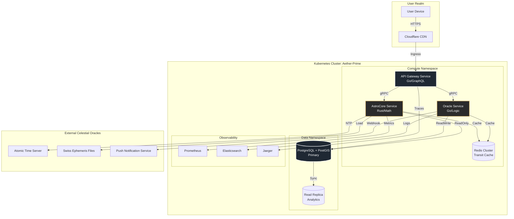

# Project AETHER: Infrastructure Strata & Nervous System
**Phase:** Foundation Laying
**Document:** INFRA-001
**Clearance:** Principal Engineer

To build a temple that withstands the erosion of time, the foundation must be laid with geometric precision. Below is the **Repository Strata** (file structure) and the **Celestial Nervous System** (infrastructure diagram).

This structure enforces separation of concerns: **Computation** (Rust), **Orchestration** (Go), **Presentation** (Next.js), and **Persistence** (PostGIS).

---

## 1. Repository Strata (Directory Tree)

We utilize a **Monorepo** structure managed by `Nx` or `Turborepo`. This ensures that changes to the astronomical constants in the Rust core are type-safe across the Go oracle and the TypeScript frontend.

```text
project-aether/
├── .github/
│   └── workflows/
│       ├── ci-astrocore.yml       # Rust build & math verification
│       ├── ci-oracle.yml          # Go build & integration tests
│       └── deploy-k8s.yml         # ArgoCD / Kubectl apply pipeline
├── apps/
│   ├── Dockerfile                 # Root multi-stage build (as requested)
│   ├── api-gateway/               # Go GraphQL Gateway
│   │   ├── cmd/
│   │   │   └── server/
│   │   ├── internal/
│   │   │   ├── graph/             # GraphQL resolvers
│   │   │   └── middleware/        # Auth & Rate limiting
│   │   ├── go.mod
│   │   ├── go.sum
│   │   └── Dockerfile
│   └── web-temple/                # Next.js + Three.js Frontend
│       ├── src/
│       │   ├── components/
│       │   │   ├── archetype-hud/ # Mythical UI overlays (Anubis/Jaguar)
│       │   │   │   ├── index.tsx
│       │   │   │   └── styles.module.css
│       │   │   ├── celestial-sphere/ # Three.js Canvas
│       │   │   │   ├── Scene.tsx
│       │   │   │   └── PlanetMesh.tsx
│       │   │   └── obelisk-countdown/ # Goal progress
│       │   │       ├── index.tsx
│       │   │       └── utils.ts
│       │   ├── hooks/
│       │   │   └── useTransit.ts  # WebSocket subscription to transits
│       │   ├── pages/
│       │   │   ├── _app.tsx
│       │   │   ├── index.tsx
│       │   │   └── api/
│       │   └── styles/
│       ├── public/
│       │   └── assets/
│       ├── package.json
│       ├── next.config.js
│       ├── tsconfig.json
│       └── Dockerfile
├── services/
│   ├── astrocore/                 # Rust High-Precision Engine
│   │   ├── src/
│   │   │   ├── calculations/
│   │   │   │   ├── ephemeris.rs   # Swiss Ephemeris bindings
│   │   │   │   ├── mayan.rs       # Tzolk'in/Haab' sync
│   │   │   │   └── metonic.rs     # 19-year cycle logic
│   │   │   ├── models/
│   │   │   │   └── transit.rs
│   │   ├── lib.rs
│   │   ├── main.rs
│   │   ├── Cargo.toml
│   │   ├── Cargo.lock
│   │   └── Dockerfile
│   └── oracle-service/            # Go Business Logic & Mythos
│       ├── pkg/
│       │   ├── archetype/         # Character mapping logic
│       │   └── goals/             # Countdown logic
│       ├── main.go
│       ├── go.mod
│       ├── go.sum
│       └── Dockerfile
├── infra/
│   ├── docker/
│   │   └── docker-compose.yml     # Local dev environment
│   ├── k8s/
│   │   ├── base/
│   │   │   ├── astrocore-deploy.yaml
│   │   │   ├── ingress.yaml
│   │   │   ├── oracle-deploy.yaml
│   │   │   └── postgres-statefulset.yaml
│   │   ├── overlays/
│   │   │   ├── production/
│   │   │   │   ├── kustomization.yaml
│   │   │   │   └── replicas.yaml
│   │   │   └── staging/
│   │   └── helm/
│   │       └── aether-chart/
│   │           ├── Chart.yaml
│   │           └── values.yaml
│   └── terraform/
│       ├── main.tf
│       ├── variables.tf
│       ├── outputs.tf
│       └── modules/
│           ├── eks-cluster/
│           └── rds-postgis/
├── libs/
│   ├── math-utils/
│   │   └── constants.rs           # Verified constants (PI, AU, Light Speed)
│   └── shared-types/
│       ├── astro.proto            # Service contracts (Protobuf)
│       └── types.ts               # Shared TS types for Frontend
├── scripts/
│   ├── db-migrate.sh              # Run SQL migrations
│   └── seed-ephemeris.sh          # Load planetary data into DB
├── .env.example
├── .gitignore
└── README.md
```

```bash
#!/bin/bash
# init_aether.sh

echo "Initializing Project AETHER Structure..."

# 1. Create Core Directories (Explicit Paths to prevent expansion errors)
mkdir -p .github/workflows/

# Apps
mkdir -p apps/web-temple/src/{components,hooks,pages,styles}
mkdir -p apps/web-temple/src/components/{celestial-sphere,archetype-hud,obelisk-countdown}
mkdir -p apps/web-temple/public/assets
mkdir -p apps/api-gateway/{cmd/server,internal/{graph,middleware}}

# Services
mkdir -p services/astrocore/src/{calculations,models}
mkdir -p services/oracle-service/pkg/{archetype,goals}

# Infrastructure
mkdir -p infra/docker
mkdir -p infra/k8s/base
mkdir -p infra/k8s/overlays/{production,staging}
mkdir -p infra/k8s/helm/aether-chart
mkdir -p infra/terraform/modules/{eks-cluster,rds-postgis}

# Libs & Scripts
mkdir -p libs/{math-utils,shared-types}
mkdir -p scripts/

# 2. Touch Files (Workflows)
touch .github/workflows/{ci-astrocore,ci-oracle,deploy-k8s}.yml

# 3. Touch Files (Apps)
touch apps/Dockerfile
touch apps/web-temple/{package.json,next.config.js,tsconfig.json,Dockerfile}
touch apps/web-temple/src/hooks/useTransit.ts
touch apps/web-temple/src/components/celestial-sphere/{Scene.tsx,PlanetMesh.tsx}
touch apps/web-temple/src/components/archetype-hud/{index.tsx,styles.module.css}
touch apps/web-temple/src/components/obelisk-countdown/{index.tsx,utils.ts}
touch apps/web-temple/src/pages/{_app.tsx,index.tsx}
touch apps/api-gateway/{go.mod,go.sum,main.go,Dockerfile}

# 4. Touch Files (Services)
touch services/astrocore/{Cargo.toml,Cargo.lock,src/lib.rs,src/main.rs,Dockerfile}
touch services/astrocore/src/calculations/{ephemeris.rs,mayan.rs,metonic.rs}
touch services/astrocore/src/models/transit.rs
touch services/oracle-service/{main.go,go.mod,go.sum,Dockerfile}
touch services/oracle-service/pkg/archetype/mapping.go
touch services/oracle-service/pkg/goals/countdown.go

# 5. Touch Files (Infra)
touch infra/docker/docker-compose.yml
touch infra/k8s/base/{astrocore-deploy.yaml,oracle-deploy.yaml,postgres-statefulset.yaml,ingress.yaml}
touch infra/k8s/overlays/production/{kustomization.yaml,replicas.yaml}
touch infra/k8s/helm/aether-chart/{Chart.yaml,values.yaml}
touch infra/terraform/{main.tf,variables.tf,outputs.tf}
touch infra/terraform/modules/eks-cluster/main.tf
touch infra/terraform/modules/rds-postgis/main.tf

# 6. Touch Files (Libs & Scripts)
touch libs/math-utils/constants.rs
touch libs/shared-types/{astro.proto,types.ts}
touch scripts/{db-migrate.sh,seed-ephemeris.sh}
touch {.env.example,.gitignore,README.md}

echo "Structure Manifested. Directories Aligned. Ready for Code Injection."
```

---

## 2. The Celestial Nervous System (Infrastructure Diagram)

This diagram illustrates the flow of data from the atomic clock to the user's retina. Note the isolation of the **AstroCore** service; it is stateless and purely computational, scaled independently during high-traffic celestial events (e.g., eclipses).



### 2.1 Critical Infrastructure Nodes

1.  **API Gateway (Go):**
    *   Acts as the **Pylon**. All traffic enters here.
    *   Handles Authentication (JWT) and Rate Limiting.
    *   Aggregates data from `AstroCore` (positions) and `Oracle` (goal state) into a single GraphQL response for the frontend.

2.  **AstroCore (Rust):**
    *   Acts as the **Engine**.
    *   **Stateless:** No database connections directly for writes. Reads static ephemeris data from mounted volumes or memory.
    *   **Scaling:** HPA targets CPU usage. Math-heavy operations require compute density.
    *   **Communication:** gRPC for low-latency communication with the Gateway.

3.  **Oracle Service (Go):**
    *   Acts as the **Keeper**.
    *   Manages state (User Goals, Archetypes).
    *   Writes to PostgreSQL.
    *   Implements the "Mythical Mapping" logic (e.g., `if transit == Mars_Square_Sun then archetype = 'Warrior'`).

4.  **PostgreSQL + PostGIS:**
    *   Acts as the **Archive**.
    *   **PostGIS Extension:** Critical for storing user birth coordinates (`GEOGRAPHY(POINT, 4326)`).
    *   **Temporal Tables:** Used to store historical goal states to allow users to "rewind" and see how past transits affected their progress.

5.  **Redis Cluster:**
    *   Acts as the **Ether**.
    *   Caches expensive astronomical calculations.
    *   *Key Strategy:* `astro:position:{planet}:{date}`. TTL set to 24 hours (planetary positions don't change drastically minute-to-minute for user goals).

---

## 3. Deployment Rituals (CI/CD)

We do not "deploy"; we **manifest**.

1.  **Verification Phase:**
    *   Rust tests must pass mathematical validation against NASA Horizons data (tolerance < 0.0001 degrees).
    *   If math drifts, the build fails immediately.
2.  **Containerization:**
    *   Images are signed using `cosign` to ensure supply chain integrity.
    *   Base images are `distroless` to reduce attack surface.
3.  **Rollout:**
    *   **Canary Deployment:** New versions of `AstroCore` are released to 5% of users first. We monitor for calculation anomalies.
    *   **Database Migrations:** Run via `Flyway` or `Golang-Migrate` as a Kubernetes Job before the new service starts.

## 4. Next Steps

1.  **Initialize Repository:** Set up the monorepo structure.
2.  **Provision Database:** Spin up the Postgres/PostGIS instance via Terraform.
3.  **Scaffold AstroCore:** Write the first Rust module for Metonic cycle calculation.

Shall I proceed with drafting the **Terraform scripts for the PostGIS cluster** or the **Rust module for the Metonic Cycle**? The foundation awaits your command.