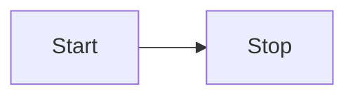

#  A Comprehensive Guide

> A beginner-friendly, production-ready reference for managing dependencies and organizing Go projects.

---

## 📋 Table of Contents

1. [What Are Go Modules?](#-what-are-go-modules)
2. [Getting Started with Modules](#-getting-started-with-modules)
3. [Essential Module Commands](#-essential-module-commands)
4. [Versioning & Dependency Management](#-versioning--dependency-management)
5. [Project Structure Patterns](#-project-structure-patterns)
6. [Architecture Patterns](#-architecture-patterns)
7. [Key Tips for Success](#-key-tips-for-success)
8. [Quick Reference Cheat Sheet](#-quick-reference-cheat-sheet)
9. [Further Resources](#-further-resources)

---

## 🔍 What Are Go Modules?

**Go Modules** are Go's official dependency management system, introduced in Go 1.11 and stabilized in Go 1.13+. They replace the older `GOPATH`-based workflow with a more flexible, reproducible approach.

### ✅ Why Modules Matter

| Benefit | Explanation |
|---------|-------------|
| **Reproducibility** | `go.mod` + `go.sum` lock exact dependency versions for consistent builds across machines |
| **Versioning** | Semantic Import Versioning (v1, v2, etc.) enables safe major-version upgrades |
| **No GOPATH Required** | Work from any directory; no need to clone into `$GOPATH/src` |
| **Private Dependencies** | Support for private modules via `GOPRIVATE`, `git config`, or proxy configuration |
| **Vendor Support** | Optional `vendor/` directory for offline builds or auditability |

### 📦 Core Files

```
my-project/
├── go.mod          # Module definition + direct dependencies
├── go.sum          # Cryptographic checksums for all dependencies (auto-generated)
├── main.go         # Your application code
└── ...
```

#### `go.mod` Anatomy
```go
module github.com/ganil/myapp           // Module path (unique identifier)

go 1.22                                  // Minimum Go version required

require (
    github.com/gin-gonic/gin v1.9.1      // Direct dependency
    github.com/stretchr/testify v1.8.4   // Test dependency
)

require (
    github.com/go-playground/validator/v10 v10.14.0 // Indirect dependency
    // ... transitive dependencies ...
) // indirect

replace github.com/old/pkg => ./forked/pkg  // Override dependency (debugging/forking)

exclude github.com/bad/pkg v1.2.3           // Block known-bad versions
```

#### `go.sum` Purpose
```
# DO NOT EDIT MANUALLY
# Contains cryptographic checksums for every module version used
# Ensures dependency integrity: "Did this dependency change unexpectedly?"
github.com/gin-gonic/gin v1.9.1 h1:abc123...
github.com/gin-gonic/gin v1.9.1/go.mod h1:def456...
```

---

## 🚀 Getting Started with Modules

### Step 1: Initialize a New Module
```bash
# Create project directory
mkdir myapp && cd myapp

# Initialize module (use your repo path for future publishing)
go mod init github.com/yourusername/myapp

# ✅ Creates go.mod with:
#   module github.com/yourusername/myapp
#   go 1.22
```

### Step 2: Add Dependencies
```bash
# Import a package in your code
# main.go:
import "github.com/gin-gonic/gin"

# Download & add to go.mod automatically
go mod tidy

# ✅ go.mod now includes:
#   require github.com/gin-gonic/gin v1.9.1
# ✅ go.sum updated with checksums
```

### Step 3: Run Your Application
```bash
# Build and run
go run main.go

# Or build a binary
go build -o myapp .
./myapp
```

### 🔄 Working Without Network (Offline/Vendored)
```bash
# Vendor dependencies for offline builds
go mod vendor

# Build using vendored code (ignores network)
go build -mod=vendor

# ✅ Useful for: CI/CD air-gapped environments, reproducible builds, auditing
```

---

## ⚙️ Essential Module Commands

| Command                        | Purpose                                         | Example                                                 |
| ------------------------------ | ----------------------------------------------- | ------------------------------------------------------- |
| `go mod init <path>`           | Initialize new module                           | `go mod init github.com/user/repo`                      |
| `go mod tidy`                  | Add missing deps, remove unused, update go.sum  | `go mod tidy`                                           |
| `go mod download`              | Download modules to local cache                 | `go mod download`                                       |
| `go mod vendor`                | Copy dependencies to `vendor/`                  | `go mod vendor`                                         |
| `go mod verify`                | Verify dependencies haven't been tampered with  | `go mod verify`                                         |
| `go mod graph`                 | Print module dependency graph                   | `go mod graph \| grep gin`                              |
| `go list -m all`               | List all modules (direct + indirect)            | `go list -m -versions github.com/gin-gonic/gin`         |
| `go get <pkg>@<version>`       | Upgrade/downgrade specific dependency           | `go get github.com/gin-gonic/gin@v1.9.2`                |
| `go get -u`                    | Upgrade all dependencies to latest minor/patch  | `go get -u ./...`                                       |
| `go mod edit -replace=old=new` | Override a dependency (e.g., for local testing) | `go mod edit -replace=github.com/foo/bar=../forked-bar` |

### 🔍 Debugging Dependencies
```bash
# Why is dependency X included?
go mod why github.com/some/pkg

# What versions are available?
go list -m -versions github.com/gin-gonic/gin

# Check for outdated dependencies
go list -u -m all | grep "\["

# Audit for known vulnerabilities (requires govulncheck)
govulncheck ./...
```

---

## 🏷️ Versioning & Dependency Management

### Semantic Import Versioning (SIV)

Go modules follow **Semantic Versioning** with a twist for major versions ≥ v2:

```go
// v0.x or v1.x: No change to import path
import "github.com/user/repo"  // implies v1

// v2 or higher: Major version MUST appear in import path
import "github.com/user/repo/v2"  // for v2.x.x
import "github.com/user/repo/v3"  // for v3.x.x
```

#### Why This Matters
```go
// ✅ Safe: Importing v1 and v2 simultaneously
import (
    "github.com/user/repo"      // v1.5.0
    "github.com/user/repo/v2"   // v2.0.0
)

// ❌ Invalid: Mixing versions without path change
// import "github.com/user/repo" // Which version? Ambiguous!
```
### Managing Version Conflicts
```bash
# Pin a specific version
go get github.com/lib/pq@v1.10.9

# Use a pseudo-version for commits (e.g., pre-release)
go get github.com/user/repo@abc123def

# Require a minimum version (in go.mod)
require github.com/user/repo v1.2.0 // indirect

# Exclude a broken version
go mod edit -exclude=github.com/bad/pkg@v1.2.3
```
### Private Modules Configuration
```bash
# Option 1: Set GOPRIVATE for your org
export GOPRIVATE=github.com/myorg/*

# Option 2: Configure git to use SSH for private repos
git config --global url."git@github.com:".insteadOf "https://github.com/"

# Option 3: Use a private proxy (e.g., Artifactory, Nexus)
export GOPROXY=https://proxy.mycompany.com,direct

# Then fetch private module
go get github.com/myorg/internal-lib@v1.0.0
```

---

## 🗂️ Project Structure Patterns

> 💡 **Go does not enforce a strict project structure**, but several community-standard patterns have emerged to handle different project scales. For a quick start, you can use the [Go Project Blueprint](https://github.com/golang-standards/project-layout) tool to scaffold a project with common frameworks.

### 1️⃣ Minimal Structure (Small Projects)

For simple applications, CLI tools, or prototypes—keep everything in the root directory. This avoids over-engineering.

```
my-tool/
├── go.mod          # Module definition
├── go.sum          # Dependency checksums
├── main.go         # Entry point (package main)
├── main_test.go    # Unit tests
├── config.go       # Configuration logic
└── README.md
```

#### ✅ When to Use
- Single-binary CLI tools
- Small utilities (< 500 LOC)
- Learning/experimentation
- Proof-of-concept prototypes

#### 📝 Example `main.go`
```go
package main

import (
    "fmt"
    "github.com/spf13/cobra" // External dependency
)

func main() {
    var rootCmd = &cobra.Command{Use: "mytool"}
    rootCmd.AddCommand(&cobra.Command{Use: "deploy", Run: deploy})
    fmt.Println(rootCmd.Execute())
}

func deploy(cmd *cobra.Command, args []string) {
    fmt.Println("Deploying...")
}
```

---

### 2️⃣ Standard Layout (Medium to Large Projects)

The [Standard Go Project Layout](https://github.com/golang-standards/project-layout) is a widely adopted community pattern for production-ready services.

```
my-service/
├── cmd/
│   └── api/                 # Main application entry points
│       └── main.go          # Each subdirectory produces a separate executable
├── internal/                # 🔒 Private code (compiler-enforced isolation)
│   ├── app/                 # Core application logic & orchestration
│   ├── db/                  # Database logic, migrations, repositories
│   ├── models/              # Domain models & data structures
│   └── auth/                # Authentication/authorization logic
├── pkg/                     # 📦 Public library code (safe for external import)
│   ├── logger/              # Reusable logging utilities
│   └── config/              # Config parsing used by multiple projects
├── api/                     # API definitions (OpenAPI, Protobuf, GraphQL)
│   └── openapi.yaml
├── configs/                 # Environment-specific config templates
│   ├── dev.yaml
│   └── prod.yaml
├── scripts/                 # Build, deploy, and analysis scripts
│   ├── build.sh
│   └── lint.sh
├── test/                    # External integration/e2e tests
│   └── e2e/
├── go.mod
├── go.sum
├── Makefi```mermaid
flowchart LR
Start --> Stop
```




le                 # Standardized build/test commands
└── README.md
```

#### 🔐 `internal/` Enforcement
```go
// internal/auth/login.go
package auth

func Validate(token string) bool { /* ... */ }
```

```go
// cmd/api/main.go
import "github.com/you/my-service/internal/auth" // ✅ Allowed (same module)

// In another module (external project):
// import "github.com/you/my-service/internal/auth" // ❌ Compile error!
// "use of internal package not allowed"
```

#### 📦 `pkg/` vs `internal/`
| Directory   | Visibility             | Use Case                                                  |
| ----------- | ---------------------- | --------------------------------------------------------- |
| `internal/` | 🔒 Module-private only | Business logic, infrastructure code not meant for reuse   |
| `pkg/`      | 🌍 Publicly importable | Utilities, helpers, or libraries you want others to reuse |

> 💡 **Rule of thumb**: Start with everything in root or `internal/`. Only move code to `pkg/` when you have a *proven need* for external consumption.

---

### 3️⃣ Architecture Patterns

For complex enterprise systems, developers often layer these structures using architectural principles:

#### 🧱 Clean/Hexagonal Architecture
Focuses on separating **business logic** from external concerns (databases, APIs, UI).

```
my-app/
├── cmd/api/main.go          # Composition root: wires dependencies
├── internal/
│   ├── core/                # Domain entities & business rules (no external deps)
│   │   ├── user.go
│   │   └── service.go
│   ├── ports/               # Interfaces (inbound/outbound contracts)
│   │   ├── http_handler.go  # Implements port for HTTP
│   │   └── repo.go          # Interface for data persistence
│   └── adapters/            # Implementations of ports
│       ├── postgres/        # Concrete DB repository
│       └── http/            # Concrete HTTP handler
```

✅ **Benefits**: Testable core logic, swappable infrastructure, clear boundaries.

#### 🧩 Service-Oriented / Domain-Driven Design
Organizing by functional "slices" where each directory handles a specific domain.

```
my-platform/
├── cmd/
│   ├── user-service/
│   └── order-service/
├── internal/
│   ├── user/                # User domain: models, logic, handlers
│   │   ├── model.go
│   │   ├── service.go
│   │   └── handler.go
│   ├── order/               # Order domain
│   └── shared/              # Cross-cutting concerns (logging, metrics)
├── pkg/
│   └── grpc/                # Shared gRPC utilities
```

✅ **Benefits**: Team autonomy, independent deployment, clear ownership.

---

## 💡 Key Tips for Success

### 🚫 Don't Over-Engineer
> **Start simple. Refactor into more complex directories like `/internal` or `/pkg` only when the project's size warrants it.**

```bash
# ✅ Good progression:
# Week 1: Single main.go + go.mod
# Month 1: Split logic into config.go, handler.go
# Month 3: Introduce internal/ when multiple binaries share code
# Year 1: Extract pkg/ when another team wants to reuse your logger
```

### 🏷️ Package Naming Best Practices
- ✅ **Short & descriptive**: `user`, `config`, `auth`, `db`
- ✅ **Singular**: `user` not `users` (package names are not collections)
- ❌ **Avoid generic names**: `common`, `utils`, `helpers` (what do they *do*?)
- ❌ **Avoid abbreviations**: `cfg` → `config`, `authz` → `authorization`

```go
// ✅ Clear intent
package config  // Parse and validate configuration
package user    // User domain logic
package postgres // PostgreSQL-specific repository

// ❌ Unclear
package utils   // What utilities? For what?
package common  // Common to what?
```

### 🛠️ Use a Makefile
Including a `Makefile` in the root directory helps standardize commands for building, testing, and linting across the team.

```go
# Makefile
.PHONY: build test lint tidy docker

build:
	go build -o bin/myapp ./cmd/api

test:
	go test -race -cover ./...

lint:
	golangci-lint run

tidy:
	go mod tidy
	git diff --exit-code go.mod go.sum  # Fail if not committed

docker:
	docker build -t myapp:latest .

# Default target
all: tidy lint test build
```

Usage:
```bash
make          # Run all: tidy → lint → test → build
make test     # Run tests only
make docker   # Build container image
```

---

## 📋 Quick Reference Cheat Sheet

### Module Commands
```bash
# Initialize
go mod init github.com/user/repo

# Sync dependencies
go mod tidy

# Upgrade a package
go get github.com/pkg/name@v1.2.3

# Vendor for offline builds
go mod vendor && go build -mod=vendor

# Check why a dep is included
go mod why github.com/pkg/name
```

### Project Structure Decision Tree
```
Is your project < 500 LOC and single-binary?
├─ Yes → Use Minimal Structure (root only)
└─ No
   ├─ Do you have multiple binaries (CLI + daemon)?
   │  ├─ Yes → Add /cmd/api, /cmd/worker
   │  └─ No
   │     ├─ Do you share code across modules?
   │     │  ├─ Yes → Extract reusable logic to /pkg
   │     │  └─ No → Keep everything in /internal
   │     └─ Need API contracts? → Add /api with OpenAPI/Protobuf
   └─ Building a large team project? → Adopt Standard Layout + Makefile
```

### Dependency Health Checklist
- [ ] `go mod tidy` runs cleanly (no unused deps)
- [ ] `go mod verify` passes (no tampering)
- [ ] `govulncheck ./...` reports no critical issues
- [ ] `go.sum` is committed to version control
- [ ] Private modules configured via `GOPRIVATE` or proxy

---

## 📚 Further Resources

### Official Documentation
- [Go Modules Reference](https://go.dev/ref/mod)
- [go command documentation](https://pkg.go.dev/cmd/go)
- [Module publishing guide](https://go.dev/doc/modules/publishing)

### Community Tools
- [`govulncheck`](https://go.dev/security/vuln/) — Static vulnerability scanner
- [`golangci-lint`](https://golangci-lint.run/) — Unified linter
- [`depguard`](https://github.com/OpenPeeDeeP/depguard) — Enforce import rules
- [`go-mod-outdated`](https://github.com/psampaz/go-mod-outdated) — Find outdated deps

### Learning
- [The Go Programming Language (Donovan & Kernighan)](https://www.gopl.io/) — Chapter 11: Packages
- [Go Blog: Modules](https://go.dev/blog/using-go-modules)
- [Go Project Blueprint](https://github.com/golang-standards/project-layout) — Scaffold starter projects

---

> 💬 Go modules and project structure are *enablers*, not constraints. Start minimal, grow intentionally, and let your project's needs—not dogma—guide your architecture.

*Happy coding 🚀*