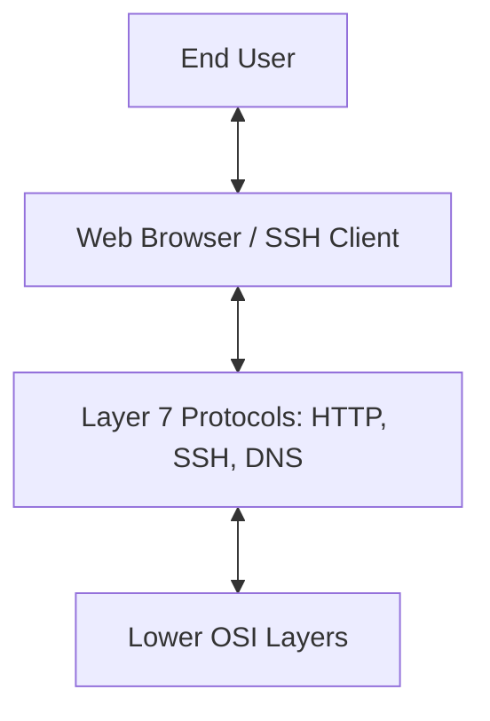

# Application Layer (Layer 7) - OSI Model

## Overview

The Application Layer is the seventh and topmost layer of the OSI model. It is the layer that **interacts directly with the software application**. When you open a browser or an email client, you are interacting with protocols at Layer 7.

It provides network services to the user and ensures that the communication partner can be reached.

---

## Key Functions

### 1. Identifying Communication Partners
Determines the availability of the intended communication partner and the resources needed to connect.

### 2. User Authentication
Handles logging in and verifying identities before allowing access to network services.

### 3. Protocol Services
Provides high-level protocols for web, email, file transfer, and remote management.

---

## Common L7 Protocols

| Protocol | Purpose | Real-World Use |
| :--- | :--- | :--- |
| **HTTP/HTTPS** | Web Browsing | Accessing websites (google.com) |
| **DNS** | Name Resolution | Turning `google.com` into an IP address |
| **SSH** | Remote Access | Securely logging into a Linux server |
| **SMTP/IMAP** | Email | Sending and receiving emails |
| **FTP/SFTP** | File Transfer | Moving files between systems |
| **SNMP** | Monitoring | Tracking the health of network devices |

---

## Why it matters for DevOps

DevOps engineers spend the majority of their time at Layer 7:
- **Load Balancing**: An "L7 Load Balancer" (like Nginx or AWS ALB) can route traffic based on URLs, cookies, or HTTP headers.
- **API Management**: Designing and securing REST or GraphQL APIs.
- **Microservices**: Orchestrating how different services talk to each other over HTTP or gRPC.
- **Troubleshooting**: Fixing "502 Bad Gateway" or "404 Not Found" errors (these are specific to the Application layer).

---

## Summary of the OSI Model

| # | Layer | Data Unit | Device/Protocol |
| :--- | :--- | :--- | :--- |
| **7** | **Application** | Data | HTTP, SSH, DNS |
| **6** | **Presentation** | Data | TLS, JPEG, JSON |
| **5** | **Session** | Data | RPC, SOCKS |
| **4** | **Transport** | Segments | TCP, UDP |
| **3** | **Network** | Packets | IP, ICMP, Routers |
| **2** | **Data Link** | Frames | Ethernet, Switches |
| **1** | **Physical** | Bits | Cables, Hubs |

---

### ⏭️ Next Step
Now that you've mastered the Network Models, explore the [Networking Tools](../../../Networking-Tools/README.md) used by DevOps engineers to troubleshoot these layers!