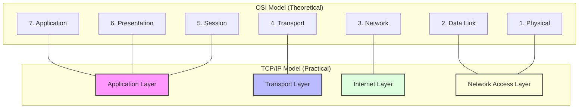

# The Network Model (OSI & TCP/IP)

To troubleshoot effectively in the cloud, you must understand how data moves across the wire. There are two primary models used to describe this: the **OSI Model** (Theoretical) and the **TCP/IP Model** (Practical).

---

## 🌍 1. The OSI Model (7 Layers)

The Open Systems Interconnection (OSI) model is a conceptual framework that standardizes the functions of a telecommunication system.

| Layer | Name | Function | Real-World Example |
| :--- | :--- | :--- | :--- |
| **7** | **Application** | Human-computer interaction | HTTP, DNS, SSH, SMTP |
| **6** | **Presentation** | Data encryption and formatting | SSL/TLS, ASCII, JPEG |
| **5** | **Session** | Session management | RPC, NetBIOS |
| **4** | **Transport** | End-to-end communication | **TCP** (Reliable), **UDP** (Fast) |
| **3** | **Network** | Path determination and Routing | **IP** (Addressing), Routers |
| **2** | **Data Link** | Physical Addressing (MAC) | Ethernet, Switches |
| **1** | **Physical** | Binary transmission (Electrics) | Cables, Hubs, Wi-Fi |

---

## 🏗️ 2. The TCP/IP Model (4 Layers)

This is the model actually implemented in the internet today. It collapses the OSI layers for simplicity.

1.  **Application Layer**: Combines OSI layers 5, 6, and 7. (HTTP, DNS, SSH).
2.  **Transport Layer**: Maps to OSI layer 4. Handles end-to-end communication, reliability, and flow control. (TCP, UDP).
3.  **Internet Layer**: Maps to OSI layer 3. Handles addressing and routing. (IP, ICMP).
4.  **Network Access Layer**: Combines OSI layers 1 and 2. Handles physical transmission and local addressing. (Ethernet, Wi-Fi).

---

## 🔍 3. Why This Matters for DevOps

As a DevOps engineer, you will often troubleshoot at specific layers:
- **Layer 7**: "My website is returning a 502 Bad Gateway." (Application config/Load Balancer).
- **Layer 4**: "I cannot connect to my database on port 5432." (Security Groups/Firewalls).
- **Layer 3**: "My VPC subnets cannot talk to each other." (Route Tables/IP addressing).

---

## 📦 4. Data Encapsulation

As data travels down the stack, each layer adds a **Header** (and sometimes a Trailer). This is called **Encapsulation**. When the receiver gets the data, it strips these headers one-by-one (**Decapsulation**) until only the original message remains.
