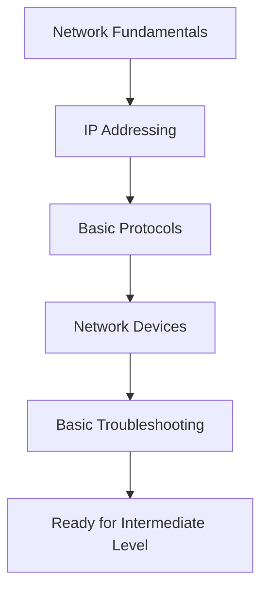

# Beginner Level Networking for DevOps

Welcome to the foundational networking concepts every DevOps professional should master. This section covers essential networking knowledge required for understanding modern infrastructure.

## 📚 Learning Objectives

By completing this level, you will understand:
- Basic networking concepts and terminology
- How data flows through networks
- IP addressing and subnetting fundamentals
- Common network protocols and their purposes
- Basic network devices and their functions
- Essential troubleshooting techniques

## 🗂️ Directory Structure

### 📁 [Network-Fundamentals](./Network-Fundamentals/)
**Core networking concepts and models**
- OSI and TCP/IP models explained
- Network topologies and architectures
- Data transmission fundamentals
- Network types (LAN, WAN, MAN)
- Basic networking terminology

### 📁 [IP-Addressing](./IP-Addressing/)
**IP addressing, subnetting, and network planning**
- IPv4 and IPv6 addressing
- Subnetting and CIDR notation
- Private vs public IP addresses
- Network address translation (NAT)
- IP address planning and allocation

### 📁 [Basic-Protocols](./Basic-Protocols/)
**Essential network protocols for DevOps**
- HTTP/HTTPS fundamentals
- DNS resolution process
- DHCP configuration basics
- TCP vs UDP protocols
- ICMP and network diagnostics

### 📁 [Network-Devices](./Network-Devices/)
**Understanding network infrastructure components**
- Routers and routing basics
- Switches and switching concepts
- Hubs, bridges, and repeaters
- Firewalls and security appliances
- Load balancers introduction

### 📁 [Basic-Troubleshooting](./Basic-Troubleshooting/)
**Essential network troubleshooting skills**
- Network diagnostic tools (ping, traceroute, nslookup)
- Reading network configurations
- Common connectivity issues
- Basic performance monitoring
- Log analysis fundamentals

## 🎯 Prerequisites

- Basic understanding of computer systems
- Familiarity with command-line interfaces
- Basic Linux/Windows administration knowledge

## 🚀 Getting Started

1. **Start with Network-Fundamentals** - Build your foundation
2. **Learn IP-Addressing** - Understand network addressing
3. **Study Basic-Protocols** - Learn how services communicate
4. **Explore Network-Devices** - Understand infrastructure components
5. **Practice Basic-Troubleshooting** - Develop diagnostic skills

## 📖 Recommended Study Path

## 🛠️ Hands-On Labs

Each section includes practical exercises:
- Network simulation using packet tracers
- Command-line practice sessions
- Configuration examples
- Troubleshooting scenarios

## 📝 Assessment Checklist

Before moving to Intermediate Level, ensure you can:
- [ ] Explain the OSI model layers and their functions
- [ ] Calculate subnet masks and network ranges
- [ ] Configure basic network services (DNS, DHCP)
- [ ] Identify and explain common network devices
- [ ] Use basic troubleshooting tools effectively
- [ ] Understand common network protocols and ports

## 🔗 Next Steps

Once you've mastered these concepts, proceed to:
- **[Intermediate Level](../Intermediate-Level/)** - Advanced networking concepts
- **[Network Models](../Network%20Model/)** - Detailed protocol analysis
- **[CyberSecurity](../CyberSecurity/)** - Network security fundamentals

---

*This beginner-level content provides the foundation for all advanced networking concepts in DevOps environments.*