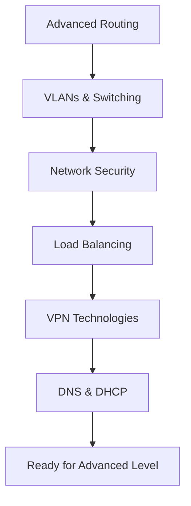

# Intermediate Level Networking for DevOps

Advanced networking concepts for experienced DevOps practitioners. This level covers enterprise-grade networking technologies, security implementations, and infrastructure optimization techniques.

## 📚 Learning Objectives

By completing this level, you will master:
- Advanced routing protocols and techniques
- VLAN implementation and management
- Network security architectures
- Load balancing strategies and implementations
- VPN technologies and configurations
- Advanced DNS and DHCP management

## 🗂️ Directory Structure

### 📁 [Advanced-Routing](./Advanced-Routing/)
**Enterprise routing protocols and techniques**
- OSPF, BGP, and EIGRP protocols
- Route redistribution and filtering
- Policy-based routing
- Multi-homing and redundancy
- Routing optimization techniques

### 📁 [VLANs-Switching](./VLANs-Switching/)
**Advanced switching and VLAN technologies**
- VLAN design and implementation
- Inter-VLAN routing
- Spanning Tree Protocol (STP)
- Link aggregation and bonding
- Switch security features

### 📁 [Network-Security](./Network-Security/)
**Comprehensive network security implementations**
- Firewall architectures and rules
- Intrusion Detection/Prevention Systems
- Network Access Control (NAC)
- Security monitoring and logging
- Threat detection and response

### 📁 [Load-Balancing](./Load-Balancing/)
**Advanced load balancing strategies**
- Layer 4 vs Layer 7 load balancing
- Health checks and failover
- Session persistence and affinity
- Global load balancing
- Application delivery controllers

### 📁 [VPN-Technologies](./VPN-Technologies/)
**Virtual Private Network implementations**
- Site-to-Site VPN configurations
- Remote access VPN solutions
- IPSec, SSL/TLS VPN protocols
- SD-WAN technologies
- VPN performance optimization

### 📁 [DNS-DHCP](./DNS-DHCP/)
**Advanced DNS and DHCP management**
- DNS server clustering and redundancy
- Dynamic DNS and DDNS
- DHCP reservations and scopes
- DNS security extensions (DNSSEC)
- Service discovery mechanisms

## 🎯 Prerequisites

Before starting this level, ensure you have:
- Completed [Beginner Level](../Beginner-Level/) networking concepts
- Solid understanding of IP addressing and subnetting
- Experience with basic network troubleshooting
- Familiarity with Linux/Windows network configuration
- Basic understanding of network security concepts

## 🚀 Learning Path



## 🛠️ Hands-On Environment Setup

### Virtual Lab Requirements

**Recommended Tools:**
- GNS3 or EVE-NG for network simulation
- VirtualBox/VMware for virtual machines
- Packet Tracer for Cisco simulations
- Containerlab for modern network testing

**Sample Lab Topology:**
```
Internet
    │
[Firewall] ── [DMZ Switch] ── [Web Servers]
    │
[Core Switch]
    │
├── [VLAN 10] ── [User Workstations]
├── [VLAN 20] ── [Server Farm]
└── [VLAN 30] ── [Management Network]
```

### Infrastructure as Code Setup

**Terraform Configuration:**
```hcl
# Network infrastructure
module "vpc" {
  source = "./modules/vpc"
  
  cidr_block = "10.0.0.0/16"
  
  public_subnets  = ["10.0.1.0/24", "10.0.2.0/24"]
  private_subnets = ["10.0.10.0/24", "10.0.20.0/24"]
  
  enable_nat_gateway = true
  enable_vpn_gateway = true
}
```

**Ansible Network Automation:**
```yaml
# network-config.yml
- name: Configure network infrastructure
  hosts: network_devices
  tasks:
    - name: Configure VLANs
      cisco.ios.ios_vlans:
        config:
          - vlan_id: 10
            name: "Users"
          - vlan_id: 20
            name: "Servers"
```

## 📊 Real-World Scenarios

### Enterprise Network Design

**Multi-Site Corporate Network:**
```
Headquarters (10.1.0.0/16)
├── Core Network (10.1.0.0/24)
├── User VLANs (10.1.10.0/23)
├── Server VLANs (10.1.20.0/23)
└── DMZ (10.1.100.0/24)

Branch Office 1 (10.2.0.0/16)
├── Local Network (10.2.0.0/24)
└── VPN to HQ

Branch Office 2 (10.3.0.0/16)
├── Local Network (10.3.0.0/24)
└── VPN to HQ

Cloud Infrastructure (10.10.0.0/16)
├── Production (10.10.1.0/24)
├── Staging (10.10.2.0/24)
└── Development (10.10.3.0/24)
```

### High Availability Architecture

**Load Balanced Web Application:**
```
Internet
    │
[Global Load Balancer]
    │
┌───────────────┬───────────────┐
│   Region 1    │   Region 2    │
│               │               │
[Regional LB]   │  [Regional LB] │
    │           │       │       │
┌───┴───┐      │   ┌───┴───┐   │
│Web1   │Web2  │   │Web3   │Web4│
└───┬───┘      │   └───┬───┘   │
    │          │       │       │
[App Servers]  │  [App Servers] │
    │          │       │       │
[Database]     │  [Database]    │
└──────────────┴───────────────┘
```

## 🔧 DevOps Integration Points

### CI/CD Network Considerations

**Pipeline Network Requirements:**
- Secure artifact repositories
- Container registry access
- Deployment target connectivity
- Monitoring and logging endpoints

**Network Automation in Pipelines:**
```yaml
# .gitlab-ci.yml
network_validation:
  stage: test
  script:
    - ansible-playbook network-tests.yml
    - terraform plan -var-file=network.tfvars
  
network_deployment:
  stage: deploy
  script:
    - terraform apply -auto-approve
    - ansible-playbook network-config.yml
```

### Container Networking Integration

**Kubernetes Network Policies:**
```yaml
apiVersion: networking.k8s.io/v1
kind: NetworkPolicy
metadata:
  name: web-netpol
spec:
  podSelector:
    matchLabels:
      tier: web
  policyTypes:
  - Ingress
  - Egress
  ingress:
  - from:
    - namespaceSelector:
        matchLabels:
          name: frontend
    ports:
    - protocol: TCP
      port: 80
```

### Monitoring and Observability

**Network Monitoring Stack:**
- Prometheus for metrics collection
- Grafana for visualization
- ELK stack for log analysis
- SNMP monitoring for network devices

## 📈 Performance Optimization

### Network Performance Tuning

**Linux Network Optimization:**
```bash
# TCP window scaling
echo 'net.core.rmem_max = 134217728' >> /etc/sysctl.conf
echo 'net.core.wmem_max = 134217728' >> /etc/sysctl.conf

# TCP congestion control
echo 'net.ipv4.tcp_congestion_control = bbr' >> /etc/sysctl.conf

# Network interface optimization
ethtool -K eth0 gro on gso on tso on
```

**Application-Level Optimization:**
- Connection pooling
- Keep-alive configurations
- Compression algorithms
- Caching strategies

## 🔒 Security Best Practices

### Network Segmentation

**Zero Trust Architecture:**
```
┌─────────────────────────────────────┐
│           Internet                  │
└─────────────┬───────────────────────┘
              │
    ┌─────────▼─────────┐
    │   Edge Firewall   │
    └─────────┬─────────┘
              │
    ┌─────────▼─────────┐
    │       DMZ         │
    │  [Web Servers]    │
    └─────────┬─────────┘
              │
    ┌─────────▼─────────┐
    │  Internal Firewall│
    └─────────┬─────────┘
              │
    ┌─────────▼─────────┐
    │  Internal Network │
    │  [App Servers]    │
    │  [Databases]      │
    └───────────────────┘
```

### Compliance Considerations

**PCI DSS Network Requirements:**
- Network segmentation for cardholder data
- Firewall configuration standards
- Wireless network security
- Network monitoring and logging

## 📝 Assessment Criteria

### Practical Skills Assessment

**Network Design Project:**
Design a complete network infrastructure for a medium-sized company including:
- [ ] Multi-site connectivity with redundancy
- [ ] VLAN segmentation for security
- [ ] Load balancing for critical applications
- [ ] VPN access for remote workers
- [ ] Network monitoring and management

**Troubleshooting Scenarios:**
- [ ] Resolve routing protocol convergence issues
- [ ] Diagnose VLAN connectivity problems
- [ ] Optimize load balancer performance
- [ ] Troubleshoot VPN connectivity
- [ ] Analyze network security incidents

## 🔗 Integration with DevOps Tools

### Infrastructure as Code
- Terraform for network provisioning
- Ansible for network configuration
- CloudFormation for AWS networking

### Monitoring and Alerting
- Prometheus network exporters
- Grafana network dashboards
- ELK stack for network logs

### Automation and Orchestration
- Network CI/CD pipelines
- Automated compliance checking
- Self-healing network configurations

## 📚 Certification Paths

**Recommended Certifications:**
- Cisco CCNP Enterprise
- CompTIA Network+
- AWS Certified Advanced Networking
- Azure Network Engineer Associate

## 🔗 Next Steps

Upon completion of this level:
- **[Advanced Level](../Advanced-Level/)** - Cloud-native and SDN technologies
- **Specialization Tracks** - Focus on specific vendor technologies
- **Hands-On Projects** - Build real-world network solutions

---

*This intermediate-level content bridges fundamental concepts with advanced enterprise networking technologies essential for modern DevOps environments.*