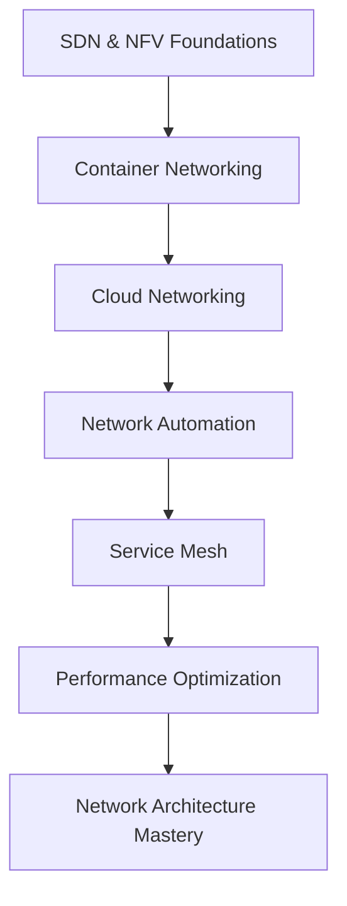

# Advanced Level Networking for DevOps

Cutting-edge networking technologies for senior DevOps engineers and network architects. This level covers cloud-native networking, software-defined networks, and next-generation infrastructure technologies.

## 📚 Learning Objectives

By mastering this level, you will understand:
- Software-Defined Networking (SDN) and Network Function Virtualization (NFV)
- Container and Kubernetes networking architectures
- Multi-cloud and hybrid cloud networking strategies
- Network automation and Infrastructure as Code
- Service mesh technologies and microservices networking
- Advanced performance optimization and troubleshooting

## 🗂️ Directory Structure

### 📁 [SDN-NFV](./SDN-NFV/)
**Software-Defined Networking and Network Function Virtualization**
- OpenFlow and SDN controllers
- Network virtualization technologies
- NFV orchestration and management
- Intent-based networking
- Network programmability and APIs

### 📁 [Container-Networking](./Container-Networking/)
**Container and orchestration networking**
- Docker networking deep dive
- Kubernetes networking model
- Container Network Interface (CNI)
- Network policies and security
- Multi-cluster networking

### 📁 [Cloud-Networking](./Cloud-Networking/)
**Multi-cloud and hybrid networking architectures**
- AWS, Azure, GCP networking services
- Cloud interconnectivity solutions
- Hybrid cloud networking patterns
- Edge computing networking
- Global network optimization

### 📁 [Network-Automation](./Network-Automation/)
**Infrastructure as Code and network automation**
- Network automation frameworks
- Configuration management at scale
- GitOps for network infrastructure
- Continuous integration for networks
- Automated compliance and testing

### 📁 [Service-Mesh](./Service-Mesh/)
**Service mesh technologies and microservices networking**
- Istio, Linkerd, and Consul Connect
- Traffic management and routing
- Security policies and mTLS
- Observability and monitoring
- Multi-cluster service mesh

### 📁 [Performance-Optimization](./Performance-Optimization/)
**Advanced network performance and optimization**
- Network performance analysis
- Latency optimization techniques
- Bandwidth management strategies
- Quality of Service (QoS) implementation
- Network capacity planning

## 🎯 Prerequisites

Before starting this level, ensure you have:
- Mastered [Intermediate Level](../Intermediate-Level/) concepts
- Experience with cloud platforms (AWS, Azure, or GCP)
- Proficiency in container technologies (Docker, Kubernetes)
- Strong programming skills (Python, Go, or similar)
- Understanding of DevOps practices and CI/CD
- Experience with Infrastructure as Code tools

## 🚀 Advanced Learning Path



## 🏗️ Modern Network Architectures

### Cloud-Native Network Stack

```
┌─────────────────────────────────────────┐
│           Application Layer             │
│  [Microservices] [APIs] [Functions]     │
└─────────────┬───────────────────────────┘
              │
┌─────────────▼───────────────────────────┐
│          Service Mesh Layer             │
│  [Istio] [Linkerd] [Traffic Management] │
└─────────────┬───────────────────────────┘
              │
┌─────────────▼───────────────────────────┐
│       Container Orchestration           │
│  [Kubernetes] [Docker Swarm] [ECS]      │
└─────────────┬───────────────────────────┘
              │
┌─────────────▼───────────────────────────┐
│        Container Runtime                │
│  [Docker] [containerd] [CRI-O]          │
└─────────────┬───────────────────────────┘
              │
┌─────────────▼───────────────────────────┐
│         Network Layer                   │
│  [CNI] [Calico] [Flannel] [Cilium]      │
└─────────────┬───────────────────────────┘
              │
┌─────────────▼───────────────────────────┐
│      Infrastructure Layer               │
│  [VPC] [Subnets] [Load Balancers]       │
└─────────────────────────────────────────┘
```

### Edge Computing Network Architecture

```
┌─────────────────────────────────────────┐
│              Cloud Core                 │
│  [Central Management] [Data Lakes]      │
└─────────────┬───────────────────────────┘
              │
┌─────────────▼───────────────────────────┐
│           Regional Edge                 │
│  [Edge Clusters] [CDN] [Caching]        │
└─────────────┬───────────────────────────┘
              │
┌─────────────▼───────────────────────────┐
│            Local Edge                   │
│  [IoT Gateways] [5G] [Local Processing] │
└─────────────┬───────────────────────────┘
              │
┌─────────────▼───────────────────────────┐
│           Device Layer                  │
│  [IoT Devices] [Sensors] [Endpoints]    │
└─────────────────────────────────────────┘
```

## 🔧 Advanced Technologies Deep Dive

### Software-Defined Networking (SDN)

**OpenFlow Controller Example:**
```python
# Ryu SDN Controller
from ryu.base import app_manager
from ryu.controller import ofp_event
from ryu.controller.handler import CONFIG_DISPATCHER, MAIN_DISPATCHER
from ryu.controller.handler import set_ev_cls
from ryu.ofproto import ofproto_v1_3

class SimpleSwitch13(app_manager.RyuApp):
    OFP_VERSIONS = [ofproto_v1_3.OFP_VERSION]

    def __init__(self, *args, **kwargs):
        super(SimpleSwitch13, self).__init__(*args, **kwargs)
        self.mac_to_port = {}

    @set_ev_cls(ofp_event.EventOFPSwitchFeatures, CONFIG_DISPATCHER)
    def switch_features_handler(self, ev):
        datapath = ev.msg.datapath
        ofproto = datapath.ofproto
        parser = datapath.ofproto_parser

        # Install table-miss flow entry
        match = parser.OFPMatch()
        actions = [parser.OFPActionOutput(ofproto.OFPP_CONTROLLER,
                                        ofproto.OFPCML_NO_BUFFER)]
        self.add_flow(datapath, 0, match, actions)
```

### Container Network Interface (CNI)

**Custom CNI Plugin Configuration:**
```json
{
  "cniVersion": "0.4.0",
  "name": "mynet",
  "type": "bridge",
  "bridge": "cni0",
  "isGateway": true,
  "ipMasq": true,
  "ipam": {
    "type": "host-local",
    "subnet": "10.244.0.0/16",
    "routes": [
      { "dst": "0.0.0.0/0" }
    ]
  }
}
```

### Service Mesh Configuration

**Istio Traffic Management:**
```yaml
apiVersion: networking.istio.io/v1alpha3
kind: VirtualService
metadata:
  name: reviews-route
spec:
  http:
  - match:
    - headers:
        end-user:
          exact: jason
    route:
    - destination:
        host: reviews
        subset: v2
  - route:
    - destination:
        host: reviews
        subset: v1
      weight: 90
    - destination:
        host: reviews
        subset: v3
      weight: 10
---
apiVersion: networking.istio.io/v1alpha3
kind: DestinationRule
metadata:
  name: reviews-destination
spec:
  host: reviews
  trafficPolicy:
    tls:
      mode: ISTIO_MUTUAL
  subsets:
  - name: v1
    labels:
      version: v1
  - name: v2
    labels:
      version: v2
    trafficPolicy:
      connectionPool:
        tcp:
          maxConnections: 100
  - name: v3
    labels:
      version: v3
```

## 🤖 Network Automation Frameworks

### Terraform Network Modules

**Multi-Cloud Network Module:**
```hcl
# modules/multi-cloud-network/main.tf
module "aws_network" {
  source = "./aws"
  count  = var.deploy_aws ? 1 : 0
  
  vpc_cidr = var.aws_vpc_cidr
  region   = var.aws_region
}

module "azure_network" {
  source = "./azure"
  count  = var.deploy_azure ? 1 : 0
  
  vnet_cidr = var.azure_vnet_cidr
  location  = var.azure_location
}

module "gcp_network" {
  source = "./gcp"
  count  = var.deploy_gcp ? 1 : 0
  
  vpc_cidr = var.gcp_vpc_cidr
  region   = var.gcp_region
}

# Cross-cloud connectivity
resource "aws_vpn_connection" "aws_to_azure" {
  count           = var.deploy_aws && var.deploy_azure ? 1 : 0
  vpn_gateway_id  = module.aws_network[0].vpn_gateway_id
  customer_gateway_id = module.azure_network[0].customer_gateway_id
  type            = "ipsec.1"
  static_routes_only = true
}
```

### Ansible Network Automation

**Network Configuration as Code:**
```yaml
# network-automation.yml
---
- name: Configure multi-vendor network infrastructure
  hosts: all
  gather_facts: no
  
  tasks:
    - name: Configure Cisco devices
      when: ansible_network_os == 'ios'
      block:
        - name: Configure VLANs
          cisco.ios.ios_vlans:
            config: "{{ vlans }}"
            state: merged
        
        - name: Configure interfaces
          cisco.ios.ios_interfaces:
            config: "{{ interfaces }}"
            state: merged
    
    - name: Configure Juniper devices
      when: ansible_network_os == 'junos'
      block:
        - name: Configure VLANs
          junipernetworks.junos.junos_vlans:
            config: "{{ vlans }}"
            state: merged
    
    - name: Validate configuration
      include_tasks: validate_config.yml
```

### GitOps for Network Infrastructure

**ArgoCD Network Application:**
```yaml
apiVersion: argoproj.io/v1alpha1
kind: Application
metadata:
  name: network-infrastructure
  namespace: argocd
spec:
  project: default
  source:
    repoURL: https://github.com/company/network-configs
    targetRevision: HEAD
    path: environments/production
  destination:
    server: https://kubernetes.default.svc
    namespace: network-system
  syncPolicy:
    automated:
      prune: true
      selfHeal: true
    syncOptions:
    - CreateNamespace=true
```

## 🔍 Advanced Monitoring and Observability

### Network Telemetry Stack

**Prometheus Network Monitoring:**
```yaml
# prometheus-network-config.yml
global:
  scrape_interval: 15s

scrape_configs:
  - job_name: 'snmp-devices'
    static_configs:
      - targets: ['router1:161', 'switch1:161']
    metrics_path: /snmp
    params:
      module: [if_mib]
    relabel_configs:
      - source_labels: [__address__]
        target_label: __param_target
      - source_labels: [__param_target]
        target_label: instance
      - target_label: __address__
        replacement: snmp-exporter:9116

  - job_name: 'kubernetes-pods'
    kubernetes_sd_configs:
      - role: pod
    relabel_configs:
      - source_labels: [__meta_kubernetes_pod_annotation_prometheus_io_scrape]
        action: keep
        regex: true
```

**Grafana Network Dashboard:**
```json
{
  "dashboard": {
    "title": "Network Infrastructure Overview",
    "panels": [
      {
        "title": "Interface Utilization",
        "type": "graph",
        "targets": [
          {
            "expr": "rate(ifInOctets[5m]) * 8",
            "legendFormat": "{{instance}} - {{ifDescr}} In"
          },
          {
            "expr": "rate(ifOutOctets[5m]) * 8",
            "legendFormat": "{{instance}} - {{ifDescr}} Out"
          }
        ]
      },
      {
        "title": "Network Latency",
        "type": "singlestat",
        "targets": [
          {
            "expr": "avg(probe_duration_seconds{job=\"blackbox\"})",
            "legendFormat": "Average Latency"
          }
        ]
      }
    ]
  }
}
```

## 🚀 Performance Optimization Techniques

### Advanced TCP Optimization

**Linux Kernel Network Tuning:**
```bash
#!/bin/bash
# advanced-network-tuning.sh

# TCP congestion control
echo 'net.ipv4.tcp_congestion_control = bbr' >> /etc/sysctl.conf

# TCP window scaling
echo 'net.core.rmem_default = 262144' >> /etc/sysctl.conf
echo 'net.core.rmem_max = 16777216' >> /etc/sysctl.conf
echo 'net.core.wmem_default = 262144' >> /etc/sysctl.conf
echo 'net.core.wmem_max = 16777216' >> /etc/sysctl.conf

# TCP buffer sizes
echo 'net.ipv4.tcp_rmem = 4096 65536 16777216' >> /etc/sysctl.conf
echo 'net.ipv4.tcp_wmem = 4096 65536 16777216' >> /etc/sysctl.conf

# Network device queue optimization
echo 'net.core.netdev_max_backlog = 5000' >> /etc/sysctl.conf
echo 'net.core.netdev_budget = 600' >> /etc/sysctl.conf

# Apply settings
sysctl -p

# NIC optimization
for interface in $(ls /sys/class/net/ | grep -E '^(eth|ens|enp)'); do
    ethtool -K $interface gro on
    ethtool -K $interface gso on
    ethtool -K $interface tso on
    ethtool -G $interface rx 4096 tx 4096
done
```

### Application-Level Network Optimization

**Connection Pooling Configuration:**
```python
# Python connection pooling example
import asyncio
import aiohttp
from aiohttp_session import setup
from aiohttp_session.cookie_storage import EncryptedCookieStorage

class NetworkOptimizedClient:
    def __init__(self):
        # Connection pooling configuration
        connector = aiohttp.TCPConnector(
            limit=100,  # Total connection pool size
            limit_per_host=30,  # Per-host connection limit
            ttl_dns_cache=300,  # DNS cache TTL
            use_dns_cache=True,
            keepalive_timeout=30,
            enable_cleanup_closed=True
        )
        
        # Timeout configuration
        timeout = aiohttp.ClientTimeout(
            total=30,
            connect=10,
            sock_read=10
        )
        
        self.session = aiohttp.ClientSession(
            connector=connector,
            timeout=timeout
        )
    
    async def make_request(self, url, **kwargs):
        async with self.session.get(url, **kwargs) as response:
            return await response.json()
```

## 🏆 Real-World Case Studies

### Case Study 1: Global E-commerce Platform

**Challenge**: Scale network infrastructure for Black Friday traffic (10x normal load)

**Solution Architecture:**
```
Global Load Balancer (Cloudflare)
├── US East (Primary)
│   ├── Application Load Balancers (3x)
│   ├── Auto-scaling Groups (Web/App tiers)
│   └── Database Cluster (RDS Multi-AZ)
├── US West (Secondary)
│   ├── Application Load Balancers (2x)
│   ├── Auto-scaling Groups
│   └── Read Replicas
└── EU West (Regional)
    ├── Application Load Balancers (2x)
    ├── Auto-scaling Groups
    └── Regional Database
```

**Key Technologies:**
- AWS Global Accelerator for traffic optimization
- Kubernetes HPA for application scaling
- Istio service mesh for traffic management
- Prometheus/Grafana for real-time monitoring

### Case Study 2: Financial Services Multi-Cloud

**Challenge**: Implement zero-trust networking across AWS, Azure, and on-premises

**Solution Components:**
- HashiCorp Consul for service discovery
- Istio service mesh for mTLS
- Terraform for infrastructure provisioning
- Vault for certificate management

## 📊 Advanced Assessment Projects

### Project 1: Design Cloud-Native Network Architecture

**Requirements:**
- Multi-region deployment with < 50ms latency
- 99.99% availability SLA
- Auto-scaling based on network metrics
- Comprehensive security controls
- Cost optimization strategies

### Project 2: Implement Network Automation Pipeline

**Deliverables:**
- GitOps workflow for network changes
- Automated testing and validation
- Rollback mechanisms
- Compliance reporting
- Performance monitoring

### Project 3: Service Mesh Implementation

**Scope:**
- Multi-cluster Istio deployment
- Traffic management policies
- Security policy enforcement
- Observability dashboard
- Disaster recovery procedures

## 🎓 Expert-Level Certifications

**Cloud-Native Networking:**
- Certified Kubernetes Administrator (CKA)
- Certified Kubernetes Security Specialist (CKS)
- Istio Certified Associate (ICA)

**Cloud Platform Specializations:**
- AWS Certified Advanced Networking - Specialty
- Microsoft Azure Network Engineer Associate
- Google Cloud Professional Cloud Network Engineer

**Vendor-Specific:**
- Cisco DevNet Professional
- Juniper JNCIE-Cloud
- VMware VCP-NV (Network Virtualization)

## 🔮 Emerging Technologies

### Network Trends to Watch

**5G and Edge Computing:**
- Ultra-low latency applications
- Network slicing technologies
- Mobile edge computing (MEC)

**AI/ML in Networking:**
- Intent-based networking
- Predictive network analytics
- Automated incident response

**Quantum Networking:**
- Quantum key distribution
- Post-quantum cryptography
- Quantum internet protocols

## 🔗 Next Steps and Specializations

### Career Paths

**Network Architect:**
- Design enterprise network architectures
- Lead digital transformation initiatives
- Develop networking standards and policies

**DevOps/Platform Engineer:**
- Build self-service network platforms
- Implement network automation at scale
- Optimize application network performance

**Security Engineer:**
- Design zero-trust network architectures
- Implement network security controls
- Develop threat detection systems

### Continuous Learning

**Stay Current With:**
- CNCF projects and technologies
- Cloud provider networking updates
- Open source networking tools
- Industry conferences and communities

---

*This advanced-level content represents the cutting edge of networking technology in modern DevOps and cloud-native environments. Mastery of these concepts positions you as a senior networking professional capable of architecting and implementing next-generation network infrastructures.*