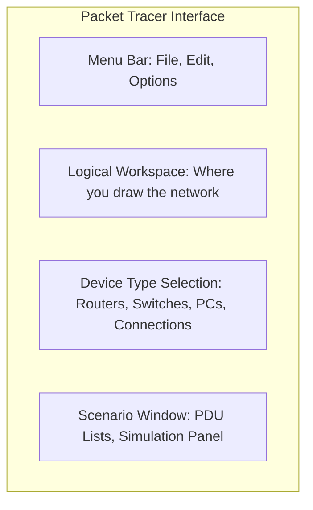

# Cisco Packet Tracer: The Network Simulator

## What is Packet Tracer?
Cisco Packet Tracer is a powerful network simulation tool that allows students to create network topologies and imitate modern computer networks. The software allows users to create simulated network topologies by dragging and dropping routers, switches, and various other types of network devices.

### Key Features
- **Simulation Mode**: Watch packets travel across your network in slow motion. See the exact content of headers at each hop.
- **Physical Mode**: View the physical rack structure, manage cable lengths, and see realistic visualization of devices.
- **Cross-Platform**: Available for Windows, Linux, and macOS.
- **IoT Support**: Simulate Internet of Things devices like smart sensors and microcontrollers.

---

## 🛠️ Getting Started Layout

Understanding the interface is key to speed.

### Essential Devices to Know
1.  **Routers**: Look for the **1941** or **2901** models (ISRs).
2.  **Switches**: The **2960** is the standard Layer 2 switch workhorse.
3.  **End Devices**: PC, Laptop, Server.
4.  **Connections**:
    -   **Straight-Through**: PC to Switch, Switch to Router.
    -   **Crossover**: PC to PC, Switch to Switch.
    -   **Serial DCE**: Router to Router (requires HWIC module).

---

## 🧪 Top 3 Labs for Beginners

### 1. The Simple PING
**Goal**: Connect two PCs and ping between them.
1.  Place two **PCs**.
2.  Connect them with a **Crossover Cable** (or use Auto-Connect lightning bolt).
3.  Assign Static IPs (e.g., `192.168.1.1` and `192.168.1.2`) in the same subnet `/24`.
4.  Open Command Prompt on PC1 and `ping 192.168.1.2`.

### 2. The Router on a Stick (VLANs)
**Goal**: Route traffic between two different VLANs using one Router.
-   **Router**: Configured with sub-interfaces (e.g., `g0/0.10`, `g0/0.20`).
-   **Switch**: Configured with Trunks facing the router and Access ports facing PCs.
-   **Encapsulation**: Must set `encapsulation dot1q <vlan-id>` on router sub-interfaces.

### 3. Dynamic Routing (OSPF)
**Goal**: Connect 3 Routers in a triangle and exchange routes.
-   Enable OSPF: `router ospf 1`
-   Advertise networks: `network 192.168.1.0 0.0.0.255 area 0`
-   Watch the routing table with `show ip route`.

---

## 🔍 Simulation Mode: The Killer Feature
The biggest advantage of Packet Tracer over manual labbing is **Simulation Mode**.

1.  Click the **Simulation** tab (bottom right).
2.  Edit Filters to show only **ICMP** (Ping) and **ARP**.
3.  Send a PDU (Message envelope icon) from PC A to PC B.
4.  Click **Play** or **Forward**.
5.  **Click the Packet Envelope** at any hop to see the OSI Layers!
    -   *Inbound PDU Details*: What the device received.
    -   *Outbound PDU Details*: What the device is sending (and how headers changed).

---

## 🛑 Common Pitfalls
-   **"My Interface is Red"**: Did you run `no shutdown` on the router interface? (Routers default to OFF; Switches default to ON).
-   **"Ping Failed"**: Did you set a **Default Gateway** on the PC? (Essential if going across a Router).
-   **"Cable Type"**: Connecting Router to Router without Serial? You need a **Cross-over** cable for Ethernet connections between similar devices (Layer 3 to Layer 3).
