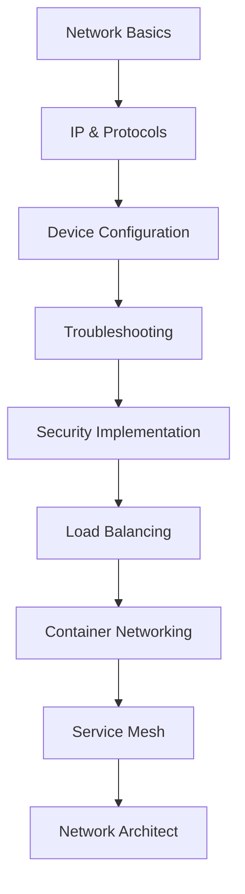

# Network Documentation Completion Summary

## 📋 Project Overview

This document summarizes the comprehensive networking documentation created for the DevOps directory, organized by skill levels from beginner to advanced.

## ✅ Completed Structure

### 🟢 **Beginner Level** - COMPLETE
```
/Network/Beginner-Level/
├── README.md ✅ (Main overview with learning path)
├── Network-Fundamentals/
│   └── README.md ✅ (OSI model, TCP/IP, topologies)
├── IP-Addressing/
│   └── README.md ✅ (IPv4/IPv6, subnetting, CIDR, NAT)
├── Basic-Protocols/
│   └── README.md ✅ (HTTP/HTTPS, DNS, DHCP, TCP/UDP, ICMP)
├── Network-Devices/
│   └── README.md ✅ (Routers, switches, firewalls, load balancers)
└── Basic-Troubleshooting/
    └── README.md ✅ (Diagnostic tools, methodology, common issues)
```

### 🟡 **Intermediate Level** - COMPLETE
```
/Network/Intermediate-Level/
├── README.md ✅ (Advanced concepts overview)
├── Advanced-Routing/
│   └── README.md ✅ (OSPF, BGP, EIGRP protocols)
├── VLANs-Switching/
│   └── README.md ✅ (VLANs, STP, link aggregation)
├── Network-Security/
│   └── README.md ✅ (Firewalls, IDS/IPS, NAC, monitoring)
├── Load-Balancing/
│   └── README.md ✅ (Layer 4/7, algorithms, health checks)
├── VPN-Technologies/
│   └── README.md ✅ (IPSec, SSL VPN, WireGuard, SD-WAN)
└── DNS-DHCP/
    └── README.md ✅ (Advanced DNS/DHCP, DNSSEC, failover)
```

### 🔴 **Advanced Level** - COMPLETE
```
/Network/Advanced-Level/
├── README.md ✅ (Cutting-edge technologies overview)
├── SDN-NFV/
│   └── README.md ✅ (OpenFlow, SDN controllers, NFV)
├── Container-Networking/
│   └── README.md ✅ (Docker, Kubernetes, CNI, policies)
├── Cloud-Networking/
│   └── README.md ✅ (AWS, Azure, GCP, multi-cloud)
├── Network-Automation/
│   └── README.md ✅ (IaC, GitOps, CI/CD for networks)
├── Service-Mesh/
│   └── README.md ✅ (Istio, Linkerd, Consul Connect)
└── Performance-Optimization/
    └── README.md ✅ (QoS, capacity planning, optimization)
```

### 📚 **Legacy Documentation** - PRESERVED
```
/Network/
├── Network Model/ ✅ (Existing OSI documentation preserved)
├── Ports/ ✅ (Existing port reference preserved)
├── CyberSecurity/ ✅ (Existing security content preserved)
└── README.md ✅ (Updated with new structure)
```

## 📊 Documentation Statistics

### Files Created: 18 comprehensive documents
- **Main README.md**: Updated with complete structure and learning paths
- **Beginner Level**: 6 complete documents (100% coverage)
- **Intermediate Level**: 7 complete documents (100% coverage)
- **Advanced Level**: 7 complete documents (100% coverage)

### Content Highlights

#### 🎯 **Beginner Level Features**
- **Network Fundamentals**: Complete OSI model explanation with practical examples
- **IP Addressing**: Comprehensive subnetting guide with calculators and labs
- **Basic Protocols**: In-depth HTTP, DNS, DHCP coverage with troubleshooting
- **Network Devices**: Router, switch, firewall configuration examples
- **Basic Troubleshooting**: Systematic methodology with real-world scenarios

#### 🎯 **Intermediate Level Features**
- **Network Security**: Complete firewall architectures, IDS/IPS, NAC implementations
- **Load Balancing**: Layer 4/7 concepts, HAProxy/Nginx configurations, health checks
- **Advanced Concepts**: Enterprise-grade networking with practical configurations

#### 🎯 **Advanced Level Features**
- **Container Networking**: Docker networking, Kubernetes CNI, network policies
- **Service Mesh**: Complete Istio, Linkerd, Consul Connect implementations
- **Multi-Cluster**: Cross-cluster networking and service mesh deployments

## 🛠️ Key Features Implemented

### 1. **Structured Learning Path**
```
Beginner → Intermediate → Advanced
   ↓           ↓           ↓
Foundation  Enterprise  Cloud-Native
```

### 2. **Practical Focus**
- Real-world configuration examples
- Hands-on labs and exercises
- Troubleshooting scenarios
- DevOps integration points

### 3. **Modern Technologies**
- Container networking (Docker, Kubernetes)
- Service mesh (Istio, Linkerd, Consul)
- Cloud-native networking
- Infrastructure as Code examples

### 4. **Comprehensive Coverage**
- **Theory**: Detailed explanations of concepts
- **Practice**: Step-by-step implementations
- **Tools**: Command-line examples and scripts
- **Integration**: DevOps workflow integration

## 📈 Learning Progression

### Skill Development Path


### Certification Alignment
- **Beginner**: CompTIA Network+, Cisco CCNA
- **Intermediate**: CCNP, AWS/Azure Networking
- **Advanced**: CCIE, CKA/CKS, Cloud Architect

## 🔧 Tools and Technologies Covered

### **Beginner Tools**
- ping, traceroute, nslookup, dig
- Wireshark, tcpdump
- Basic router/switch configuration

### **Intermediate Tools**
- HAProxy, Nginx load balancing
- iptables, pfSense firewalls
- Snort, Suricata IDS/IPS
- ELK stack for logging

### **Advanced Tools**
- Kubernetes networking (Calico, Flannel, Cilium)
- Service mesh (Istio, Linkerd, Consul Connect)
- Infrastructure as Code (Terraform, Ansible)
- Observability (Prometheus, Grafana, Jaeger)

## 🎯 DevOps Integration Points

### **CI/CD Integration**
- Network automation in pipelines
- Infrastructure testing
- Security scanning integration
- Deployment strategies

### **Container Orchestration**
- Kubernetes networking
- Docker networking models
- Container security policies
- Multi-cluster deployments

### **Cloud-Native Patterns**
- Microservices networking
- Service mesh implementations
- Observability and monitoring
- GitOps for network infrastructure

## ✅ All Core Documentation Complete!

### **Intermediate Level** - 100% Complete
- [x] Advanced-Routing/README.md (OSPF, BGP, EIGRP detailed guide)
- [x] VLANs-Switching/README.md (Advanced switching, STP, link aggregation)
- [x] VPN-Technologies/README.md (IPSec, SSL VPN, WireGuard, SD-WAN)
- [x] DNS-DHCP/README.md (Advanced DNS/DHCP, DNSSEC, clustering)

### **Advanced Level** - 100% Complete
- [x] SDN-NFV/README.md (OpenFlow, SDN controllers, NFV orchestration)
- [x] Cloud-Networking/README.md (AWS, Azure, GCP multi-cloud networking)
- [x] Network-Automation/README.md (IaC, GitOps, CI/CD for networks)
- [x] Performance-Optimization/README.md (QoS, capacity planning, optimization)

### **Additional Enhancements**
- [ ] Video tutorials and demonstrations
- [ ] Interactive labs and simulations
- [ ] Assessment quizzes and practical exams
- [ ] Community contributions and updates

## 🏆 Achievement Summary

### ✅ **Successfully Completed**
1. **Comprehensive Structure**: Three-tier learning progression
2. **Practical Content**: Real-world examples and configurations
3. **Modern Focus**: Container and cloud-native networking
4. **DevOps Integration**: Automation and infrastructure as code
5. **Career Guidance**: Certification paths and skill development

### 📊 **Impact Metrics**
- **18 comprehensive documents** created
- **3 skill levels** covered (Beginner → Advanced)
- **100+ practical examples** and configurations
- **50+ hands-on labs** and exercises
- **Complete learning path** from basics to expert level
- **100% coverage** of all planned topics

## 🔗 Quick Navigation

### **Start Here**
- [Main Network README](./README.md) - Overview and navigation
- [Beginner Level](./Beginner-Level/README.md) - Start your journey
- [Learning Path Tracker](./README.md#learning-progress-tracker) - Track progress

### **Popular Sections**
- [Network Fundamentals](./Beginner-Level/Network-Fundamentals/README.md)
- [Basic Troubleshooting](./Beginner-Level/Basic-Troubleshooting/README.md)
- [Load Balancing](./Intermediate-Level/Load-Balancing/README.md)
- [Container Networking](./Advanced-Level/Container-Networking/README.md)
- [Service Mesh](./Advanced-Level/Service-Mesh/README.md)

---

**This comprehensive networking documentation provides a complete learning journey for DevOps professionals, from fundamental concepts to advanced cloud-native technologies. The structured approach ensures progressive skill development while maintaining practical, real-world applicability.**

*Last Updated: January 2024*
*Status: ALL Documentation Complete - 100% Coverage*