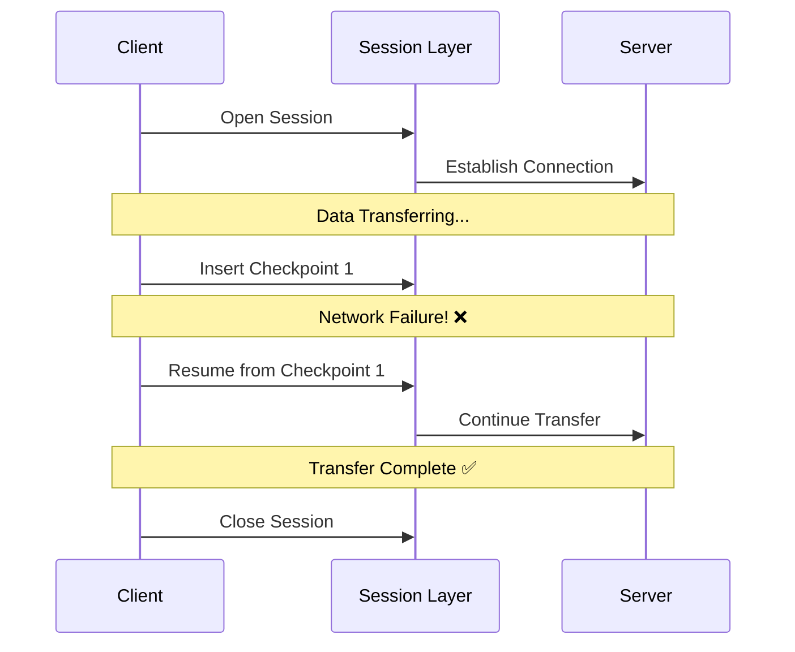

# Session Layer (Layer 5) - OSI Model

## Overview

The Session Layer is the fifth layer of the OSI model. Its primary responsibility is to manage the "dialogue" between two computers. It establishes, manages, and terminates sessions (communication channels) between local and remote applications.

Think of it as the **Manager** of a conversation. It decides who speaks when, for how long, and how to resume if the connection is cut.

---

## Key Functions

### 1. Dialogue Control
Determines whether communication is:
- **Simplex**: One-way only (like a radio).
- **Half-Duplex**: Two-way, but only one at a time (like a walkie-talkie).
- **Full-Duplex**: Two-way simultaneously (like a telephone).

### 2. Token Management
Prevents two parties from attempting the same critical operation at the same time by using "tokens."

### 3. Synchronization (Checkpoints)
The Session Layer can insert checkpoints into the data stream. If a failure occurs during a large file transfer, the session can be resumed from the last checkpoint rather than starting over from the beginning.

---

## Session Layer Protocols

While modern TCP/IP models often merge these functions into the Application layer, specific protocols operate at or describe Session layer functions:

- **NetBIOS**: Network Basic Input/Output System (used in early Windows networks).
- **RPC (Remote Procedure Call)**: Allows a program on one computer to execute code on another computer.
- **SOCKS**: A protocol used to route packets between client-server applications via a proxy.
- **PPTP**: Point-to-Point Tunneling Protocol.

---

## Why it matters for DevOps
- **Stateless vs Stateful**: Understanding sessions is key to managing web application state (e.g., using Redis for session storage in a cluster).
- **Sticky Sessions**: Load balancers often use session affinity to ensure a user stays connected to the same backend server.
- **Database Connections**: Managing persistent connections (pools) to databases is a session-level concern.

---

### ⏭️ Next Step
Move up to [Layer 6: Presentation Layer](../6.%20Presentation/README.md).