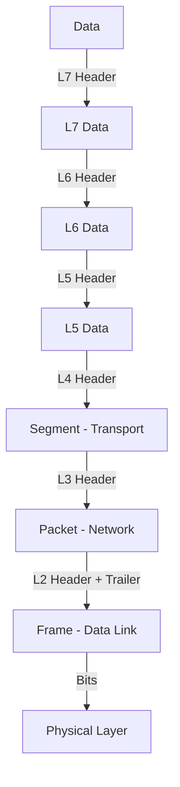

# The Network Model (OSI & TCP/IP)

To troubleshoot effectively in the cloud, you must understand how data moves across the wire. This module covers the two primary models: the **OSI Model** (Theoretical) and the **TCP/IP Model** (Practical).

---

## 🗺️ Directory Mindmap

Navigate the layers deeply:

- **[Layer 1: Physical](./OSI%20Model/1.%20Physical/README.md)** (Cables, Signals)
- **[Layer 2: Data Link](./OSI%20Model/2.%20Data%20Link/README.md)** (Frames, MAC Addresses, Switching)
- **[Layer 3: Network](./OSI%20Model/3.%20Network/README.md)** (Packets, IP, Routing)
- **[Layer 4: Transport](./OSI%20Model/4.%20Transport/README.md)** (Segments, TCP/UDP)
- **[Layer 5: Session](./OSI%20Model/5.%20Session/README.md)** (Session Mgmt)
- **[Layer 6: Presentation](./OSI%20Model/6.%20Presentation/README.md)** (Encryption, Formatting)
- **[Layer 7: Application](./OSI%20Model/7.%20Application/README.md)** (HTTP, DNS, User Interface)

### 🧠 Interactive Learning
- **[🛠️ Real-Life Troubleshooting Scenarios](./Real-Life-Scenarios.md)**: How to use this connection to fix actual production bugs.
- **[📝 Network Model Quiz](./Quiz.md)**: Test your knowledge with 20 questions.

---

## 🌍 1. The OSI Model (7 Layers)

The Open Systems Interconnection (OSI) model standardizes network functions.

| Layer | Name | Function | Real-World Example |
| :--- | :--- | :--- | :--- |
| **7** | **Application** | Human-computer interaction | HTTP, DNS, SSH, SMTP |
| **6** | **Presentation** | Data encryption and formatting | SSL/TLS, ASCII, JPEG |
| **5** | **Session** | Session management | RPC, NetBIOS |
| **4** | **Transport** | End-to-end communication | **TCP** (Reliable), **UDP** (Fast) |
| **3** | **Network** | Path determination and Routing | **IP** (Addressing), Routers |
| **2** | **Data Link** | Physical Addressing (MAC) | Ethernet, Switches |
| **1** | **Physical** | Binary transmission (Electrics) | Cables, Hubs, Wi-Fi |

### Deep Dive into Layers

**7. Application Layer**
Used by end-user software (Browsers, Email Clients). Key protocols: HTTP, DNS, FTP.

**6. Presentation Layer**
"The Translator." Handles data formatting, encryption (TLS), and compression.

**5. Session Layer**
Manages "conversations" (sessions) between computers. Keeps connections open and handles checkpoints.

**4. Transport Layer**
"The Post Office." Breaks data into segments. Features **TCP** (Connection-oriented, reliable) and **UDP** (Connection-less, fast).

**3. Network Layer**
"The GPS." Handles logical addressing (IPs) and routing packets across different networks.

**2. Data Link Layer**
"The Local Delivery." Handles physical addressing (MAC) to switch frames within the SAME network.

**1. Physical Layer**
"The Hardware." Transmits raw bits over copper, fiber, or air.

---

## 🏗️ 2. The TCP/IP Model (4 Layers)

This is the model actually implemented in the internet today. It collapses the OSI layers for simplicity.

1.  **Application Layer**: Combines OSI layers 5, 6, and 7.
2.  **Transport Layer**: Maps to OSI layer 4.
3.  **Internet Layer**: Maps to OSI layer 3.
4.  **Network Access Layer**: Combines OSI layers 1 and 2.

### OSI vs. TCP/IP Comparison

---

## 📦 3. Data Encapsulation

As data moves down the stack, each layer adds a **Header** (and sometimes a Trailer). When the receiver gets the data, it strips headers (**Decapsulation**).

---

## 🔍 Why This Matters for DevOps

- **Layer 7 Debugging**: 500 Errors, Nginx Configs, Load Balancers.
- **Layer 4 Debugging**: Security Groups, Firewalls (Port 80 blocked?), Telnet checks.
- **Layer 3 Debugging**: VPC Peering, Route Tables, Subnet CIDRs.

---

### ⏭️ Next Step
Start with the foundational [Physical Layer](./OSI%20Model/1.%20Physical/README.md).