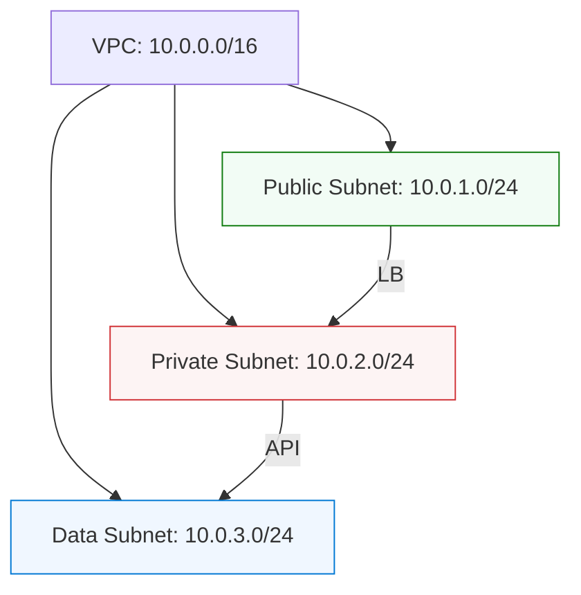

# 🌐 IP Addressing and Subnetting: The Postal Code of the Cloud

> **"If IP addresses are your home address, then Subnetting is the fence around your property. In DevOps, a bad IP plan is like building a city where two houses have the same name—total chaos ensues."**

---

## 🧠 The Mental Model: The Global Postal System

**The Newbie Struggle**: "I understand what an IP address is (like 192.168.1.1), but I have no idea why we need the 'slash' (like /24). It feels like magic math. Why can't I just give every server any IP I want?"

**The Engineer Solution**: You realize that IPs are about **Routing Efficiency**. Just like a mailman doesn't look at every individual house name to get to a different city, a router doesn't look at every individual IP. It looks at the **Subnet prefix** (The ZIP Code).

### 🏗️ 1. The Postal Code Analogy
- **IP Address (192.168.1.50)**: The specific house on the street.
- **Subnet Mask (/24)**: The ZIP Code. It tells the mailman, "Everything starting with 192.168.1 belongs in this neighborhood."
- **Default Gateway**: The local Post Office. If the mail isn't for your neighborhood, you take it here.

---

## 🎯 Learning Objectives

- Master IPv4 and IPv6 addressing schemes
- Understand subnetting and CIDR notation
- Learn private vs public IP address concepts
- Grasp Network Address Translation (NAT)
- Plan and allocate IP addresses effectively
- **Design non-overlapping VPC architectures for Cloud growth**

## 📖 IPv4 Addressing

### IPv4 Address Structure

IPv4 addresses are 32-bit numbers written in dotted decimal notation:
```
192.168.1.100
│   │   │  │
│   │   │  └── Host portion
│   │   └───── Network portion
│   └───────── (depends on subnet mask)
└───────────── 
```

**Binary Representation:**
```
192.168.1.100 = 11000000.10101000.00000001.01100100
```

### IPv4 Address Classes

**Class A**: 1.0.0.0 to 126.255.255.255
- Default subnet mask: 255.0.0.0 (/8)
- Network bits: 8, Host bits: 24
- Supports ~16 million hosts per network

**Class B**: 128.0.0.0 to 191.255.255.255
- Default subnet mask: 255.255.0.0 (/16)
- Network bits: 16, Host bits: 16
- Supports ~65,000 hosts per network

**Class C**: 192.0.0.0 to 223.255.255.255
- Default subnet mask: 255.255.255.0 (/24)
- Network bits: 24, Host bits: 8
- Supports 254 hosts per network

**Class D**: 224.0.0.0 to 239.255.255.255 (Multicast)
**Class E**: 240.0.0.0 to 255.255.255.255 (Reserved)

### Private IP Address Ranges (RFC 1918)

```
Class A: 10.0.0.0/8        (10.0.0.0 - 10.255.255.255)
Class B: 172.16.0.0/12     (172.16.0.0 - 172.31.255.255)
Class C: 192.168.0.0/16    (192.168.0.0 - 192.168.255.255)
```

**Special Addresses:**
- `127.0.0.1` - Loopback address
- `169.254.0.0/16` - Link-local addresses (APIPA)
- `0.0.0.0` - Default route or "any" address
- `255.255.255.255` - Broadcast address

## 🔢 Subnetting Fundamentals

### Subnet Mask

Subnet masks determine which portion of an IP address represents the network and which represents the host:

```
IP Address:    192.168.1.100
Subnet Mask:   255.255.255.0
               │
               └── Network: 192.168.1.0, Host: 100
```

### CIDR Notation (Classless Inter-Domain Routing)

CIDR uses slash notation to indicate network prefix length:

```
192.168.1.0/24
            │
            └── 24 network bits, 8 host bits
```

**Common CIDR Blocks:**
```
/8  = 255.0.0.0     = 16,777,214 hosts
/16 = 255.255.0.0   = 65,534 hosts
/24 = 255.255.255.0 = 254 hosts
/25 = 255.255.255.128 = 126 hosts
/26 = 255.255.255.192 = 62 hosts
/27 = 255.255.255.224 = 30 hosts
/28 = 255.255.255.240 = 14 hosts
/29 = 255.255.255.248 = 6 hosts
/30 = 255.255.255.252 = 2 hosts
```

### Subnetting Process

**Example: Subnet 192.168.1.0/24 into 4 subnets**

1. **Determine required subnet bits**: 4 subnets = 2² = 2 bits needed
<b>2. New subnet mask**: /24 + 2 = /26</b>
<details>
<summary>Show Answer</summary>
Answer: 255.255.255.192
</details>

3. **Calculate subnets**:
   ```
   Subnet 1: 192.168.1.0/26   (192.168.1.1 - 192.168.1.62)
   Subnet 2: 192.168.1.64/26  (192.168.1.65 - 192.168.1.126)
   Subnet 3: 192.168.1.128/26 (192.168.1.129 - 192.168.1.190)
   Subnet 4: 192.168.1.192/26 (192.168.1.193 - 192.168.1.254)
   ```

### Variable Length Subnet Masking (VLSM)

VLSM allows different subnet sizes within the same network:

```
Main Network: 192.168.1.0/24

Subnet 1 (50 hosts needed): 192.168.1.0/26   (62 hosts available)
Subnet 2 (25 hosts needed): 192.168.1.64/27  (30 hosts available)
Subnet 3 (10 hosts needed): 192.168.1.96/28  (14 hosts available)
Subnet 4 (2 hosts needed):  192.168.1.112/30 (2 hosts available)
```

## 🌐 IPv6 Addressing

### IPv6 Address Structure

IPv6 addresses are 128-bit numbers written in hexadecimal:
```
2001:0db8:85a3:0000:0000:8a2e:0370:7334
```

**Compressed Format:**
```
2001:db8:85a3::8a2e:370:7334
```

### IPv6 Address Types

**Unicast Addresses:**
- Global Unicast: 2000::/3 (Internet routable)
- Link-Local: fe80::/10 (Local network segment)
- Unique Local: fc00::/7 (Private networks)

**Multicast Addresses:**
- ff00::/8 (Group communication)

**Anycast Addresses:**
- Same as unicast but assigned to multiple interfaces

### IPv6 Subnetting

IPv6 uses a standard /64 subnet size:
```
2001:db8:1234:5678::/64
│              │    │
│              │    └── Interface ID (64 bits)
│              └─────── Subnet ID (16 bits)
└────────────────────── Network Prefix (48 bits)
```

## 🔄 Network Address Translation (NAT)

### NAT Types

**Static NAT (One-to-One)**
```
Private IP: 192.168.1.10 ←→ Public IP: 203.0.113.10
```

**Dynamic NAT (Many-to-Many)**
```
Private Pool: 192.168.1.0/24 ←→ Public Pool: 203.0.113.0/28
```

**PAT/NAPT (Port Address Translation)**
```
192.168.1.10:1024 ←→ 203.0.113.1:5000
192.168.1.11:1024 ←→ 203.0.113.1:5001
192.168.1.12:1024 ←→ 203.0.113.1:5002
```

### NAT Configuration Example (Linux iptables)

```bash
# Enable IP forwarding
echo 1 > /proc/sys/net/ipv4/ip_forward

# Configure NAT
iptables -t nat -A POSTROUTING -o eth0 -j MASQUERADE
iptables -A FORWARD -i eth1 -o eth0 -j ACCEPT
iptables -A FORWARD -i eth0 -o eth1 -m state --state RELATED,ESTABLISHED -j ACCEPT

# Port forwarding (DNAT)
iptables -t nat -A PREROUTING -p tcp --dport 80 -j DNAT --to-destination 192.168.1.10:80
```

### Tiered VPC Design (The DevOps standard)

In the cloud, we don't just throw things into one subnet. We use a **Tiered Architecture** to enforce security.



### 🏆 Real-World DevOps Story: The "Overlapping Merger"

**The Incident**: Company A (Network: 10.0.0.0/16) buys Company B (Network: 10.0.0.0/16). They try to connect their clouds via a VPN tunnel so their servers can talk.
**The Failure**: When a server in Company A tries to talk to 10.0.1.5, its own router says, "That's me! I'm in this neighborhood!" and the packet never leaves the building. The two companies are invisible to each other.
**The Fix**: A massive, 6-month project to "Re-IP" one of the companies.
**The Lesson**: **Plan for growth.** Never use the same "Neighborhood names" as everyone else if you ever plan to connect your systems.

### Container Network Planning

**Docker Network Example:**
```bash
# Create custom bridge network
docker network create --driver bridge \
  --subnet=172.20.0.0/16 \
  --ip-range=172.20.240.0/20 \
  --gateway=172.20.0.1 \
  production-network

# Assign specific IP to container
docker run -d --name web-server \
  --network production-network \
  --ip 172.20.1.10 \
  nginx
```

**Kubernetes Network Planning:**
```yaml
# Pod CIDR: 10.244.0.0/16
# Service CIDR: 10.96.0.0/12
# Node Network: 192.168.1.0/24

apiVersion: v1
kind: Service
metadata:
  name: web-service
spec:
  clusterIP: 10.96.1.100
  selector:
    app: web
  ports:
  - port: 80
    targetPort: 8080
```

## 🧮 Subnetting Tools and Calculators

### Command Line Tools

```bash
# Calculate subnet information
ipcalc 192.168.1.0/24

# Show network configuration
ip addr show
ip route show

# Test connectivity
ping 192.168.1.1
traceroute 8.8.8.8

# DNS lookup with IP
nslookup google.com
dig google.com A
```

### Subnet Calculator Script

```bash
#!/bin/bash
# Simple subnet calculator

network="192.168.1.0"
prefix="24"
subnets="4"

echo "Original Network: $network/$prefix"
echo "Subnets needed: $subnets"

# Calculate new prefix length
new_prefix=$((prefix + $(echo "l($subnets)/l(2)" | bc -l | cut -d. -f1)))
echo "New prefix length: /$new_prefix"

# Use ipcalc to show subnets
for i in $(seq 0 $((subnets-1))); do
    subnet_addr=$(ipcalc -n $network/$prefix | grep Network | awk '{print $2}' | cut -d/ -f1)
    echo "Subnet $((i+1)): $(ipcalc -n $subnet_addr/$new_prefix)"
done
```

## 🧪 Practical Labs

### Lab 1: Basic Subnetting

**Scenario**: Subnet 172.16.0.0/16 for a company with 4 departments:
- Sales: 500 users
- Engineering: 200 users  
- Marketing: 100 users
- IT: 50 users

**Solution**:
```
Sales:       172.16.0.0/23   (510 hosts)
Engineering: 172.16.2.0/24   (254 hosts)
Marketing:   172.16.3.0/25   (126 hosts)
IT:          172.16.3.128/26 (62 hosts)
```

### Lab 2: VLSM Practice

**Task**: Design network for branch office with:
- 1 point-to-point link (2 IPs)
- 1 server subnet (10 servers)
- 1 user subnet (50 users)
- 1 guest subnet (20 users)

### Lab 3: IPv6 Configuration

```bash
# Configure IPv6 address
sudo ip -6 addr add 2001:db8:1::1/64 dev eth0

# Enable IPv6 forwarding
echo 1 > /proc/sys/net/ipv6/conf/all/forwarding

# Test IPv6 connectivity
ping6 2001:db8:1::2
```

## 📊 DevOps IP Planning Best Practices

### 1. Documentation Standards
```yaml
# network-plan.yaml
networks:
  production:
    cidr: "10.1.0.0/16"
    subnets:
      web_tier: "10.1.1.0/24"
      app_tier: "10.1.2.0/24"
      db_tier: "10.1.3.0/24"
  
  development:
    cidr: "10.2.0.0/16"
    subnets:
      dev_web: "10.2.1.0/24"
      dev_app: "10.2.2.0/24"
```

### 2. Automation with Terraform
```hcl
# vpc.tf
resource "aws_vpc" "main" {
  cidr_block           = "10.0.0.0/16"
  enable_dns_hostnames = true
  enable_dns_support   = true
  
  tags = {
    Name = "production-vpc"
  }
}

resource "aws_subnet" "web" {
  vpc_id            = aws_vpc.main.id
  cidr_block        = "10.0.1.0/24"
  availability_zone = "us-west-2a"
  
  tags = {
    Name = "web-subnet"
    Tier = "web"
  }
}
```

### 3. Monitoring IP Usage
```bash
# Monitor DHCP pool usage
dhcp-lease-list --lease /var/lib/dhcp/dhcpd.leases

# Check ARP table
arp -a

# Scan network for active hosts
nmap -sn 192.168.1.0/24
```

## ✅ Knowledge Check

Before proceeding, ensure you can:
- [ ] Convert between decimal and binary IP addresses
- [ ] Calculate subnet masks and network ranges
- [ ] Design VLSM networks for given requirements
- [ ] Understand IPv6 addressing and subnetting
- [ ] Configure NAT and port forwarding
- [ ] Plan IP addressing for DevOps environments
- [ ] Use command-line tools for IP management

---

*Next: [Basic Protocols](../04-Basic-Protocols/) - Learn essential network protocols*