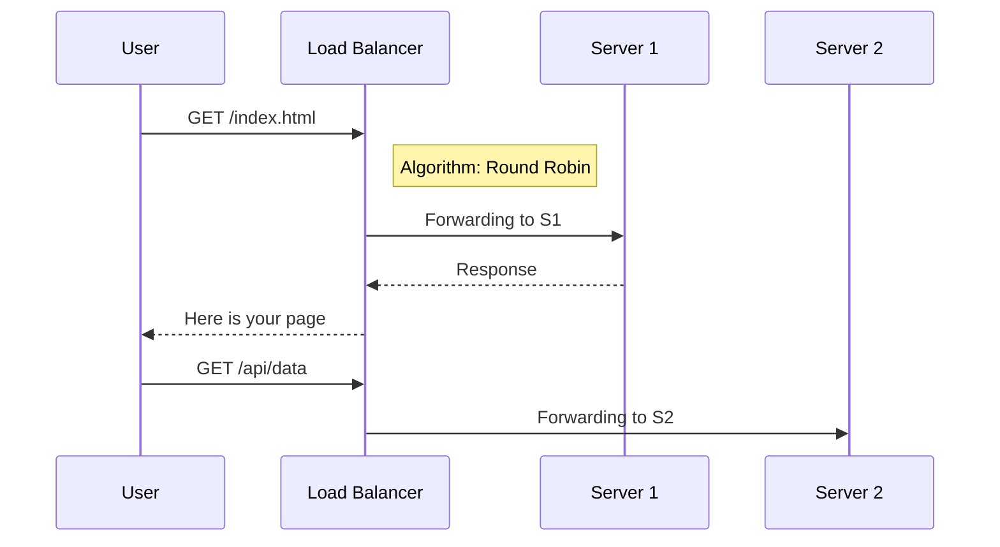

# 🔌 Network Devices: The Invisible Chassis of the Cloud

> **"In the physical world, we use screwdrivers and racks. In the DevOps world, we use JSON and APIs. But underneath every Cloud VPC, there is an invisible chassis of Routers, Switches, and Firewalls orchestrated by software."**

---

## 🧠 The Mental Model: The City Traffic System

**The Newbie Struggle**: "Why am I learning about physical Routers and Switches if I'm just going to work in AWS or Azure? Can't I just click a button and have a network?"

**The Engineer Solution**: You realize that the "Buttons" you click in the cloud are just API calls to **Virtual Network Devices**. If you don't understand how a physical **Switch** works, you'll never understand why your **Cloud Subnet** is having a broadcast storm. If you don't understand **Routing**, you'll never fix a "No Route to Host" error in your Kubernetes cluster.

Think of it like a City:
1.  **The Switch (The Local Street)**: Connects houses in the same neighborhood. No directions needed, just follow the house numbers (MAC addresses).
2.  **The Router (The Highway Interchange)**: Connects different cities. It looks at the ZIP Code (IP Address) to decide which highway (Path) to send you on.
3.  **The Firewall (The Border Checkpoint)**: Inspects every car. "Do you have the right ID? Is your cargo allowed?"
4.  **The Load Balancer (The Queue Manager)**: Directs traffic to the fastest available lane so no single road gets overwhelmed.

---

## 🎯 Learning Objectives

- Understand different types of network devices and their functions
- Learn router configuration and routing concepts
- Master switch operations and VLAN basics
- Explore firewall types and security appliances
- Understand load balancer fundamentals
- **Bridge physical hardware knowledge to Cloud/VPC equivalents**

## 🔌 Network Device Categories

### Layer 1 Devices (Physical Layer)

**Repeaters and Hubs:**
- Amplify and regenerate signals
- Operate at bit level
- Create single collision domain
- Largely obsolete in modern networks

**Media Converters:**
- Convert between different media types
- Fiber to copper conversion
- Extend network reach

### Layer 2 Devices (Data Link Layer)

**Switches:**
- Forward frames based on MAC addresses
- Create separate collision domains
- Support VLANs for network segmentation
- Provide full-duplex communication

**Bridges:**
- Connect network segments
- Filter traffic based on MAC addresses
- Reduce collision domains

### Layer 3 Devices (Network Layer)

**Routers:**
- Route packets between different networks
- Make forwarding decisions based on IP addresses
- Implement routing protocols
- Provide network address translation (NAT)

**Layer 3 Switches:**
- Combine switching and routing functions
- High-speed packet forwarding
- VLAN routing capabilities

### 🏗️ 2. The Router (Layer 3): The Global Navigator

Routers are the "Post Offices" of the internet. They don't care about your MAC address; they only care about your **Routing Table**.

**The SRE Diagnostic**: If you can `ping` an IP but can't reach the service, the Router might be dropping the packet or sending it to a "Black Hole" (null route).

```mermaid
graph LR
    SubnetA[Subnet A: 10.0.1.0/24]
    SubnetB[Subnet B: 10.0.2.0/24]
    Router((Core Router))
    Internet((The Internet))
    
    SubnetA --> Router
    SubnetB --> Router
    Router --> Internet
    
    Note over Router: Routing Table:<br/>10.0.1.0 -> Port 1<br/>10.0.2.0 -> Port 2<br/>0.0.0.0 -> Internet
```

## 🔀 Routers

### Router Functions

**Primary Functions:**
- Packet forwarding between networks
- Path determination using routing tables
- Network address translation (NAT)
- Access control and security

**Router Components:**
```
┌─────────────────────────────────────────┐
│              Router                     │
│                                         │
│  ┌─────────┐    ┌─────────────────┐     │
│  │   CPU   │    │   Routing Table │     │
│  └─────────┘    └─────────────────┘     │
│                                         │
│  ┌─────────┐    ┌─────────────────┐     │
│  │   RAM   │    │  Interface Cards│     │
│  └─────────┘    └─────────────────┘     │
│                                         │
│  ┌─────────┐    ┌─────────────────┐     │
│  │  Flash  │    │      NVRAM      │     │
│  └─────────┘    └─────────────────┘     │
└─────────────────────────────────────────┘
```

### Basic Router Configuration

**Cisco Router Configuration:**
```bash
# Enter privileged mode
Router> enable
Router# configure terminal

# Set hostname
Router(config)# hostname R1

# Configure interface
R1(config)# interface gigabitethernet0/0
R1(config-if)# ip address 192.168.1.1 255.255.255.0
R1(config-if)# no shutdown
R1(config-if)# exit

# Configure default route
R1(config)# ip route 0.0.0.0 0.0.0.0 192.168.1.254

# Enable SSH
R1(config)# ip domain-name example.com
R1(config)# crypto key generate rsa modulus 2048
R1(config)# username admin privilege 15 secret cisco123
R1(config)# line vty 0 4
R1(config-line)# transport input ssh
R1(config-line)# login local

# Save configuration
R1# copy running-config startup-config
```

**Linux Router Configuration:**
```bash
# Enable IP forwarding
echo 1 > /proc/sys/net/ipv4/ip_forward
echo 'net.ipv4.ip_forward = 1' >> /etc/sysctl.conf

# Configure interfaces
ip addr add 192.168.1.1/24 dev eth0
ip addr add 10.0.0.1/24 dev eth1

# Add static routes
ip route add 192.168.2.0/24 via 10.0.0.2
ip route add default via 192.168.1.254

# Configure NAT with iptables
iptables -t nat -A POSTROUTING -o eth0 -j MASQUERADE
iptables -A FORWARD -i eth1 -o eth0 -j ACCEPT
iptables -A FORWARD -i eth0 -o eth1 -m state --state RELATED,ESTABLISHED -j ACCEPT
```

### Routing Protocols

**Static Routing:**
```bash
# Cisco
ip route 192.168.2.0 255.255.255.0 10.0.0.2

# Linux
ip route add 192.168.2.0/24 via 10.0.0.2
```

**Dynamic Routing (OSPF):**
```bash
# Cisco OSPF Configuration
router ospf 1
network 192.168.1.0 0.0.0.255 area 0
network 10.0.0.0 0.0.0.255 area 0
```

## 🔄 Switches

### Switch Operations

**MAC Address Learning:**
```
1. Frame arrives on port
2. Switch examines source MAC address
3. Adds MAC to address table with port number
4. Forwards frame based on destination MAC
5. Floods frame if destination unknown
```

**Switch Configuration:**
```bash
# Cisco Switch Configuration
Switch> enable
Switch# configure terminal
Switch(config)# hostname SW1

# Configure management IP
SW1(config)# interface vlan1
SW1(config-if)# ip address 192.168.1.10 255.255.255.0
SW1(config-if)# no shutdown

# Configure access port
SW1(config)# interface fastethernet0/1
SW1(config-if)# switchport mode access
SW1(config-if)# switchport access vlan 10

# Configure trunk port
SW1(config)# interface gigabitethernet0/1
SW1(config-if)# switchport mode trunk
SW1(config-if)# switchport trunk allowed vlan 10,20,30
```

### VLANs (Virtual LANs)

**VLAN Benefits:**
- Network segmentation
- Improved security
- Broadcast domain control
- Flexible network design

**VLAN Configuration:**
```bash
# Create VLANs
SW1(config)# vlan 10
SW1(config-vlan)# name Sales
SW1(config-vlan)# exit

SW1(config)# vlan 20
SW1(config-vlan)# name Engineering
SW1(config-vlan)# exit

# Assign ports to VLANs
SW1(config)# interface range fastethernet0/1-10
SW1(config-if-range)# switchport access vlan 10

SW1(config)# interface range fastethernet0/11-20
SW1(config-if-range)# switchport access vlan 20
```

**Inter-VLAN Routing:**
```bash
# Router-on-a-stick configuration
R1(config)# interface gigabitethernet0/0.10
R1(config-subif)# encapsulation dot1Q 10
R1(config-subif)# ip address 192.168.10.1 255.255.255.0

R1(config)# interface gigabitethernet0/0.20
R1(config-subif)# encapsulation dot1Q 20
R1(config-subif)# ip address 192.168.20.1 255.255.255.0
```

## 🛡️ Firewalls

### Firewall Types

**Packet Filtering Firewalls:**
- Examine packet headers
- Filter based on IP, port, protocol
- Stateless operation
- Fast but limited security

**Stateful Firewalls:**
- Track connection state
- Maintain session tables
- Better security than packet filtering
- Most common type

**Application Layer Firewalls:**
- Deep packet inspection
- Application-aware filtering
- Proxy-based operation
- Highest security but slower

### Firewall Configuration

**iptables (Linux):**
```bash
# Default policies
iptables -P INPUT DROP
iptables -P FORWARD DROP
iptables -P OUTPUT ACCEPT

# Allow loopback
iptables -A INPUT -i lo -j ACCEPT

# Allow established connections
iptables -A INPUT -m state --state ESTABLISHED,RELATED -j ACCEPT

# Allow SSH
iptables -A INPUT -p tcp --dport 22 -j ACCEPT

# Allow HTTP/HTTPS
iptables -A INPUT -p tcp --dport 80 -j ACCEPT
iptables -A INPUT -p tcp --dport 443 -j ACCEPT

# Allow ping
iptables -A INPUT -p icmp --icmp-type echo-request -j ACCEPT

# Save rules
iptables-save > /etc/iptables/rules.v4
```

**pfSense Configuration:**
```bash
# Web interface configuration
# Navigate to Firewall > Rules > LAN

# Allow LAN to any
Source: LAN subnets
Destination: any
Port: any
Action: Pass

# Block specific traffic
Source: LAN subnets
Destination: 192.168.100.0/24
Action: Block
```

### Next-Generation Firewalls (NGFW)

**Features:**
- Application identification
- Intrusion prevention (IPS)
- URL filtering
- Malware detection
- SSL inspection

**Palo Alto Configuration Example:**
```xml
<security>
  <rules>
    <entry name="Allow-Web-Traffic">
      <from>
        <member>trust</member>
      </from>
      <to>
        <member>untrust</member>
      </to>
      <source>
        <member>192.168.1.0/24</member>
      </source>
      <destination>
        <member>any</member>
      </destination>
      <application>
        <member>web-browsing</member>
        <member>ssl</member>
      </application>
      <action>allow</action>
    </entry>
  </rules>
</security>
```

## ⚖️ Load Balancers

### Load Balancer Fundamentals
A Load Balancer (LB) sits in front of your servers and distributes requests. This is the most critical device for a DevOps Engineer.



### Load Balancer Types

**Hardware Load Balancers:**
- Dedicated appliances
- High performance
- Expensive
- Examples: F5 BIG-IP, Citrix NetScaler

**Software Load Balancers:**
- Run on standard servers
- Cost-effective
- Flexible deployment
- Examples: HAProxy, Nginx, Apache

**Cloud Load Balancers:**
- Managed services
- Auto-scaling
- Pay-per-use
- Examples: AWS ELB, Azure Load Balancer

### Basic Load Balancer Configuration

**HAProxy Configuration:**
```bash
global
    daemon
    maxconn 4096

defaults
    mode http
    timeout connect 5000ms
    timeout client 50000ms
    timeout server 50000ms

frontend web_frontend
    bind *:80
    default_backend web_servers

backend web_servers
    balance roundrobin
    option httpchk GET /health
    server web1 192.168.1.10:8080 check
    server web2 192.168.1.11:8080 check
    server web3 192.168.1.12:8080 check
```

**Nginx Load Balancer:**
```nginx
upstream backend {
    server 192.168.1.10:8080;
    server 192.168.1.11:8080;
    server 192.168.1.12:8080;
}

server {
    listen 80;
    location / {
        proxy_pass http://backend;
    }
}
```

## 🔧 Network Appliances

### Wireless Access Points (WAPs)

**Functions:**
- Provide wireless connectivity
- Bridge wireless to wired networks
- Implement wireless security (WPA2/WPA3)
- Support multiple SSIDs

**Basic WAP Configuration:**
```bash
# Cisco WAP Configuration
configure
interface dot11radio0
ssid Corporate
authentication open
authentication key-management wpa version 2
wpa-psk ascii MySecurePassword123
```

### Network Attached Storage (NAS)

**Functions:**
- Centralized file storage
- Network-accessible storage
- Backup and archival
- Media streaming

### Intrusion Detection/Prevention Systems

**IDS (Intrusion Detection System):**
- Monitors network traffic
- Detects suspicious activity
- Generates alerts
- Passive monitoring

**IPS (Intrusion Prevention System):**
- Active traffic filtering
- Blocks malicious traffic
- Real-time protection
- Inline deployment

**Snort Configuration Example:**
```bash
# /etc/snort/snort.conf
var HOME_NET 192.168.1.0/24
var EXTERNAL_NET !$HOME_NET

# Rules
alert tcp $EXTERNAL_NET any -> $HOME_NET 22 (msg:"SSH connection attempt"; sid:1000001;)
alert icmp any any -> $HOME_NET any (msg:"ICMP Ping detected"; sid:1000002;)
```

## 🏗️ Network Device Selection

### Factors to Consider

**Performance Requirements:**
- Throughput (packets per second)
- Latency requirements
- Concurrent connections
- Processing power

**Scalability:**
- Port density
- Expansion capabilities
- Stacking/clustering support
- Future growth plans

**Features:**
- Layer 2/3 capabilities
- Security features
- Management options
- Protocol support

**Cost Considerations:**
- Initial purchase price
- Licensing costs
- Maintenance and support
- Power consumption

### Device Comparison Matrix

| Device Type | Layer | Primary Function | Cloud Equivalent | Key Features |
|-------------|-------|------------------|------------------|--------------|
| Hub | 1 | Signal regeneration | N/A | Shared bandwidth, collision domain |
| Switch | 2 | Frame forwarding | VPC Subnet | MAC learning, VLANs, full-duplex |
| Router | 3 | Packet routing | Transit Gateway | Inter-network communication, NAT |
| Firewall | 3-7 | Security filtering | Security Group | Access control, threat protection |
| Load Balancer | 4-7 | Traffic distribution | ALB / ELB | High availability, performance |

## ❓ Interview & SRE Mastery

### 🎯 High-Impact Questions

1. **Q: What is the difference between a Switch and a Router?**
    *   *Answer: A **Switch** works at Layer 2 (MAC addresses) to connect devices in the SAME network. A **Router** works at Layer 3 (IP addresses) to connect DIFFERENT networks.*
2. **Q: Why would I use a Load Balancer even if I only have one server?**
    *   *Answer: For **SSL Termination** (the LB handles the heavy encryption math) and for **Zero-Downtime Deployments** (you can swap the backend without changing the user's IP).*
3. **Q: What is "Router on a Stick"?**
    *   *Answer: A legacy (but still vital) pattern where a single physical interface on a router handles multiple VLANs by using "Sub-interfaces" (e.g. `eth0.10`, `eth0.20`).*

## 🧪 Practical Labs

### Lab 1: Basic Router Configuration

**Objective:** Configure a router for inter-network communication

**Equipment:**
- 1 Router (physical or virtual)
- 2 Switches
- 4 PCs

**Tasks:**
1. Configure router interfaces
2. Set up static routing
3. Configure NAT
4. Test connectivity

### Lab 2: Switch and VLAN Setup

**Objective:** Implement VLANs for network segmentation

**Tasks:**
1. Create VLANs on switch
2. Assign ports to VLANs
3. Configure trunk ports
4. Test VLAN isolation

### Lab 3: Firewall Implementation

**Objective:** Deploy and configure a firewall

**Tasks:**
<b>1. Install firewall</b>
<details>
<summary>Show Answer</summary>
Answer: pfSense/iptables
</details>

2. Configure security rules
3. Test traffic filtering
4. Monitor logs

## 🔍 Troubleshooting Network Devices

### Common Issues and Solutions

**Router Problems:**
```bash
# Check interface status
show ip interface brief
show interfaces

# Verify routing table
show ip route

# Test connectivity
ping 8.8.8.8
traceroute 8.8.8.8

# Check configuration
show running-config
```

**Switch Problems:**
```bash
# Check port status
show interfaces status

# Verify VLAN configuration
show vlan brief

# Check MAC address table
show mac address-table

# Verify trunk configuration
show interfaces trunk
```

**Firewall Issues:**
```bash
# Check iptables rules
iptables -L -n -v

# Monitor traffic
tcpdump -i eth0 -n

# Check logs
tail -f /var/log/syslog | grep iptables

# Test connectivity
telnet target_ip port
```

## ✅ Knowledge Check

Before proceeding, ensure you can:
- [ ] Explain the functions of different network devices
- [ ] Configure basic router and switch settings
- [ ] Implement VLANs for network segmentation
- [ ] Set up basic firewall rules
- [ ] Understand load balancer concepts
- [ ] Troubleshoot common device issues
- [ ] Select appropriate devices for network requirements

## 🔗 Next Steps

- **[Basic Troubleshooting](../06-Basic-Troubleshooting/)** - Network diagnostic techniques
- **[Intermediate Level](../../../../2-Intermediate/README.md)** - Advanced concepts

---

*Understanding network devices is fundamental to building and maintaining robust network infrastructure in DevOps environments.*