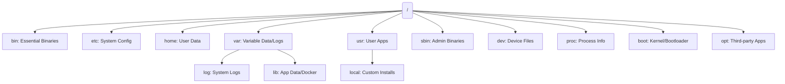

# Linux Filesystem Hierarchy Mastery

The Linux filesystem is organized in a tree-like structure, starting from the root directory `/`. Unlike Windows, which uses drive letters (C:, D:), Linux mounts all storage devices under this single tree.

---

## 🌳 The Filesystem Hierarchy Standard (FHS)

Every DevOps engineer must know where things live. Misplacing a configuration file or filling up the wrong partition can cause production outages.



### 📂 Essential Directory Breakdown

| Directory | Purpose | Why DevOps Care? |
| :--- | :--- | :--- |
| **`/etc`** | System configuration files. | Where you edit Nginx, SSH, and Systemd configs. |
| **`/var/log`** | Dynamic log files. | The first place you look when an app crashes. |
| **`/proc`** | Virtual filesystem for kernel/process info. | Used by monitoring tools to get CPU/RAM stats. |
| **`/dev`** | Device files (hard drives, terminals). | Where you find `/dev/sda` or `/dev/null`. |
| **`/opt`** | Optional/Third-party software. | Standard location for standalone apps like Prometheus. |
| **`/usr/bin`** | Non-essential user binaries. | Where most of your installed tools (git, python) live. |
| **`/home`** | Personal directories for users. | Where `.ssh/authorized_keys` are stored. |

---

## 🏗️ Production Partitioning Strategy

In production, we don't just put everything on one partition. We separate them to prevent a log file from filling up the entire disk and crashing the OS.


### SRE Recommended Mounts:
1.  **`/` (Root)**: The base OS.
2.  **`/var/log`**: Separate this so logs can't fill the root disk.
3.  **`/home`**: Keep user data separate for easier OS upgrades.
4.  **`/tmp`**: Often mounted as `tmpfs` (RAM-based) for speed.

---

## 📁 Everything is a File: Special Devices

One of the most powerful concepts in Linux is that hardware and special resources are represented as files.

- **`/dev/null`**: The "Black Hole". Anything sent here disappears. Great for silencing errors: `command 2> /dev/null`.
- **`/dev/zero`**: A source of infinite null bytes. Used for creating dummy files.
- **`/dev/random`**: A source of cryptographically secure random numbers.

---

## 🛠️ Filesystem Troubleshooting for SREs

### Scenario 1: Disk is full but I can't find the files.
**Symptom**: `df -h` shows 100% full, but `du -sh *` doesn't account for all space.
**Reason**: A process is holding a deleted file open.
**Fix**:
```bash
sudo lsof | grep deleted
# Find the PID and restart the service.
```

### Scenario 2: "No space left on device" but `df` shows 50% free.
**Symptom**: You can't create new files even though there is GBs of space.
**Reason**: Inode exhaustion. You have millions of tiny files.
**Check**:
```bash
df -i
# If IUse% is 100%, you need to delete small files (e.g., session files, cache).
```

---

## 🌟 Real-Life SRE Scenario: The Log-Rotate Failure

**Situation**: A Jenkins agent stops responding. Disk usage is 100%. You find that `jenkins.log` is 40GB because `logrotate` didn't run correctly.

**The Fix**:
1.  **Emergency**: Note the log content if needed, then truncate: `> /var/log/jenkins.log`. (Don't delete with `rm` as the process might still hold it open).
2.  **Permanent**: Fix the `/etc/logrotate.d/jenkins` config to rotate based on size rather than just daily.

---

## 🔗 Related Resources
- [Essential Linux Commands](../03-Commands/README.md)
- [Linux Permissions](../04-Permissions/README.md)
- [System Architecture](../01-Introduction/README.md)
