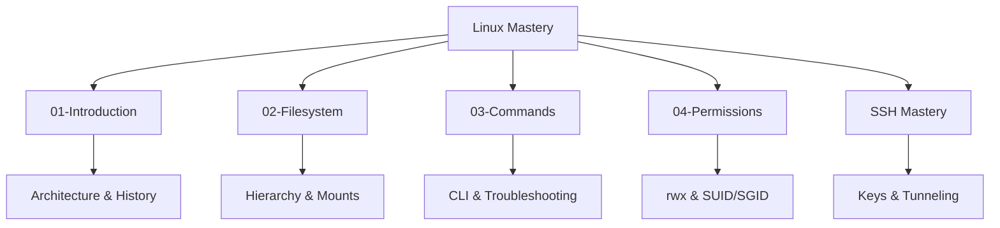

# Linux Mastery for DevOps

Linux is the bedrock of the cloud. Almost all containers, servers, and cloud services run on a Linux kernel. This module covers everything from first commands to advanced system management.

---

## 🏗️ Module Architecture

Mastering Linux requires understanding both the theory of operation and the practical commands.

---

## 📂 Learning Paths

### 🔰 Foundation
- **[01-Introduction](./01-Introduction/README.md)**: Core concepts, Kernel architecture, and Linux Distributions.
- **[02-Filesystem](./02-Filesystem/README.md)**: Understanding the Linux file tree, where logs live, and mount points.
- **[03-Commands](./03-Commands/README.md)**: The essential tools for navigation, search, and system inspection.
- **[04-Permissions](./04-Permissions/README.md)**: Mastering the security model (u, g, o) and special bits.

### 🔐 Secure Access
- **[SSH Mastery](./SSH/README.md)**: Connecting to remote servers, key management, and secure tunneling.

---

## 🎤 Interview & Assessment
Each module includes its own specialized questions, but you can also explore the comprehensive collection:
- **[Full Interview Questions & Quizzes](./Interview_Questions_and_Quiz.md)**

---

##  SRE Standards for Linux

As a Site Reliability Engineer, you should adhere to these principles:
- **Automation First**: Never perform manual configuration changes. Use Configuration Management (Ansible).
- **Security by Design**: Disable root logins, use SSH keys, and follow the principle of least privilege.
- **Observability**: Monitor Load Average, CPU Wait, and Disk IOPS as key health indicators.
- **Immutability**: Prefer replacing instances over complex in-place updates.

---

## 🏆 Related Certifications
- **CompTIA Linux+**: Basic administration skills.
- **LFCS (Linux Foundation Certified System Administrator)**: Hands-on skills.
- **RHCSA (Red Hat Certified System Administrator)**: Enterprise-standard certification.

---
*The shell is your cockpit—learn the gauges and you can fly anything.*