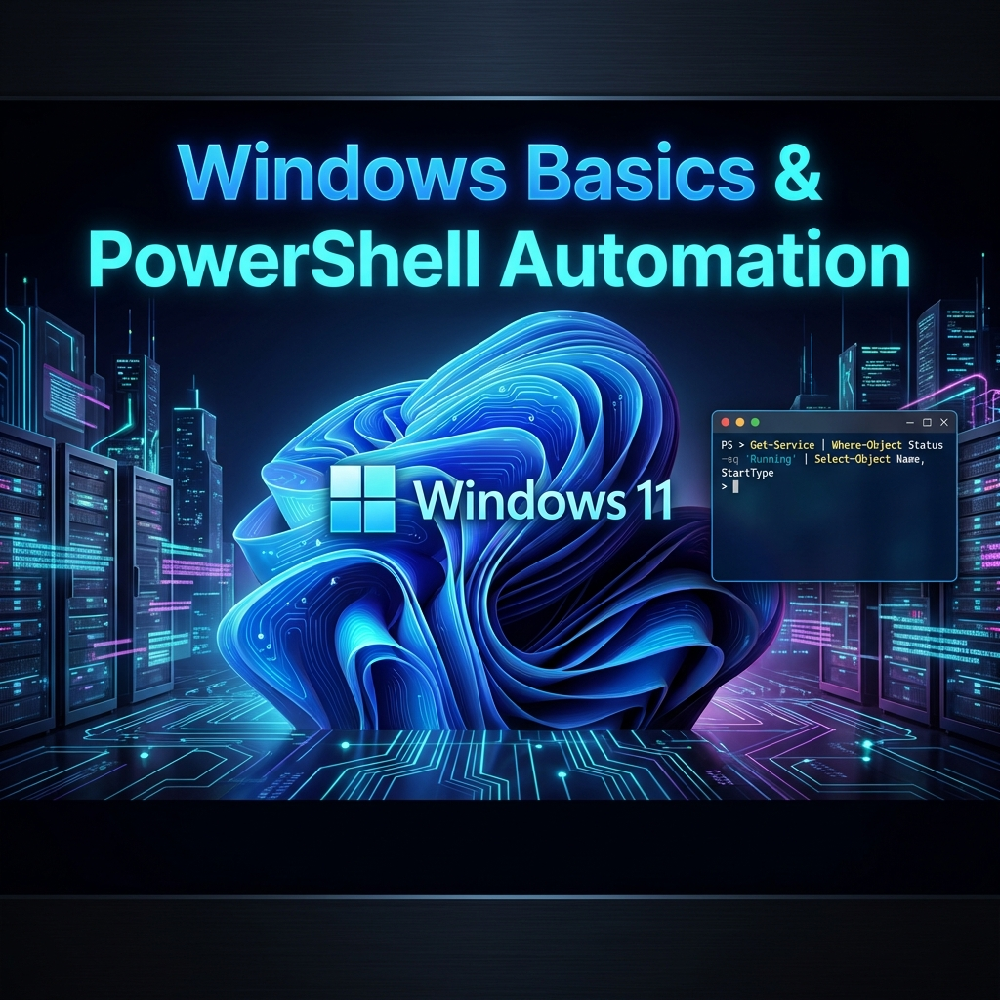
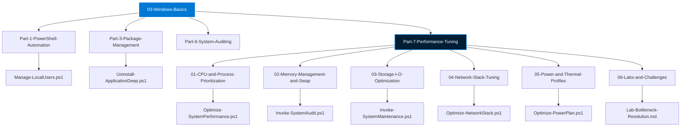
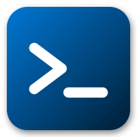

# 

## Windows Basics & PowerShell Automation

This module covers the essential skills for managing and automating Windows environments in a DevOps context. As a DevOps engineer, Windows is often the foundation for build agents, active directory services, and enterprise endpoints.

---

### 🛠️ The PowerShell Interface

PowerShell is an object-oriented shell and scripting language. Unlike Bash (which passes text), PowerShell passes objects, making it incredibly powerful for complex automation without the need for manual parsing.

#### 📜 Execution Policy

By default, Windows restricts script execution for security. To develop and run local scripts, you must set the execution policy:

```powershell
# Set policy to allow local scripts to run
Set-ExecutionPolicy RemoteSigned -Scope CurrentUser
```

#### 🔄 Windows PowerShell (5.1) vs. PowerShell Core (7+)

-   **Windows PowerShell 5.1**: Built into Windows, based on .NET Framework. Legacy but still required for many management modules.
-   **PowerShell (7+)**: Cross-platform (Windows, Linux, macOS), based on .NET 7/8/9. This is the future of automation.

---

### 🗺️ Navigation Architecture



---

### 📂 Structured Tooling (Scripts)



Our scripts are organized into "Golden Scripts"—idempotent, parameterized, and production-ready tools.

-   **[Performance Management](./Part-7-Performance-Tuning)**: Audit hardware, and apply kernel-level optimizations.
-   **[Server Administration](./Part-4-Server-Administration)**: Manage local accounts, groups, and server-specific roles.
-   **[Network Diagnostics](./Part-7-Performance-Tuning/02-Resource-Monitoring)**: Advanced port scanning and network stack tuning.
-   **[Automation Services](./Part-7-Performance-Tuning/04-Startup-Management)**: Background security monitoring and service self-healing.

---

### 🎓 Curriculum Roadmap

-   **[Part 1: PowerShell Automation](./Part-1-PowerShell-Automation)** - The core of Windows automation.
-   **[Part 2: WSL Integration](./Part-2-WSL-Linux-Integration)** - Running Linux on Windows.
-   **[Part 3: Package Management](./Part-3-Package-Management)** - Modern software management (Winget/Chocolatey).
-   **[Part 4: Server Administration](./Part-4-Server-Administration)** - Windows Server specifics.
-   **[Part 5: Windows Containers](./Part-5-Windows-Containers)** - Docker and Windows process isolation.
-   **[Part 6: System Auditing](./Part-6-System-Auditing)** - Forensic discovery and fleet reporting.
-   **[Part 7: Performance Tuning](./Part-7-Performance-Tuning)** - Kernel-level optimization techniques.
-   **[Part 8: Hacks & Tips](./Part-8-Pro-Tips)** - Productivity boosters for the power user.

---

## 🏢 Reference Library
*Deep-dive documentation for at-a-glance problem solving.*

*   **[Windows Architecture](./REFERENCE/Windows-System-Architecture-Ref.md)**: Registry, Services, and core system manual.
*   **[PowerShell Automation](./REFERENCE/PowerShell-Automation-Ref.md)**: Object-oriented logic and scripting manual.
*   **[Active Directory & Identity](./REFERENCE/Active-Directory-Identity-Ref.md)**: DCs, OUs, and Group Policy manual.
*   **[Windows Troubleshooting](./REFERENCE/SRE-Windows-Troubleshooting-Ref.md)**: SRE playbook for performance and error resolution.
*   **[Windows Best Practices](./REFERENCE/Windows-Best-Practices-Ref.md)**: Fleet management and security standards.

---

### 📚 Resources

-   [Official Microsoft PowerShell Docs](https://learn.microsoft.com/en-us/powershell/)
-   [Microsoft Learn: Windows Administration](https://learn.microsoft.com/en-us/training/paths/windows-server-administration-fundamentals/)
