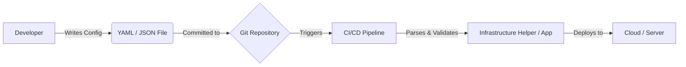

# Data Formats: YAML & JSON Fundamentals

In DevOps, we almost never configure systems through a GUI. Instead, we use **Declarative Configuration** files. The two most common formats for these files are YAML and JSON.

---

## 🎯 Learning Objectives
- Read and write valid YAML and JSON
- Understand the syntax differences and use cases
- Validate configuration files using linters
- Query JSON data using `jq`
- Convert data between YAML and JSON formats

## 📖 YAML (YAML Ain't Markup Language)
YAML is the industry standard for DevOps tools like Kubernetes, Ansible, and Docker Compose. It is designed to be human-readable.


### Key Syntax Rules
- **Indentation Matters**: Use spaces (usually 2), NEVER tabs.
- **Key-Value Pairs**: `key: value`
- **Lists**: Defined with a dash `-`
- **Comments**: Start with `#`

### Advanced YAML Features

#### 1. Anchors and Aliases (`&` and `*`)
Reduce repetition by defining a block once and reusing it.

```yaml
# Define the anchor
default_settings: &defaults
  timeout: 30
  retries: 3

# Use the alias
service_a:
  <<: *defaults
  name: "Service A"

service_b:
  <<: *defaults
  name: "Service B"
```

#### 2. Multi-line Strings (`|` vs `>`)
- **Pipe (`|`)**: Preserves newlines (Literal Block Scalar).
- **Folded (`>`)**: Replaces newlines with spaces (Folded Block Scalar).

```yaml
script: |
  echo "Line 1"
  echo "Line 2"

description: >
  This is a very long sentence that spans multiple lines
  in the file but will be read as a single line.
```

---

## 📖 JSON (JavaScript Object Notation)
JSON is widely used for APIs, cloud configuration (like AWS IAM policies), and Terraform state files. It is more rigid than YAML but very fast for machines to process.

### Configuration Data Flow


### JSON Data Types
JSON supports specific data types:
1. **String**: `"hello"`
2. **Number**: `42` or `3.14`
3. **Boolean**: `true` or `false`
4. **Array**: `["a", "b"]`
5. **Object**: `{"key": "value"}`
6. **Null**: `null`

### JSON Schema
In DevOps, we often use **JSON Schema** to validate that a JSON file has the correct structure before deploying it.

```json
{
  "$schema": "http://json-schema.org/draft-04/schema#",
  "type": "object",
  "properties": {
    "name": { "type": "string" },
    "age": { "type": "integer" }
  },
  "required": ["name"]
}
```

---

## 📖 Comparison & Tooling

| Feature | YAML | JSON |
| :--- | :--- | :--- |
| **Readability** | High (Human-focused) | Medium (Machine-focused) |
| **Comments** | Supported (`#`) | Not Standard |
| **Parsing Speed** | Slower | Very Fast |
| **Strictness** | Indentation-sensitive | Brace/Comma-sensitive |
| **Usage** | Config files (K8s, Ansible) | APIs, Data Interchange |

### Essential CLI Tools

#### 1. `yq` (YAML Processor)
A lightweight command-line YAML processor.
```bash
# Read a value
yq '.spec.replicas' deployment.yaml

# Update a value
yq -i '.spec.replicas = 5' deployment.yaml
```

#### 2. `jq` (JSON Processor)
The swiss-army knife for JSON.
```bash
# Pretty print JSON
cat data.json | jq .

# Filter list of objects
cat logs.json | jq '.[] | select(.level == "error")'
```

---

## 🧪 Practical Labs

### Lab 1: Fixing Broken YAML
**Scenario**: Your Kubernetes deployment is failing with "mapping values are not allowed here".
**Task**: Identify the syntax error.
**Problem Code**:
```yaml
spec:
  replicas: 3
    selector: # Error here
    app: nginx
```
**Solution**: YAML relies on strict indentation. `selector` is indented too far relative to `replicas`. Align them vertically.

### Lab 2: Querying with `jq`
**Scenario**: You have a large JSON log file and need to extract just the error messages.
**Task**: Use `jq` to filter the data.
**Solution**:
```bash
echo '{"level": "error", "msg": "failed"}' | jq '.msg'
```

### Lab 3: Converting YAML to JSON
**Scenario**: An API requires JSON, but you have a YAML config.
**Task**: Convert the file using python.
**Solution**:
```bash
python3 -c 'import sys, yaml, json; print(json.dumps(yaml.safe_load(sys.stdin.read()), indent=2))' < config.yaml
```

## 🧠 Comprehensive Knowledge Quiz

### Part 1: Syntax & Rules
**1. Which character is FORBIDDEN for indentation in YAML?**
- A) Space
- B) Tab
- C) Dash
- D) Underscore

**2. Which of the following is a valid JSON key-value pair?**
- A) `key: value`
- B) `"key": "value"`
- C) `'key': 'value'`
- D) `key = "value"`

**3. Does standard JSON support comments?**
- A) Yes, with `//`
- B) Yes, with `#`
- C) No
- D) Only in metadata

**4. How do you denote a list item in YAML?**
- A) `*`
- B) `-`
- C) `+`
- D) `>`

**5. Which YAML symbol starts a comment?**
- A) `//`
- B) `--`
- C) `#`
- D) `;`

### Part 2: Data Types & Structures

**6. Which of these is NOT a valid JSON data type?**
- A) Boolean
- B) Date
- C) Number
- D) Null

**7. In YAML, what does the pipe `|` symbol denote?**
- A) A comment
- B) A list
- C) A Literal Block Scalar (preserves newlines)
- D) A Folded Block Scalar (removes newlines)

**8. What is the YAML `&` symbol used for?**
- A) Pointers
- B) Anchors (defining a reusable block)
- C) Aliases (referencing a block)
- D) Asynchronous loading

**9. What is the YAML `*` symbol used for?**
- A) Multiplication
- B) Wildcard
- C) Aliases (referencing an anchor)
- D) Bold text

**10. How is a Dictionary/Map represented in JSON?**
- A) `[]`
- B) `{}`
- C) `()`
- D) `<>`

### Part 3: Tooling (jq & yq)

**11. Which tool is best suited for querying JSON data in the terminal?**
- A) `grep`
- B) `awk`
- C) `jq`
- D) `sed`

**12. Which command would extract the value of "version" from a JSON file?**
- A) `jq .version file.json`
- B) `grep version file.json`
- C) `cat file.json | cut version`
- D) `json --get version`

**13. What does `yq` primarily handle?**
- A) XML files
- B) YAML files
- C) Java Source files
- D) Python scripts

**14. If you pipe JSON into `jq .`, what is the output?**
- A) The file size
- B) Pretty-printed (formatted) JSON
- C) An error
- D) The first line only

**15. Can `yq` convert YAML to JSON?**
- A) No, never
- B) Yes, often used for this purpose
- C) Only if the YAML is empty
- D) Only on Windows

### Part 4: Real-World Scenarios

**16. Why is YAML preferred over JSON for Kubernetes?**
- A) It is faster to parse
- B) It supports comments and is easier for humans to read
- C) It uses less disk space
- D) Google invented it

**17. Why is JSON preferred for Web APIs?**
- A) It is easier for Javascript (and many languages) to parse natively
- B) It supports comments
- C) It looks nicer
- D) It supports binary data

**18. You have a `config.yaml` with a massive list of IPs. You need to verify if "192.168.1.5" is in it. What is the fastest check?**
- A) Open in Word
- B) `grep "192.168.1.5" config.yaml`
- C) Convert to JSON then use Excel
- D) Read it line by line manually

**19. You encounter a JSON error: `Unexpected token }`. What is the likely cause?**
- A) A missing or extra comma
- B) A comment was used
- C) Using single quotes
- D) All of the above are common JSON errors

**20. In a CI/CD pipeline, why might we validate JSON/YAML before deployment?**
- A) To make the pipeline slower
- B) To ensure the configuration syntax is correct before applying it to production
- C) To compress the files
- D) To encrypt the data

**Next Step**: Now that you master data formats, learn how to package apps in [Docker Basics](../06-Docker/README.md).

### 🔑 Quiz Answer Key

**Part 1: Syntax & Rules**
<b>1. B) Tab</b>
<details>
<summary>Show Answer</summary>
Answer: YAML forbids tabs for indentation
</details>

<b>2. B) `"key": "value"`</b>
<details>
<summary>Show Answer</summary>
Answer: JSON requires double quotes for keys and strings
</details>

<b>3. C) No</b>
<details>
<summary>Show Answer</summary>
Answer: Standard JSON does not support comments
</details>

<b>4. B) `-`</b>
<details>
<summary>Show Answer</summary>
Answer: Dash denotes a list item
</details>

<b>5. C) `#`</b>
<details>
<summary>Show Answer</summary>
Answer: Hash denotes a comment
</details>


**Part 2: Data Types & Structures**
<b>6. B) Date</b>
<details>
<summary>Show Answer</summary>
Answer: JSON has no native Date type; usually strings are used
</details>

<b>7. C) A Literal Block Scalar</b>
<details>
<summary>Show Answer</summary>
Answer: Preserves newlines
</details>

<b>8. B) Anchors</b>
<details>
<summary>Show Answer</summary>
Answer: Defines a reusable block
</details>

<b>9. C) Aliases</b>
<details>
<summary>Show Answer</summary>
Answer: References an anchor
</details>

<b>10. B) `{}`</b>
<details>
<summary>Show Answer</summary>
Answer: Curly braces denote an object/dictionary
</details>


**Part 3: Tooling (jq & yq)**
11. **C) `jq`**
12. **A) `jq .version file.json`**
<b>13. B) YAML files</b>
<details>
<summary>Show Answer</summary>
Answer: Though modern versions handle JSON/XML too
</details>

14. **B) Pretty-printed (formatted) JSON**
<b>15. B) Yes, often used for this purpose</b>
<details>
<summary>Show Answer</summary>
Answer: `yq -o=json`
</details>


**Part 4: Real-World Scenarios**
16. **B) It supports comments and is easier for humans to read**
17. **A) It is easier for Javascript (and many languages) to parse natively**
<b>18. B) `grep "192.168.1.5" config.yaml`</b>
<details>
<summary>Show Answer</summary>
Answer: Fastest for simple existence check
</details>

<b>19. A) A missing or extra comma</b>
<details>
<summary>Show Answer</summary>
Answer: Very common JSON syntax error
</details>

20. **B) To ensure the configuration syntax is correct before applying it to production**