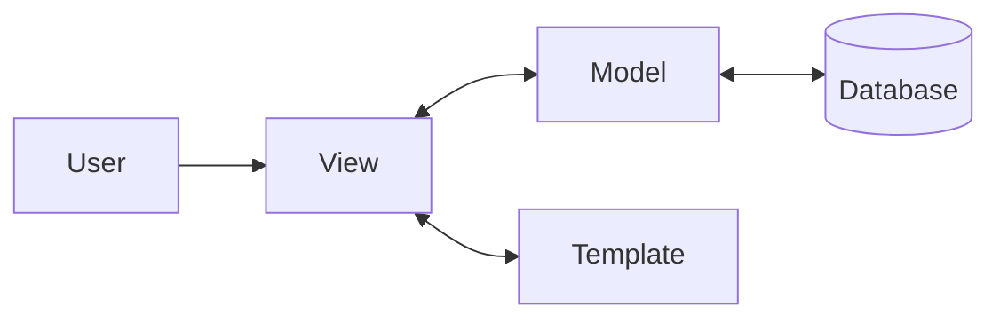

# Django - The Web Framework for Perfectionists with Deadlines

Django is a **high-level Python web framework** that encourages rapid development and clean, pragmatic design. It follows the "batteries-included" philosophy.

## Why Django for DevOps?
- **Robustness**: Handles high traffic and complex data structures.
- **Security**: Built-in protection against SQL injection, XSS, and CSRF.
- **Admin Interface**: Automatic, production-ready admin site.

> [!IMPORTANT]
> Always use a **[Virtual Environment](../Environment-Setup.md)** before installing Django.

---

## 1. Architecture: MTV Pattern
Django uses the **Model-Template-View** pattern.
- **Model**: Data access layer (PostgreSQL, MySQL, SQLite).
- **Template**: Presentation layer (HTML with Django Template Language).
- **View**: Business logic layer (The bridge between Model and Template).



---

## 2. Core Components

### Django ORM
Interact with your database using Python code instead of SQL.
```python
# Create a record
user = User.objects.create(username="devops_pro")

# Retrieve records
all_users = User.objects.all()
```

### Automated Admin
Simply define your models, and Django builds a management UI for you.

---

## 3. DevOps & Production Setup

### Configuration (Settings)
In production, use environment variables for sensitive data.
```python
# settings.py
import os
SECRET_KEY = os.environ.get('DJANGO_SECRET_KEY')
DEBUG = False
ALLOWED_HOSTS = ['myapp.com']
```

### Static & Media Files
Django does NOT serve static files in production. Use **WhiteNoise** or a dedicated server (Nginx).

### Dockerizing Django
```dockerfile
FROM python:3.9-slim

WORKDIR /app

COPY requirements.txt .
RUN pip install --no-cache-dir -r requirements.txt

COPY . .

# Run migrations and start Gunicorn/Uvicorn
CMD ["sh", "-c", "python manage.py migrate && gunicorn --bind 0.0.0.0:8000 myproject.wsgi:application"]
```

---

## 4. Quiz: Django Basics

1. What design pattern does Django primarily use?
   - a) MVC
   - b) MTV
   - c) MVVM
   - d) Singleton

2. Which command is used to sync database changes?
   - a) `python manage.py runserver`
   - b) `python manage.py migrate`
   - c) `python manage.py startapp`
   - d) `python manage.py sync`

3. True or False: Django serves static files automatically in production.
   - a) True
   - b) False

*(Answers: 1:b, 2:b, 3:b)*

---

**[← Back to Web Design](Web%20Design%20&%20Frameworks.md)**