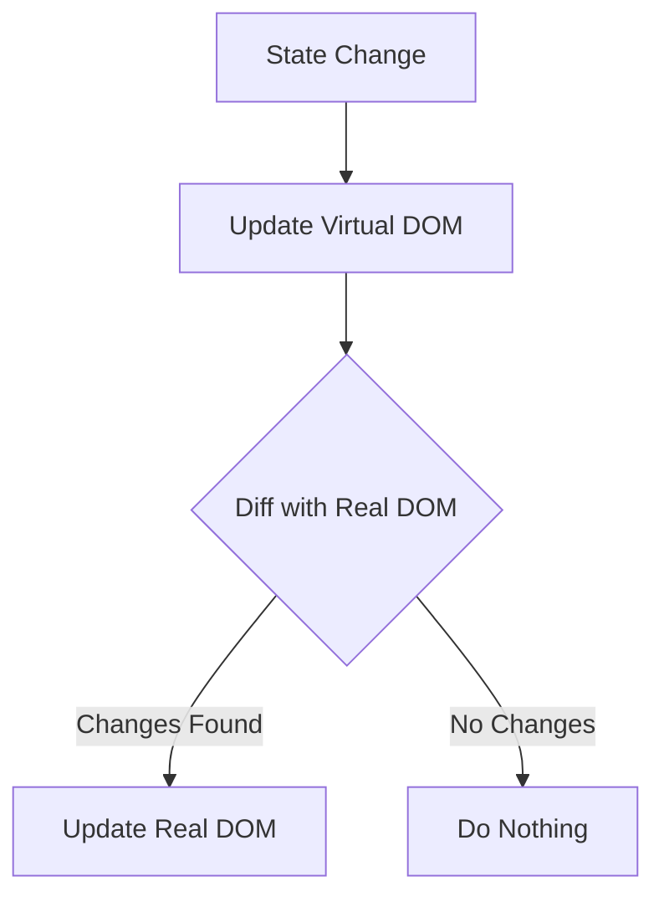

# React for DevOps Engineers

React is a JavaScript library for building user interfaces. For DevOps, understanding how React apps are built (transpiled/bundled) and served (static files) is critical.

## 1. Core Concepts

### Components
Building blocks of UI. Can be functional or class-based.

```javascript
function Welcome(props) {
  return <h1>Hello, {props.name}</h1>;
}
```

### Virtual DOM
React keeps a lightweight representation of the real DOM in memory. When state changes, it diffs the Virtual DOM with the real DOM and only updates what changed.



### Single Page Application (SPA)
React apps typically load a single HTML file (`index.html`) and JavaScript dynamically updates the content. This means routing is handled client-side.

---

## 2. DevOps Context: The Build Process

Unlike Python/Node scripts, React code (JSX, ES6+) cannot run directly in a browser. It must be **transpiled** and **bundled**.

### Key Tools
- **Node.js**: Runtime for build tools.
- **npm/yarn**: Dependency management.
- **Webpack/Vite**: Bundlers that compile code into static assets (`.js`, `.css`, `.html`).

### The Build Command
Usually `npm run build`.
**Result:** A `build/` (or `dist/`) folder containing optimized static files.
**Production:** You serve *this folder*, not the source code.

---

## 3. Serving React (Nginx & Docker)

Since the output is just static files, you don't need Node.js in production to *run* the app, only to *build* it (or just use an Nginx container serving the built assets).

### Multi-Stage Docker Build
Best practice to keep images small.

```dockerfile
# Stage 1: Build
FROM node:18-alpine as builder
WORKDIR /app
COPY package.json .
RUN npm install
COPY . .
RUN npm run build

# Stage 2: Serve
FROM nginx:alpine
# Copy static assets from builder stage
COPY --from=builder /app/build /usr/share/nginx/html
# Custom Nginx config for Client-Side Routing
COPY nginx.conf /etc/nginx/conf.d/default.conf
EXPOSE 80
CMD ["nginx", "-g", "daemon off;"]
```

### Nginx Configuration (Client-Side Routing Fix)
If a user refreshes `/about`, Nginx looks for `about.html` and fails (404). You must tell Nginx to fallback to `index.html`.

```nginx
server {
    listen 80;
    location / {
        root   /usr/share/nginx/html;
        index  index.html index.htm;
        # Crucial for SPAs:
        try_files $uri $uri/ /index.html;
    }
}
```

---

## Real World Scenarios

### Scenario 1: "It works locally but 404s on refresh in Prod"
**Context:** QA reports that navigating to `myapp.com/dashboard` works, but refreshing the page gives a 404 Nginx error.
**Root Cause:** Client-side routing. Browser asks server for `/dashboard`, server checks filesystem, finds nothing.
**Solution:** Update `nginx.conf` with `try_files $uri /index.html;`. Nginx serves `index.html`, React Router takes over and renders Dashboard.

### Scenario 2: Environment Variables
**Context:** Need to point to `api.dev.com` in Dev and `api.prod.com` in Prod.
**Issue:** React is static. `process.env` is baked in at *build time*, not runtime.
**Solution:**
1. **Build-time:** Use `.env` files and build separate images (Anti-pattern for "Build once, deploy anywhere").
2. **Runtime (Better):** Fetch a `config.json` at runtime or inject variable into `window.ENV` in `index.html` using a startup script in the container.

---

## Interview Questions

### Basic Level
1. **What is the output of a React build?**
   - Static files: HTML, CSS, JavaScript chunks, images.
2. **Do you need Node.js installed on the production server for a standard React app?**
   - No. You only need a web server (Nginx, Apache, S3) to serve static files. Node is only for build time (unless using SSR like Next.js).
3. **What is `package.json`?**
   - Manifest file listing dependencies, scripts, and metadata.

### Intermediate Level
4. **Explain Multi-Stage Docker builds for React.**
   - Stage 1 uses a heavy Node image to install deps and build. Stage 2 uses a light Nginx image and copies only the build artifacts. Result: Tiny image (nginx + HTML/JS).
5. **Why do we need `try_files` in Nginx for React?**
   - To support HTML5 History API (Client-side routing). Server knows only `index.html`, browser knows `/routes`.
6. **What is "Tree Shaking"?**
   - Remove unused code during the build process to minimize bundle size.

<b>7. </b>
<details>
<summary>Show Answer</summary>
Answer: B) User Interfaces (Frontend)</b>
</details>


<b>2. The command `npm run build` typically creates:</b>
<details>
<summary>Show Answer</summary>
Answer: B) A directory of static files (HTML/CSS/JS)</b>
</details>


<b>3. Which Docker image is best for SERVING a production React app?</b>
<details>
<summary>Show Answer</summary>
Answer: B) nginx:alpine</b>
</details>


<b>4. In a Multi-Stage build, the Node.js layer is used for:</b>
<details>
<summary>Show Answer</summary>
Answer: A) Compiling/Building the code</b>
</details>


<b>5. "Client-Side Routing" means:</b>
<details>
<summary>Show Answer</summary>
Answer: A) The browser handles URL changes without requesting new HTML from server</b>
</details>


<b>6. JSX stands for:</b>
<details>
<summary>Show Answer</summary>
Answer: A) JavaScript XML</b>
</details>


<b>7. `node_modules` folder should be:</b>
<details>
<summary>Show Answer</summary>
Answer: B) Ignored (.gitignore)</b>
</details>


<b>8. Environment variables in React (by default) are injected at:</b>
<details>
<summary>Show Answer</summary>
Answer: B) Build time</b>
</details>


<b>9. To fix 404s on refresh in Nginx, use:</b>
<details>
<summary>Show Answer</summary>
Answer: A) try_files $uri /index.html;</b>
</details>


<b>10. Webpack is a:</b>
<details>
<summary>Show Answer</summary>
Answer: A) Module Bundler</b>
</details>
