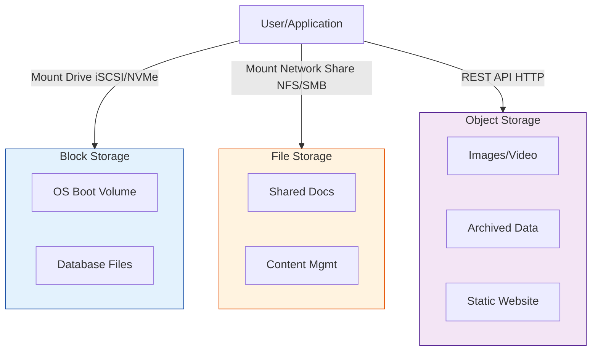

# Cloud Storage

Comprehensive guide to cloud storage types, services, and best practices across cloud platforms.

## Storage Types

### Storage Architecture


### Object Storage
```yaml
Characteristics:
  - Flat namespace structure
  - REST API access
  - Unlimited scalability
  - Metadata support
  - Versioning capabilities

Use Cases:
  - Static websites
  - Data archiving
  - Content distribution
  - Backup and recovery
  - Big data analytics

Examples:
  - AWS S3
  - Azure Blob Storage
  - Google Cloud Storage
```

### Block Storage
```yaml
Characteristics:
  - Raw block-level storage
  - High IOPS performance
  - Attached to compute instances
  - Snapshot capabilities
  - Encryption support

Use Cases:
  - Database storage
  - File systems
  - Boot volumes
  - High-performance applications

Examples:
  - AWS EBS
  - Azure Managed Disks
  - Google Persistent Disks
```

### File Storage
```yaml
Characteristics:
  - Network-attached storage
  - POSIX-compliant
  - Shared access
  - Hierarchical structure
  - Concurrent access

Use Cases:
  - Shared application data
  - Content repositories
  - Home directories
  - Legacy applications

Examples:
  - AWS EFS
  - Azure Files
  - Google Filestore
```

## AWS Storage Services

### Amazon S3
```bash
# Create S3 bucket
aws s3 mb s3://my-bucket-name --region us-east-1

# Upload file
aws s3 cp file.txt s3://my-bucket-name/

# Sync directory
aws s3 sync ./local-folder s3://my-bucket-name/folder/

# Set bucket policy
aws s3api put-bucket-policy \
  --bucket my-bucket-name \
  --policy file://bucket-policy.json

# Enable versioning
aws s3api put-bucket-versioning \
  --bucket my-bucket-name \
  --versioning-configuration Status=Enabled
```

### S3 Storage Classes
```yaml
Standard:
  - Frequent access
  - 99.999999999% durability
  - Low latency

Standard-IA:
  - Infrequent access
  - Lower storage cost
  - Retrieval charges

One Zone-IA:
  - Single AZ storage
  - 20% less cost than Standard-IA
  - Lower availability

Glacier:
  - Long-term archival
  - Minutes to hours retrieval
  - Very low cost

Glacier Deep Archive:
  - Lowest cost storage
  - 12+ hours retrieval
  - Compliance archiving
```

### Amazon EBS
```bash
# Create EBS volume
aws ec2 create-volume \
  --size 100 \
  --volume-type gp3 \
  --availability-zone us-east-1a

# Attach volume to instance
aws ec2 attach-volume \
  --volume-id vol-12345678 \
  --instance-id i-12345678 \
  --device /dev/sdf

# Create snapshot
aws ec2 create-snapshot \
  --volume-id vol-12345678 \
  --description "Daily backup"
```

## Azure Storage Services

### Azure Blob Storage
```bash
# Create storage account
az storage account create \
  --name mystorageaccount \
  --resource-group myRG \
  --location eastus \
  --sku Standard_LRS

# Create container
az storage container create \
  --name mycontainer \
  --account-name mystorageaccount

# Upload blob
az storage blob upload \
  --file myfile.txt \
  --container-name mycontainer \
  --name myblob \
  --account-name mystorageaccount
```

### Azure Storage Tiers
```yaml
Hot Tier:
  - Frequent access
  - Higher storage cost
  - Lower access cost

Cool Tier:
  - Infrequent access (30+ days)
  - Lower storage cost
  - Higher access cost

Archive Tier:
  - Rare access (180+ days)
  - Lowest storage cost
  - Highest access cost
  - Rehydration required
```

### Azure Managed Disks
```bash
# Create managed disk
az disk create \
  --resource-group myRG \
  --name myDisk \
  --size-gb 128 \
  --sku Premium_LRS

# Attach disk to VM
az vm disk attach \
  --resource-group myRG \
  --vm-name myVM \
  --name myDisk
```

## Google Cloud Storage

### Cloud Storage
```bash
# Create bucket
gsutil mb gs://my-bucket-name

# Upload file
gsutil cp file.txt gs://my-bucket-name/

# Set bucket lifecycle
gsutil lifecycle set lifecycle.json gs://my-bucket-name

# Enable versioning
gsutil versioning set on gs://my-bucket-name
```

### Storage Classes
```yaml
Standard:
  - Frequent access
  - No minimum storage duration
  - Best for hot data

Nearline:
  - Monthly access
  - 30-day minimum storage
  - Backup and archival

Coldline:
  - Quarterly access
  - 90-day minimum storage
  - Disaster recovery

Archive:
  - Annual access
  - 365-day minimum storage
  - Long-term preservation
```

### Persistent Disks
```bash
# Create persistent disk
gcloud compute disks create my-disk \
  --size=100GB \
  --zone=us-central1-a \
  --type=pd-ssd

# Attach disk to instance
gcloud compute instances attach-disk my-instance \
  --disk=my-disk \
  --zone=us-central1-a
```

## Storage Security

### Encryption
```yaml
Encryption at Rest:
  - Server-side encryption
  - Customer-managed keys
  - Hardware security modules
  - Key rotation policies

Encryption in Transit:
  - HTTPS/TLS protocols
  - VPN connections
  - Private endpoints
  - Certificate management

Access Control:
  - IAM policies
  - Bucket policies
  - Access control lists
  - Signed URLs
```

### Data Protection
```bash
# AWS S3 Cross-Region Replication
aws s3api put-bucket-replication \
  --bucket source-bucket \
  --replication-configuration file://replication.json

# Azure Blob Storage Replication
az storage account create \
  --name mystorageaccount \
  --replication-type GRS

# GCP Multi-Regional Storage
gsutil mb -c MULTI_REGIONAL gs://my-global-bucket
```

## Performance Optimization

### Throughput Optimization
```yaml
Parallel Operations:
  - Multi-part uploads
  - Concurrent transfers
  - Thread pooling
  - Bandwidth allocation

Caching Strategies:
  - CDN integration
  - Local caching
  - Edge locations
  - Cache invalidation

Network Optimization:
  - Transfer acceleration
  - Direct connections
  - Regional proximity
  - Compression
```

### Cost Optimization
```yaml
Lifecycle Policies:
  - Automatic tier transitions
  - Deletion policies
  - Version management
  - Incomplete upload cleanup

Storage Analysis:
  - Usage patterns
  - Access frequency
  - Cost monitoring
  - Right-sizing recommendations

Data Deduplication:
  - Eliminate duplicates
  - Compression algorithms
  - Delta synchronization
  - Incremental backups
```

## Backup and Recovery

### Backup Strategies
```bash
# Automated backup script
#!/bin/bash
DATE=$(date +%Y%m%d)
BUCKET="backup-bucket"

# Database backup
mysqldump -u user -p database > db_backup_$DATE.sql
aws s3 cp db_backup_$DATE.sql s3://$BUCKET/database/

# File system backup
tar -czf files_backup_$DATE.tar.gz /important/files
aws s3 cp files_backup_$DATE.tar.gz s3://$BUCKET/files/

# Cleanup old backups
aws s3 ls s3://$BUCKET/ | grep backup | head -n -7 | awk '{print $4}' | \
xargs -I {} aws s3 rm s3://$BUCKET/{}
```

### Disaster Recovery
```yaml
RTO (Recovery Time Objective):
  - Maximum acceptable downtime
  - Recovery procedures
  - Automation requirements
  - Testing schedules

RPO (Recovery Point Objective):
  - Maximum data loss acceptable
  - Backup frequency
  - Replication strategies
  - Point-in-time recovery

Cross-Region Replication:
  - Geographic distribution
  - Automatic failover
  - Data consistency
  - Compliance requirements
```

This comprehensive guide covers cloud storage fundamentals, services, and best practices across major cloud platforms.

## Real World Scenarios

### Scenario 1: Media Streaming Platform
**Context:** A video streaming service needs to store petabytes of raw user-uploaded videos, transcoding them into different formats, and serving them globally to users.
**Solution:**
- **Object Storage (S3/Blob):** Store raw and transcoded video files (unlimited scale, low redundancy cost).
- **Lifecycle Policies:** Automatically move original raw files to "Cool" or "Archive" storage after transcoding to save money.
- **CDN Integration:** Serve the transcoded videos via CloudFront/Azure CDN directly from the storage bucket to reduce latency.
**Benefit:** Cost-effective scaling for massive unstructured data with high performance delivery.

### Scenario 2: High-Performance Database
**Context:** A company runs a mission-critical transactional database (OLTP) that requires sub-millisecond disk latency and high throughput.
**Solution:**
- **Block Storage (EBS/Managed Disk):** Attach Provisioned IOPS SSD volumes to the database EC2 instances.
- **RAID Configuration:** Stripe data across multiple volumes if even higher throughput is needed.
- **Snapshots:** frequent automated snapshots for point-in-time recovery.
**Benefit:** Provides the low-level, high-speed disk access required by database engines, which Object Storage cannot offer.

---

## Interview Questions

### Basic Level
1.  **What is the difference between Object Storage and Block Storage?**
    -   **Object Storage:** Stores data as objects with metadata and ID (flat structure). Access via API (HTTP). Great for static files (images, backups).
    -   **Block Storage:** Stores chunks of data in fixed-sized blocks. Access via OS mounting (like a hard drive). Great for databases and OS boot drives.
2.  **Explain "Durability" vs "Availability" in S3.**
    -   **Durability:** Probability that data will NOT be lost (S3 is 99.999999999% or "11 9s").
    -   **Availability:** Probability that you can access the data right now (e.g., 99.99%).
3.  **What is a Storage Class?**
    -   Categories of storage (Standard, Infrequent Access, Archive) offering different trade-offs between access cost, storage cost, and retrieval time.

### Intermediate Level
4.  **When would you use File Storage (EFS/Azure Files) over Block Storage?**
    -   When you need multiple instances (VMs) to access/mount the *same* file system simultaneously (Shared Access). Block storage is typically mounted to only one instance at a time (with some exceptions like Multi-Attach).
5.  **How do Lifecycle Policies save money?**
    -   They automate the transition of data to cheaper storage tiers (e.g., from Standard to Glacier) based on age or access patterns, reducing bills for data that isn't rarely used.
6.  **What is "Encryption at Rest"?**
    -   The cloud provider encrypts the data on the physical disk using keys (KMS) so that if someone stole the hard drive, they couldn't read the data.
7.  **Describe the concept of "Consistency" in S3 (Eventual vs Strong).**
    -   Modern S3 offers strong consistency (read-after-write). Historically it was eventually consistent (might read stale data immediately after update).
8.  **What is the use case for "Transfer Acceleration"?**
    -   Using the AWS Edge Network (CloudFront edge locations) to upload data to S3 faster from long distances.

<b>9. </b>
<details>
<summary>Show Answer</summary>
Answer: C) Object Storage (S3)</b>
</details>


<b>2. If a database requires sub-millisecond disk latency, which storage should you use?</b>
<details>
<summary>Show Answer</summary>
Answer: C) AWS EBS (Block Storage)</b>
</details>


<b>3. S3 Standard storage allows you to mount the bucket as a drive on your OS natively for high performance DB I/O. (True/False)</b>
<details>
<summary>Show Answer</summary>
Answer: B) False</b>
</details>


<b>4. Which storage tier is the cheapest "Archive" solution?</b>
<details>
<summary>Show Answer</summary>
Answer: C) S3 Glacier Deep Archive</b>
</details>


<b>5. To share files between 100 Linux servers simultaneously, you should use:</b>
<details>
<summary>Show Answer</summary>
Answer: C) EFS (Elastic File System)</b>
</details>


<b>6. What does "11 9s" refer to in S3?</b>
<details>
<summary>Show Answer</summary>
Answer: B) Durability</b>
</details>


<b>7. EBS Volumes are scoped to which boundary level?</b>
<details>
<summary>Show Answer</summary>
Answer: C) Availability Zone (AZ)</b>
</details>


<b>8. S3 Buckets are scoped to which boundary level (for naming uniqueness)?</b>
<details>
<summary>Show Answer</summary>
Answer: A) Global</b>
</details>


<b>9. What feature protects S3 objects from accidental deletion?</b>
<details>
<summary>Show Answer</summary>
Answer: B) Versioning</b>
</details>


<b>10. Block storage data is persistently stored even after the instance terminates IF:</b>
<details>
<summary>Show Answer</summary>
Answer: B) The "Delete on Termination" flag is unchecked</b>
</details>


<b>11. Which S3 feature allows you to use a custom domain name for objects?</b>
<details>
<summary>Show Answer</summary>
Answer: A) Static Website Hosting + DNS</b>
</details>


<b>12. EBS Snapshots are stored in:</b>
<details>
<summary>Show Answer</summary>
Answer: B) S3 (managed by AWS, effectively)</b>
</details>


<b>13. Can you attach one EBS volume to an instance in a different Availability Zone?</b>
<details>
<summary>Show Answer</summary>
Answer: B) No</b>
</details>


<b>14. Which is NOT a valid access method for S3?</b>
<details>
<summary>Show Answer</summary>
Answer: D) iSCSI Protocol</b>
</details>


<b>15. Data "Re-hydration" time is a key consideration for which storage class?</b>
<details>
<summary>Show Answer</summary>
Answer: B) S3 Glacier</b>
</details>


<b>16. Instance Store provides:</b>
<details>
<summary>Show Answer</summary>
Answer: B) Ephemeral (Temporary) storage with very high performance</b>
</details>


<b>17. Which Azure service maps to AWS S3?</b>
<details>
<summary>Show Answer</summary>
Answer: B) Azure Blob Storage</b>
</details>


<b>18. What is the max file size in S3?</b>
<details>
<summary>Show Answer</summary>
Answer: B) 5 TB</b>
</details>


<b>19. Lifecycle rules can be applied to current versions and _____ versions.</b>
<details>
<summary>Show Answer</summary>
Answer: B) Previous (Non-current)</b>
</details>


<b>20. Use cases for Block Storage include:</b>
<details>
<summary>Show Answer</summary>
Answer: A) Boot volumes and databases</b>
</details>


<b>21. Which encryption key management option allows the customer to keep full control of the key material outside of AWS?</b>
<details>
<summary>Show Answer</summary>
Answer: C) SSE-C (Customer Provided)</b>
</details>
