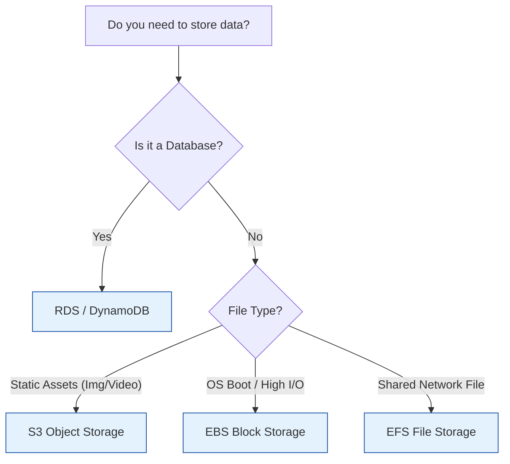

# AWS Storage Services

Overview of AWS storage options: S3 (Object), EFS (File), and EBS (Block).

## Storage Decision Matrix

## Real World Scenarios
### Scenario: CMS Media Library
**Context:** Wordpress site needs to store user uploads and be accessible by multiple servers.
**Solution:**
- **EFS:** Mount EFS to /var/www/html/wp-content/uploads on all web servers.
**Benefit:** All servers see the same files instantly. S3 could work with a plugin, but EFS is native filesystem access.

<b>1. S3 bucket names must be:</b>

Show Answer

Answer: A) Unique across all AWS accounts globally</b>

<b>2. Which S3 storage class is for "Unknown Access Patterns"?</b>

Show Answer

Answer: B) Intelligent-Tiering</b>

<b>3. EBS Volumes persist independently of the EC2 instance unless:</b>

Show Answer

Answer: A) "Delete on Termination" is checked</b>

<b>4. EFS is compatible with:</b>

Show Answer

Answer: A) Linux only (NFS)</b>

<b>5. Does S3 support file locking?</b>

Show Answer

Answer: A) No (It is object storage, not a file system)</b>

<b>6. Maximum size of a single S3 object?</b>

Show Answer

Answer: A) 5 TB</b>

<b>7. Which service is best for long-term audit logs that you hope never to read?</b>

Show Answer

Answer: A) S3 Glacier Deep Archive</b>

<b>8. Can you resize an EBS volume while it is attached and in use?</b>

Show Answer

Answer: A) Yes (Elastic Volumes)</b>

<b>9. S3 Transfer Acceleration uses:</b>

Show Answer

Answer: A) Edge Locations</b>

<b>10. What keeps track of object versions in S3?</b>

Show Answer

Answer: A) S3 Versioning</b>

<b>11. EFS grows and shrinks automatically. (True/False)</b>

Show Answer

Answer: A) True</b>

<b>12. EBS Multi-Attach is supported on:</b>

Show Answer

Answer: A) io1/io2 volumes only (Provisioned IOPS)</b>

<b>13. S3 Select allows you to:</b>

Show Answer

Answer: A) Retrieve only a subset of data from an object using SQL</b>

<b>14. Which EBS type is cheapest for infrequent access (boot volumes)?</b>

Show Answer

Answer: A) Cold HDD (sc1) (Though technically sc1 cannot be boot volume. For boot volume it's usually gp2/gp3. But sc1 is cheapest block storage)</b>

<b>15. S3 Object Lock helps with:</b>

Show Answer

Answer: A) Compliance (WORM)</b>

<b>16. Can you access EFS from On-Premises?</b>

Show Answer

Answer: A) Yes, via Direct Connect or VPN</b>

<b>17. FSx for Windows File Server uses which protocol?</b>

Show Answer

Answer: A) SMB</b>

<b>18. What is the durability of S3 Standard?</b>

Show Answer

Answer: A) 99.999999999% (11 9s)</b>

<b>19. S3 Cross-Region Replication (CRR) requires:</b>

Show Answer

Answer: A) Versioning enabled on both source and destination buckets</b>

<b>20. To serve S3 content privately to specific users, use:</b>

Show Answer

Answer: A) Pre-signed URLs or CloudFront Signed Cookies</b>

<b>21. Does S3 support directory structure natively?</b>

Show Answer

Answer: A) No, it uses "Prefixes" to simulate folders</b>

