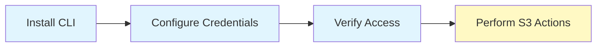

# AWS S3 Bucket - CLI Guide

Complete step-by-step guide for creating and managing S3 buckets using the AWS CLI.

## Prerequisites



### Install AWS CLI

```bash
# Check if AWS CLI is installed
aws --version

# Install on Linux
curl "https://awscli.amazonaws.com/awscli-exe-linux-x86_64.zip" -o "awscliv2.zip"
unzip awscliv2.zip
sudo ./aws/install

# Install on macOS
brew install awscli

# Install on Windows (PowerShell)
# Download and run: https://awscli.amazonaws.com/AWSCLIV2.msi
```

### Configure AWS Credentials

```bash
# Configure AWS CLI (interactive)
aws configure

# You'll be prompted for:
# - AWS Access Key ID
# - AWS Secret Access Key
# - Default region name (e.g., us-east-1)
# - Default output format (json, yaml, text, table)

# Verify configuration
aws sts get-caller-identity

# Output shows:
# - UserId
# - Account
# - Arn
```

### Set Environment Variables (Alternative)

```bash
# Set credentials via environment variables
export AWS_ACCESS_KEY_ID="your-access-key-id"
export AWS_SECRET_ACCESS_KEY="your-secret-access-key"
export AWS_DEFAULT_REGION="us-east-1"

# Verify
aws s3 ls
```

## Creating S3 Buckets

### Basic Bucket Creation

```bash
# Create bucket with default settings
aws s3 mb s3://my-unique-bucket-name

# Create bucket in specific region
aws s3 mb s3://my-bucket-name --region us-west-2

# Success message:
# make_bucket: my-bucket-name
```

### Bucket Naming Rules

```yaml
Requirements:
  - Must be globally unique across ALL AWS accounts
  - 3-63 characters long
  - Lowercase letters, numbers, hyphens only
  - Must start with letter or number
  - Cannot be formatted as IP address (e.g., 192.168.1.1)
  - Cannot use underscores
  - Cannot have consecutive periods

Good Examples:
  - my-company-data-2024
  - user-uploads-prod
  - backup-bucket-123

Bad Examples:
  - MyBucket (uppercase not allowed)
  - my_bucket (underscores not allowed)
  - -mybucket (cannot start with hyphen)
  - my..bucket (consecutive periods)
```

### Create Bucket with Unique Name

```bash
# Use timestamp for uniqueness
BUCKET_NAME="my-bucket-$(date +%Y%m%d-%H%M%S)"
echo "Creating bucket: $BUCKET_NAME"
aws s3 mb s3://$BUCKET_NAME --region us-east-1

# Use random string
BUCKET_NAME="my-bucket-$(openssl rand -hex 4)"
echo "Creating bucket: $BUCKET_NAME"
aws s3 mb s3://$BUCKET_NAME --region us-east-1
```

## Listing Buckets

```bash
# List all buckets
aws s3 ls

# Output format:
# 2024-01-20 10:30:00 bucket-name-1
# 2024-01-20 11:45:00 bucket-name-2

# List with specific profile
aws s3 ls --profile production

# List using s3api (more details)
aws s3api list-buckets

# Pretty print with jq
aws s3api list-buckets | jq '.Buckets[] | .Name'

# Count total buckets
aws s3api list-buckets | jq '.Buckets | length'
```

## Bucket Information

```bash
# Get bucket location/region
aws s3api get-bucket-location --bucket my-bucket-name

# Output: {"LocationConstraint": "us-west-2"}
# Note: us-east-1 returns null

# Get bucket details
aws s3api head-bucket --bucket my-bucket-name

# Check if bucket exists (exit code 0 = exists, 254 = not exists)
aws s3api head-bucket --bucket my-bucket-name 2>&1
if [ $? -eq 0 ]; then
    echo "Bucket exists"
else
    echo "Bucket does not exist"
fi
```

## Configuring Bucket Properties

### Enable Versioning

```bash
# Enable versioning
aws s3api put-bucket-versioning \
  --bucket my-bucket-name \
  --versioning-configuration Status=Enabled

# Check versioning status
aws s3api get-bucket-versioning --bucket my-bucket-name

# Output: {"Status": "Enabled"}

# Suspend versioning (doesn't delete versions)
aws s3api put-bucket-versioning \
  --bucket my-bucket-name \
  --versioning-configuration Status=Suspended
```

### Enable Encryption

```bash
# Enable default encryption (AES256)
aws s3api put-bucket-encryption \
  --bucket my-bucket-name \
  --server-side-encryption-configuration '{
    "Rules": [{
      "ApplyServerSideEncryptionByDefault": {
        "SSEAlgorithm": "AES256"
      },
      "BucketKeyEnabled": true
    }]
  }'

# Enable encryption with KMS
aws s3api put-bucket-encryption \
  --bucket my-bucket-name \
  --server-side-encryption-configuration '{
    "Rules": [{
      "ApplyServerSideEncryptionByDefault": {
        "SSEAlgorithm": "aws:kms",
        "KMSMasterKeyID": "arn:aws:kms:us-east-1:123456789012:key/12345678-1234-1234-1234-123456789012"
      },
      "BucketKeyEnabled": true
    }]
  }'

# Check encryption configuration
aws s3api get-bucket-encryption --bucket my-bucket-name
```

### Block Public Access

```bash
# Block all public access (RECOMMENDED)
aws s3api put-public-access-block \
  --bucket my-bucket-name \
  --public-access-block-configuration \
    "BlockPublicAcls=true,IgnorePublicAcls=true,BlockPublicPolicy=true,RestrictPublicBuckets=true"

# Check public access block status
aws s3api get-public-access-block --bucket my-bucket-name

# Remove public access block (use with caution)
aws s3api delete-public-access-block --bucket my-bucket-name
```

### Enable Logging

```bash
# Create logging bucket first
aws s3 mb s3://my-logs-bucket

# Grant log delivery permissions
aws s3api put-bucket-acl \
  --bucket my-logs-bucket \
  --grant-write 'URI="http://acs.amazonaws.com/groups/s3/LogDelivery"' \
  --grant-read-acp 'URI="http://acs.amazonaws.com/groups/s3/LogDelivery"'

# Enable logging on source bucket
aws s3api put-bucket-logging \
  --bucket my-bucket-name \
  --bucket-logging-status '{
    "LoggingEnabled": {
      "TargetBucket": "my-logs-bucket",
      "TargetPrefix": "logs/"
    }
  }'

# Check logging configuration
aws s3api get-bucket-logging --bucket my-bucket-name
```

### Set Lifecycle Policies

```bash
# Create lifecycle configuration file
cat > lifecycle.json << 'EOF'
{
  "Rules": [
    {
      "Id": "MoveToIA",
      "Status": "Enabled",
      "Filter": {},
      "Transitions": [
        {
          "Days": 30,
          "StorageClass": "STANDARD_IA"
        },
        {
          "Days": 90,
          "StorageClass": "GLACIER"
        }
      ]
    },
    {
      "Id": "DeleteOldVersions",
      "Status": "Enabled",
      "Filter": {},
      "NoncurrentVersionExpiration": {
        "NoncurrentDays": 90
      }
    },
    {
      "Id": "CleanupIncompleteUploads",
      "Status": "Enabled",
      "Filter": {},
      "AbortIncompleteMultipartUpload": {
        "DaysAfterInitiation": 7
      }
    }
  ]
}
EOF

# Apply lifecycle configuration
aws s3api put-bucket-lifecycle-configuration \
  --bucket my-bucket-name \
  --lifecycle-configuration file://lifecycle.json

# View lifecycle configuration
aws s3api get-bucket-lifecycle-configuration --bucket my-bucket-name

# Delete lifecycle configuration
aws s3api delete-bucket-lifecycle --bucket my-bucket-name
```

## Uploading Files

```bash
# Upload single file
aws s3 cp file.txt s3://my-bucket-name/

# Upload to specific prefix (folder)
aws s3 cp file.txt s3://my-bucket-name/documents/

# Upload with metadata
aws s3 cp file.txt s3://my-bucket-name/ \
  --metadata "author=john,department=engineering"

# Upload with server-side encryption
aws s3 cp file.txt s3://my-bucket-name/ \
  --server-side-encryption AES256

# Upload directory recursively
aws s3 cp ./local-folder s3://my-bucket-name/remote-folder/ --recursive

# Upload with progress
aws s3 cp large-file.zip s3://my-bucket-name/ \
  --no-progress false

# Upload with ACL
aws s3 cp file.txt s3://my-bucket-name/ \
  --acl private  # or public-read, public-read-write, authenticated-read
```

## Downloading Files

```bash
# Download single file
aws s3 cp s3://my-bucket-name/file.txt ./

# Download to specific location
aws s3 cp s3://my-bucket-name/file.txt /path/to/destination/

# Download directory recursively
aws s3 cp s3://my-bucket-name/folder/ ./local-folder/ --recursive

# Download all files from bucket
aws s3 cp s3://my-bucket-name/ ./backup/ --recursive

# Download only specific file types
aws s3 cp s3://my-bucket-name/ ./images/ \
  --recursive \
  --exclude "*" \
  --include "*.jpg"
```

## Listing Objects

```bash
# List all objects in bucket
aws s3 ls s3://my-bucket-name/

# List objects in specific prefix
aws s3 ls s3://my-bucket-name/documents/

# List recursively with human-readable sizes
aws s3 ls s3://my-bucket-name/ --recursive --human-readable

# List with summary
aws s3 ls s3://my-bucket-name/ --recursive --summarize

# List using s3api (more control)
aws s3api list-objects-v2 --bucket my-bucket-name

# List with specific prefix using s3api
aws s3api list-objects-v2 \
  --bucket my-bucket-name \
  --prefix "documents/" \
  --max-keys 100

# Count total objects
aws s3api list-objects-v2 \
  --bucket my-bucket-name \
  --query 'length(Contents)'
```

## Syncing Directories

```bash
# Sync local to S3 (upload)
aws s3 sync ./local-folder s3://my-bucket-name/

# Sync S3 to local (download)
aws s3 sync s3://my-bucket-name/ ./local-folder

# Sync with delete (remove files not in source)
aws s3 sync ./local-folder s3://my-bucket-name/ --delete

# Sync excluding files
aws s3 sync ./local-folder s3://my-bucket-name/ \
  --exclude "*.tmp" \
  --exclude ".git/*" \
  --exclude "node_modules/*"

# Sync including only specific files
aws s3 sync ./local-folder s3://my-bucket-name/ \
  --exclude "*" \
  --include "*.jpg" \
  --include "*.png"

# Dry run (see what would be synced)
aws s3 sync ./local-folder s3://my-bucket-name/ --dryrun
```

## Deleting Objects and Buckets

```bash
# Delete single object
aws s3 rm s3://my-bucket-name/file.txt

# Delete all objects in prefix
aws s3 rm s3://my-bucket-name/folder/ --recursive

# Delete all objects in bucket
aws s3 rm s3://my-bucket-name/ --recursive

# Delete empty bucket
aws s3 rb s3://my-bucket-name

# Delete bucket with all contents (DANGEROUS!)
aws s3 rb s3://my-bucket-name --force

# Delete specific object version
aws s3api delete-object \
  --bucket my-bucket-name \
  --key file.txt \
  --version-id "version-id-here"
```

## Advanced Operations

### Presigned URLs

```bash
# Generate presigned URL for download (valid for 1 hour)
aws s3 presign s3://my-bucket-name/file.txt --expires-in 3600

# Generate presigned URL for upload
aws s3 presign s3://my-bucket-name/upload.txt \
  --expires-in 3600 \
  --http-method PUT
```

### Multipart Upload

```bash
# For large files, AWS CLI automatically uses multipart upload
# Configure multipart settings
aws configure set default.s3.multipart_threshold 64MB
aws configure set default.s3.multipart_chunksize 16MB
aws configure set default.s3.max_concurrent_requests 10

# Upload large file (multipart used automatically)
aws s3 cp large-file.zip s3://my-bucket-name/

# List incomplete multipart uploads
aws s3api list-multipart-uploads --bucket my-bucket-name

# Abort specific multipart upload
aws s3api abort-multipart-upload \
  --bucket my-bucket-name \
  --key large-file.zip \
  --upload-id "upload-id-here"
```

### Copy Objects

```bash
# Copy within same bucket
aws s3 cp s3://my-bucket-name/file.txt s3://my-bucket-name/backup/file.txt

# Copy between buckets
aws s3 cp s3://source-bucket/file.txt s3://dest-bucket/file.txt

# Copy recursively
aws s3 cp s3://source-bucket/ s3://dest-bucket/ --recursive

# Copy and change storage class
aws s3 cp s3://my-bucket-name/file.txt s3://my-bucket-name/file.txt \
  --storage-class GLACIER

# Copy with metadata
aws s3api copy-object \
  --copy-source my-bucket-name/source-file.txt \
  --bucket my-bucket-name \
  --key destination-file.txt \
  --metadata "author=jane,version=2"
```

### Move Objects

```bash
# Move file (copy then delete)
aws s3 mv s3://my-bucket-name/old-location.txt s3://my-bucket-name/new-location.txt

# Move directory
aws s3 mv s3://my-bucket-name/old-folder/ s3://my-bucket-name/new-folder/ --recursive

# Move between buckets
aws s3 mv s3://source-bucket/file.txt s3://dest-bucket/file.txt
```

## Complete Example: Create Production Bucket

```bash
#!/bin/bash

# Configuration
BUCKET_NAME="my-company-prod-data-$(date +%Y%m%d)"
REGION="us-east-1"
LOG_BUCKET="my-company-logs"

echo "Creating production S3 bucket: $BUCKET_NAME"

# 1. Create main bucket
aws s3 mb s3://$BUCKET_NAME --region $REGION
echo "✓ Bucket created"

# 2. Enable versioning
aws s3api put-bucket-versioning \
  --bucket $BUCKET_NAME \
  --versioning-configuration Status=Enabled
echo "✓ Versioning enabled"

# 3. Enable encryption
aws s3api put-bucket-encryption \
  --bucket $BUCKET_NAME \
  --server-side-encryption-configuration '{
    "Rules": [{
      "ApplyServerSideEncryptionByDefault": {
        "SSEAlgorithm": "AES256"
      },
      "BucketKeyEnabled": true
    }]
  }'
echo "✓ Encryption enabled"

# 4. Block public access
aws s3api put-public-access-block \
  --bucket $BUCKET_NAME \
  --public-access-block-configuration \
    "BlockPublicAcls=true,IgnorePublicAcls=true,BlockPublicPolicy=true,RestrictPublicBuckets=true"
echo "✓ Public access blocked"

# 5. Enable logging (if log bucket exists)
if aws s3api head-bucket --bucket $LOG_BUCKET 2>/dev/null; then
  aws s3api put-bucket-logging \
    --bucket $BUCKET_NAME \
    --bucket-logging-status "{
      \"LoggingEnabled\": {
        \"TargetBucket\": \"$LOG_BUCKET\",
        \"TargetPrefix\": \"s3-access-logs/$BUCKET_NAME/\"
      }
    }"
  echo "✓ Logging enabled"
fi

# 6. Add lifecycle policy
cat > /tmp/lifecycle.json << 'EOF'
{
  "Rules": [
    {
      "Id": "TransitionToIA",
      "Status": "Enabled",
      "Filter": {},
      "Transitions": [
        {"Days": 30, "StorageClass": "STANDARD_IA"},
        {"Days": 90, "StorageClass": "GLACIER"}
      ],
      "NoncurrentVersionExpiration": {"NoncurrentDays": 90}
    }
  ]
}
EOF

aws s3api put-bucket-lifecycle-configuration \
  --bucket $BUCKET_NAME \
  --lifecycle-configuration file:///tmp/lifecycle.json
echo "✓ Lifecycle policy configured"

# 7. Add tags
aws s3api put-bucket-tagging \
  --bucket $BUCKET_NAME \
  --tagging "TagSet=[
    {Key=Environment,Value=Production},
    {Key=ManagedBy,Value=DevOps},
    {Key=CostCenter,Value=Engineering}
  ]"
echo "✓ Tags applied"

echo ""
echo "Production bucket ready: s3://$BUCKET_NAME"
echo "Configuration:"
echo "  - Versioning: Enabled"
echo "  - Encryption: AES256"
echo "  - Public Access: Blocked"
echo "  - Logging: Enabled to s3://$LOG_BUCKET"
echo "  - Lifecycle: 30d → IA, 90d → Glacier"
```

## Troubleshooting

### Common Errors

```bash
# Error: Bucket already exists
# Solution: Choose a different bucket name (must be globally unique)

# Error: Access Denied
# Solution: Check IAM permissions
aws iam get-user-policy --user-name your-username --policy-name your-policy

# Error: Invalid bucket name
# Solution: Check naming rules (lowercase, no underscores, etc.)

# Error: Region mismatch
# Solution: Specify correct region
aws s3 mb s3://my-bucket --region us-west-2

# Test connectivity
aws s3 ls --debug 2>&1 | grep -i "error"
```

### Check Permissions

```bash
# Check current IAM identity
aws sts get-caller-identity

# Test S3 access
aws s3 ls

# Check specific bucket access
aws s3 ls s3://my-bucket-name
```

## Additional Resources

- [S3 Main README](./README.md)
- [S3 Bucket Policies (Intermediate)](../../../../../../2-Intermediate/02-Phase-2/12-Cloud-Engineering/03-Storage-and-Databases/08-S3-Advanced/s3-bucket-policies.md)
- [AWS CLI S3 Reference](https://docs.aws.amazon.com/cli/latest/reference/s3/)
- [AWS CLI S3API Reference](https://docs.aws.amazon.com/cli/latest/reference/s3api/)
