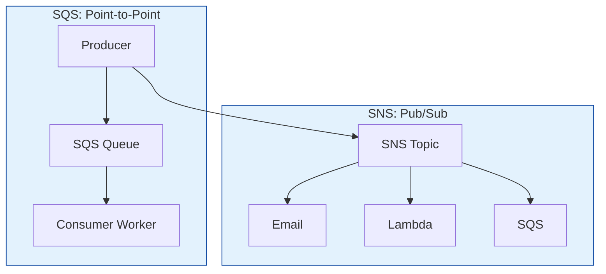

# AWS Messaging (SQS & SNS)

Decoupling applications with Queues and Pub/Sub.

## Architecture: Queue vs Topic

## Real World Scenarios
### Scenario: Fan-out Pattern
**Context:** When a user buys a product, you need to: 1) Send email receipt, 2) Notify warehouse, 3) Update analytics.
**Solution:**
- **SNS + SQS:** The checkout service publishes ONCE to an SNS Topic.
- **Subscriptions:**
    - SQS Queue for Warehouse Service (Subscribed to Topic)
    - SQS Queue for Analytics Service (Subscribed to Topic)
    - Lambda for Email (Subscribed to Topic)
**Benefit:** Decoupled. You can add more subscribers later (e.g., Rewards Service) without modifying the checkout code.

<b>1. SQS stands for:</b>

Show Answer

Answer: A) Simple Queue Service</b>

<b>2. SNS stands for:</b>

Show Answer

Answer: A) Simple Notification Service</b>

<b>3. SQS is strict ordering guaranteed in:</b>

Show Answer

Answer: A) FIFO Queues only</b>

<b>4. SQS Standard queues provide:</b>

Show Answer

Answer: A) At-least-once delivery (duplicates possible)</b>

<b>5. SNS is what type of messaging model?</b>

Show Answer

Answer: A) Pub/Sub (Publish-Subscribe)</b>

<b>6. SQS specific feature to prevent other consumers from adjusting a message while it is being processed:</b>

Show Answer

Answer: A) Visibility Timeout</b>

<b>7. Dead Letter Queue (DLQ) is used for:</b>

Show Answer

Answer: A) Messages that failed processing multiple times</b>

<b>8. SQS Short Polling returns:</b>

Show Answer

Answer: A) Immediately, even if queue is empty (or has few messages)</b>

<b>9. SQS Long Polling reduces cost by:</b>

Show Answer

Answer: A) Waiting (up to 20s) for a message to arrive before returning an empty response</b>

<b>10. Can SNS send SMS text messages?</b>

Show Answer

Answer: A) Yes</b>

<b>11. Amazon MQ is key when:</b>

Show Answer

Answer: A) You need support for industry standard protocols (MQTT, AMQP, STOMP) for legacy migration</b>

<b>12. Max retention period for a message in SQS:</b>

Show Answer

Answer: A) 14 days</b>

<b>13. SNS FIFO Topics enforce:</b>

Show Answer

Answer: A) Ordering and deduplication</b>

<b>14. Kinesis Data Streams vs SQS:</b>

Show Answer

Answer: A) Kinesis = Real-time Big Data streaming (multiple consumers reading same stream). SQS = Job queues (start/finish/delete).</b>

<b>15. Message Group ID in FIFO queues is used to:</b>

Show Answer

Answer: A) Ensure ordering *within* a specific group (e.g., user_id) while allowing parallel processing across groups</b>

<b>16. SQS allows files larger than 256KB by:</b>

Show Answer

Answer: A) Using the SQS Extended Client Library (Storing payload in S3, reference in SQS)</b>

<b>17. Can you subscribe a Lambda function to an SQS queue?</b>

Show Answer

Answer: A) Yes, Lambda poller reads from queue and invokes function synchronously</b>

<b>18. SNS Message Filtering allows:</b>

Show Answer

Answer: A) Subscribers to only receive a subset of messages based on attributes</b>

<b>19. EventBridge vs SNS:</b>

Show Answer

Answer: A) EventBridge is an Event Bus (SaaS integrations, schema registry, content-based routing). SNS is simple Pub/Sub.</b>

<b>20. What happens if a consumer fails to process an SQS message before visibility timeout expires?</b>

Show Answer

Answer: A) The message becomes visible again in the queue for another consumer to retry</b>

<b>21. Max message size in SQS/SNS (standard)?</b>

Show Answer

Answer: A) 256 KB</b>

