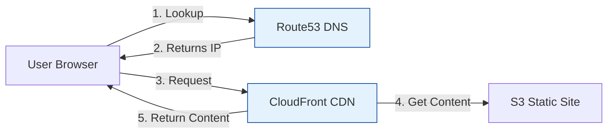

# AWS Web Hosting (Route53 & CloudFront)

DNS and Content Delivery.

## Architecture: Web Request Flow

## Real World Scenarios
### Scenario: Global Marketing Site
**Context:** High traffic launch for a new product page. Users are worldwide.
**Solution:**
- **S3:** Host the static HTML/CSS/JS.
- **CloudFront:** Cache the site at Edge Locations globally.
- **Route53:** Latency-based routing (optional) or simple Alias record to CloudFront.
**Benefit:** Fastest possible load times, low cost, 99.99% availability, survives massive traffic spikes.

<b>1. Route53 is a:</b>

Show Answer

Answer: A) Highly available and scalable DNS web service</b>

<b>2. "53" in Route53 refers to:</b>

Show Answer

Answer: A) The TCP/UDP port for DNS</b>

<b>3. An "Alias Record" in Route53 is better than CNAME because:</b>

Show Answer

Answer: A) It can point to AWS root resources (like ELB/CloudFront) and is free for queries</b>

<b>4. Which Routing Policy routes traffic to the Region with the fastest response time?</b>

Show Answer

Answer: A) Latency Routing</b>

<b>5. Which Routing Policy routes traffic based on the user's physical location (Country/State)?</b>

Show Answer

Answer: A) Geolocation Routing</b>

<b>6. CloudFront is a:</b>

Show Answer

Answer: A) Content Delivery Network (CDN)</b>

<b>7. "TTL" (Time To Live) determines:</b>

Show Answer

Answer: A) How long a DNS record is cached by the resolver</b>

<b>8. Route53 Health Checks can:</b>

Show Answer

Answer: A) Monitor endpoint health and trigger failover</b>

<b>9. Weighted Routing is used for:</b>

Show Answer

Answer: A) A/B Testing (e.g., 10% to new version, 90% to old)</b>

<b>10. Route53 is a Global Service. (True/False)</b>

Show Answer

Answer: A) True</b>

<b>11. Can Route53 register domain names?</b>

Show Answer

Answer: A) Yes (Registrar)</b>

<b>12. CloudFront "Origin" can be:</b>

Show Answer

Answer: A) S3 Bucket, Load Balancer, EC2, or custom HTTP server</b>

<b>13. "OAI" (Origin Access Identity) is used to:</b>

Show Answer

Answer: A) Restrict access to an S3 bucket so only CloudFront can access it</b>

<b>14. CloudFront signed URLs are for:</b>

Show Answer

Answer: A) Restricted content access (Paid content, private)</b>

<b>15. Dynamic Content (API) via CloudFront:</b>

Show Answer

Answer: A) Is optimized via the AWS private network backbone to the origin</b>

<b>16. Route53 Failover record type:</b>

Show Answer

Answer: A) Directs traffic to a backup resource if the primary is unhealthy</b>

<b>17. Lambda@Edge runs:</b>

Show Answer

Answer: A) Code at CloudFront Edge Locations (closest to user)</b>

<b>18. Can you host a Zone Apex (e.g., example.com) on an ELB?</b>

Show Answer

Answer: A) Yes, using Route53 Alias Record</b>

<b>19. Geo-Proximity Routing uses:</b>

Show Answer

Answer: A) Bias values to shift traffic usage between geographic regions</b>

<b>20. To prevent DDoS attacks at the Edge, CloudFront integrates with:</b>

Show Answer

Answer: A) AWS Shield and WAF</b>

<b>21. Multi-Value Answer Routing:</b>

Show Answer

Answer: A) Returns multiple healthy IP addresses (Simple Load Balancing)</b>

