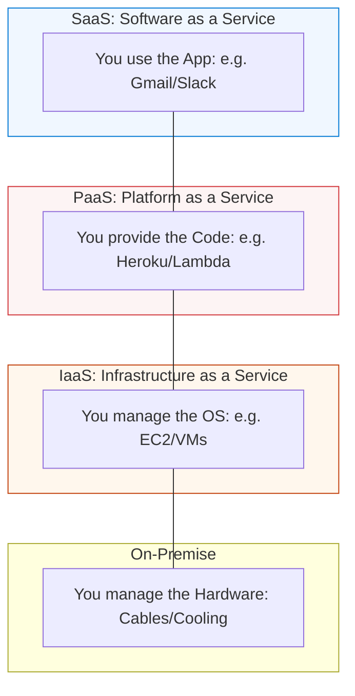

# ☁️ Cloud Foundations: Renting the Infinite Data Center

> **"The cloud is just someone else's computer, but it's a computer with an infinite credit limit and 1,000 security guards. If you treat the cloud like your laptop, you will waste money; if you treat it like an API, you will scale forever."**

---

## 🧠 The Mental Model: The Managed High-Tech City

**The Newbie Struggle**: "I looked at the AWS console and I saw 200 different services. EC2, S3, RDS, Lambda, Fargate... I just want to host a simple website! I feel like I'm trying to order water in a city that has 500 different types of taps. I'm terrified I'll click the wrong button and end up with a $10,000 bill at the end of the month."

**The Engineer Solution**: You realize that you don't need to learn 200 services. You only need to learn the **4 Core Pillars**: Compute (The Brains), Storage (The Memory), Networking (The Nervous System), and Identity (The Keys). You understand that the Cloud is a **Utility**, like electricity. You stop building "servers" and start building **"Solutions."**

### 🏗️ The Cloud Analogy

Think of Cloud Computing like **Renting a Modular Home**:

| Concept | Traditional Data Center | Cloud Equivalent (AWS/Azure/GCP) |
|:--------|:------------------------|:---------------------------------|
| **Ownership** | You buy the land and build the house | You rent a room in a massive complex |
| **Compute** | You buy a physical server rack | You rent "EC2" or "Virtual Machines" |
| **Storage** | You buy hard drives and tapes | You rent "S3" (The infinite closet) |
| **Identity** | You hire a physical guard | You use "IAM" (The digital badge system) |
| **Scalability** | You call a truck to deliver more RAM | You move a slider to "Auto-Scale" |

---

## 📚 Why This Module Matters for Newbies

**Before this module**, you might think:
- "The cloud is just for big companies."
- "I can just host everything on my own PC."
- "Security is the cloud provider's problem, not mine."

**After this module**, you'll understand:
- **Shared Responsibility**: Knowing exactly where the provider's job ends and yours begins.
- **Microservices**: Why breaking a big app into small pieces makes it unbreakable.
- **Pay-as-you-go**: How to run a global system for the price of a cup of coffee.
- **Regional Resiliency**: How to keep your site up even if a whole city goes dark.

**The Difference**: You move from "Managing hardware" to **"Architecting the World."**

---

## 🎯 Learning Objectives

By the end of this module, you will:

- ✅ **Map the Big Three**: Understanding the differences between AWS, Azure, and GCP.
- ✅ **Master the Pillars**: Navigating Compute, Storage, and Networking.
- ✅ **Enforce Security**: Using IAM (Identity and Access Management) to lock your doors.
- ✅ **Control Costs**: Setting up Budgets and Alerts to prevent bill shock.
- ✅ **Choose the Model**: Understanding IaaS, PaaS, and SaaS.

---

## 🏗️ The Cloud Service Hierarchy

Not all cloud is created equal. You choose how much control you want.

---

## 📂 Learning Path

1.  **[04-Cloud-Fundamentals](./04-Cloud-Fundamentals/README.md)**: Compute, Storage, and the Shared Responsibility model.
2.  **[01-Basic-Networking](./01-Basic-Networking/README.md)**: VPCs and Subnets (Your private slice of the cloud).
3.  **[05-AWS-Basics](./05-AWS-Basics/README.md)**: Mastering the market leader.
4.  **[06-Azure-Basics](./06-Azure-Basics/README.md)**: Enterprise integration and Windows-first cloud.
5.  **[07-GCP-Basics](./07-GCP-Basics/README.md)**: Kubernetes-native and Data-heavy cloud.

---

## 🏆 Real-World DevOps Story: The 11am "Reddit Hug"

**The Incident**: A small startup launched a product, and it was featured on the front page of Reddit at 11:00 AM.
**The Failure**: They were running on a single local server. It crashed within 2 minutes. They tried to buy more RAM, but it would take 3 days to deliver.
**The Fix**: A Newbie engineer spent 1 hour migrating the database to **AWS RDS** and the frontend to an **Auto-Scaling Group**.
**The Outcome**: The site was back up by noon. As 100,000 people flooded in, AWS automatically "spawned" 20 new servers. When the traffic died down, the servers were "deleted" automatically, and the bill only cost $15.

---

## ❓ Interview Preparation (Cloud)

### 🎯 Core Concepts

1. **Q: What is the 'Shared Responsibility Model'?**
    *   *Answer: The Cloud Provider is responsible for the 'Security of the Cloud' (the cables, the data center, the hypervisor). The Customer is responsible for 'Security in the Cloud' (the data, the IAM users, the OS patching).*
2. **Q: IaaS vs PaaS vs SaaS?**
    *   *Answer: IaaS is like renting a car (you drive, you get gas). PaaS is like taking a taxi (you just say where to go). SaaS is like taking the bus (you just follow the pre-set route).*
3. **Q: What is an 'Availability Zone' (AZ)?**
    *   *Answer: A physically separate data center with its own power and cooling. If one AZ floods, the others keep running. We deploy apps across multiple AZs for High Availability.*

---

## 📝 Knowledge Check

1. **Which service model gives you the most control over the Operating System?**
    * [ ] a) SaaS
    * [ ] b) PaaS
    * [x] c) IaaS
2. **What is the primary way to manage 'Who can do what' in the cloud?**
    * [ ] a) S3
    * [x] b) IAM
    * [ ] c) VPC
3. **True or False: Cloud computing is always cheaper than owning your own hardware.**
    * [ ] a) True
    * [x] b) False (It is 'Elastic'; if you don't manage it well, it can be more expensive).

---

**Next Step**: Start with **[Cloud Fundamentals](./04-Cloud-Fundamentals/README.md)**
