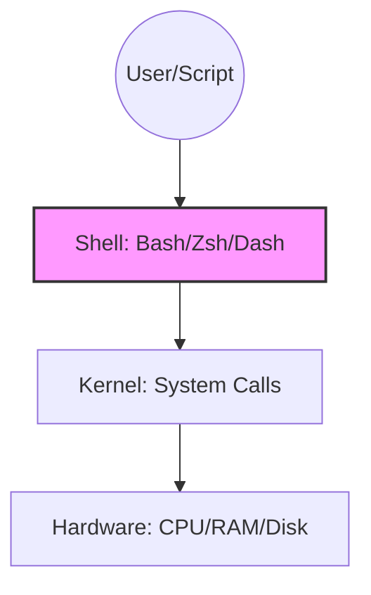

# Shell Environment and Execution

The shell is the command language interpreter that provides a user interface for the POSIX operating system. Understanding how it interacts with the kernel and how scripts are executed is the first step in DevOps automation.

## 🏛️ The OS Hierarchy

To master shell scripting, you must understand the relationship between the user, the shell, and the system hardware.



## 🏗️ The Shebang (`#!`)

The first line of a script, the shebang, tells the operating system which interpreter to use to parse the rest of the file.

-   **Standard Bash**: `#!/bin/bash`
-   **Portable Bash**: `#!/usr/bin/env bash` (Recommended for cross-platform compatibility).
-   **Python**: `#!/usr/bin/env python3`

> [!IMPORTANT]
> Without a shebang, the operating system may default to `/bin/sh` (which might be `dash` on Ubuntu), leading to "Bashisms" (Bash-specific syntax) failing in your script.

## 🔑 Permissions and the `PATH`

Before a script can run, it needs **Execute** permissions.

```bash
# Grant execute permission
chmod +x deploy.sh

# Run from current directory
./deploy.sh
```

-   **The `PATH` Variable**: A colon-separated list of directories where the shell looks for executable files.
-   **DevOps Tip**: Add your custom script directories to the PATH to run them from anywhere: `export PATH=$PATH:/home/user/scripts`.

---

## 📖 Stories from the Field: The "Permission Denied" Mystery

**Scenario**: A DevOps engineer configured a Jenkins pipeline to run a cleanup script. Locally, the script ran perfectly. In Jenkins, the build failed with `sh: cleanup.sh: Permission denied`.
**Discovery**: The engineer had committed the script to Git without the `+x` bit. While their local filesystem had the permission, the Git index did not store it correctly.
**Resolution**: Used `git update-index --chmod=+x cleanup.sh` to ensure the permission was tracked by version control.
**Prevention**: Always verify execution permissions in your CI/CD environment or use `bash script.sh` instead of `./script.sh` if permissions are unreliable.

---

## ❓ Interview Questions

1.  **What is the difference between `/bin/sh` and `/bin/bash`?**
    *   *Answer*: `/bin/sh` is the POSIX standard shell (often a symbolic link to `dash` or `bash` in POSIX mode). `/bin/bash` is the Bourne Again SHell, which adds many "Bashisms" like arrays and extended globbing.
2.  **Why use `#!/usr/bin/env bash` instead of `#!/bin/bash`?**
    *   *Answer*: Portability. `env` searches for the `bash` executable in the user's `PATH`, whereas `/bin/bash` assumes a specific absolute path that might not exist on all systems (e.g., FreeBSD or macOS).
3.  **What does `source script.sh` (or `. script.sh`) do?**
    *   *Answer*: It executes the script in the *current* shell environment instead of spawning a new sub-shell. This allows the script to modify the current shell's variables and functions.
4.  **How do you see all currently set environment variables?**
    *   *Answer*: Use the `env` or `printenv` commands.
5.  **What is a sub-shell?**
    *   *Answer*: A child process started by the main shell to execute a command or script. Variables defined in a sub-shell are not visible to the parent unless exported.

---

## 🧠 Quiz

1.  **What is the name of the first line in a bash script starting with `#!`?** `(Shebang)`
2.  **Which command changes file permissions to make a script executable?** `(chmod)`
3.  **True/False: A script without a shebang will always fail.** `(False - it might run with the default shell, but behavior is unpredictable)`
4.  **Which environment variable stores the list of directories for executable searches?** `(PATH)`
5.  **What is the kernel's primary role in this hierarchy?** `(Managing system calls and hardware resources)`