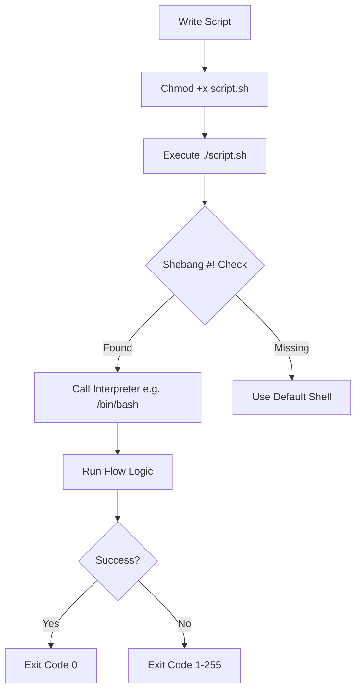

# Shell Scripting Basics: The DevOps Glue

The shell is the native language of the server. Mastering it allows you to manipulate files, manage processes, and glue different tools together into a coherent automation pipeline.

## 📚 Learning Path

| # | Topic | Description | Key Concepts |
| :--- | :--- | :--- | :--- |
| **01** | [**Environment & Execution**](./01-Shell-Environment-and-Execution/README.md) | How the Shell Works | Shebang, Permissions, Kernel/User Space |
| **02** | [**Variables & Streams**](./02-Variables-and-Data-Streams/README.md) | Data Flow | Pipes, Redirection, stdout/stderr, Env Vars |
| **03** | [**Logic & Flow Control**](./03-Logic-and-Flow-Control/README.md) | Script Decisions | if/else, for loops, while loops, case |
| **04** | [**Functions & Modularity**](./04-Shell-Functions-and-Modularity/README.md) | Clean Automation | Reusable code, variable scope, parameters |
| **05** | [**Error Handling**](./05-Robust-Scripting-and-Error-Handling/README.md) | Production Scripts | set -e, traps, exit codes, debugging |

---

## 🏗️ Script Lifecycle Diagram

---

## 🏗️ Real-Life Scenarios

### Scenario 1: The "Recursive Delete" Accident
**Problem**: A developer wrote a cleanup script use `rm -rf $LOG_DIR/*`. One day, the variable `$LOG_DIR` was empty due to a configuration error.
**Crisis**: The command evaluated to `rm -rf /*`, and since the script was running as root, it started deleting the entire operating system.
**Outcome**: The server became unbootable within seconds, and the company lost a production node.
**Solution**: Always check if a variable is set before using it in a destructive command. Use `${LOG_DIR:?variable not set}` or `set -u` to exit the script if an unset variable is referenced.
**Result**: The team implemented strict naming conventions and safety checks in all automation scripts.

### Scenario 2: The "Silent Failure" Backup
**Problem**: A backup script was running via cron every night. It used `tar` to compress a database dump and then `scp` to send it to remote storage.
**Crisis**: The database dump failed because the disk was full, but the `tar` command still created an empty file. The `scp` command "succeeded" in sending that empty file.
**Outcome**: When a recovery was needed, the team found 30 days of 0-byte backups.
**Solution**: Use `set -e` (Exit on Error) and `set -o pipefail` at the start of scripts. This ensures that if any command in a pipe fails, the whole script stops and reports an error.
**Result**: The backup system now triggers an alert immediately if any part of the process fails.

### Scenario 3: The "Log File" Performance Hit
**Problem**: A monitoring script was appending to a log file thousands of times per hour. 
**Crisis**: Each time the script ran, it opened and closed the log file, causing massive disk I/O overhead and slow performance.
**Outcome**: The server monitoring itself was causing the CPU to spike to 80%.
**Solution**: Use **Standard Stream Redirection** properly. Redirect the entire output of a loop or function into the log file once, rather than redirecting every individual command.
**Result**: Script performance improved by 90%, and system overhead returned to normal levels.

---

## ❓ Interview Questions

1.  **What is the 'Shebang' (#!) and why is it important at the top of a script?**
    - *Answer*: The Shebang tells the kernel which interpreter should be used to execute the script (e.g., `#!/bin/bash` or `#!/usr/bin/env python`). Without it, the system might use the user's default shell, leading to inconsistent behavior if the script uses shell-specific features.
2.  **Explain the difference between 'set -e', 'set -u', and 'set -o pipefail'.**
    - *Answer*: `set -e` makes the script exit immediately if any command fails. `set -u` makes the script exit if an unset variable is used. `set -o pipefail` ensures that if a command in a pipe (e.g., `cmd1 | cmd2`) fails, the script sees the non-zero exit code.
3.  **How do you capture the 'Exit Code' of the last executed command?**
    - *Answer*: You use the special variable `$?`. An exit code of `0` indicates success, while any value from `1-255` indicates various types of errors.
4.  **What is the difference between '$*' and '$@' when handling arguments?**
    - *Answer*: Both represent all command-line arguments. However, when quoted, `"$*"` treats them as a single string (e.g., "arg1 arg2"), while `"$@"` treats them as separate strings (e.g., "arg1" "arg2"), which is safer for handling arguments with spaces.
5.  **Explain what a 'Trap' is in a shell script.**
    - *Answer*: A `trap` allows you to catch signals (like `SIGINT` or `EXIT`) and execute a specific command. It's commonly used for cleanup, such as deleting temporary files when a script is interrupted or finishes.
6.  **What is the difference between 'local' variables and global variables in a function?**
    - *Answer*: By default, all variables in a shell script are global. Using the `local` keyword inside a function restricts that variable's scope to that function only, preventing accidental overwrites of variables used elsewhere in the script.

---

## 🧠 Comprehensive Quiz (25 Questions)

<b>1. Which command is used to give a script execution permissions?</b>

Show Answer

Answer: B

<b>2. True/False: 'Standard Error' (stderr) is represented by file descriptor 1.</b>

Show Answer

Answer: B

<b>3. Which character is used to pipe the output of one command as input to another?</b>

Show Answer

Answer: B

<b>4. How do you append text to a file instead of overwriting it?</b>

Show Answer

Answer: B

<b>5. Which variable represents the Process ID (PID) of the current script?</b>

Show Answer

Answer: B

<b>6. 'set -u' helps prevent errors related to:</b>

Show Answer

Answer: B

<b>7. True/False: Single quotes (' ') prevent variable expansion.</b>

Show Answer

Answer: A

<b>8. Which loop is used to iterate over a list of items?</b>

Show Answer

Answer: B

<b>9. The special variable '$1' represents:</b>

Show Answer

Answer: B

<b>10. What does '2>&1' do in a command line?</b>

Show Answer

Answer: B

<b>11. Which operator is used for 'AND' logic in a conditional?</b>

Show Answer

Answer: B

<b>12. '#!/bin/bash' is called a:</b>

Show Answer

Answer: B

<b>13. How do you create a temporary file that is automatically cleaned up?</b>

Show Answer

Answer: A

<b>14. True/False: Functions in Bash must be defined before they are called.</b>

Show Answer

Answer: A

<b>15. Which command is used to read input from a user?</b>

Show Answer

Answer: B

<b>16. The exit code for 'Command not found' is usually:</b>

Show Answer

Answer: B

<b>17. What does the 'case' statement replace?</b>

Show Answer

Answer: A

<b>18. 'Environment Variables' are exported using which command?</b>

Show Answer

Answer: B

<b>19. Which square brackets are preferred for modern Bash tests?</b>

Show Answer

Answer: B

<b>20. True/False: A script with an exit code of 0 failed.</b>

Show Answer

Answer: B

<b>21. 'Cron' is used for:</b>

Show Answer

Answer: A

<b>22. Which command is used to see the contents of a file in the terminal?</b>

Show Answer

Answer: A

<b>23. '$0' represents:</b>

Show Answer

Answer: B

<b>24. 'Standard Input' (stdin) file descriptor number is:</b>

Show Answer

Answer: A

<b>25. Reliable automation starts with _____ script writing.</b>

Show Answer

Answer: B

