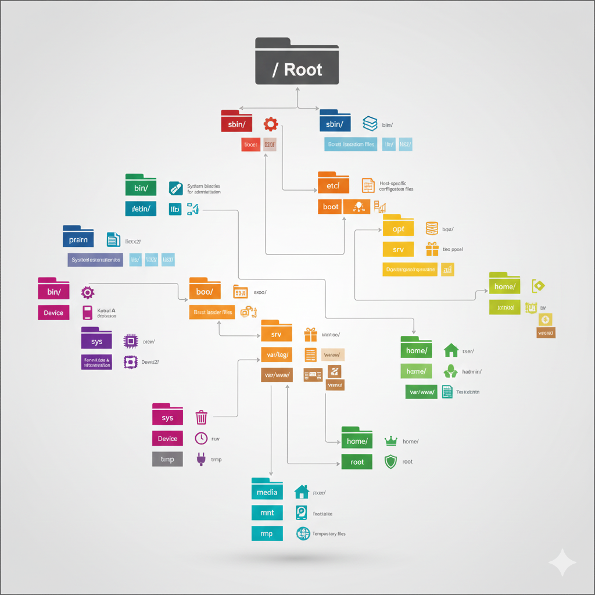
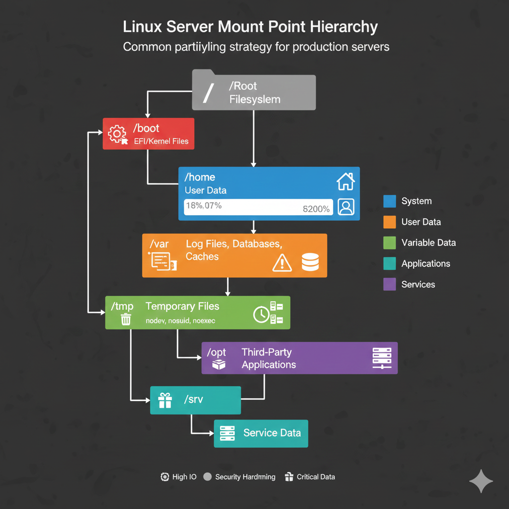
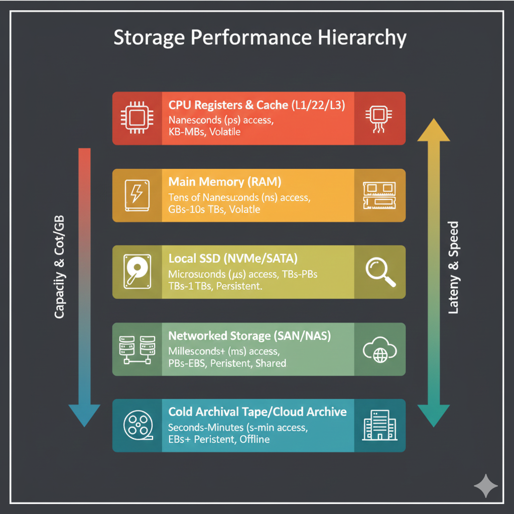

# Linux File System Architecture Guide for DevOps Engineers

## ⚡ DevOps Quick Reference Cheat Sheet

| Directory | Why it matters to DevOps | Example Use Case |
| :--- | :--- | :--- |
| `/etc/systemd` | Service orchestration | Managing Docker/Kubernetes service unit files |
| `/var/log` | Troubleshooting | Checking `journalctl` or app access logs |
| `/proc` | System performance | Checking `/proc/cpuinfo` or `/proc/meminfo` |
| `/etc/network` | Networking | Configuring static IPs or interface bonding |
| `/run` | Runtime state | Checking PID files for running processes |
| `/opt` | Third-party apps | Standard home for standalone binaries like Prometheus |

---

## Overview of Linux File System Hierarchy

The Linux file system follows the Filesystem Hierarchy Standard (FHS), which defines the directory structure and directory contents in Unix-like operating systems. Understanding this architecture is crucial for DevOps engineers managing servers, containers, and cloud infrastructure.

### Root Directory Structure

```bash
/
├── bin/          # Essential user command binaries
├── boot/         # Boot loader files, kernel images
├── dev/          # Device files
├── etc/          # System configuration files
├── home/         # User home directories
├── lib/          # Essential shared libraries
├── lib64/        # 64-bit shared libraries
├── media/        # Removable media mount points
├── mnt/          # Temporary mount points
├── opt/          # Optional application software packages
├── proc/         # Virtual filesystem (process information)
├── root/         # Root user home directory
├── run/          # Runtime data for system processes
├── sbin/         # Essential system binaries
├── srv/          # Service data
├── sys/          # Virtual filesystem (system information)
├── tmp/          # Temporary files
├── usr/          # User utilities and applications
└── var/          # Variable data files
```



## Detailed Directory Descriptions

### `/bin` - Essential User Binaries
Contains essential command-line utilities that need to be available in single-user mode and for all users.

```bash
# Common binaries in /bin
ls /bin/
# Output includes: bash, cat, cp, ls, mv, rm, grep, sed, tar, etc.

# Examples of critical binaries
/bin/bash           # Bash shell
/bin/ls             # List directory contents
/bin/cp             # Copy files
/bin/mv             # Move/rename files
/bin/rm             # Remove files
/bin/cat            # Display file contents
/bin/grep           # Search text patterns
```

**DevOps Relevance:**
- Scripts often reference `/bin/bash` or `/bin/sh`
- Essential for container base images
- Required for system recovery and maintenance

### `/sbin` - System Binaries
Contains essential system administration binaries, typically requiring root privileges.

```bash
# Common system binaries
ls /sbin/
# Output includes: init, mount, umount, fsck, iptables, etc.

# Examples of system binaries
/sbin/init          # System initialization
/sbin/mount         # Mount filesystems
/sbin/iptables      # Firewall configuration
/sbin/fsck          # File system check
/sbin/ifconfig      # Network interface configuration
```

**DevOps Relevance:**
- Network configuration and troubleshooting
- File system management
- System initialization and service management

### `/etc` - Configuration Files
Contains system-wide configuration files and shell scripts used during boot.

```bash
# Key configuration directories and files
/etc/
├── passwd          # User account information
├── shadow          # Encrypted passwords
├── group           # Group information
├── hosts           # Static hostname resolution
├── resolv.conf     # DNS resolver configuration
├── fstab           # File system mount table
├── crontab         # System cron jobs
├── ssh/            # SSH configuration
│   ├── sshd_config # SSH daemon configuration
│   └── ssh_config  # SSH client configuration
├── nginx/          # Nginx web server configuration
├── apache2/        # Apache web server configuration
├── mysql/          # MySQL database configuration
├── systemd/        # Systemd configuration
│   └── system/     # System unit files
└── init.d/         # SysV init scripts (legacy)
```

**DevOps Critical Files:**
```bash
# Network configuration
/etc/hosts                    # Local hostname resolution
/etc/resolv.conf             # DNS configuration
/etc/network/interfaces      # Network interface config (Debian)
/etc/netplan/               # Network configuration (Ubuntu 18+)

# Service configuration
/etc/systemd/system/        # Custom systemd services
/etc/cron.d/               # Cron job definitions
/etc/logrotate.d/          # Log rotation configuration

# Security configuration
/etc/ssh/sshd_config       # SSH server configuration
/etc/sudoers               # Sudo privileges
/etc/security/limits.conf  # Resource limits
```

### `/var` - Variable Data Files
Contains files that are expected to grow or change during system operation.

```bash
/var/
├── log/            # System and application logs
│   ├── syslog      # System log
│   ├── auth.log    # Authentication log
│   ├── nginx/      # Nginx logs
│   └── apache2/    # Apache logs
├── lib/            # Variable state information
│   ├── mysql/      # MySQL database files
│   ├── postgresql/ # PostgreSQL database files
│   └── docker/     # Docker data
├── cache/          # Application cache data
├── tmp/            # Temporary files (preserved across reboots)
├── spool/          # Spool directories
│   ├── mail/       # Mail spool
│   └── cron/       # Cron spool
├── run/            # Runtime variable data
└── www/            # Web server document root (some distributions)
```

**DevOps Log Management:**
```bash
# Critical log locations
/var/log/syslog             # System messages
/var/log/auth.log           # Authentication attempts
/var/log/kern.log           # Kernel messages
/var/log/nginx/access.log   # Web server access logs
/var/log/nginx/error.log    # Web server error logs
/var/log/mysql/error.log    # MySQL error log
/var/log/audit/audit.log    # System audit log
```

### `/usr` - User System Resources
Contains user utilities, applications, and their documentation.

```bash
/usr/
├── bin/            # User command binaries
├── sbin/           # Non-essential system binaries
├── lib/            # Libraries for binaries in /usr/bin and /usr/sbin
├── local/          # Local software installations
│   ├── bin/        # Local binaries
│   ├── lib/        # Local libraries
│   └── etc/        # Local configuration
├── share/          # Architecture-independent data
│   ├── doc/        # Documentation
│   └── man/        # Manual pages
└── src/            # Source code
```

**DevOps Application Deployment:**
```bash
# Common installation paths
/usr/local/bin/             # Custom scripts and binaries
/usr/local/lib/             # Custom libraries
/usr/share/nginx/html/      # Default Nginx document root
/usr/share/applications/    # Desktop application files
```

### `/home` - User Home Directories
Contains personal directories for system users.

```bash
/home/
├── user1/          # User1's home directory
│   ├── .bashrc     # Bash configuration
│   ├── .ssh/       # SSH keys and configuration
│   └── .profile    # Shell profile
└── user2/          # User2's home directory
```

**DevOps User Management:**
```bash
# Service user home directories
/home/deploy/       # Deployment user
/home/nginx/        # Nginx service user
/home/mysql/        # MySQL service user

# SSH configuration per user
~/.ssh/config       # SSH client configuration
~/.ssh/authorized_keys  # Authorized public keys
~/.ssh/id_rsa       # Private key
~/.ssh/id_rsa.pub   # Public key
```

### `/opt` - Optional Software Packages
Contains add-on software packages and large applications.

```bash
/opt/
├── google/         # Google applications
├── docker/         # Docker installation
├── kubernetes/     # Kubernetes binaries
├── prometheus/     # Prometheus monitoring
└── custom-app/     # Custom applications
```

**DevOps Application Structure:**
```bash
# Typical application layout in /opt
/opt/myapp/
├── bin/            # Application binaries
├── config/         # Configuration files
├── logs/           # Application logs
├── data/           # Application data
└── lib/            # Application libraries
```

## Virtual File Systems

### `/proc` - Process Information
Virtual filesystem providing process and kernel information.

```bash
# Process information
/proc/PID/          # Information about process PID
/proc/PID/cmdline   # Command line arguments
/proc/PID/environ   # Environment variables
/proc/PID/fd/       # File descriptors
/proc/PID/maps      # Memory mappings

# System information
/proc/cpuinfo       # CPU information
/proc/meminfo       # Memory information
/proc/version       # Kernel version
/proc/uptime        # System uptime
/proc/loadavg       # Load average
/proc/mounts        # Mounted filesystems
/proc/net/          # Network information
```

**DevOps Monitoring Examples:**
```bash
# System monitoring using /proc
cat /proc/loadavg           # Current load average
cat /proc/meminfo | grep MemAvailable  # Available memory
cat /proc/cpuinfo | grep processor     # CPU count
cat /proc/net/dev           # Network interface statistics
```

### `/sys` - System Information
Virtual filesystem exposing kernel objects and hardware information.

```bash
/sys/
├── block/          # Block devices
├── bus/            # System buses
├── class/          # Device classes
│   ├── net/        # Network interfaces
│   └── block/      # Block devices
├── devices/        # Device tree
├── firmware/       # Firmware information
├── fs/             # Filesystem information
├── kernel/         # Kernel parameters
└── module/         # Loaded kernel modules
```

**DevOps Hardware Management:**
```bash
# Network interface information
ls /sys/class/net/          # List network interfaces
cat /sys/class/net/eth0/speed  # Interface speed

# Block device information
ls /sys/block/              # List block devices
cat /sys/block/sda/size     # Device size in sectors

# CPU information
ls /sys/devices/system/cpu/ # CPU information
cat /sys/devices/system/cpu/cpu0/cpufreq/scaling_governor
```

### `/dev` - Device Files
Contains device files representing hardware devices and virtual devices.

```bash
/dev/
├── sda             # First SATA/SCSI disk
├── sda1            # First partition of sda
├── sdb             # Second SATA/SCSI disk
├── nvme0n1         # First NVMe disk
├── tty             # Terminal devices
├── pts/            # Pseudo-terminal slaves
├── null            # Null device
├── zero            # Zero device
├── random          # Random number generator
├── urandom         # Non-blocking random generator
└── mapper/         # Device mapper devices (LVM)
```

**DevOps Device Management:**
```bash
# Common device operations
lsblk               # List block devices
fdisk -l            # List disk partitions
mount /dev/sda1 /mnt  # Mount device
umount /mnt         # Unmount device

# Special devices for scripting
/dev/null           # Discard output
/dev/zero           # Source of null bytes
/dev/random         # Cryptographically secure random
/dev/urandom        # Non-blocking random
```

## File System Types and Mount Points

### Common File System Types

```bash
# File system types
ext4                # Fourth extended filesystem (most common)
xfs                 # XFS filesystem (high performance)
btrfs               # B-tree filesystem (advanced features)
zfs                 # ZFS filesystem (enterprise features)
tmpfs               # Temporary filesystem in RAM
nfs                 # Network File System
cifs/smb            # Common Internet File System
```

### Mount Point Strategy



```bash
# Typical production mount strategy
/                   # Root filesystem (ext4, 20-50GB)
/boot               # Boot partition (ext4, 1GB)
/home               # User home directories (ext4, variable)
/var                # Variable data (ext4, 50-100GB)
/var/log            # Separate log partition (ext4, 20-50GB)
/tmp                # Temporary files (tmpfs or ext4, 10GB)
/opt                # Optional software (ext4, variable)
/srv                # Service data (ext4, variable)
swap                # Swap partition (swap, 2x RAM or 8GB max)
```

### `/etc/fstab` Configuration

```bash
# /etc/fstab - File system mount table
# <device> <mountpoint> <fstype> <options> <dump> <pass>

# Root filesystem
UUID=12345678-1234-1234-1234-123456789abc / ext4 defaults 0 1

# Boot partition
UUID=87654321-4321-4321-4321-cba987654321 /boot ext4 defaults 0 2

# Home partition
UUID=11111111-2222-3333-4444-555555555555 /home ext4 defaults,nodev 0 2

# Log partition with security options
UUID=22222222-3333-4444-5555-666666666666 /var/log ext4 defaults,nodev,nosuid,noexec 0 2

# Temporary filesystem in RAM
tmpfs /tmp tmpfs defaults,nodev,nosuid,noexec,size=2G 0 0

# Network filesystem
nfs-server:/export/data /mnt/nfs nfs defaults,_netdev 0 0

# Swap partition
UUID=33333333-4444-5555-6666-777777777777 none swap sw 0 0
```

## Security Considerations in File System Architecture

### File Permissions and Ownership

```bash
# Permission structure
drwxr-xr-x  # Directory with 755 permissions
-rw-r--r--  # Regular file with 644 permissions
lrwxrwxrwx  # Symbolic link

# Security-critical directories and their permissions
drwx------  /root           # Root home directory (700)
drwxr-xr-x  /etc            # Configuration directory (755)
drw-------  /etc/ssl/private # SSL private keys (700)
drwxrwxrwt  /tmp            # Temporary directory with sticky bit (1777)
```

### Security Mount Options

```bash
# Security-focused mount options in /etc/fstab
/dev/sda1 /tmp ext4 defaults,nodev,nosuid,noexec 0 2
/dev/sda2 /var/log ext4 defaults,nodev,nosuid,noexec 0 2
/dev/sda3 /home ext4 defaults,nodev,nosuid 0 2

# Mount option explanations:
# nodev    - Don't interpret character/block special devices
# nosuid   - Don't allow setuid/setgid bits to take effect
# noexec   - Don't allow execution of binaries
# ro       - Read-only mount
# noatime  - Don't update access times (performance)
```

## Container and Cloud Considerations

### Container File System Architecture

```bash
# Docker container filesystem layers
/var/lib/docker/
├── aufs/           # AUFS storage driver
├── overlay2/       # Overlay2 storage driver (recommended)
├── containers/     # Container metadata
├── images/         # Image metadata
└── volumes/        # Docker volumes

# Container mount points
/                   # Container root filesystem
/proc               # Process information (mounted from host)
/sys                # System information (mounted from host)
/dev                # Device files (subset from host)
/tmp                # Container temporary files
```

### Kubernetes File System Integration

```bash
# Kubernetes volume mount points
/var/lib/kubelet/   # Kubelet data directory
/etc/kubernetes/    # Kubernetes configuration
/opt/cni/bin/       # CNI plugin binaries

# Pod filesystem structure
/                   # Container root
/var/run/secrets/kubernetes.io/serviceaccount/  # Service account token
/etc/hosts          # Pod hostname resolution
/etc/resolv.conf    # DNS configuration
```

## Performance Considerations

### I/O Performance Optimization



```bash
# Storage hierarchy (fastest to slowest)
CPU Cache           # L1/L2/L3 cache (nanoseconds)
RAM                 # System memory (nanoseconds)
NVMe SSD           # Non-Volatile Memory Express (microseconds)
SATA SSD           # Serial ATA SSD (microseconds)
SAS HDD            # Serial Attached SCSI HDD (milliseconds)
SATA HDD           # Serial ATA HDD (milliseconds)
Network Storage    # NFS/iSCSI/Ceph (milliseconds to seconds)
```

### File System Performance Tuning

```bash
# ext4 performance tuning
tune2fs -o journal_data_writeback /dev/sda1  # Writeback journaling
mount -o noatime,nodiratime /dev/sda1 /mnt   # Disable access time updates

# XFS performance tuning
mount -o noatime,logbufs=8,logbsize=256k /dev/sda1 /mnt

# I/O scheduler optimization
echo deadline > /sys/block/sda/queue/scheduler  # For SSDs
echo cfq > /sys/block/sda/queue/scheduler       # For HDDs
```

## Monitoring and Troubleshooting

### File System Monitoring Commands

```bash
# Disk usage monitoring
df -h               # Human-readable disk usage
du -sh /path/*      # Directory sizes
lsof +D /path       # Files open in directory
fuser -v /path      # Processes using files in path

# Inode monitoring
df -i               # Inode usage
find /path -type f | wc -l  # Count files in directory

# File system checking
fsck /dev/sda1      # Check filesystem integrity
tune2fs -l /dev/sda1  # Display filesystem parameters
```

### Performance Analysis

```bash
# I/O performance monitoring
iostat -x 1         # Extended I/O statistics
iotop               # I/O usage by process
lsof -p PID         # Files opened by process

# File system performance testing
dd if=/dev/zero of=/tmp/testfile bs=1G count=1 oflag=direct
fio --name=test --ioengine=libaio --rw=randwrite --bs=4k --size=1G
```

## Best Practices for DevOps Engineers

### Directory Structure Standards

```bash
# Application deployment structure
/opt/applications/
├── app1/
│   ├── bin/        # Application binaries
│   ├── config/     # Configuration files
│   ├── logs/       # Application logs
│   ├── data/       # Application data
│   └── backup/     # Backup files
└── app2/
    └── ...

# Log management structure
/var/log/
├── applications/   # Application logs
├── system/         # System logs
├── security/       # Security logs
└── archived/       # Archived logs
```

### Backup and Recovery Strategy

```bash
# Critical directories to backup
/etc/               # System configuration
/home/              # User data
/var/lib/           # Application data
/opt/               # Custom applications
/root/              # Root user data

# Backup script example
#!/bin/bash
BACKUP_ROOT="/backup"
DATE=$(date +%Y%m%d)

# System configuration backup
tar -czf "$BACKUP_ROOT/etc_$DATE.tar.gz" /etc/

# Application data backup
rsync -av /opt/applications/ "$BACKUP_ROOT/applications/"

# Database backup
mysqldump --all-databases | gzip > "$BACKUP_ROOT/mysql_$DATE.sql.gz"
```

## Image and Diagram References

**Images to Create:**

1. **Linux Directory Tree Diagram**
   - Complete filesystem hierarchy
   - Color-coded by function (system, user, virtual, etc.)
   - Include permission indicators

2. **Mount Point Strategy Diagram**
   - Production server partition layout
   - Security considerations for each mount point
   - Performance optimization indicators

3. **Storage Performance Hierarchy**
   - Visual representation of storage types
   - Performance characteristics (latency, throughput)
   - Use cases for each storage type

4. **Container Filesystem Layers**
   - Docker image layers visualization
   - Container filesystem overlay
   - Volume mount points

5. **Security Architecture Diagram**
   - File permission model
   - Access control flow
   - Security boundaries

This comprehensive guide provides DevOps engineers with the essential knowledge needed to understand, manage, and optimize Linux file system architecture in production environments.