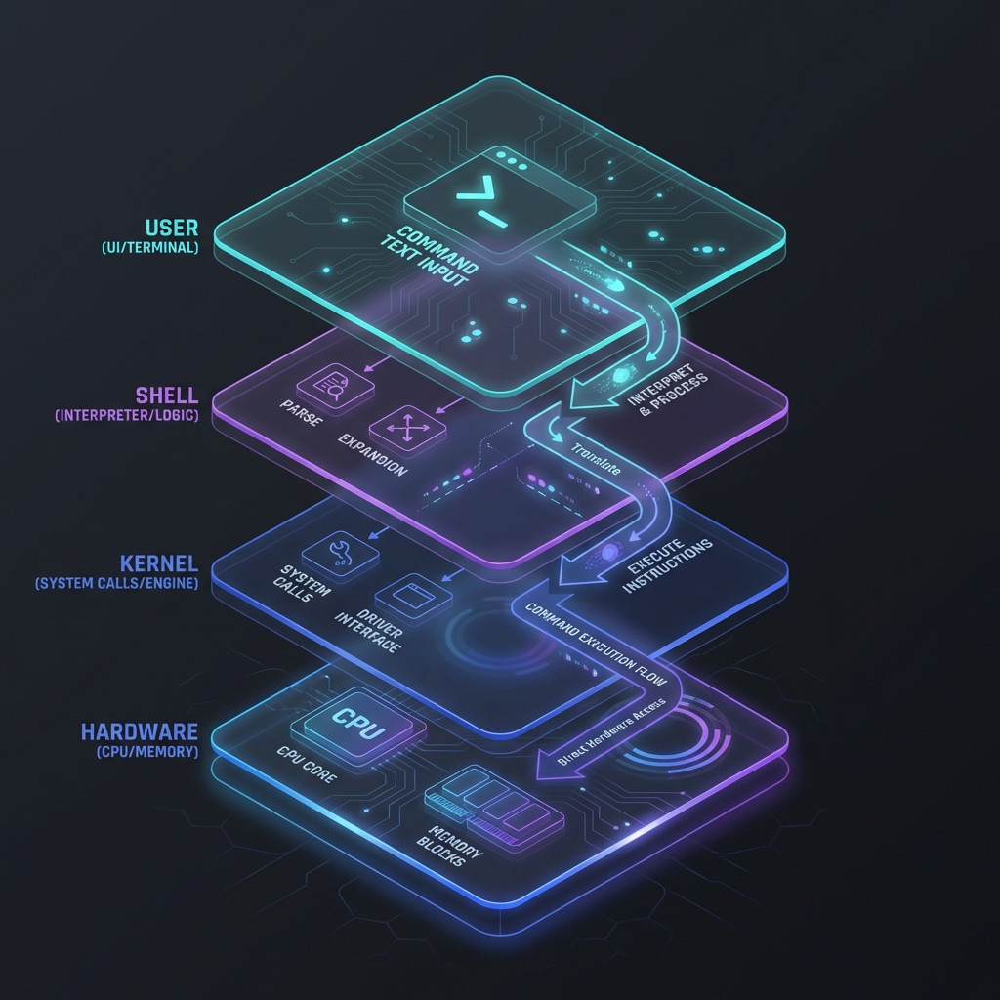

# 🎯 Introduction to Shell Scripting

> **"The shell is the command interpreter in Linux. It is the protective 'shell' around the Operating System Kernel, translating human commands into machine action."**

## 📚 Overview
Shell scripting is the primary medium of communication for DevOps engineers. It is not just about "running commands"; it is about **Orchestration**. A shell script is a text file containing a sequence of commands that are executed by a shell interpreter. 

While tools like Terraform, Ansible, and Kubernetes have abstracted many tasks, they all eventually rely on the shell to perform local execution, environment setup, and system-level checks. Mastering the shell is the difference between an engineer who "uses tools" and an engineer who "builds systems."

## 🎓 Learning Objectives
By the end of this module, you will:
- ✅ Understand the **Layered Architecture** (User → Shell → Kernel → Hardware).
- ✅ Differentiate between the three industry-standard shells: **Bash, Sh, and Zsh**.
- ✅ Master the **Interpreter Logic** and the **Shebang** (`#!`) mechanic.
- ✅ Write and execute your first cross-platform automation script.
- ✅ Strategically decide when to use Shell vs. high-level languages like Python.

---

## 🏗️ Architecture: The Hierarchy of Power
To understand scripting, you must understand how a command travels through your computer.

1.  **User Layer**: The human provides a string of text (e.g., `mkdir logs`).
2.  **Shell Layer (The Interpreter)**: The shell parses the text, expands variables, checks syntax, and looks for the binary.
3.  **Kernel Layer (The Brain)**: The shell makes a **System Call** to the Kernel. The Kernel manages CPU time and Memory for the process.
4.  **Hardware Layer**: The CPU creates the directory on the physical storage device.

### The Trio of Industrial Shells
| Shell | Full Name | Industry Role |
| :--- | :--- | :--- |
| **Bash** | Bourne Again Shell | The universal standard. Default on almost every Linux server (Ubuntu, CentOS, etc.). |
| **Sh** | Bourne Shell | The legacy foundation. Used for extreme portability and tiny Alpine Linux containers. |
| **Zsh** | Z Shell | The developer's choice. Modern default for macOS and feature-rich for interactive use. |

---

## 🛠️ The Shebang Mechanic: `#!/bin/bash`
The first line of your script is a "Magic Number" instruction for the Linux kernel.

- **What it does**: When you execute `./myscript.sh`, the kernel reads the first two bytes (`#!`). If it sees these characters, it knows the rest of the file should be passed to the path specified (e.g., `/bin/bash`).
- **Standard vs. Portable**:
    *   `#!/bin/bash`: Standard, assumes bash is in the root bin directory.
    *   `#!/usr/bin/env bash`: **Professional Pattern**. Uses the user's environment to find the bash binary, making scripts more portable across different Linux distributions and macOS.

---

## 🚀 Why Shell Scripting in a Cloud World?

### 1. Zero Dependencies
Unlike Python or Go, which require runtimes or compiled binaries, Bash is **already there**. Every server you spin up in AWS, Azure, or GCP is ready to execute your shell scripts the second it boots.

### 2. The "Glue" Logic
Nothing is faster at connecting different binaries. If you need to:
1.  Fetch a secret from Vault.
2.  Inject it into a Docker environment variable.
3.  Trigger a Terraform apply.
...Bash can do this in three lines of code.

### 3. "Cloud-Init" & User Data
When you launch 1,000 servers at once, you use "User Data" scripts. These are overwhelmingly written in Shell to handle the initial boot-strap of the machine.

---

## 🏆 Real-World DevOps Story: The Sub-Second Audit

**The Scenario**: A security incident occurred. An engineer needed to check the running processes of 200 servers for a specific malicious signature. Using a manual GUI tool would have taken hours.
**The Fix**:
They wrote a 4-line script that used an SSH loop and `grep`. In less than **60 seconds**, the script audited the entire fleet, identified the 3 infected servers, and automatically quarantined them by rotating their security groups.
**The Lesson**: In a crisis, the shell is your fastest weapon.

---

## ❓ Interview Preparation (Introduction)

1. **Q: What is a "Shebang" and why is it required?**
   *A: It is the `#!` sequence at the start of a script. It tells the Kernel which interpreter binary should be used to execute the code within the file.*

2. **Q: When would you use a Shell script instead of Python?**
   *A: I use Shell for tasks that primarily involve wrapping system commands, file manipulation, or when I need to ensure a script runs with zero external dependencies. I switch to Python for complex data processing or advanced API integrations.*

3. **Q: What is the difference between `sh` and `bash`?**
   *A: `sh` is the original Bourne Shell and follows strict POSIX standards for portability. `bash` is an improved version (Bourne Again Shell) that includes advanced features like arrays, improved arithmetic, and better string handling.*

4. **Q: Is the `.sh` file extension mandatory in Linux?**
   *A: No. Linux determines how to run a file based on its **Execute Permission** and the **Shebang** line. The extension is purely for human organization and IDE syntax highlighting.*

5. **Q: What does `#!/usr/bin/env bash` provide over `#!/bin/bash`?**
   *A: Portability. Some systems might have bash in `/usr/local/bin/bash`. Using `/usr/bin/env` asks the system to find the first 'bash' in the user's `$PATH`, ensuring the script works on more environments.*

---

## 📝 Knowledge Check

1. **Which layer is responsible for managing the actual CPU and RAM?**
   - [ ] a) Shell
   - [x] b) Kernel
   - [ ] c) UI/Terminal

2. **What is the outcome of running a script with no Shebang?**
   - [ ] a) The computer crashes
   - [x] b) The script is executed by the user's *current* active shell
   - [ ] c) The script is automatically converted to Python

3. **Which command grants a script the power to be executed directly as `./script.sh`?**
   - [ ] a) `cat script.sh`
   - [ ] b) `ls -l`
   - [x] c) `chmod +x`

4. **True or False: Shell scripting is an interpreted language, not a compiled one.**
   - [x] a) True
   - [ ] b) False

5. **Which shell is the modern default for macOS Terminal?**
   - [ ] a) Bash
   - [ ] b) Sh
   - [x] c) Zsh

---

## 🔗 Next Steps

Ready to move into the cockpit?

Proceed to: **[Terminal Navigation](../02-Terminal-and-Finder/README.md)** →
