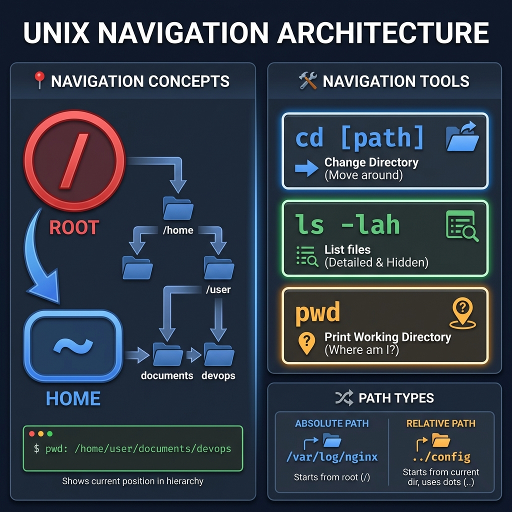

# 📍 Terminal Navigation: The DevOps GPS

> **"You can't automate where you haven't been. Mastering navigation is the first step to controlling the machine."**



## 📚 Overview

The terminal is your headquarters. Unlike the mouse-driven "Finder" or "File Explorer," the terminal is a precise, text-based interface for the Unix filesystem. In DevOps, you don't navigate by clicking folders; you navigate by understanding the **Filesystem Hierarchy Standard (FHS)**.

This module covers the essential "GPS" commands and architectural concepts required to move safely and efficiently across local clusters and remote production servers.

## 🎓 Learning Objectives

By the end of this module, you will:
- ✅ Understand the **Filesystem Hierarchy Standard (FHS)** and where files "live."
- ✅ Master the **Primary Navigation Trio**: `cd`, `ls`, and `pwd`.
- ✅ Navigate using **Absolute** vs. **Relative** paths with zero errors.
- ✅ Implement **Stack-based Navigation** using `pushd` and `popd`.
- ✅ Utilize **Terminal Speed Hacks** (Tab completion, history, and shortcuts).

---

## 🏗️ The Filesystem Hierarchy Standard (FHS)
In Linux, every file has a designated home. Understanding this map is critical for automation.

| Directory  | Purpose                  | DevOps Context                                    |
| :--------- | :----------------------- | :------------------------------------------------ |
| `/bin`     | Essential Binary apps    | `ls`, `cp`, `mv` live here.                       |
| `/etc`     | System Configurations    | Where `nginx.conf` or `cni` settings live.        |
| `/var/log` | Variable Data (Logs)     | The first place you go when a service fails.      |
| `/home`    | User Directories         | Personal scripts and SSH keys.                    |
| `/opt`     | Optional/Add-on software | Where manual installs (like some DBs) are stored. |
| `/tmp`     | Temporary files          | Wiped on reboot; used for interim script data.    |

---

## 🚀 Professional Patterns for Automation

### Pattern A: Absolute vs. Relative Mastery
- **Absolute (`/`)**: Starts from the Root. Used in scripts to ensure a path is valid regardless of where the script is executed.
  *   *Example*: `/var/lib/docker/volumes/`
- **Relative (Current)**: Relative to where you are standing.
  *   `.` (Current): `chmod +x ./setup.sh`
  *   `..` (Parent): `cd ../configs/`

### Pattern B: Stack Navigation (`pushd` / `popd`)
When a script needs to jump to a directory to perform a task and then **immediately return**, don't use `cd`. Use the stack.
- `pushd /var/log`: Saves current location and jumps to logs.
- `popd`: Jumps back to exactly where you were.

### Pattern C: The "Prev" Shortcut
Need to toggle between two deeply nested directories? Use `cd -`.
```bash
cd /very/long/path/to/project/a
cd /another/very/long/path/to/project/b
cd -  # Jumps back to project A
cd -  # Jumps back to project B
```

---

## 🏆 Real-World DevOps Story: The Lost Root Deletion

**The Scenario**: An engineer meant to delete a `tmp` folder inside their local project to clean up build artifacts. They typed `rm -rf /tmp/`.
**The Discovery**: Because they started the path with a `/`, they told the system to delete the **Global System Root /tmp** folder instead of the one in their local project. This caused several running services to crash as their temporary sockets and lock files vanished.
**The Lesson**: Always use relative paths starting with `./` (e.g., `rm -rf ./tmp/`) for local project work to prevent accidental system-wide damage.

---

## ❓ Interview Preparation (Navigation)

1. **Q: What is the difference between `/` and `~`?**
   *A: `/` represents the System Root (the very top of the hierarchy). `~` represents the current user's Home directory (e.g., `/home/ubuntu` or `/Users/Ganil`).*

2. **Q: How do you jump back to the previous directory you were in?**
   *A: Use the `cd -` command. It toggles your working directory to the value stored in the `$OLDPWD` environment variable.*

3. **Q: Why is it safer to use absolute paths in automation scripts?**
   *A: Automation scripts (like Cron jobs or CI/CD runners) may execute from unpredictable locations. Absolute paths ensure the script targets the exact intended file every time.*

4. **Q: What does the command `pwd -P` do?**
   *A: It prints the physical directory. If you are in a directory that is actually a **Symbolic Link**, `pwd -P` will resolve the link and show the real physical path on the disk.*

5. **Q: How do you see all files, including hidden ones, in a long-list format?**
   *A: Use `ls -al`. The `-a` flag shows all (including dots) and `-l` provides the long-list detail (permissions, size, owner).*

---

## 📝 Knowledge Check

1. **Which directory usually contains the system-wide configuration files?**
   - [ ] a) `/var`
   - [x] b) `/etc`
   - [ ] c) `/bin`

2. **What happens if you type `cd` with no arguments?**
   - [ ] a) It prints an error
   - [ ] b) It goes to the Root (`/`)
   - [x] c) It returns you to your Home directory (`~`)

3. **How do you move up TWO levels in the filesystem?**
   - [ ] a) `cd ...`
   - [x] b) `cd ../..`
   - [ ] c) `cd --`

4. **True or False: `pushd` and `popd` allow you to manage a history of visited directories.**
   - [x] a) True
   - [ ] b) False

5. **Which keyboard shortcut instantly clears your terminal screen?**
   - [ ] a) `Ctrl + C`
   - [x] b) `Ctrl + L`
   - [ ] c) `Ctrl + Z`

---

## 🔗 Next Steps

Now that you can move through the system, let's learn how to manipulate the files you find!

Proceed to: **[Basic File Manipulation](../03-Basic-File-Manipulation/README.md)** →
