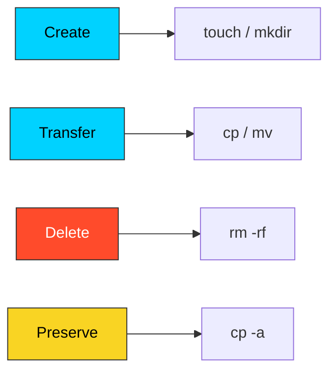

# 📁 Basic File Manipulation: The DevOps Foundation

> **"Files are the atomic unit of infrastructure. Master them, or they will master you."**



## 📚 Overview
Every automation script, CI/CD pipeline, and server configuration revolves around file lifecycle management. Whether you are creating a log directory, cloning an SSH key, or rotating backups, you are performing **File Manipulation**. In DevOps, we don't just "move files"—we orchestrate data state.

This module covers the core CRUD (Create, Read, Update, Delete) operations of the filesystem, focusing on performance, safety, and atomicity.

## 🎓 Learning Objectives
By the end of this module, you will:
- ✅ **Architect Directories** using nested parental flags (`mkdir -p`).
- ✅ Master the **Inode Logic** of moving vs. copying files.
- ✅ Utilize **Archive Mode** (`cp -a`) to preserve system metadata.
- ✅ Implement **Atomic Renaming** for zero-downtime configuration swaps.
- ✅ Apply **Defensive File Guards** to prevent accidental data loss.

---

## 🏗️ Command Architecture: Data State Management

### 1. Creation & Time-Stamping (`touch` & `mkdir`)
- **`touch`**: Frequently misunderstood as just a "file creator." In reality, its primary role is updating **Access (atime)** and **Modification (mtime)** timestamps. This is vital for trigger-based automation like `make` or backup syncs.
- **`mkdir -p`**: The "Safe Create." The `-p` (Parents) flag ensures that the command doesn't error if the directory exists and creates any missing parent folders in the path dynamically.

### 2. The Inode Mystery: `cp -a` vs. `mv`
In Unix, every file is an "Inode" (Index Node).
- **`mv` (Move/Rename)**: Within the same partition, `mv` is **Atomic**. It simply points a new name to an existing Inode. It is instantaneous, regardless of file size (1KB or 1TB).
- **`cp` (Copy)**: Creates a new Inode and physically duplicates the data blocks. 
- **The Pro Flag: `cp -a`**: Unlike `cp -r`, the **Archive** flag (`-a`) preserves permissions, ownership, and timestamps. This is the industrial standard for cloning environments.

### 3. Bulk Operations with Brace Expansion
Professional engineers don't run 10 commands. They run one.
```bash
# Create a skeleton for a new microservice
mkdir -p project/{src,bin,logs,config}
touch project/src/main.py project/config/settings.{yaml,json}
```

---

## 🚀 Professional Patterns for Automation

### Pattern A: The Atomic Config Swap
When updating a production config, never overwrite the live file directly. If the copy fails halfway, the service crashes.
```bash
# Copy new config to a temporary spot
cp new_config.yaml config.yaml.tmp

# Atomically swap the pointer (Zero-downtime)
mv config.yaml.tmp config.yaml
```

### Pattern B: The Defensive Guard
Always check for a file's existence before performing an operation that depends on it.
```bash
# Guard Clause: Create file ONLY if it doesn't exist
[[ -f ".env" ]] || touch ".env"

# Ensure log directory is ready
[[ -d "/var/log/app" ]] || sudo mkdir -p "/var/log/app"
```

### Pattern C: The Recursive Shield
By default, `rm` is silent. When writing scripts that delete data, use variables carefully.
```bash
# BAD: rm -rf $TARGET_DIR/ (If $TARGET_DIR is empty, it tries to delete /!)
# GOOD: 
if [[ -n "$TARGET_DIR" ]]; then
    rm -rf "${TARGET_DIR:?}/"
fi
```

---

## 🏆 Real-World DevOps Story: The Space-Separated Disaster

**The Scenario**: An engineer was cleaning up an old project and meant to run `rm -rf tmp/`. In a rush, they accidentally typed `rm -rf / tmp/`.
**The Discovery**: Note the space after the first slash. The shell interpreted this as two separate targets: the first being the **System Root (/)**. The system immediately began deleting everything from the kernel to the user's home folder.
**The Fix**: Use the `${VAR:?}` syntax in scripts. This tells the shell: "Error out if this variable is null or unset," preventing a null variable from becoming a "delete root" command.

---

## ❓ Interview Preparation (File Manipulation)

1. **Q: Why is `mv` faster than `cp` for large files on the same disk?**
   *A: Because `mv` only changes the directory entry to point to the existing data on the disk (Inode), whereas `cp` must read and write every bit of data to a new location.*

2. **Q: What is the difference between `cp -r` and `cp -a`?**
   *A: `-r` is for recursive copying. `-a` (Archive) includes recursive copying but also preserves symbols, permissions, ownership, and timestamps, which is critical for configuration management.*

3. **Q: How do you create 100 files named `test_1.txt` to `test_100.txt` in one command?**
   *A: Using brace expansion: `touch test_{1..100}.txt`.*

4. **Q: What does the `-p` flag do for `mkdir`?**
   *A: It prevents an error if the directory already exists and creates any missing parent directories in the specified path.*

5. **Q: How can you move all files ending in `.log` to a folder named `backup`?**
   *A: `mv *.log backup/`. This uses shell globbing to expand all matching files.*

---

## 📝 Knowledge Check

1. **Which command is used to update the timestamp of an existing file?**
   - [ ] a) `mkdir`
   - [x] b) `touch`
   - [ ] c) `mv`

2. **What is the safest way to delete a directory and all of its contents?**
   - [ ] a) `rm -p`
   - [ ] b) `rm -f`
   - [x] c) `rm -rf`

3. **In the command `mv old.txt new.txt`, what happens to `old.txt`?**
   - [ ] a) It is copied and kept
   - [x] b) It is renamed/repointed, and the original name disappears
   - [ ] c) It is moved to /tmp

4. **Which flag preserves file permissions during a copy?**
   - [x] a) `-p` (as part of `-a`)
   - [ ] b) `-r`
   - [ ] c) `-v`

5. **Is it possible to create nested folders `app/logs/auth` if `app` doesn't exist?**
   - [ ] a) No, you must create `app` first
   - [x] b) Yes, using `mkdir -p app/logs/auth`
   - [ ] c) Yes, using `touch -p`

---

## 🔗 Next Steps

Now that you can build the structure, let's learn how some files hide in plain sight!

Proceed to: **[Hidden Files](../04-Hidden-Files/README.md)** →
