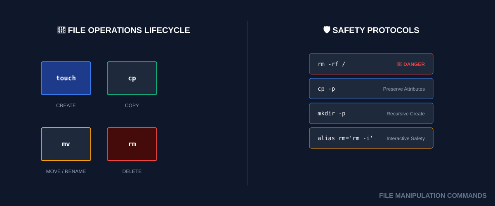

# 📁 Basic File Manipulation (The DevOps Foundation)
> **"Files are the atomic unit of infrastructure. Master them, or they will master you."**

## 📚 Overview
Every automation script, CI/CD pipeline, and server configuration revolves around files. Whether you are creating a log directory, copying an SSH key, or rotating old backups, you are performing **File Manipulation**. This module covers the basic commands (`touch`, `mkdir`, `cp`, `mv`, `rm`) that form the foundation of every DevOps operation.
## 🎓 Learning Objectives
By the end of this module, you will:
- ✅ Create files (`touch`) and directories (`mkdir`) with precision.
- ✅ Understand the difference between **Moving** (`mv`) and **Copying** (`cp`).
- ✅ Master the **Recursive** flag (`-r`) for bulk operations.
- ✅ Implement **Safety Best Practices** to avoid accidental data loss.
- ✅ Use **Renaming** as part of the move operation.
---
## 🏗️ Command Architecture: CRUD for Files
### 1. Create (touch & mkdir)
- **`touch`**: Updates timestamps or creates an empty file.
- **`mkdir -p`**: The `-p` (parents) flag creates the entire folder structure at once (e.g., `mkdir -p /app/logs/auth`).
### 2. Copy & Move (cp & mv)
- **`cp -r`**: Recursive copy. Essential for copying entire folders.
- **`cp -p`**: Preserve modes and timestamps.
- **`mv`**: Moves data OR renames it. In Linux, renaming is just moving a file to a new name in the same spot.
### 3. Delete (rm)
- **`rm -f`**: Force delete. Use with extreme caution.
- **`rm -rf`**: Recursive force delete. The "Nuke" option for directories.
---
## 🚀 Practical Examples for Automation
### Example A: The Folder Sentry
Ensuring a log directory exists before a script starts logging.
```bash
# -p ensures it won't error if the folder already exists
mkdir -p /var/log/my-automation/
```
### Example B: Rotating a Config
Renaming a current config to a backup before deploying a new one.
```bash
mv config.yaml config.yaml.bak
cp new_config.yaml config.yaml
```
---
## 📑 File Manipulation Cheat Sheet
| Task | Command | Standard Flags |
|------|---------|----------------|
| **Create File** | `touch <name>` | - |
| **Create Dir** | `mkdir <name>` | `-p` (create parents) |
| **Copy** | `cp <src> <dest>`| `-r` (recursive), `-p` (preserve) |
| **Move/Rename** | `mv <src> <dest>`| - |
| **Delete File** | `rm <name>` | `-f` (force) |
| **Delete Dir** | `rm -rf <dir>` | `-r` (recursive) |
---
## 🏆 Real-World DevOps Story
### 💡 **The Recursive Nightmare**
**The Scenario**: An engineer was cleaning up a project folder and meant to run `rm -rf tmp/`. Instead, they typed `rm -rf / tmp/`.
**The Discovery**:
Notice the space after the first slash. The shell interpreted this as two separate targets:
1. `/` (The entire root filesystem)
2. `tmp/` (The local folder)
**The Result**: The system immediately began deleting every file on the hard drive starting from the root.
**The Fix**: Always use relative paths (`./tmp`) and never use `rm -rf` with variables unless you validate them first!
---
## 📝 Knowledge Check
1. **Which flag allows `mkdir` to create parent directories automatically?**
   - [ ] a) `-r`
   - [x] b) `-p`
   - [ ] c) `-f`
2. **What command is used to rename a file?**
   - [x] a) `mv`
   - [ ] b) `rn`
   - [ ] c) `cp`
3. **True or False: `rm -rf` asks for your permission before deleting files.**
   - [ ] a) True
   - [x] b) False (The `-f` stands for 'Force')
**Answers**: 1-b, 2-a, 3-b
## 🔗 Next Steps
Continue to: **[Hidden Files](../04-Hidden-Files/README.md)** →
