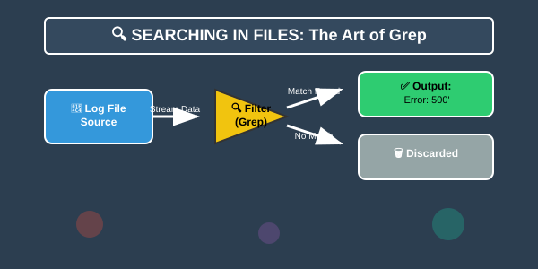

# 🔍 Searching in Files (Grep Mastery)
> **"Finding a needle in a haystack is easy... if you have a magnet."**


## 📚 Overview
In DevOps, you spend 80% of your time reading logs, debugging errors, and searching configuration files. `grep` (Global Regular Expression Print) is the ultimate tool for this. It allows you to find specific text patterns across thousands of files instantly. Mastering grep is the difference between an engineer who spends 2 hours searching for an error and one who finds it in 2 seconds.
## 🎓 Learning Objectives
By the end of this module, you will:
- ✅ Master the `grep` command syntax and essential flags (`-i`, `-r`, `-n`, `-v`).
- ✅ Understand **Context Searching** (`-A`, `-B`, `-C`) to see the "why" behind an error.
- ✅ Use **Regular Expressions (Regex)** for powerful pattern matching.
- ✅ Filter results (Invert match, counting, and filename extraction).
- ✅ Understand the performance hierarchy: `grep` vs `ripgrep` (`rg`).
---
## 🏗️ Search Architecture: The Grep Engine
`grep` acts as a stream filter. It reads data line-by-line, checks it against your pattern in the regex engine, and decides whether to pass it to `stdout` or discard it.
### The Power Choice: Grep vs. RipGrep
| Tool | Speed | Use Case |
|------|-------|----------|
| **grep** | ⚡ Fast | Standard in pipelines, installed on every server. |
| **rg** (ripgrep) | 🚀 Insane | The modern choice for searching massive monorepos. |

---
## 🛠️ Performance Searching & Context
### 1. The Day-to-Day Flags
- `-i`: Case-insensitive (Find "Error", "error", and "ERROR").
- `-r`: Recursive (Search through all subfolders).
- `-v`: Invert match (Show everything EXCEPT lines matching the pattern).
- `-l`: List files (Show only the filenames containing the match).
### 2. Contextual Debugging
Finding an error is useless if you don't know what happened *before* it.
- **`-A 5`**: Show 5 lines **After** (Useful for stack traces).
- **`-B 5`**: Show 5 lines **Before** (Useful for finding the initiating request).
---
## 🚀 Practical Examples for Automation
### Example A: The Error Watcher
Extracting specific errors from a log while ignoring noisy "Information" messages.
```bash
grep -iE "error|critical" /var/log/syslog | grep -v "ignored"
```
### Example B: Security Audit
Searching for hardcoded AWS Access Keys in a repository.
```bash
grep -rE "AKIA[0-9A-Z]{16}" .
```
---
## 📑 The Grep Cheat Sheet
| Flag | Meaning | Example |
|------|---------|---------|
| `-i` | Ignore Case | `grep -i "fail" log` |
| `-r` | Recursive | `grep -r "api" ./src` |
| `-v` | Invert | `grep -v "success" build` |
| `-n` | Line Number | `grep -n "TODO" script.sh` |
| `-E` | Extended Regex| `grep -E "a|b" file` |
| `-A n`| After context | `grep -A 2 "err" log` |
| `-B n`| Before context| `grep -B 2 "err" log` |
---
## 🏆 Real-World DevOps Story
### 💡 **The API Key Leak**
**The Scenario**: A company was billed $50,000 for AWS usage overnight. Someone had committed an Access Key to a public GitHub repository. They needed to find *every* instance of that key pattern in their 10GB codebase immediately.
**The Fix**:
Standard `grep` took 5 minutes. Using `rg` (RipGrep), they scanned the entire 10GB repo in 4 seconds. They found two other forgotten keys in a `.env.backup` file that was supposed to be hidden.
**Lesson**: Tools like `grep` are for scripts; precision tools like `rg` are for emergency forensic audits.
---
## 📝 Knowledge Check
1. **Which flag shows lines that do NOT match the pattern?**
   - [ ] a) `-i`
   - [x] b) `-v`
   - [ ] c) `-n`
2. **What does `grep -A 3 "Error"` do?**
   - [ ] a) Shows the first 3 errors
   - [x] b) Shows the error and 3 lines after it
   - [ ] c) Searches 3 files
3. **How do you search for multiple patterns (OR logic)?**
   - [ ] a) `grep "a" "b"`
   - [x] b) `grep -E "a|b"`
   - [ ] c) `grep -m "a,b"`
**Answers**: 1-b, 2-b, 3-b
## 🔗 Next Steps
Continue to: **[Paging Files](../06-Paging-Files/README.md)** →
