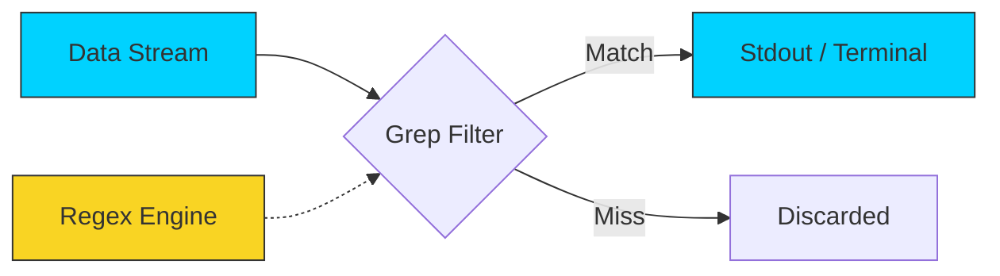

# 🔍 Searching in Files: Grep Mastery

> **"Finding a needle in a haystack is easy... if you have a magnet. Grep is that magnet."**



## 📚 Overview
In DevOps, you spend 80% of your time reading logs, debugging errors, and searching configuration files. **`grep` (Global Regular Expression Print)** is the industry-standard tool for this. It allows you to find specific text patterns across thousands of files instantly. 

Mastering `grep` is the difference between an engineer who spends 2 hours searching for an error and one who finds it in 2 seconds. In this module, we move beyond basic string matching into high-performance pattern recognition.

## 🎓 Learning Objectives
By the end of this module, you will:
- ✅ Master the **Triple-Context Flags**: `-A`, `-B`, and `-C`.
- ✅ Understand the **Regex Partition**: BRE vs. ERE (`-E`) vs. PCRE (`-P`).
- ✅ Construct complex **Exclusion Filters** using `-v` and `--exclude-dir`.
- ✅ Perform **Forensic Audits** to identify security leaks (Keys, IPs).
- ✅ Differentiate between the performance of **`grep`**, **`ack`**, and **`ripgrep` (`rg`)**.

---

## 🏗️ Search Architecture: The Grep Engine

### 1. The Regex Hierarchy
Bash `grep` supports three distinct "flavors" of pattern matching:
- **BRE (Basic Regular Expressions)**: The default. Requires escaping special characters like `+`, `?`, `{`. 
- **ERE (Extended Regular Expressions) `-E`**: Allows modern syntax like `|` (OR) without escaping. This is the **Professional Default**.
- **PCRE (Perl-Compatible) `-P`**: The most powerful. Supports lookaheads and backreferences. Used for complex log parsing.

### 2. The Contextual Debugger (Seeing the "Why")
Finding an error line is useless if you don't know what caused it. 
- **`-A 5` (After)**: Shows the stack trace following an error.
- **`-B 5` (Before)**: Shows the user request or event that triggered the error.
- **`-C 5` (Context)**: Shows both, providing a full narrative of the event.

### 3. High-Performance Tools
| Tool | Speed | Use Case |
| :--- | :--- | :--- |
| **`grep`** | ⚡ Fast | The universal standard found on every server. |
| **`ripgrep` (`rg`)**| 🚀 Insane | The modern choice for searching massive monorepos and multi-gigabyte logs. |

---

## 🚀 Professional Patterns for Automation

### Pattern A: The "Noise Silencer" (Chained Grep)
When logs are "noisy," use `grep -v` to progressively filter out the information you don't need until only the error remains.
```bash
# Filter logs: Find errors, ignore 'Info' and 'Heartbeat' messages
tail -f /var/log/app.log | grep "ERROR" | grep -v "ignored" | grep -v "heartbeat"
```

### Pattern B: The Recursive Security Audit
Searching a Git repository for hardcoded AWS Access Keys or Secrets while ignoring the `.git` directory to save time.
```bash
# Recursive, case-insensitive, filename only, exclude git
grep -ril "AKIA" . --exclude-dir=.git
```

### Pattern C: The IP Extraction (Regex)
Using Extended Regex to find all IP addresses in a firewall log for blocking.
```bash
# Match IP pattern: 1-3 digits followed by a dot, repeated 3 times
grep -oE "[0-9]{1,3}\.[0-9]{1,3}\.[0-9]{1,3}\.[0-9]{1,3}" access.log
```

---

## 🏆 Real-World DevOps Story: The $50,000 Typo

**The Scenario**: A company was billed $50,000 for AWS usage overnight. A junior engineer had committed a testing `.env` file containing an Access Key to a public repository. 
**The Discovery**: They needed to find *every* mention of that key and any others in their 10GB monorepo. Standard `grep` was taking minutes to run across the massive file tree.
**The Fix**: Using `rg` (RipGrep), they scanned the entire 10GB codebase in **3.8 seconds**. They found three other forgotten keys hidden in `.backup` files that had been missed by manual checks.
**The Lesson**: For scripts, `grep` is the universal tool. For emergency forensic investigations, know and use your high-performance alternatives like `ripgrep`.

---

## ❓ Interview Preparation (Searching)

1. **Q: How do you perform a case-insensitive search with `grep`?**
   *A: Use the `-i` flag. For example: `grep -i "error" logfile.log` will match "Error", "ERROR", and "error".*

2. **Q: What is the difference between `grep` and `egrep`?**
   *A: `egrep` is equivalent to `grep -E`. It enables Extended Regular Expressions, allowing you to use control characters like `|`, `+`, and `?` without backslash escapes.*

3. **Q: How do you show 3 lines of context around a match?**
   *A: Use the `-C 3` flag. This will display 3 lines before and 3 lines after each match.*

4. **Q: How do you search for a specific string in all files in the current directory and subdirectories?**
   *A: Use the recursive flag `-r`. Example: `grep -r "pattern" .`.*

5. **Q: How do you find only the count of lines that match a pattern rather than the lines themselves?**
   *A: Use the `-c` flag. Example: `grep -c "error" server.log`.*

---

## 📝 Knowledge Check

1. **Which flag is used to invert the match (show lines that DON'T match)?**
   - [ ] a) `-i`
   - [x] b) `-v`
   - [ ] c) `-n`

2. **What does the command `grep -l` do?**
   - [x] a) Lists only the names of files that contain a match
   - [ ] b) Shows the line numbers
   - [ ] c) Lowercases all output

3. **Which operator in Extended Regex (`-E`) represents 'OR'?**
   - [ ] a) `&`
   - [x] b) `|`
   - [ ] c) `+`

4. **True or False: `grep` can search inside binary files by default.**
   - [ ] a) True
   - [x] b) False (It identifies them as binary and usually skips text output unless `-a` is used)

5. **Which command is used to see the context BEFORE a match?**
   - [ ] a) `-A`
   - [x] b) `-B`
   - [ ] c) `-X`

---

## 🔗 Next Steps

Now that you can find the data, let's learn how to read through massive files without crashing your terminal!

Proceed to: **[Paging Files](../06-Paging-Files/README.md)** →
