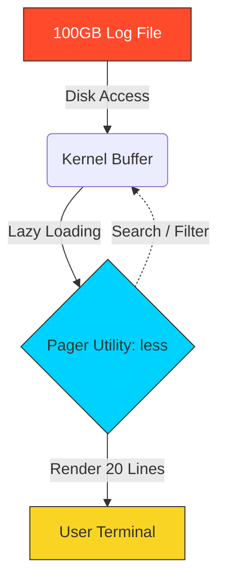

# 📜 Paging Files: Mastering Massive Data

> **"A senior engineer never drinks from the firehose. They use a pager to sip precisely what is needed."**



## 📚 Overview
In DevOps, log files are the "black boxes" of our infrastructure. When an application crashes, it doesn't leave a note; it leaves a trace—sometimes gigabytes in size. Attempting to `cat` or `vim` a 50GB file will lock up your terminal or crash your server by consuming all available RAM.

**Paging Utilities** solve this through **Lazy Loading**. They allow you to navigate massive data streams with surgical precision, constant memory usage, and powerful search capabilities. Mastering these tools is critical for Site Reliability Engineering (SRE) and high-stakes troubleshooting.

## 🎓 Learning Objectives
By the end of this module, you will:
- ✅ Master **Bidirectional Navigation** inside the `less` pager.
- ✅ Implement **Real-Time Monitoring** with `tail -f` and `tail -F`.
- ✅ Understand **Memory-Mapped I/O** (why pagers handle petabytes efficiently).
- ✅ Perform **In-Pager Searching** using forward (`/`) and backward (`?`) logic.
- ✅ Combine pagers with pipes for high-speed output filtering.

---

## 🏗️ Paging Architecture: Lazy Loading Logic

### 1. Why `less` is more
The older tool `more` can only move forward and must load chunks of the file into memory as it goes. `less` is a modern replacement that uses memory mapping:
- **Lazy Loading**: It only reads from the disk the specific bytes required to fill your current terminal screen.
- **Constant Memory**: Whether the file is 1KB or 100TB, `less` uses the same tiny amount of memory.
- **Bidirectional**: Allows scrolling up/down and jumping to specific percentages of the file.

### 2. Slicing with `head` and `tail`
- **`head -n 20`**: Used to inspect the metadata or configuration headers at the top of a file.
- **`tail -n 20`**: Used to jump straight to the most recent events (the "current state" of a log).

---

## 🚀 Professional Patterns for Automation

### Pattern A: The "Rotation-Aware" Follower
Logs on production servers are often "rotated" (the current `app.log` is renamed to `app.log.1` and a new empty `app.log` is created). 
- **The Pitfall**: `tail -f` will stop working because it follows the *file descriptor* (the old renamed file). 
- **The Pro Fix**: `tail -F`. The capital `-F` follows the *filename*. It if the file is deleted and recreated, it will automatically pick up the new stream.

### Pattern B: The Buffered Live Filter
When monitoring a live log for errors, the shell often "buffers" the output, causing a delay. Use `--line-buffered` to see matches instantly.
```bash
# Watch for errors in real-time with zero delay in the pipes
tail -f /var/log/syslog | grep --line-buffered "ERROR" | tee error_audit.log
```

### Pattern C: Jumps and Markers in `less`
Inside a `less` session, you can create "bookmarks" to jump back to important lines.
- Press `m` followed by any letter (e.g., `ma`).
- Continue searching.
- Press `'` followed by the letter (e.g., `'a`) to jump back instantly to that specific line.

---

## 🏆 Real-World DevOps Story: The 100GB Freeze

**The Scenario**: An intern tried to debug a database crash by running `cat database.log`. The log was 120GB.
**The Discovery**: The terminal attempted to render 120GB of text. The SSH session froze, the server CPU spiked (due to I/O interrupts), and the entire team was locked out of the maintenance window.
**The Fix**: A senior engineer used `less`. By running `less database.log`, only a few kilobytes were read to fill the screen. They pressed `G` (capital G), which tells the kernel to seek to the end of the file descriptor immediately. The actual crash error was found in **300 milliseconds** without stressing the system.

---

## ❓ Interview Preparation (Paging)

1. **Q: How does `less` handle a 10TB file without running out of memory?**
   *A: It uses Lazy Loading. It only reads the specific bytes from the disk that are currently displayed on the terminal screen, rather than loading the entire file into the RAM.*

2. **Q: What is the difference between `tail -f` and `tail -F`?**
   *A: `-f` follows the file descriptor and stops if the file is renamed or replaced. `-F` follows the filename and will continue following if the file is rotated, deleted, or recreated.*

3. **Q: How do you jump to the end of a file while inside `less`?**
   *A: Press the `G` (capital G) key.*

4. **Q: How can you use a pager to read the output of a very long command like `ls -R /`?**
   *A: Pipe the command into `less`: `ls -R / | less`.*

5. **Q: How do you search for a pattern backwards while paging?**
   *A: Use the `?` followed by your keyword (e.g., `?CRITICAL`). Press `n` to find the next match in that same up-ward direction.*

---

## 📝 Knowledge Check

1. **Which command is used to see the FIRST 10 lines of a file?**
   - [ ] a) `tail`
   - [x] b) `head`
   - [ ] c) `cat`

2. **What does the `-f` flag do in `tail -f`?**
   - [ ] a) Fast execution
   - [x] b) Follow the file (continuous output)
   - [ ] c) Force read

3. **How do you exit from a `less` session?**
   - [ ] a) `Ctrl + C`
   - [ ] b) `Esc`
   - [x] c) `q`

4. **Which key is used to jump to the very START of a file in `less`?**
   - [x] a) `g` (lowercase g)
   - [ ] b) `0`
   - [ ] c) `Home`

5. **True or False: `cat` is recommended for files larger than 1GB.**
   - [ ] a) True
   - [x] b) False (It creates significant I/O overhead and can slow down the system)

---

## 🔗 Next Steps

Now that you can navigate massive data, let's learn how to find the manuals for every tool you use!

Proceed to: **[Man Pages](../07-Man-Pages/README.md)** →
