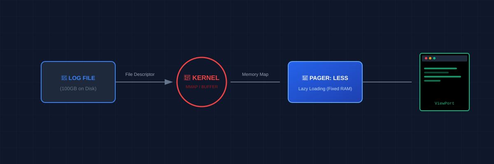

# 📜 Paging Files (Mastering Large Data Streams)
> **"A senior engineer never drinks from the firehose. They use a pager to sip precisely what is needed."**

## 📚 Overview
In DevOps, log files are the "black boxes" of our infrastructure. When an application crashes, it doesn't leave a note; it leaves a 40GB trace. Attempting to `cat` or `nano` such a massive file will lock up your terminal or crash your server. **Paging Utilities** allow you to navigate these data streams with surgical precision, constant memory usage, and powerful search capabilities.
## 🎓 Learning Objectives
By the end of this module, you will:
- ✅ Master **`less`** navigation (The industry-standard pager).
- ✅ Use **`head`** and **`tail`** to inspect file slices.
- ✅ Implement real-time monitoring with **`tail -f`**.
- ✅ Search and filter within a pager session.
- ✅ Understand **Memory-Mapped I/O** (Why pagers never crash).
---
## 🏗️ Paging Architecture: Less vs. More
### 1. The Survival Rule: `less` is more
The older tool `more` can only move forward and must load more of the file into memory as you go. `less` is a modern replacement that:
- Loads only the visible portion of the file (Lazy Loading).
- Allows bidirectional navigation (Up and Down).
- Handles massive files (Petabytes) without lagging.
### 2. Slicing with `head` and `tail`
- **`head -n 20`**: See the configuration header of a file.
- **`tail -n 20`**: See the most recent events in a log.
---
## 🚀 Practical Examples for Automation
### Example A: Live Log Monitoring
The most common task for an SRE is watching a service deploy in real-time.
```bash
# Follow the log as new lines are added
tail -f /var/log/nginx/access.log
# Pro Tip: Use -F if the log file rotates (is deleted and recreated)
tail -F /var/log/app.log
```
### Example B: Peeking at Large Configs
Quickly checking the first few lines of a huge CSV or JSON file.
```bash
head -n 5 massive_data.csv
```
---
## 📑 The Pager Cheat Sheet
| Task | Command / Key |
|------|---------------|
| **Open File** | `less filename` |
| **Page Down** | `Space` / `PageDown` |
| **Page Up** | `b` / `PageUp` |
| **Search Forward**| `/keyword` |
| **Search Backward**| `?keyword` |
| **First Line** | `g` |
| **Last Line** | `G` |
| **Exit** | `q` |
---
## 🏆 Real-World DevOps Story
### 💡 **The 100GB Log Freeze**
**The Scenario**: An intern tried to debug a database crash by using `cat database.log`. The log was 120GB.
**The Discovery**:
The terminal attempted to process 120GB of text. The SSH session froze, the server CPU spiked (due to I/O overhead), and the engineer was locked out of the system.
**The Fix**:
Senior engineers use `less`. By running `less database.log`, the pager only read the first 4KB of data required to fill the screen. They then jumped to the end with `G` to see the actual crash error in milliseconds without stressing the server.
---
## 📝 Knowledge Check
1. **Which command is better for real-time log monitoring?**
   - [ ] a) `head`
   - [x] b) `tail -f`
   - [ ] c) `cat`
2. **True or False: `less` loads the entire file into memory.**
   - [ ] a) True
   - [x] b) False
3. **How do you search for a word while inside `less`?**
   - [x] a) `/`
   - [ ] b) `f`
   - [ ] c) `s`
**Answers**: 1-b, 2-b, 3-a
## 🔗 Next Steps
Continue to: **[Man Pages](../07-Man-Pages/README.md)** →
