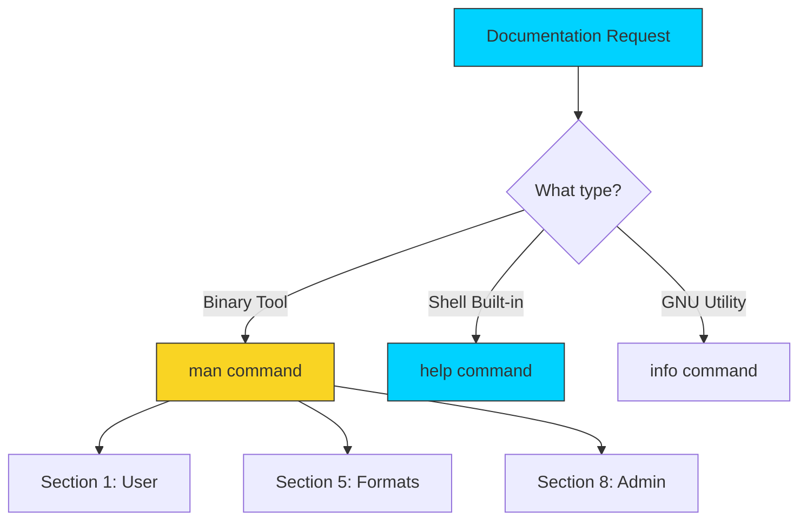

# 📖 Man Pages: The Definitive System Source

> **"Give a person a fish, you feed them for a day. Teach them to use `man`, and they solve their own infrastructure problems forever."**



## 📚 Overview
The name is short for **Manual**. Before Google and Stack Overflow, there were Man pages. They are the definitive, offline documentation for every command on your system. 

Unlike online tutorials which might be outdated or tailored to a specific OS version, `man` pages exactly match the version of the software installed on **your** machine. For a DevOps engineer, the local manual is the "Source of Truth" when shell scripts behave differently across Ubuntu, RHEL, or macOS.

## 🎓 Learning Objectives
By the end of this module, you will:
- ✅ **Decode the SYNOPSIS**: Understand optional vs. required flag notation.
- ✅ Master the **Sectional Hierarchy** (1, 5, and 8).
- ✅ Conduct **Heuristic Searches** using `apropos` and `whatis`.
- ✅ Differentiate between **`man`**, **`info`**, and **`help`**.
- ✅ Navigate the manual using **Vim-style shortcuts**.

---

## 🏗️ Manual Architecture: The 8 Core Sections
Linux organizes information into sections to avoid name collisions. For example, `printf(1)` is the shell command, while `printf(3)` is the C programming function.

| Section | Topic | DevOps Relevance |
| :--- | :--- | :--- |
| **Section 1** | **User Commands** | Your daily binaries: `ls`, `ssh`, `curl`, `jq`. |
| **Section 5** | **File Formats** | Structure of config files like `/etc/passwd` or `crontab`. |
| **Section 8** | **System Admin** | Privileged tools: `iptables`, `visudo`, `systemctl`. |

### SYNOPSIS Decoding (The Rules of Engagement)
In the manual, flags and arguments follow a strict logical notation:
- **`[ ]` (Brackets)**: **Optional**. If you see `ls [-a]`, the command works without it.
- **`< >` (Angled)**: **Required**. You must provide a value here.
- **`|` (Pipe)**: **OR**. You must choose one option or the other.
- **`...` (Ellipsis)**: **Repeatable**. You can list multiple files or directories.

---

## 🚀 Professional Help Patterns

### Pattern A: The One-Line Scout (`whatis`)
When you see a command you don't recognize in a script, don't read the whole manual yet. Get a 5-second summary.
```bash
# Quick definition of a complex tool
whatis xargs
# Output: xargs (1) - build and execute command lines from standard input
```

### Pattern B: The Keyword Detective (`apropos`)
"How do I change the system time?" Use `apropos` to search the one-line descriptions of every tool on the system for a keyword.
```bash
# Search for all tools related to time management
apropos time
```

### Pattern C: Customizing your Pager
By default, `man` uses the `less` pager. You can customize the styling or search behavior by setting the `MANPAGER` environment variable in your `.bashrc`.
```bash
# Example: Use 'most' for color-coded man pages (if installed)
export MANPAGER="less -R --use-color -Dd+r -Du+b"
```

---

## 🏆 Real-World DevOps Case Study: The Flag Version Trap

**The Scenario**: A junior engineer was trying to use a tool called `yq`. All online tutorials showed a `--indent` flag for formatting output. However, whenever they ran the script on the production server, they received: `Error: unknown flag: --indent`.
**The Investigation**: They ran `man yq` on the server and searched for the string `indent`. They discovered the version installed on the server was two years old and used the flag `-i` instead of the long-form `--indent`.
**The Lesson**: Documentation on the web reflects the *latest* version. The `man` page reflects the *current* version. Always trust the local manual for environment-specific consistency.

---

## ❓ Interview Preparation (Manuals)

1. **Q: How do you search for a specific keyword in all man pages?**
   *A: Use the `apropos` command or `man -k`. This searches the short descriptions of all man pages for the specified keyword.*

2. **Q: Why are there multiple sections in the Linux manual?**
   *A: To handle name collisions. For example, `crontab(1)` describes the command to edit your schedule, while `crontab(5)` describes the layout and syntax of the crontab file itself.*

3. **Q: How do you access the manual for a file format instead of a command?**
   *A: Specify the section number. For example, `man 5 crontab` or `man 5 exports`.*

4. **Q: What is the difference between `man` and `help`?**
   *A: `man` is used for external binary programs located in `/bin` or `/usr/bin`. `help` is used for shell "built-ins" which are part of the bash binary itself (like `cd`, `alias`, and `echo`).*

5. **Q: How do you find where a man page's underlying file is located on the disk?**
   *A: Use the `-w` flag. Example: `man -w ls` will return the path to the compressed manual file.*

---

## 📝 Knowledge Check

1. **Which command provides help for shell built-ins like `cd` or `alias`?**
   - [ ] a) `man`
   - [x] b) `help`
   - [ ] c) `info`

2. **What does the SYNOPSIS notation `[ -f ]` tell you about the flag?**
   - [x] a) It is optional
   - [ ] b) It is required
   - [ ] c) It must be used with a file

3. **Which section of the manual contains System Administration tools (root level)?**
   - [ ] a) Section 1
   - [ ] b) Section 5
   - [x] c) Section 8

4. **True or False: The `whatis` command provides a full multi-page tutorial of a command.**
   - [ ] a) True
   - [x] b) False (It provides only a one-line summary)

5. **How do you search for a text string while inside a man page?**
   - [ ] a) `Ctrl + F`
   - [ ] b) `f`
   - [x] c) `/`

---

## 🔗 Next Steps

Now that you can find the manual for any tool, let's learn how to manage the lifecycle of those tools!

Proceed to: **[Programs and Commands](../08-Programs-and-Commands/README.md)** →
