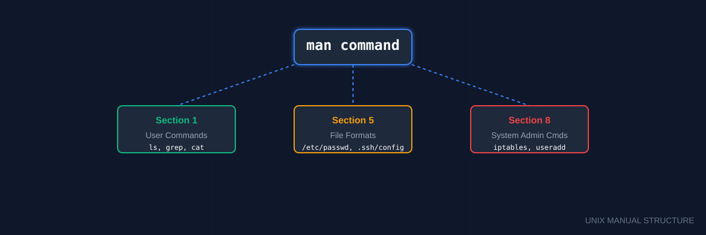

# 📖 Man Pages (The Definitive System Source)
> **"Give a person a fish, you feed them for a day. Teach them to use `man`, and they solve their own problems forever."**

## 📚 Overview
The name comes from **Manual**. Before Google and Stack Overflow, there were Man pages. They are the definitive, offline documentation for every command on your system. Unlike online tutorials which might be outdated or tailored to a specific OS, `man` pages exactly match the version of the software installed on **your** machine. For a DevOps engineer, `man` is the final word when shell scripts behave differently across Ubuntu, CentOS, or macOS.
## 🎓 Learning Objectives
By the end of this module, you will:
- ✅ Understand the **Sectional Hierarchy** of the Linux manual.
- ✅ Decode the **SYNOPSIS** syntax (Optional vs. Required flags).
- ✅ Conduct keyword searches using `apropos` and `whatis`.
- ✅ Access built-in shell documentation using `help`.
- ✅ Navigate the manual interface like a professional.
---
## 🏗️ Manual Architecture: Sections & Help
### 1. The 8 Essential Sections
Sometimes the same name exists in multiple sections (e.g., `printf` is a shell command and a C function). Use the section number to be specific.
| Section | Topic | DevOps Relevance |
|---------|-------|------------------|
| **1** | **User Commands** | Your daily tools: `ls`, `grep`, `ssh`. |
| **5** | **File Formats** | Content structure of `/etc/passwd` or `crontab`. |
| **8** | **System Admin** | Root-level tools: `reboot`, `iptables`, `visudo`. |
### 2. Difference between `man`, `info`, and `help`
| Tool | Scope | Best For |
|------|-------|----------|
| **`man`** | System-wide binaries | Standard documentation. |
| **`help`** | Shell Built-ins | Commands like `cd`, `alias`, `history`. |
| **`info`** | GNU Utilities | Deep, multi-page hyperlinked guides. |
---
## 🛠️ Performance & Search Hacks
### 1. `apropos` - The Keyword Search
Don't know the command name? Search the one-line descriptions.
```bash
# Find all tools related to "partition"
apropos partition
```
### 2. `whatis` - The Quick Definition
Get a one-line summary of what a command does without opening the manual.
```bash
whatis grep
# Output: grep (1) - print lines matching a pattern
```
### 3. Navigation Shortcuts (Vim-style)
- `Space`: Page Down
- `b`: Page Up
- `/keyword`: Search forward
- `n`: Next match
- `q`: **Exit**
---
## 🚀 Practical Examples for Automation
### Example A: Checking Tool Portability
Before using a flag in a script that runs on multiple servers, check the `man` page to see if it's POSIX-compliant or OS-specific.
```bash
# Researching the -i flag for sed on different systems
man sed | grep -A 5 "\-i"
```
---
## 📑 The Man Page Cheat Sheet
| Notation | Meaning | Example |
|----------|---------|---------|
| **Bold** | Type exactly as shown | `ls` |
| *Italic/Underline* | Replace with your value | *filename* |
| `[ ]` | **Optional** parameters | `[ -a ]` |
| `< >` | **Required** parameters | `<path>` |
| `...` | Can be repeated | `[file...]` |
| `|` | Choice (OR) | `[-a | -b]` |
---
## 🏆 Real-World DevOps Case Study
### 💡 **The YAML Validator Mystery**
**The Scenario**: A junior engineer was trying to use a new tool called `yq`. The online docs showed a `--indent` flag, but the runner threw: `Error: unknown flag: --indent`.
**The Investigation**:
They ran `man yq` on the server and searched for "indent". They found that the version installed was much older and used `-i` instead of `--indent`.
**Lesson**: Documentation on the web reflects the *latest* version. The `man` page reflects the *current* version. Always trust the local manual.
---
## 📝 Knowledge Check
1. **Which command provides help for shell built-ins like `cd`?**
   - [ ] a) `man`
   - [x] b) `help`
   - [ ] c) `info`
2. **What does `man 5 /etc/passwd` show?**
   - [ ] a) The command to change passwords
   - [x] b) The structure/format of the passwd file
   - [ ] c) The last 5 lines of the file
3. **How do you exit a man page?**
   - [ ] a) `Ctrl-C`
   - [ ] b) `Esc`
   - [x] c) `q`
**Answers**: 1-b, 2-b, 3-c
## 🔗 Next Steps
Continue to: **[Programs and Commands](../08-Programs-and-Commands/README.md)** →
