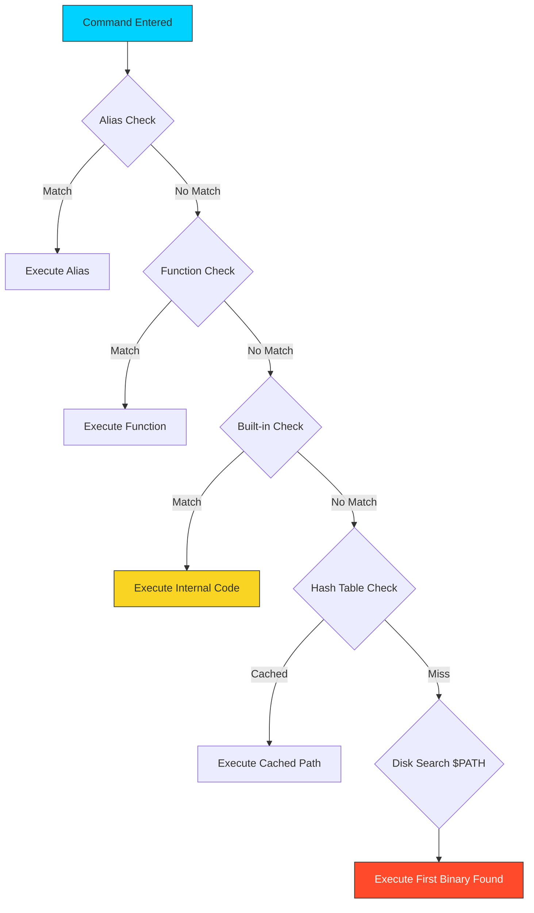

# 💻 Programs and Commands: The DevOps Execution Layer

> **"Linux is an orchestra of small, specialized programs. Mastering the shell means knowing how to conduct them with precision."**



## 📚 Overview
In the Linux ecosystem, a "command" is rarely a single monolithic entity. Modern infrastructure relies on the seamless interaction between **Shell Built-ins**, **Functions**, **Aliases**, and **External Binaries**. 

As a DevOps engineer, your shell is your control center. To build reliable automation, you must understand how the shell identifies programs, how it prioritizes execution, and how to harness the "Power Toolkit" (`grep`, `sed`, `awk`, `curl`, `jq`) to transform raw data streams into actionable infrastructure insights.

## 🎓 Learning Objectives
By the end of this module, you will:
- ✅ Distinguish between **Internal (Built-in)** and **External** execution processes.
- ✅ Master the **Command Resolution Order** to prevent "Ghost Command" bugs.
- ✅ Deep dive into the **DevOps Power Toolkit** (sed, awk, jq).
- ✅ Implement **Defensive PATH management** for cross-environment consistency.
- ✅ Use `type`, `which`, and `hash` to audit execution sources and resolve conflicts.

---

## 🏗️ Execution Architecture: Built-ins vs. Externals

### 1. Shell Built-ins (The "Internal" Engine)
Built-ins are commands compiled directly into the shell binary itself. 
- **Execution**: They run inside the current shell process. No expensive subshell is created.
- **Why it matters**: `cd` must be a built-in because a child process cannot change the current working directory of its parent.
- **Examples**: `cd`, `echo`, `export`, `alias`, `read`, `source`, `history`.

### 2. External Programs (The "Fork-Exec" Cycle)
These are independent executable files residing on the filesystem (usually in `/bin` or `/usr/bin`).
- **The Cycle**: The shell must locate the binary in the `$PATH`, `fork()` a new child process, and then `exec()` the binary code into that process.
- **Environment**: They run in isolated buffers. Changes they make to variables do not affect your main shell.
- **Examples**: `ls`, `grep`, `docker`, `terraform`, `jq`, `python3`.

---

## 🛠️ The DevOps Power Toolkit: Data Plumbing

### 1. `sed` (The Stream Editor)
Automates the modification of configuration files without opening an editor—ideal for CI/CD pipelines.
- **In-place Edit**: `sed -i 's/OLD/NEW/g' config.yaml` (Modifies the file directly).
- **Pro Pattern**: Use different delimiters for paths: `sed 's|/var/www|/usr/share/nginx|g'`.

### 2. `awk` (The Report Generator)
A programming language disguised as a command. It views files as tables (columns and rows).
- **Extraction**: `awk '{print $1, $NF}' access.log` (Prints IP and status code).
- **Math**: `awk '{sum += $10} END {print sum/1024/1024 " MB"}' access.log` (Calculates total bandwidth).

### 3. `jq` (The JSON Surgeon)
The primary tool for cloud engineering. Since AWS, GCP, and Kubernetes APIs speak JSON, `jq` is mandatory.
- **Filter**: `jq '.items[] | select(.status.phase=="Running")'` (Filters for running K8s pods).
- **Raw Output**: `jq -r '.id'` (Removes quotes, making strings bash-ready).

---

## 🚀 Professional Patterns for Automation

### Pattern A: Tool Verification Header
Never assume a tool is installed on a server. Add a "Guard Check" at the top of your scripts.
```bash
readonly REQUIRED_TOOLS=("jq" "curl" "kubectl")

for tool in "${REQUIRED_TOOLS[@]}"; do
    if ! command -v "$tool" &> /dev/null; then
        echo "❌ Error: $tool is not installed. Please install it to continue."
        exit 1
    fi
done
```

### Pattern B: The "Function Shield"
If you have a function named `ls`, it will hijack every `ls` call in your script. Use the `command` keyword to force the shell to use the actual binary.
```bash
ls() { echo "Hijacked!"; }

# This calls the function
ls 
# This bypasses the function and calls the actual binary
command ls 
```

### Pattern C: Path Hardening
In security-sensitive environments, never rely on the user's `$PATH`. Hardcode it at the start of your script.
```bash
# Prevents PATH hijacking attacks
export PATH="/usr/local/sbin:/usr/local/bin:/usr/sbin:/usr/bin:/sbin:/bin"
```

---

## 🏆 Real-World DevOps Story: The Ghost of the Old Version

**The Scenario**: An SRE team updated their custom `deploy-tool` from v1 to v2. They replaced the binary in `/usr/local/bin/`. Half the team saw the new features, but long-logged-in users still saw v1 behavior, even though `which deploy-tool` pointed to the new path.
**The Discovery**: Bash "remembers" where it finds a command to avoid searching the `$PATH` every time. This is called **Hashing**. Because the users had used v1 earlier, Bash had cached that specific disk location.
**The Fix**: Use `hash -r` to force the shell to forget its cache and search the `$PATH` again.
**The Lesson**: When upgrading binaries on long-running systems, you must clear the shell's memory cache.

---

## ❓ Interview Preparation (Programs)

1. **Q: How does the shell know where to find the `ls` command?**
   *A: It searches the directories listed in the `$PATH` environment variable in order from left to right. Once it finds a match, it stops searching.*

2. **Q: What is the difference between `which` and `type`?**
   *A: `which` only searches for external files in the `$PATH`. `type` is more comprehensive—it identifies if a command is an alias, a shell function, a built-in, or a disk binary.*

3. **Q: Why would you use `awk` instead of `grep`?**
   *A: Use `grep` for simple text filtering. Use `awk` when the data is structured into columns and you need to perform logic or calculations on specific fields.*

4. **Q: How can you see the full execution hierarchy of a command on your system?**
   *A: Use `type -a <command>`. This will list every version of the command the shell can see, from aliases down to the disk binaries.*

5. **Q: What happens if two directories in the `$PATH` both contain a binary named `python`?**
   *A: The shell will execute the version in the directory that appears **first** (leftmost) in the `$PATH` string.*

---

## 📝 Knowledge Check

1. **Which command is used to determine if a command is a built-in or a binary?**
   - [ ] a) `which`
   - [x] b) `type`
   - [ ] c) `cat`

2. **What tool is best for parsing the JSON output of an AWS CLI command?**
   - [ ] a) `sed`
   - [ ] b) `awk`
   - [x] c) `jq`

3. **True or False: A shell function has higher execution priority than a built-in.**
   - [x] a) True
   - [ ] b) False

4. **Which command allows you to clear the shell's remembered location of programs?**
   - [ ] a) `clear`
   - [ ] b) `reset`
   - [x] c) `hash -r`

5. **What is the outcome of `command -v <tool>`?**
   - [ ] a) It executes the tool
   - [x] b) It prints the path to the tool (or nothing if missing) and returns an exit code
   - [ ] c) It updates the tool to the latest version

---

## 🔗 Next Steps

Now that you've mastered the programs, let's learn how to store and manage the data they use!

Proceed to: **[Basic Variables](../09-Basic-Variables/README.md)** →
