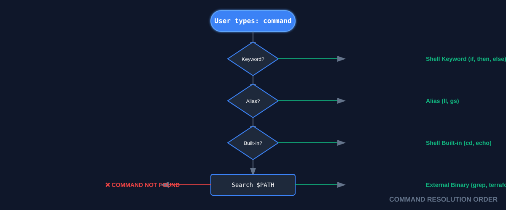
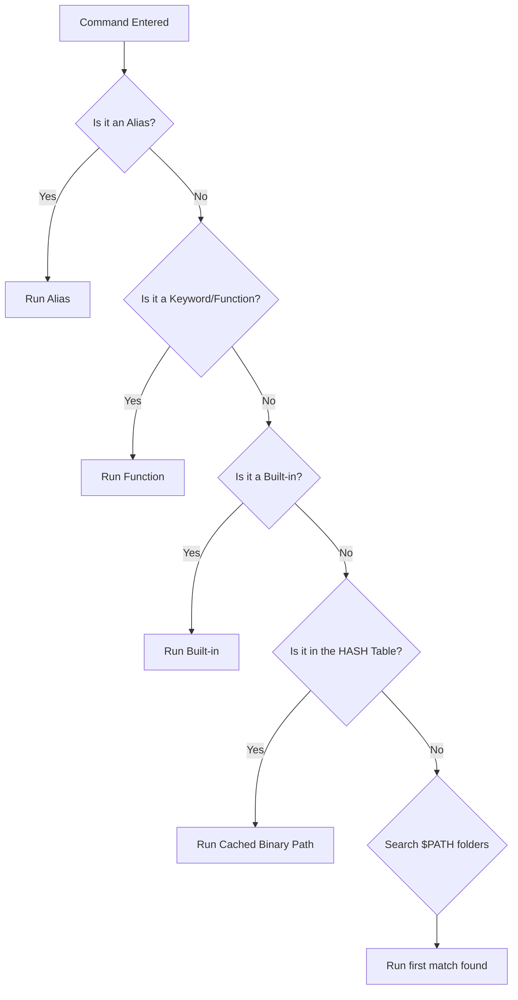

# 💻 Programs and Commands (The DevOps Execution Layer)
>
> **"Linux is an orchestra of small, specialized programs. Mastering the shell means knowing how to conduct them."**



---

## 📚 Overview

In the Linux ecosystem, a "command" is rarely a single monolithic entity. Modern infrastructure relies on the seamless interaction between **Shell Built-ins**, **Functions**, **Aliases**, and **External Binaries**. 

As a DevOps engineer, your shell is your control center. To build reliable automation, you must understand how the shell identifies programs, how it prioritizes execution, and how to harness the "Power Toolkit" (`grep`, `sed`, `awk`, `curl`, `jq`) to transform raw data streams into actionable infrastructure insights.

## 🎓 Learning Objectives

By the end of this module, you will:

- ✅ Distinguish between **Internal (Built-in)** and **External** execution processes.
- ✅ Master the **Command Resolution Order** to prevent "Ghost Command" and versioning bugs.
- ✅ Deep dive into the **DevOps Power Toolkit** for stream editing and API interaction.
- ✅ Implement **Defensive PATH management** to ensure scripts run consistently across environments.
- ✅ Use `type`, `which`, and `command` to audit execution sources and resolve conflicts.

---

## 🏗️ Execution Architecture: Built-ins vs. Externals

### 1. Shell Built-ins (The "Internal" Engine)

Built-ins are commands compiled directly into the shell (Bash, Zsh) binary itself. 

- **Execution Mechanics**: They run inside the current shell process. No `fork()` or `exec()` is required.
- **Speed**: Extremely fast. There is zero overhead in launching them.
- **Control**: They can modify the shell's own state. For example, `cd` must be a built-in because a child process cannot change the current working directory of its parent.
- **Audit**: Use `type -a <command>` to see if a command is a built-in.
- **Examples**: `cd`, `echo`, `export`, `alias`, `read`, `history`, `source`.

### 2. External Programs (The "Disk" Binaries)

These are independent executable files residing on the filesystem (usually in `/bin`, `/usr/bin`, or `/usr/local/bin`).

- **Execution Mechanics**: The shell must locate the file in the `$PATH`, `fork()` a new child process, and then `exec()` the binary.
- **Speed**: Relatively slower due to the process overhead.
- **Scope**: They run in an isolated environment. Changes they make to variables or directories do not affect the main shell.
- **Audit**: Use `which <command>` to find the specific path to the binary.
- **Examples**: `ls`, `grep`, `docker`, `terraform`, `jq`, `git`, `python3`.

---

## � The Command Resolution Order

When you type a command and hit Enter, the shell doesn't just look for a file. it follows a strict hierarchy of "Who gets to run?":



**⚠️ DevOps Warning**: If you name a shell function `ls`, it will run *instead* of the actual `ls` binary unless you explicitly use the full path `/bin/ls` or the `command` keyword.

---

## 🛠️ The DevOps Power Toolkit: Data Plumbing

DevOps automation is the art of **Data Plumbing**. We pipe output from one tool into another to achieve a result.

### 1. `grep` (The Filter)
The primary tool for finding "needles in haystacks."
- **Basic Usage**: `grep "pattern" file`
- **Extended Regex (`-E`)**: Allows for complex grouping and "or" logic: `grep -E "ERROR|CRITICAL" /var/log/syslog`.
- **Expert Insight**: Use `grep -c` to count occurrences rather than piping to `wc -l` (it's faster and more readable).

### 2. `sed` (The Stream Editor)
Automates the modification of configuration files without opening an editor.
- **Substitution**: `sed 's/find/replace/g' file`
- **In-place Edit (`-i`)**: Modifies the file on disk. 
- **Expert Insight**: Use different delimiters if your path contains slashes: `sed 's|/var/www|/usr/share/nginx|' config.json`.

### 3. `awk` (The Report Generator)
A full programming language disguised as a command. It views files as tables (columns and rows).
- **Column Extraction**: `awk '{print $1, $NF}' log.txt` (Prints first and last columns).
- **Conditionals**: `awk '$9 >= 500 {print}' access.log` (Finds all HTTP 500 errors).
- **Expert Insight**: Use the `BEGIN` and `END` blocks to create full summaries and math reports from raw logs.

### 4. `curl` (The API Requester)
The bridge between the shell and the internet/cloud services.
- **REST APIs**: `curl -u "user:pass" -X GET https://api.cloud.com`
- **Headers**: `curl -I https://google.com` (Check headers without downloading the body).
- **Expert Insight**: Use `-sS` (Silent but show errors) and `-L` (Follow redirects) in production scripts.

### 5. `jq` (The JSON Processor)
Essential for Cloud Engineering, where every API (AWS, GCP, Kubernetes) speaks JSON.
- **Select Data**: `jq '.items[].status.phase'`
- **Format Output**: `jq -r` (Raw output) removes quotes, making strings usable in variables.
- **Expert Insight**: You can use `jq` to *construct* JSON objects from shell variables, not just read them.

---

## �️ Defensive Scripting Best Practices

To avoid "It works on my machine" bugs, professional DevOps scripts follow these rules:

1.  **Check for Tool Existence**:
    ```bash
    if ! command -v jq &> /dev/null; then
        echo "Error: jq is not installed. Exiting."
        exit 1
    fi
    ```
2.  **Define a Clean PATH**:
    Avoid inheriting a messy user `$PATH`. Hardcode it if necessary: `export PATH="/usr/local/bin:/usr/bin:/bin"`.
3.  **Avoid Aliases**:
    Aliases are for interactive use, not scripts. Scripts should use full command names or absolute paths to prevent shell customization from breaking the logic.

---

## 📑 The DevOps Command Cheat Sheet

| Command | Category | DevOps Use Case | Power Flag |
|---------|----------|-----------------|--------------|
| `type` | Built-in | Audit command origin (alias/function/binary) | `-a` (show all sources) |
| `which` | External | Locate the binary used in the current $PATH | `-a` (find all paths) |
| `grep` | External | Log filtering and guard checks | `-q` (quiet, return exit code) |
| `sed` | External | Configuration template injection | `-i.bak` (in-place with backup) |
| `awk` | External | Parsing tabular logs (Nginx/App logs) | `-F` (custom field separator) |
| `jq` | External | Parsing AWS/GCP/K8s JSON responses | `.[0]` (array access) |
| `curl` | External | Microservice health checks | `-m` (set timeout) |
| `hash` | Built-in | Clear or view the shell's command cache | `-r` (reset all hashes) |

---

## 🏆 Real-World DevOps Story

### 💡 **The Ghost of the Old Version**

**The Scenario**: An SRE team updated their custom `deploy-tool` from v1.1 to v2.0. They installed the new version in `/usr/local/bin/` (which comes early in the `$PATH`) while the old version remained in `/usr/bin/`.

**The Crisis**: Half the team reported the new features were working, while the other half (who had been logged in all day) saw the old v1.1 behavior, despite `which` pointing to the new folder.

**The Investigation**:
They ran `type deploy-tool` and discovered:
`deploy-tool is hashed (/usr/bin/deploy-tool)`

**The Discovery**:
Bash "remembers" where it finds a command to avoid searching the `$PATH` every time. Because the long-session users had used the old tool earlier, Bash had **cached** the old path. It never looked in `/usr/local/bin/` because it "knew" it was in `/usr/bin/`.

**The Fix**:
They implemented a `hash -r` in their deployment wrapper script.
**Lesson**: When upgrading binaries on a running system, you must clear the shell's memory, not just update the disk.

---

## 📝 Knowledge Check

1. **Why might `which cd` return nothing?**
   - [ ] a) `cd` is not installed
   - [x] b) `cd` is a built-in, and `which` only finds external binaries
   - [ ] c) Your `$PATH` is broken
2. **Which tool is best for extracting the 3rd column from a 5GB CSV file?**
   - [ ] a) `sed`
   - [x] b) `awk`
   - [ ] c) `grep`
3. **What is the primary benefit of the `command` keyword in a script?**
   - [ ] a) It makes the command run faster
   - [x] b) It ignores aliases and functions, ensuring the real command runs
   - [ ] c) It automatically downloads missing tools

**Answers**: 1-b, 2-b, 3-b

---

## ❓ Advanced Interview Questions

1. **Explain why `export` must be a shell built-in.**
   *Answer: If it were an external program, it would run in a child process. A child process cannot change the environment of its parent shell. To persist a variable to the current session, the command must run within the shell itself.*

2. **How does Bash optimize searching through a $PATH with 20+ directories?**
   *Answer: It uses a Hash Table. The first time a command is found, the path is stored in memory. Subsequent calls use the memory address directly, skipping the disk search.*

3. **When would you use `sed` over `awk`?**
   *Answer: Use `sed` for simple text transformations or substitutions across a whole line. Use `awk` when the data is structured into columns and you need logic (if/else) or math (sums) based on those columns.*

---

## 🔗 Next Steps

Continue to: **[Basic Variables](../09-Basic-Variables/README.md)** →

