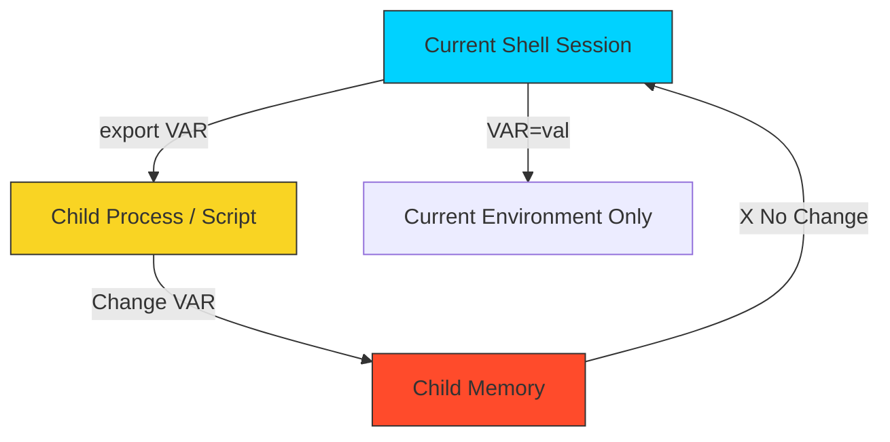

# 📦 Basic Variables: State & Abstraction

> **"Hardcoding is a technical debt you pay every day. Variables are the currency of automation."**



## 📚 Overview

Variables are the foundation of dynamic infrastructure. In DevOps, we use them to store API keys, target server IPs, deployment tags, and temporary compute results. Without variables, every script would be a static, fragile set of commands that breaks the moment the environment changes.

This module covers the essential mechanics of shell state management, from simple assignments to advanced **Parameter Expansion** logic.

## 🎓 Learning Objectives

By the end of this module, you will:

- ✅ Master **Assignment Syntax** (and why spaces break your logic).
- ✅ Understand **Inheritance** and the `export` mechanism.
- ✅ Decode **Quoting Rules**: Single (`'`), Double (`"`), and Command (`$( )`).
- ✅ Capture Input via **Positional Parameters** (`$1`, `$#`, `$@`).
- ✅ Monitor Script Health using **Special Variables** (`$?`, `$$`).
- ✅ Leverage **Parameter Expansion** for smart defaults and error handling.
- ✅ Implement **String Manipulation** directly within variables.

---

## 🏗️ The Rules of Engagement

### 1. The Syntax Trap (No Spaces!)

In Bash, spaces are command delimiters. Adding a space around `=` changes the meaning entirely.

- **`PORT=80`**: ✅ **Assignment**. The shell stores '80' inside the memory address for 'PORT'.
- **`PORT = 80`**: ❌ **Execution Error**. The shell tries to run a program named `PORT` with `=` and `80` as arguments.

### 2. Quoting Hierarchy

The type of quotes you use determines how the shell "interpolates" your data.

- **Double Quotes (`"`)**: **Expansion**. Variables are replaced by their values. `"$USER"` becomes `"Ganil"`.
- **Single Quotes (`'`)**: **Literal**. Strictly preserves every character. `'$USER'` remains `'$USER'`.
- **Command Substitution (`$( )`)**: Runs the command inside and stores the result. `NOW=$(date)`.

### 3. Brace Safety: `${VAR}`

Adding braces `{ }` around a variable name prevents the shell from getting confused when you "glue" text to the variable.

- **Bad**: `$VERSION_v1` (Shell looks for a variable named `VERSION_v1`).
- **Good**: `${VERSION}_v1` (Shell looks for `VERSION` and appends `_v1`).

---

## 🎮 Input Variables: Positional Parameters

When you run a script like `./deploy.sh web-server 80`, you are passing information into the script's memory. The shell automatically captures these in **Positional Parameters**.

```mermaid
graph LR
    Command[./deploy.sh prod v1.2]
    Command --- S0[$0: ./deploy.sh]
    Command --- S1[$1: prod]
    Command --- S2[$2: v1.2]
    
    subgraph Special Counters
    Count[$#: 2 arguments]
    All[$@: prod, v1.2]
    end

    style S0 fill:#f9f9f9,stroke:#333
    style S1 fill:#d1e7dd,stroke:#333
    style S2 fill:#d1e7dd,stroke:#333
```

### 🧠 The Core Input Toolkit

1. **`$0`**: The name of the script itself. Useful for usage messages.
2. **`$1`, `$2`...`$9`**: The first, second, third, etc. arguments.
3. **`${10}`**: Use braces for double-digit arguments.
4. **`$#`**: The total **count** of arguments passed. Use this to verify if the user provided enough info.
5. **`$@`**: "All of them." Best for looping. If you run `for arg in "$@"; do`, it treats each argument exactly as it was passed (handling spaces correctly).
6. **`$*`**: All arguments as a single string. Rarely preferred over `$@`.

### 🛡️ The DevOps "Health" Variables

These aren't passed by the user; they are updated by the OS as the script runs.

- **`$?`**: **The Exit Status**. `0` means success, anything else (1-255) means an error occurred.
- **`$$`**: The **Process ID (PID)** of the script. Useful for creating unique temporary files (e.g., `/tmp/log.$$`).

---

## 🚀 Professional Patterns for Automation

### Pattern A: The Default Value Shorthand
Never let a script fail because of a missing environment variable. Provide a sensible default.
```bash
# If REGION is empty/unset, use 'us-east-1'
AWS_REGION=${REGION:-"us-east-1"}
```

### Pattern B: The Mandatory Variable Guard
For critical secrets (like API keys), don't use a default. Crash the script with a clear error.
```bash
# If API_KEY is missing, print the error and EXIT
: ${API_KEY:? "Error: You must provide an API_KEY to run this script."}
```

### Pattern C: Safe Temporary Files
Use the process ID (`$$`) to ensure your temporary files don't collide if multiple instances of the script run at once.
```bash
LOG_FILE="/tmp/deploy_log.$$"
echo "Starting deployment..." > "$LOG_FILE"
```

### Pattern D: String Sanitization
Remove prefixes or suffixes (like `http://` or `.git`) directly in Bash without spawning external processes like `sed`.
```bash
URL="https://github.com/user/repo"
# Remove 'https://' prefix
CLEAN_URL=${URL#https://}
```

---

## 🌍 Variable Scope & Exporting

Variables do not automatically move between scripts to protect system memory.

- **Local Variable**: `APP_NAME="myapp"`. Only available in the current file.
- **Environment Variable**: `export APP_NAME`. Available to the current file **and all scripts/programs it launches**.

**⚠️ The Golden Rule**: A child process (a script you run) can **never** change a variable in the parent shell that launched it.

---

## 🏆 Real-World DevOps Story: The Empty Variable Catastrophe

**The Scenario**: A junior engineer wrote a cleanup script: `rm -rf $TMP_DIR/*`. One day, due to a network error, the script ran in an environment where `$TMP_DIR` was never set.
**The Discovery**: Because `$TMP_DIR` was empty/null, the shell expanded the command to: `rm -rf /*`. The system immediately began deleting the entire root filesystem.
**The Fix**: Use **Defensive Parameter Expansion**.
`rm -rf ${TMP_DIR:? "Error: TMP_DIR is not set!"}/*`
Now, if the variable is empty, the shell triggers an immediate failure and exits with a clear error message instead of executing a destructive command.

---

## ❓ Interview Preparation (Variables)

1. **Q: What is the difference between `MY_VAR=val` and `export MY_VAR=val`?**
   *A: `MY_VAR=val` sets a local variable available only to the current shell. `export` makes the variable an environment variable, which is inherited by any child processes or sub-shells started from that session.*

2. **Q: How do you capture the output of a command into a variable?**
   *A: Use command substitution with the `$()` syntax. For example: `USER_COUNT=$(who | wc -l)`.*

3. **Q: What does `${VAR:-"dev"}` do?**
   *A: It returns the value of `$VAR` if it is set and not null. If `$VAR` is empty or unset, it returns the string "dev" as a fallback.*

4. **Q: Why should you wrap variables in curly braces like `${VAR}`?**
   *A: It protects the variable name from being misinterpreted when it is immediately followed by other characters. Example: `${IMAGE_NAME}_v2` prevents the shell from searching for a variable named `IMAGE_NAME_v2`.*

5. **Q: Can a child script change the value of a variable in the parent script?**
   *A: No. In Unix systems, child processes inherit a **copy** of the environment. Any changes made to variables in the child process stay within that child's memory and are lost when the child exits.*

6. **Q: What is the difference between `$@` and `$*`?**
   *A: Both represent all arguments. However, when wrapped in double quotes, `"$@"` treats each argument as a separate word (honoring spaces within arguments), while `"$*"` clumps everything into one single string separated by the first character of the `IFS` variable (usually a space).*

7. **Q: Why is `echo $?` the most important command in a CI/CD pipeline?**
   *A: Because it returns the exit code of the previous command. CI/CD runners (like GitHub Actions or Jenkins) use this value to decide if a build step passed (0) or failed (non-zero).*

---

## 📝 Knowledge Check

1. **Which character is used to reference the value of a variable?**
   - [ ] a) `%`
   - [ ] b) `&`
   - [x] c) `$`

2. **What is the result of `VAR="Hello" && echo '$VAR'`?**
   - [ ] a) Hello
   - [x] b) $VAR
   - [ ] c) An empty line

3. **Which command creates a variable that cannot be changed later?**
   - [ ] a) `export`
   - [x] b) `readonly`
   - [ ] c) `set`

4. **What happens if you use `VAR = value` (with spaces)?**
   - [ ] a) The variable is set normally
   - [x] b) The shell tries to run a command named 'VAR'
   - [ ] c) The shell crashes

5. **Which parameter expansion terminates the script if the variable is missing?**
   - [ ] a) `${VAR:-error}`
   - [x] b) `${VAR:?error}`
   - [ ] c) `${VAR#error}`

6. **Which special variable returns the number of arguments passed to a script?**
   - [ ] a) `$@`
   - [x] b) `$#`
   - [ ] c) `$$`

7. **What does an exit code of `0` typically represent?**
   - [x] a) Success
   - [ ] b) General Error
   - [ ] c) Command not found

8. **Inside a script, what does `$0` represent?**
   - [ ] a) The first argument
   - [x] b) The script name
   - [ ] c) The last return code

---

## 🔗 Next Steps

Now that you've mastered state management, let's look at the "Admin Console" of the terminal!

Proceed to: **[Arithmetic & Metrics](../10-Arithmetic-and-Metrics/README.md)** →
