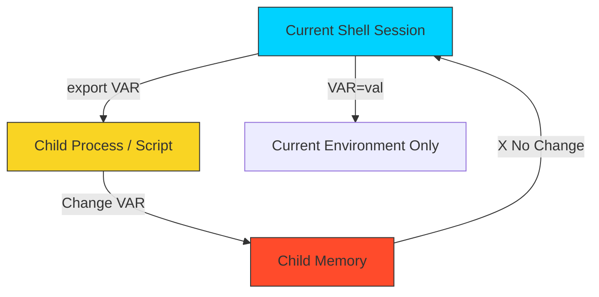

# 📦 Basic Variables: State & Abstraction

> **"Hardcoding is a technical debt you pay every day. Variables are the currency of automation."**

## 📚 Overview
Variables are the foundation of dynamic infrastructure. In DevOps, we use them to store API keys, target server IPs, deployment tags, and temporary compute results. Without variables, every script would be a static, fragile set of commands that breaks the moment the environment changes. 

This module covers the essential mechanics of shell state management, from simple assignments to advanced **Parameter Expansion** logic.

## 🎓 Learning Objectives
By the end of this module, you will:
- ✅ Master **Assignment Syntax** (and why spaces break your logic).
- ✅ Understand **Inheritance** and the `export` mechanism.
- ✅ Decode **Quoting Rules**: Single (`'`), Double (`"`), and Command (`$( )`).
- ✅ Leverage **Parameter Expansion** for smart defaults and error handling.
- ✅ Implement **String Manipulation** directly within variables.

---

## 🏗️ The Rules of Engagement

### 1. The Syntax Trap (No Spaces!)
In Bash, spaces are command delimiters. Adding a space around `=` changes the meaning entirely.
- **`PORT=80`**: ✅ **Assignment**. The shell stores '80' inside the memory address for 'PORT'.
- **`PORT = 80`**: ❌ **Execution Error**. The shell tries to run a program named `PORT` with `=` and `80` as arguments.

### 2. Quoting Hierarchy
The type of quotes you use determines how the shell "interpolates" your data.
- **Double Quotes (`"`)**: **Expansion**. Variables are replaced by their values. `"$USER"` becomes `"Ganil"`.
- **Single Quotes (`'`)**: **Literal**. Strictly preserves every character. `'$USER'` remains `'$USER'`.
- **Command Substitution (`$( )`)**: Runs the command inside and stores the result. `NOW=$(date)`.

### 3. Brace Safety: `${VAR}`
Adding braces `{ }` around a variable name prevents the shell from getting confused when you "glue" text to the variable.
- **Bad**: `$VERSION_v1` (Shell looks for a variable named `VERSION_v1`).
- **Good**: `${VERSION}_v1` (Shell looks for `VERSION` and appends `_v1`).

---

## 🚀 Advanced Parameter Expansion (DevOps Gold)
Senior engineers use expansion logic to handle edge cases directly in the variable reference.

| Syntax | Description | DevOps Use Case |
| :--- | :--- | :--- |
| **`${VAR:-default}`** | If empty, use `default` | **Default AWS Regions** |
| **`${VAR:?error}`** | If empty, **STOP** script | **Missing API Secrets** |
| **`${VAR#prefix}`** | Remove shortest prefix | **Cleaning URL protocols** |
| **`${VAR%.ext}`** | Remove shortest suffix | **Renaming file extensions** |

---

## 🌍 Variable Scope & Exporting
Variables do not automatically move between scripts to protect system memory.
- **Local Variable**: `APP_NAME="myapp"`. Only available in the current file.
- **Environment Variable**: `export APP_NAME`. Available to the current file **and all scripts/programs it launches**.

**⚠️ The Golden Rule**: A child process (a script you run) can **never** change a variable in the parent shell that launched it.

---

## 🏆 Real-World DevOps Story: The Empty Variable Catastrophe

**The Scenario**: A junior engineer wrote a cleanup script: `rm -rf $TMP_DIR/*`. One day, due to a network error, the script ran in an environment where `$TMP_DIR` was never set.
**The Discovery**: Because `$TMP_DIR` was empty/null, the shell expanded the command to: `rm -rf /*`. The system immediately began deleting the entire root filesystem.
**The Fix**: Use **Defensive Parameter Expansion**.
`rm -rf ${TMP_DIR:? "Error: TMP_DIR is not set!"}/*`
Now, if the variable is empty, the shell triggers an immediate failure and exits with a clear error message instead of executing a destructive command.

---

## ❓ Interview Preparation (Variables)

1. **Q: What is the difference between `MY_VAR=val` and `export MY_VAR=val`?**
   *A: `MY_VAR=val` sets a local variable available only to the current shell. `export` makes the variable an environment variable, which is inherited by any child processes or sub-shells started from that session.*

2. **Q: How do you capture the output of a command into a variable?**
   *A: Use command substitution with the `$()` syntax. For example: `USER_COUNT=$(who | wc -l)`.*

3. **Q: What does `${VAR:-"dev"}` do?**
   *A: It returns the value of `$VAR` if it is set and not null. If `$VAR` is empty or unset, it returns the string "dev" as a fallback.*

4. **Q: Why should you wrap variables in curly braces like `${VAR}`?**
   *A: It protects the variable name from being misinterpreted when it is immediately followed by other characters. Example: `${IMAGE_NAME}_v2` prevents the shell from searching for a variable named `IMAGE_NAME_v2`.*

5. **Q: Can a child script change the value of a variable in the parent script?**
   *A: No. In Unix systems, child processes inherit a **copy** of the environment. Any changes made to variables in the child process stay within that child's memory and are lost when the child exits.*

---

## 📝 Knowledge Check

1. **Which character is used to reference the value of a variable?**
   - [ ] a) `%`
   - [ ] b) `&`
   - [x] c) `$`

2. **What is the result of `VAR="Hello" && echo '$VAR'`?**
   - [ ] a) Hello
   - [x] b) $VAR
   - [ ] c) An empty line

3. **Which command creates a variable that cannot be changed later?**
   - [ ] a) `export`
   - [x] b) `readonly`
   - [ ] c) `set`

4. **What happens if you use `VAR = value` (with spaces)?**
   - [ ] a) The variable is set normally
   - [x] b) The shell tries to run a command named 'VAR'
   - [ ] c) The shell crashes

5. **Which parameter expansion terminates the script if the variable is missing?**
   - [ ] a) `${VAR:-error}`
   - [x] b) `${VAR:?error}`
   - [ ] c) `${VAR#error}`

---

## 🔗 Next Steps

Now that you've mastered state management, let's look at the "Admin Console" of the terminal!

Proceed to: **[Vim Crash Course](../10-Vim-Crash-Course/README.md)** →
